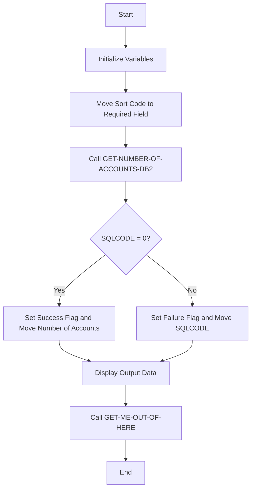

This document will cover the ACCTCTRL program. We'll cover:

1. What the Program Does
2. Program Flow
3. Program Sections

## What the Program Does

The ACCTCTRL program is designed to manage account control operations. It primarily retrieves the number of accounts associated with a specific sort code from a database. The program initializes necessary variables, performs a database query to count the accounts, and then returns the result. The main logic revolves around fetching and displaying the number of accounts based on the provided sort code.

## Program Flow

This is a visualization of the flow:



<SwmSnippet path="/src/base/cobol_src/ACCTCTRL.cbl" line="132">

---

### PREMIERE SECTION

First, the program initializes by moving the sort code to the required field and then performs the <SwmToken path="src/base/cobol_src/ACCTCTRL.cbl" pos="141:3:11" line-data="           PERFORM GET-NUMBER-OF-ACCOUNTS-DB2">`GET-NUMBER-OF-ACCOUNTS-DB2`</SwmToken> section to retrieve the number of accounts.

```cobol
       PROCEDURE DIVISION USING DFHCOMMAREA.
       PREMIERE SECTION.
       P010.


           MOVE SORTCODE TO
              REQUIRED-SORT-CODE.

           PERFORM GET-NUMBER-OF-ACCOUNTS-DB2


      D    DISPLAY 'OUTPUT DATA IS='
      D       DFHCOMMAREA.


           PERFORM GET-ME-OUT-OF-HERE.

       P999.
           EXIT.
```

---

</SwmSnippet>

<SwmSnippet path="/src/base/cobol_src/ACCTCTRL.cbl" line="157">

---

### <SwmToken path="src/base/cobol_src/ACCTCTRL.cbl" pos="157:1:9" line-data="       GET-NUMBER-OF-ACCOUNTS-DB2 SECTION.">`GET-NUMBER-OF-ACCOUNTS-DB2`</SwmToken> SECTION

Next, the program initializes the <SwmToken path="src/base/cobol_src/ACCTCTRL.cbl" pos="160:3:3" line-data="           INITIALIZE DFHCOMMAREA.">`DFHCOMMAREA`</SwmToken> and moves the required sort code to the host variable. It then executes an SQL query to count the number of accounts with the given sort code. If the SQL query is successful, it sets the success flag and moves the number of accounts to the appropriate field. Otherwise, it sets the failure flag and moves the SQLCODE to the display field.

```cobol
       GET-NUMBER-OF-ACCOUNTS-DB2 SECTION.
       WCD010.

           INITIALIZE DFHCOMMAREA.


           MOVE REQUIRED-SORT-CODE TO HV-ACCOUNT-SORTCODE

           EXEC SQL
              SELECT COUNT(*)
              INTO  :HV-NUMBER-OF-ACCOUNTS
              FROM ACCOUNT
              WHERE ACCOUNT_SORTCODE = :HV-ACCOUNT-SORTCODE
           END-EXEC.

           IF SQLCODE = ZERO
             MOVE 'Y' TO ACCOUNT-CONTROL-SUCCESS-FLAG
             MOVE HV-NUMBER-OF-ACCOUNTS TO NUMBER-OF-ACCOUNTS
           ELSE
             MOVE 'N' TO ACCOUNT-CONTROL-SUCCESS-FLAG
             MOVE SQLCODE TO SQLCODE-DISPLAY
```

---

</SwmSnippet>

<SwmSnippet path="/src/base/cobol_src/ACCTCTRL.cbl" line="183">

---

### <SwmToken path="src/base/cobol_src/ACCTCTRL.cbl" pos="183:1:5" line-data="       POPULATE-TIME-DATE SECTION.">`POPULATE-TIME-DATE`</SwmToken> SECTION

Then, the program populates the current time and date using CICS commands. This section is not directly related to the main account control logic but is included for completeness.

```cobol
       POPULATE-TIME-DATE SECTION.
       PTD010.
      D    DISPLAY 'POPULATE-TIME-DATE SECTION'.

           EXEC CICS ASKTIME
              ABSTIME(WS-U-TIME)
           END-EXEC.

           EXEC CICS FORMATTIME
                     ABSTIME(WS-U-TIME)
                     DDMMYYYY(WS-ORIG-DATE)
                     TIME(WS-TIME-NOW)
                     DATESEP
           END-EXEC.

       PTD999.
           EXIT.
```

---

</SwmSnippet>

<SwmSnippet path="/src/base/cobol_src/ACCTCTRL.cbl" line="205">

---

### <SwmToken path="src/base/cobol_src/ACCTCTRL.cbl" pos="205:1:9" line-data="       GET-ME-OUT-OF-HERE SECTION.">`GET-ME-OUT-OF-HERE`</SwmToken> SECTION

Finally, the program calls the <SwmToken path="src/base/cobol_src/ACCTCTRL.cbl" pos="205:1:9" line-data="       GET-ME-OUT-OF-HERE SECTION.">`GET-ME-OUT-OF-HERE`</SwmToken> section to return control to CICS and end the program.

```cobol
       GET-ME-OUT-OF-HERE SECTION.
       GMOFH010.

           EXEC CICS RETURN
           END-EXEC.

       GMOFH999.
           EXIT.
```

---

</SwmSnippet>

&nbsp;

*This is an auto-generated document by Swimm 🌊 and has not yet been verified by a human*

<SwmMeta version="3.0.0" repo-id="Z2l0aHViJTNBJTNBY2ljcy1iYW5raW5nLXNhbXBsZS1hcHBsaWNhdGlvbi1jYnNhLUlCTS1EZW1vLUdQVCUzQSUzQVN3aW1tLURlbW8=" repo-name="cics-banking-sample-application-cbsa-IBM-Demo-GPT"><sup>Powered by [Swimm](/)</sup></SwmMeta>
