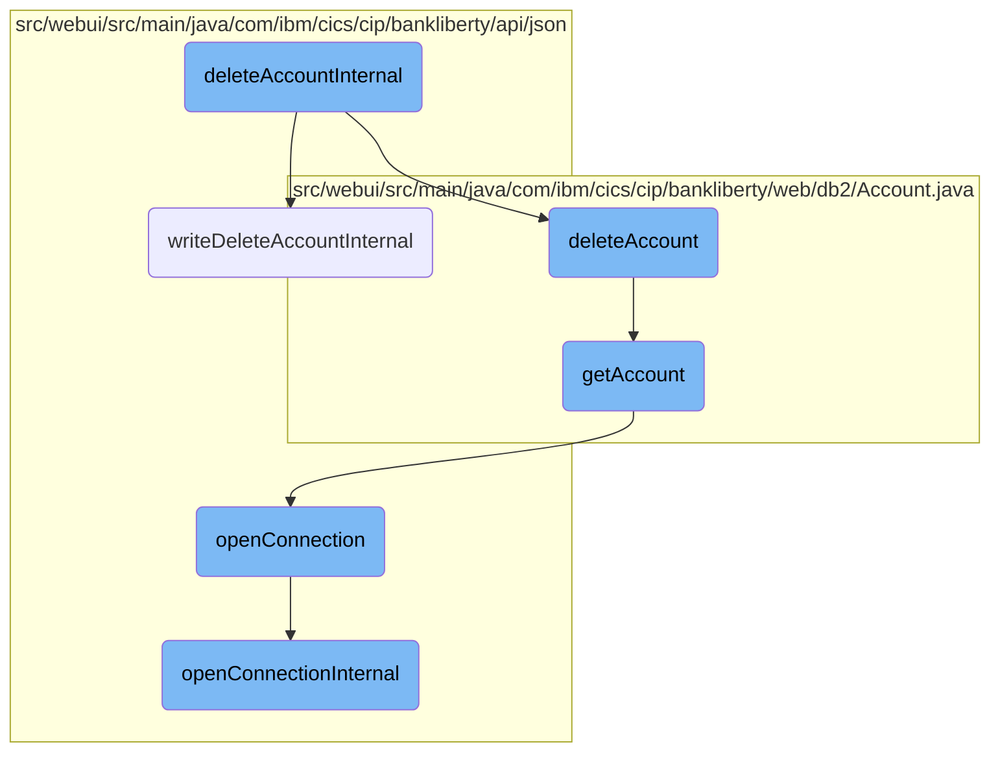
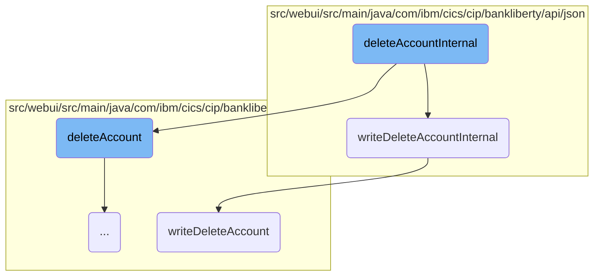
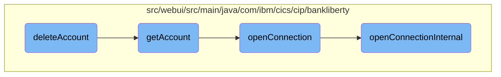
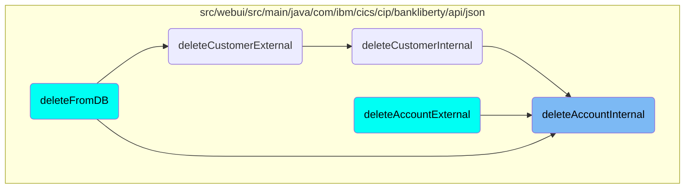

This document explains the process of deleting a bank account. The process involves several steps, including retrieving account details, deleting the account from the database, and logging the transaction.

The flow starts by retrieving the account details. If the account exists, it proceeds to delete the account from the database. After successfully deleting the account, it logs the transaction details. If any step fails, the operation is rolled back, and an error response is returned.

Here is a high level diagram of the flow, showing only the most important functions:



# Flow drill down

First, we'll zoom into this section of the flow:



<SwmSnippet path="/src/webui/src/main/java/com/ibm/cics/cip/bankliberty/api/json/AccountsResource.java" line="1241">

---

## Handling Account Deletion

The <SwmToken path="src/webui/src/main/java/com/ibm/cics/cip/bankliberty/api/json/AccountsResource.java" pos="1241:5:5" line-data="	public Response deleteAccountInternal(Long accountNumber)">`deleteAccountInternal`</SwmToken> method is responsible for handling the deletion of a bank account. It first retrieves the account details and then attempts to delete the account from the database. If the account is successfully deleted, it logs the transaction; otherwise, it rolls back the operation and returns an error response.

```java
	public Response deleteAccountInternal(Long accountNumber)
	{
		logger.entering(this.getClass().getName(), DELETE_ACCOUNT);
		Response myResponse = null;

		JSONObject response = new JSONObject();

		Integer sortCode = this.getSortCode();

		com.ibm.cics.cip.bankliberty.web.db2.Account db2Account = new Account();

		db2Account = db2Account.deleteAccount(accountNumber.intValue(),
				sortCode.intValue());
		if (db2Account != null)
		{
			response.put(JSON_SORT_CODE, db2Account.getSortcode().trim());
			response.put("id", db2Account.getAccountNumber());
			response.put(JSON_CUSTOMER_NUMBER, db2Account.getCustomerNumber());
			response.put(JSON_ACCOUNT_TYPE, db2Account.getType().trim());
			response.put(JSON_AVAILABLE_BALANCE,
					BigDecimal.valueOf(db2Account.getAvailableBalance()));
```

---

</SwmSnippet>

<SwmSnippet path="/src/webui/src/main/java/com/ibm/cics/cip/bankliberty/api/json/ProcessedTransactionResource.java" line="426">

---

### Logging the Deleted Account

The <SwmToken path="src/webui/src/main/java/com/ibm/cics/cip/bankliberty/api/json/ProcessedTransactionResource.java" pos="426:5:5" line-data="	public Response writeDeleteAccountInternal(">`writeDeleteAccountInternal`</SwmToken> method logs the details of the deleted account. It creates a new <SwmToken path="src/webui/src/main/java/com/ibm/cics/cip/bankliberty/api/json/ProcessedTransactionResource.java" pos="429:15:15" line-data="		com.ibm.cics.cip.bankliberty.web.db2.ProcessedTransaction myProcessedTransactionDB2 = new com.ibm.cics.cip.bankliberty.web.db2.ProcessedTransaction();">`ProcessedTransaction`</SwmToken> object and writes the account details to the database. If the operation is successful, it returns a success response; otherwise, it returns an error response.

```java
	public Response writeDeleteAccountInternal(
			ProcessedTransactionAccountJSON myDeletedAccount)
	{
		com.ibm.cics.cip.bankliberty.web.db2.ProcessedTransaction myProcessedTransactionDB2 = new com.ibm.cics.cip.bankliberty.web.db2.ProcessedTransaction();
		if (myProcessedTransactionDB2.writeDeleteAccount(
				myDeletedAccount.getSortCode(),
				myDeletedAccount.getAccountNumber(),
				myDeletedAccount.getActualBalance(),
				myDeletedAccount.getLastStatement(),
				myDeletedAccount.getNextStatement(),
				myDeletedAccount.getCustomerNumber(),
				myDeletedAccount.getType()))
		{
			return Response.ok().build();
		}
		else
		{
			return Response.serverError().build();
		}

	}
```

---

</SwmSnippet>

<SwmSnippet path="/src/webui/src/main/java/com/ibm/cics/cip/bankliberty/web/db2/ProcessedTransaction.java" line="752">

---

### Writing the Deleted Account to the Database

The <SwmToken path="src/webui/src/main/java/com/ibm/cics/cip/bankliberty/web/db2/ProcessedTransaction.java" pos="752:5:5" line-data="	public boolean writeDeleteAccount(String sortCode2, String accountNumber,">`writeDeleteAccount`</SwmToken> method in the <SwmToken path="src/webui/src/main/java/com/ibm/cics/cip/bankliberty/api/json/ProcessedTransactionResource.java" pos="429:15:15" line-data="		com.ibm.cics.cip.bankliberty.web.db2.ProcessedTransaction myProcessedTransactionDB2 = new com.ibm.cics.cip.bankliberty.web.db2.ProcessedTransaction();">`ProcessedTransaction`</SwmToken> class is responsible for writing the deleted account details to the database. It prepares an SQL statement with the account details and executes the statement. If the execution is successful, it returns true; otherwise, it logs the error and returns false.

```java
	public boolean writeDeleteAccount(String sortCode2, String accountNumber,
			BigDecimal actualBalance, Date lastStatement, Date nextStatement,
			String customerNumber, String accountType)
	{
		logger.entering(this.getClass().getName(), WRITE_DELETE_ACCOUNT);

		PROCTRAN myPROCTRAN = new PROCTRAN();

		Calendar myCalendar = Calendar.getInstance();
		myCalendar.setTime(lastStatement);

		myPROCTRAN.setProcDescDelaccLastDd(myCalendar.get(Calendar.DATE));
		myPROCTRAN.setProcDescDelaccLastMm(myCalendar.get(Calendar.MONTH) + 1);
		myPROCTRAN.setProcDescDelaccLastYyyy(myCalendar.get(Calendar.YEAR));

		myCalendar.setTime(nextStatement);
		myPROCTRAN.setProcDescDelaccNextDd(myCalendar.get(Calendar.DATE));
		myPROCTRAN.setProcDescDelaccNextMm(myCalendar.get(Calendar.MONTH) + 1);
		myPROCTRAN.setProcDescDelaccNextYyyy(myCalendar.get(Calendar.YEAR));
		myPROCTRAN.setProcDescDelaccAcctype(accountType);
		myPROCTRAN.setProcDescDelaccCustomer(Integer.parseInt(customerNumber));
```

---

</SwmSnippet>

Now, lets zoom into this section of the flow:



<SwmSnippet path="/src/webui/src/main/java/com/ibm/cics/cip/bankliberty/web/db2/Account.java" line="647">

---

## Deleting the Account

The <SwmToken path="src/webui/src/main/java/com/ibm/cics/cip/bankliberty/web/db2/Account.java" pos="647:5:5" line-data="	public Account deleteAccount(int account, int sortcode)">`deleteAccount`</SwmToken> function is responsible for deleting an account from the database. It first retrieves the account details using the <SwmToken path="src/webui/src/main/java/com/ibm/cics/cip/bankliberty/web/db2/Account.java" pos="650:9:9" line-data="		Account db2Account = this.getAccount(account, sortcode);">`getAccount`</SwmToken> function. If the account exists, it opens a database connection and constructs SQL queries to delete the account. The function then executes these queries to remove the account from the database.

```java
	public Account deleteAccount(int account, int sortcode)
	{
		logger.entering(this.getClass().getName(), DELETE_ACCOUNT);
		Account db2Account = this.getAccount(account, sortcode);
		if (db2Account == null)
		{
			logger.exiting(this.getClass().getName(), DELETE_ACCOUNT, null);
			return null;
		}
		Account temp = null;
		openConnection();
		StringBuilder myStringBuilder = new StringBuilder();

		for (int i = Integer.toString(account)
				.length(); i < ACCOUNT_NUMBER_LENGTH; i++)
		{
			myStringBuilder.append('0');
		}
		myStringBuilder.append(Integer.toString(account));
		String accountNumberString = myStringBuilder.toString();

```

---

</SwmSnippet>

<SwmSnippet path="/src/webui/src/main/java/com/ibm/cics/cip/bankliberty/web/db2/Account.java" line="402">

---

## Retrieving the Account

The <SwmToken path="src/webui/src/main/java/com/ibm/cics/cip/bankliberty/web/db2/Account.java" pos="402:5:5" line-data="	public Account getAccount(int accountNumber, int sortCode)">`getAccount`</SwmToken> function retrieves account details from the database. It opens a database connection and constructs SQL queries to fetch the account information based on the account number and sort code. If the account number is 99999999, it retrieves the latest account for the given sort code. Otherwise, it retrieves the specific account details.

```java
	public Account getAccount(int accountNumber, int sortCode)
	{
		logger.entering(this.getClass().getName(), GET_ACCOUNT + accountNumber);
		openConnection();
		Account temp = null;

		String sortCodeString = padSortCode(sortCode);
		String sql9999 = "SELECT * from ACCOUNT where ACCOUNT_EYECATCHER LIKE 'ACCT' AND ACCOUNT_SORTCODE like ? order by ACCOUNT_NUMBER DESC";
		String sql = SQL_SELECT;
		try (PreparedStatement stmt9999 = conn.prepareStatement(sql9999);
				PreparedStatement stmt = conn.prepareStatement(sql);)
		{
			if (accountNumber == 99999999)
			{

				logger.log(Level.FINE, () -> PRE_SELECT_MSG + sql9999 + ">");

				stmt9999.setString(1, sortCodeString);
				ResultSet rs = stmt9999.executeQuery();
				if (rs.next())
				{
```

---

</SwmSnippet>

<SwmSnippet path="/src/webui/src/main/java/com/ibm/cics/cip/bankliberty/api/json/HBankDataAccess.java" line="69">

---

## Opening the Database Connection

The <SwmToken path="src/webui/src/main/java/com/ibm/cics/cip/bankliberty/api/json/HBankDataAccess.java" pos="69:5:5" line-data="	protected void openConnection()">`openConnection`</SwmToken> function is responsible for opening a connection to the <SwmToken path="src/webui/src/main/java/com/ibm/cics/cip/bankliberty/api/json/HBankDataAccess.java" pos="71:13:13" line-data="		// Open a connection to the DB2 database">`DB2`</SwmToken> database. It checks if a connection already exists for the current task. If not, it calls <SwmToken path="src/webui/src/main/java/com/ibm/cics/cip/bankliberty/api/json/HBankDataAccess.java" pos="87:1:1" line-data="			openConnectionInternal();">`openConnectionInternal`</SwmToken> to create a new connection.

```java
	protected void openConnection()
	{
		// Open a connection to the DB2 database
		logger.entering(this.getClass().getName(), "openConnection()");

		Integer taskNumberInteger = Task.getTask().getTaskNumber();
		String db2ConnString = DB2CONN.concat(taskNumberInteger.toString());
		logger.log(Level.FINE,
				() -> "Attempting to get DB2CONN for task number "
						+ taskNumberInteger.toString());
		this.conn = (Connection) cornedBeef.get(db2ConnString);
		if (this.conn == null)
		{
			HBankDataAccess.incrementConnCount();
			logger.log(Level.FINE,
					() -> "Attempting to create DB2CONN for task number "
							+ taskNumberInteger.toString());
			// Attempt to open a connection
			openConnectionInternal();
			logger.log(Level.FINE,
					() -> "Creation succcessful for DB2CONN for task number "
```

---

</SwmSnippet>

<SwmSnippet path="/src/webui/src/main/java/com/ibm/cics/cip/bankliberty/api/json/HBankDataAccess.java" line="162">

---

## Creating a New Database Connection

The <SwmToken path="src/webui/src/main/java/com/ibm/cics/cip/bankliberty/api/json/HBankDataAccess.java" pos="163:3:3" line-data="	void openConnectionInternal()">`openConnectionInternal`</SwmToken> function creates a new connection to the <SwmToken path="src/webui/src/main/java/com/ibm/cics/cip/bankliberty/api/json/HBankDataAccess.java" pos="178:17:17" line-data="						() -&gt; &quot;About to attempt to get DB2 connection&quot;);">`DB2`</SwmToken> database. It uses JNDI to look up the data source and attempts to get a connection. If the connection is successful, it sets the transaction isolation level and stores the connection for reuse.

```java
	@SuppressWarnings("unchecked")
	void openConnectionInternal()
	{
		logger.entering(this.getClass().getName(), "openConnectionInternal");
		String jndiString = "jdbc/defaultCICSDataSource";
		Context ctx;

		try
		{
			ctx = new InitialContext();
			DataSource ds = (DataSource) ctx.lookup(jndiString);
			logger.log(Level.FINE, () -> "jndi string is " + jndiString);
			// If there is no current connection
			if (this.conn == null)
			{
				logger.log(Level.FINE,
						() -> "About to attempt to get DB2 connection");
				// Try and get a connection
				this.conn = ds.getConnection();
				this.conn.setTransactionIsolation(
						Connection.TRANSACTION_READ_UNCOMMITTED);
```

---

</SwmSnippet>

# Where is this flow used?

This flow is used multiple times in the codebase as represented in the following diagram:



&nbsp;

*This is an auto-generated document by Swimm 🌊 and has not yet been verified by a human*

<SwmMeta version="3.0.0" repo-id="Z2l0aHViJTNBJTNBY2ljcy1iYW5raW5nLXNhbXBsZS1hcHBsaWNhdGlvbi1jYnNhLUlCTS1EZW1vLUdQVCUzQSUzQVN3aW1tLURlbW8=" repo-name="cics-banking-sample-application-cbsa-IBM-Demo-GPT"><sup>Powered by [Swimm](/)</sup></SwmMeta>
