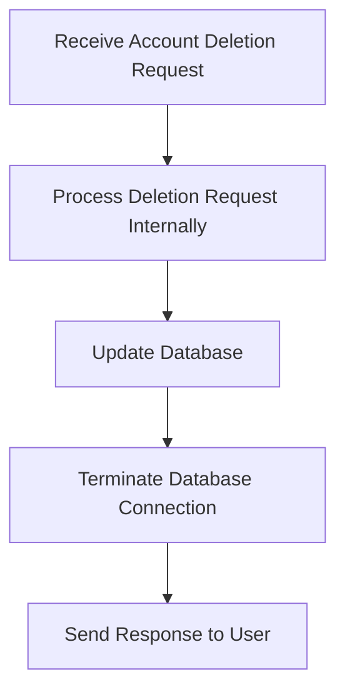

The process of deleting a bank account involves several steps to ensure the request is handled correctly and securely. This document will cover:

1. Receiving the account deletion request
2. Processing the deletion request internally
3. Updating the database
4. Terminating the database connection
5. Sending a response back to the user.

Technical document: <SwmLink doc-title="Account Deletion Process">[Account Deletion Process](/.swm/account-deletion-process.foi5c807.sw.md)</SwmLink>

# [Receiving the Account Deletion Request](https://app.swimm.io/repos/Z2l0aHViJTNBJTNBY2ljcy1iYW5raW5nLXNhbXBsZS1hcHBsaWNhdGlvbi1jYnNhLUlCTS1EZW1vLUdQVCUzQSUzQVN3aW1tLURlbW8=/docs/foi5c807#handling-the-account-deletion-request)

The account deletion process begins when a request is received in JSON format. This request contains all the necessary details about the account to be deleted, such as the account number, sort code, and customer information. This step ensures that the system has all the required information to proceed with the deletion.

# [Processing the Deletion Request Internally](https://app.swimm.io/repos/Z2l0aHViJTNBJTNBY2ljcy1iYW5raW5nLXNhbXBsZS1hcHBsaWNhdGlvbi1jYnNhLUlCTS1EZW1vLUdQVCUzQSUzQVN3aW1tLURlbW8=/docs/foi5c807#processing-the-deletion-internally)

Once the request is received, it is processed internally to verify if the account can be deleted. This involves checking the account's current status, ensuring there are no pending transactions, and confirming that the account balance is zero. If any of these conditions are not met, the deletion request will be denied, and an error response will be sent back to the user.

# [Updating the Database](https://app.swimm.io/repos/Z2l0aHViJTNBJTNBY2ljcy1iYW5raW5nLXNhbXBsZS1hcHBsaWNhdGlvbi1jYnNhLUlCTS1EZW1vLUdQVCUzQSUzQVN3aW1tLURlbW8=/docs/foi5c807#writing-the-deletion-to-the-database)

If the account is eligible for deletion, the next step is to update the database. This involves executing SQL statements to remove the account details from the database. The system ensures that all related records are also deleted to maintain data integrity. Any errors encountered during this process are logged, and appropriate measures are taken to handle them.

# [Terminating the Database Connection](https://app.swimm.io/repos/Z2l0aHViJTNBJTNBY2ljcy1iYW5raW5nLXNhbXBsZS1hcHBsaWNhdGlvbi1jYnNhLUlCTS1EZW1vLUdQVCUzQSUzQVN3aW1tLURlbW8=/docs/foi5c807#opening-a-database-connection)

After the database has been updated, the system terminates the database connection. This step is crucial to ensure that no unauthorized access can occur after the deletion process is complete. It also helps in freeing up resources and maintaining the overall performance of the system.

# [Sending a Response to the User](https://app.swimm.io/repos/Z2l0aHViJTNBJTNBY2ljcy1iYW5raW5nLXNhbXBsZS1hcHBsaWNhdGlvbi1jYnNhLUlCTS1EZW1vLUdQVCUzQSUzQVN3aW1tLURlbW8=/docs/foi5c807#handling-the-account-deletion-request)

Finally, an appropriate response is sent back to the user. If the deletion was successful, a confirmation message is sent. If there were any issues during the process, an error message detailing the problem is returned. This ensures that the user is informed about the status of their request and can take any necessary follow-up actions.

&nbsp;

*This is an auto-generated document by Swimm 🌊 and has not yet been verified by a human*

<SwmMeta version="3.0.0" repo-id="Z2l0aHViJTNBJTNBY2ljcy1iYW5raW5nLXNhbXBsZS1hcHBsaWNhdGlvbi1jYnNhLUlCTS1EZW1vLUdQVCUzQSUzQVN3aW1tLURlbW8=" repo-name="cics-banking-sample-application-cbsa-IBM-Demo-GPT">Powered by [Swimm](/)</SwmMeta>
