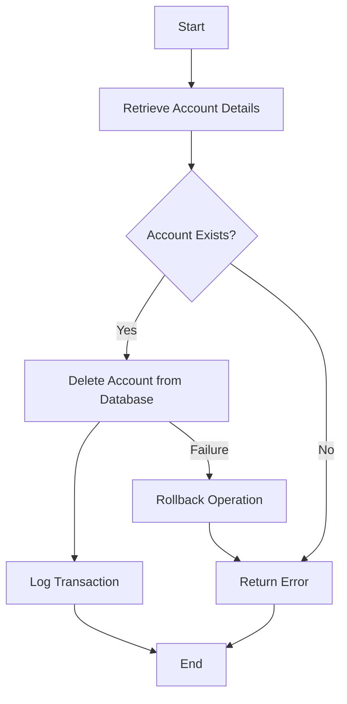

The process of deleting a bank account involves several steps to ensure data integrity and proper logging. This document will cover:

1. Retrieving account details
2. Deleting the account from the database
3. Logging the transaction
4. Handling errors and rollback

Technical document: <SwmLink doc-title="Account Deletion Flow">[Account Deletion Flow](/.swm/account-deletion-flow.04bjcshx.sw.md)</SwmLink>

# [Retrieving Account Details](https://app.swimm.io/repos/Z2l0aHViJTNBJTNBY2ljcy1iYW5raW5nLXNhbXBsZS1hcHBsaWNhdGlvbi1jYnNhLUlCTS1EZW1vLUdQVCUzQSUzQVN3aW1tLURlbW8=/docs/04bjcshx#retrieving-the-account)

The first step in the account deletion flow is to retrieve the account details. This involves checking if the account exists in the database. If the account number provided is 99999999, the system retrieves the latest account for the given sort code. Otherwise, it fetches the specific account details based on the account number and sort code provided. This step ensures that the account to be deleted is valid and exists in the system.

# [Deleting the Account from the Database](https://app.swimm.io/repos/Z2l0aHViJTNBJTNBY2ljcy1iYW5raW5nLXNhbXBsZS1hcHBsaWNhdGlvbi1jYnNhLUlCTS1EZW1vLUdQVCUzQSUzQVN3aW1tLURlbW8=/docs/04bjcshx#deleting-the-account)

Once the account details are retrieved and validated, the next step is to delete the account from the database. This involves opening a database connection and constructing SQL queries to remove the account. The system ensures that all related data is also removed to maintain data integrity. If the account does not exist, the process is halted, and an error is returned.

# [Logging the Transaction](https://app.swimm.io/repos/Z2l0aHViJTNBJTNBY2ljcy1iYW5raW5nLXNhbXBsZS1hcHBsaWNhdGlvbi1jYnNhLUlCTS1EZW1vLUdQVCUzQSUzQVN3aW1tLURlbW8=/docs/04bjcshx#logging-the-deleted-account)

After successfully deleting the account, the system logs the transaction details. This involves creating a new `ProcessedTransaction` object and writing the account details to the database. Logging is crucial for audit purposes and ensures that there is a record of the deletion for future reference. If the logging operation fails, an error response is returned.

# [Handling Errors and Rollback](https://app.swimm.io/repos/Z2l0aHViJTNBJTNBY2ljcy1iYW5raW5nLXNhbXBsZS1hcHBsaWNhdGlvbi1jYnNhLUlCTS1EZW1vLUdQVCUzQSUzQVN3aW1tLURlbW8=/docs/04bjcshx#handling-account-deletion)

If any step in the account deletion process fails, the system performs a rollback operation. This ensures that no partial deletions occur, maintaining the integrity of the database. The system then returns an error response to inform the user of the failure. This step is essential to ensure that the system remains in a consistent state even in the event of an error.

&nbsp;

*This is an auto-generated document by Swimm 🌊 and has not yet been verified by a human*

<SwmMeta version="3.0.0" repo-id="Z2l0aHViJTNBJTNBY2ljcy1iYW5raW5nLXNhbXBsZS1hcHBsaWNhdGlvbi1jYnNhLUlCTS1EZW1vLUdQVCUzQSUzQVN3aW1tLURlbW8=" repo-name="cics-banking-sample-application-cbsa-IBM-Demo-GPT">Powered by [Swimm](/)</SwmMeta>
