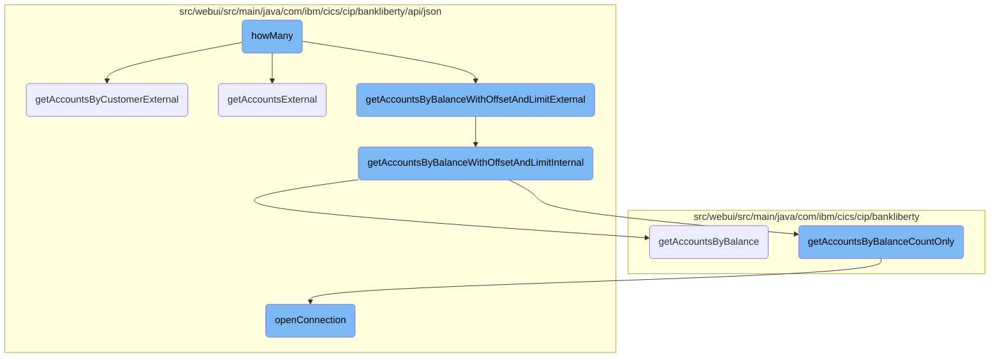
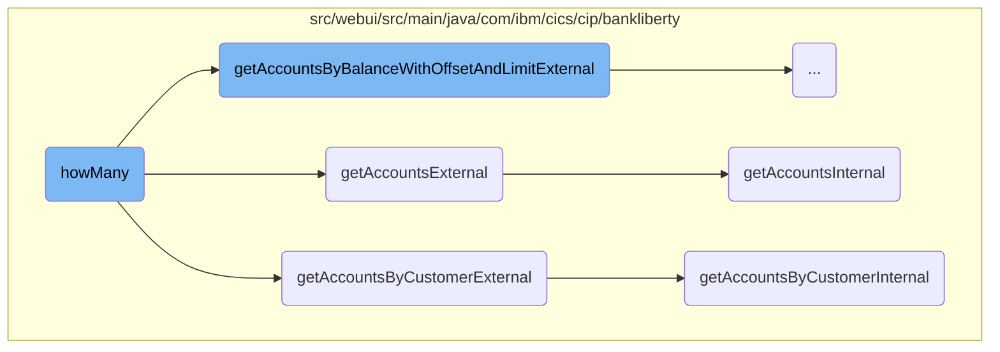
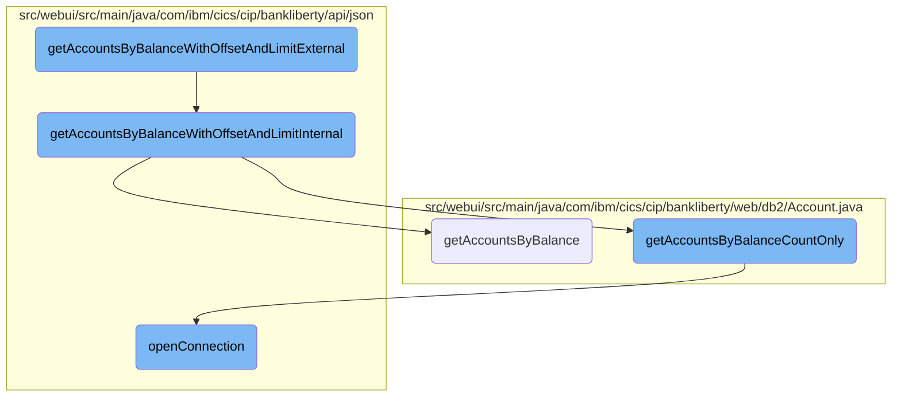
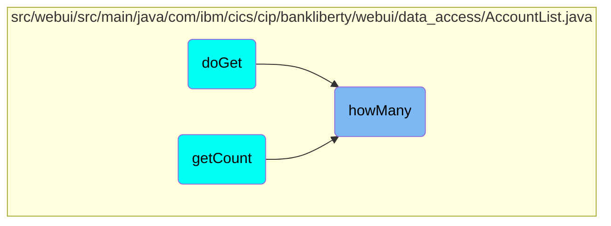

This document explains the <SwmToken path="src/webui/src/main/java/com/ibm/cics/cip/bankliberty/webui/data_access/AccountList.java" pos="69:1:1" line-data="			howMany(filter);">`howMany`</SwmToken> flow, which is responsible for determining the number of accounts based on different filtering criteria. The flow involves several steps, including filtering accounts by balance, account number, and customer number, as well as retrieving all accounts when no specific filter is provided.

The <SwmToken path="src/webui/src/main/java/com/ibm/cics/cip/bankliberty/webui/data_access/AccountList.java" pos="69:1:1" line-data="			howMany(filter);">`howMany`</SwmToken> flow starts by checking if there are any filters applied to the account list. If a filter for account balance is found, it extracts the balance and operator from the filter string and retrieves accounts matching the balance criteria. If the filter is for an account number, it extracts the account number and retrieves the specific account. Similarly, if the filter is for a customer number, it extracts the customer number and retrieves accounts associated with that customer. If no filters are applied, it retrieves all accounts within a specified range and counts the number of accounts. Finally, the flow checks the response status and updates the count of accounts accordingly.

Here is a high level diagram of the flow, showing only the most important functions:



# Flow drill down

First, we'll zoom into this section of the flow:



<SwmSnippet path="/src/webui/src/main/java/com/ibm/cics/cip/bankliberty/webui/data_access/AccountList.java" line="87">

---

## Filtering accounts based on balance

When the filter contains 'AND ACCOUNT_AVAILABLE_BALANCE', the code extracts the balance and operator from the filter string. It then calls <SwmToken path="src/webui/src/main/java/com/ibm/cics/cip/bankliberty/webui/data_access/AccountList.java" pos="97:2:2" line-data="						.getAccountsByBalanceWithOffsetAndLimitExternal(balance,">`getAccountsByBalanceWithOffsetAndLimitExternal`</SwmToken> to retrieve accounts that match the balance criteria.

```java
			if (filter.contains("AND ACCOUNT_AVAILABLE_BALANCE"))
			{
				// 01234567890123456789012345678901234567890
				// AND ACCOUNT_AVAILABLE_BALANCE <= 33558.0

				String operator = filter.substring(31, 32);
				BigDecimal balance = BigDecimal
						.valueOf(Double.parseDouble(filter.substring(34)));

				myAccountsResponse = myAccountsResource
						.getAccountsByBalanceWithOffsetAndLimitExternal(balance,
								operator, null, null, true);
```

---

</SwmSnippet>

<SwmSnippet path="/src/webui/src/main/java/com/ibm/cics/cip/bankliberty/webui/data_access/AccountList.java" line="101">

---

## Filtering accounts based on account number

If the filter contains 'AND ACCOUNT_NUMBER', the code extracts the account number from the filter string and calls <SwmToken path="src/webui/src/main/java/com/ibm/cics/cip/bankliberty/webui/data_access/AccountList.java" pos="112:2:2" line-data="						.getAccountExternal(accountNumberFilterLong);">`getAccountExternal`</SwmToken> to retrieve the specific account.

```java
			if (filter.contains("AND ACCOUNT_NUMBER"))
			{
				String accountNumberFilter = filter.substring(22);
				if (accountNumberFilter.indexOf(' ') >= 0)
				{
					accountNumberFilter = accountNumberFilter.substring(0,
							accountNumberFilter.indexOf(' '));
				}
				Long accountNumberFilterLong = Long
						.parseLong(accountNumberFilter);
				myAccountsResponse = myAccountsResource
						.getAccountExternal(accountNumberFilterLong);
```

---

</SwmSnippet>

<SwmSnippet path="/src/webui/src/main/java/com/ibm/cics/cip/bankliberty/webui/data_access/AccountList.java" line="115">

---

## Filtering accounts based on customer number

When the filter contains 'AND ACCOUNT_CUSTOMER_NUMBER', the code extracts the customer number and calls <SwmToken path="src/webui/src/main/java/com/ibm/cics/cip/bankliberty/webui/data_access/AccountList.java" pos="121:2:2" line-data="						.getAccountsByCustomerExternal(customerNumber, true);">`getAccountsByCustomerExternal`</SwmToken> to retrieve accounts associated with that customer.

```java
			if (filter.contains("AND ACCOUNT_CUSTOMER_NUMBER"))
			{
				String customerNumberFilter = filter.substring(31);
				Long customerNumber = Long.parseLong(customerNumberFilter);

				myAccountsResponse = myAccountsResource
						.getAccountsByCustomerExternal(customerNumber, true);
```

---

</SwmSnippet>

<SwmSnippet path="/src/webui/src/main/java/com/ibm/cics/cip/bankliberty/webui/data_access/AccountList.java" line="125">

---

## Retrieving all accounts

If no specific filter is provided, the code calls <SwmToken path="src/webui/src/main/java/com/ibm/cics/cip/bankliberty/webui/data_access/AccountList.java" pos="128:7:7" line-data="				myAccountsResponse = myAccountsResource.getAccountsExternal(Integer.valueOf(0),Integer.valueOf(999999),true);">`getAccountsExternal`</SwmToken> to retrieve all accounts within a specified range. It then parses the response to count the number of accounts.

```java
			if (filter.length() == 0)
			{

				myAccountsResponse = myAccountsResource.getAccountsExternal(Integer.valueOf(0),Integer.valueOf(999999),true);
				String myAccountsString = myAccountsResponse.getEntity().toString();

				JSONObject myAccountsJSON = JSONObject.parse(myAccountsString);
				if (myAccountsJSON.get(JSON_NUMBER_OF_ACCOUNTS) != null)
				{
					long accountCount = (Long) myAccountsJSON
							.get(JSON_NUMBER_OF_ACCOUNTS);
					this.count = (int) accountCount;
				}

```

---

</SwmSnippet>

<SwmSnippet path="/src/webui/src/main/java/com/ibm/cics/cip/bankliberty/webui/data_access/AccountList.java" line="140">

---

## Counting accounts

After retrieving the accounts, the code checks the response status. If successful, it parses the response to count the number of accounts and updates the <SwmToken path="src/webui/src/main/java/com/ibm/cics/cip/bankliberty/webui/data_access/AccountList.java" pos="148:3:3" line-data="				this.count = 1;">`count`</SwmToken> variable.

```java
			if (myAccountsResponse != null
					&& myAccountsResponse.getStatus() == 200)
			{

				String myAccountsString = myAccountsResponse.getEntity()
						.toString();

				JSONObject myAccountsJSON = JSONObject.parse(myAccountsString);
				this.count = 1;
				if (myAccountsJSON.get(JSON_NUMBER_OF_ACCOUNTS) != null)
				{
					long accountCount = (Long) myAccountsJSON
							.get(JSON_NUMBER_OF_ACCOUNTS);
					this.count = (int) accountCount;
				}
```

---

</SwmSnippet>

Now, lets zoom into this section of the flow:



<SwmSnippet path="/src/webui/src/main/java/com/ibm/cics/cip/bankliberty/api/json/AccountsResource.java" line="1465">

---

## Handling account retrieval based on balance criteria

The <SwmToken path="src/webui/src/main/java/com/ibm/cics/cip/bankliberty/api/json/AccountsResource.java" pos="1465:5:5" line-data="	public Response getAccountsByBalanceWithOffsetAndLimitExternal(">`getAccountsByBalanceWithOffsetAndLimitExternal`</SwmToken> method initiates the process of retrieving accounts based on balance criteria. It logs the entry, checks if the <SwmToken path="src/webui/src/main/java/com/ibm/cics/cip/bankliberty/api/json/AccountsResource.java" pos="1470:5:5" line-data="			@QueryParam(&quot;countOnly&quot;) Boolean countOnly)">`countOnly`</SwmToken> parameter is set, and then calls the internal method <SwmToken path="src/webui/src/main/java/com/ibm/cics/cip/bankliberty/api/json/AccountsResource.java" pos="1481:7:7" line-data="		Response myResponse = getAccountsByBalanceWithOffsetAndLimitInternal(">`getAccountsByBalanceWithOffsetAndLimitInternal`</SwmToken> to perform the actual retrieval.

```java
	public Response getAccountsByBalanceWithOffsetAndLimitExternal(
			@QueryParam("balance") BigDecimal balance,
			@QueryParam("operator") String operator,
			@QueryParam("offset") Integer offset,
			@QueryParam("limit") Integer limit,
			@QueryParam("countOnly") Boolean countOnly)
	{
		// return only accounts with a certain balance
		logger.entering(this.getClass().getName(),
				"getAccountsByBalanceWithOffsetAndLimitExternal(BigDecimal balance, String operator, Integer offset, Integer limit, Boolean countOnly");
		boolean countOnlyReal = false;
		if (countOnly != null)
		{
			countOnlyReal = countOnly.booleanValue();
		}

		Response myResponse = getAccountsByBalanceWithOffsetAndLimitInternal(
				balance, operator, offset, limit, countOnlyReal);
		HBankDataAccess myHBankDataAccess = new HBankDataAccess();
		myHBankDataAccess.terminate();
		logger.exiting(this.getClass().getName(),
```

---

</SwmSnippet>

<SwmSnippet path="/src/webui/src/main/java/com/ibm/cics/cip/bankliberty/api/json/AccountsResource.java" line="1492">

---

### Validating operator and setting limits

The <SwmToken path="src/webui/src/main/java/com/ibm/cics/cip/bankliberty/api/json/AccountsResource.java" pos="1492:5:5" line-data="	public Response getAccountsByBalanceWithOffsetAndLimitInternal(">`getAccountsByBalanceWithOffsetAndLimitInternal`</SwmToken> method validates the operator to ensure it is either '<=' or '>='. It also sets default values for <SwmToken path="src/webui/src/main/java/com/ibm/cics/cip/bankliberty/api/json/AccountsResource.java" pos="1495:5:5" line-data="			@QueryParam(&quot;offset&quot;) Integer offset,">`offset`</SwmToken> and <SwmToken path="src/webui/src/main/java/com/ibm/cics/cip/bankliberty/api/json/AccountsResource.java" pos="1496:5:5" line-data="			@QueryParam(&quot;limit&quot;) Integer limit, boolean countOnly)">`limit`</SwmToken> if they are not provided, ensuring that the query does not result in an <SwmToken path="src/webui/src/main/java/com/ibm/cics/cip/bankliberty/api/json/AccountsResource.java" pos="1379:23:23" line-data="		// We want to set a limit to try to avoid OutOfMemory Exceptions.">`OutOfMemory`</SwmToken> exception.

```java
	public Response getAccountsByBalanceWithOffsetAndLimitInternal(
			@QueryParam("balance") BigDecimal balance,
			@QueryParam("operator") String operator,
			@QueryParam("offset") Integer offset,
			@QueryParam("limit") Integer limit, boolean countOnly)
	{
		// return only accounts with a certain balance
		logger.entering(this.getClass().getName(),
				GET_ACCOUNTS_BY_BALANCE_WITH_OFFSET_AND_LIMIT_INTERNAL);
		Response myResponse = null;
		boolean lessThan;
		if (!operator.startsWith("<") && !(operator.startsWith(">")))
		{
			JSONObject error = new JSONObject();
			error.put(JSON_ERROR_MSG, "Invalid operator, '" + operator
					+ "' only <= or >= allowed");
			logger.log(Level.WARNING, () -> "Invalid operator, '" + operator
					+ "' only <= or >= allowed");
			logger.exiting(this.getClass().getName(),
					GET_ACCOUNTS_BY_BALANCE_WITH_OFFSET_AND_LIMIT_INTERNAL,
					myResponse);
```

---

</SwmSnippet>

<SwmSnippet path="/src/webui/src/main/java/com/ibm/cics/cip/bankliberty/api/json/AccountsResource.java" line="1541">

---

### Counting accounts based on balance

If the <SwmToken path="src/webui/src/main/java/com/ibm/cics/cip/bankliberty/api/json/AccountsResource.java" pos="1541:4:4" line-data="		if (countOnly)">`countOnly`</SwmToken> flag is set, the method <SwmToken path="src/webui/src/main/java/com/ibm/cics/cip/bankliberty/api/json/AccountsResource.java" pos="1545:2:2" line-data="					.getAccountsByBalanceCountOnly(sortCode, balance, lessThan);">`getAccountsByBalanceCountOnly`</SwmToken> is called to count the number of accounts that match the balance criteria. If the count retrieval fails, an error response is returned.

```java
		if (countOnly)
		{
			db2Account = new Account();
			numberOfAccounts = db2Account
					.getAccountsByBalanceCountOnly(sortCode, balance, lessThan);
			if (numberOfAccounts == -1)
			{
				JSONObject error = new JSONObject();
				error.put(JSON_ERROR_MSG, DB2_READ_FAILURE);
				logger.log(Level.SEVERE, () -> DB2_READ_FAILURE);
				logger.exiting(this.getClass().getName(),
						GET_ACCOUNTS_BY_BALANCE_WITH_OFFSET_AND_LIMIT_INTERNAL,
						myResponse);
				myResponse = Response.status(500).entity(error.toString())
						.build();
				return myResponse;
			}
```

---

</SwmSnippet>

<SwmSnippet path="/src/webui/src/main/java/com/ibm/cics/cip/bankliberty/api/json/AccountsResource.java" line="1560">

---

### Retrieving account details

If <SwmToken path="src/webui/src/main/java/com/ibm/cics/cip/bankliberty/api/json/AccountsResource.java" pos="1470:5:5" line-data="			@QueryParam(&quot;countOnly&quot;) Boolean countOnly)">`countOnly`</SwmToken> is not set, the method <SwmToken path="src/webui/src/main/java/com/ibm/cics/cip/bankliberty/api/json/AccountsResource.java" pos="1565:7:7" line-data="			myAccounts = db2Account.getAccountsByBalance(sortCode, balance,">`getAccountsByBalance`</SwmToken> is called to retrieve the account details. The results are then formatted into a JSON response, which includes the number of accounts and their details.

```java
		{
			Account[] myAccounts = null;

			db2Account = new Account();

			myAccounts = db2Account.getAccountsByBalance(sortCode, balance,
					lessThan, offset, limit);

			if (myAccounts == null)
			{
				JSONObject error = new JSONObject();
				error.put(JSON_ERROR_MSG, DB2_READ_FAILURE);
				logger.log(Level.SEVERE, () -> DB2_READ_FAILURE);
				logger.exiting(this.getClass().getName(),
						GET_ACCOUNTS_BY_BALANCE_WITH_OFFSET_AND_LIMIT_INTERNAL,
						myResponse);
				myResponse = Response.status(500).entity(error.toString())
						.build();
				return myResponse;
			}
			accounts = new JSONArray(myAccounts.length);
```

---

</SwmSnippet>

<SwmSnippet path="/src/webui/src/main/java/com/ibm/cics/cip/bankliberty/api/json/HBankDataAccess.java" line="69">

---

### Opening database connection

The <SwmToken path="src/webui/src/main/java/com/ibm/cics/cip/bankliberty/api/json/HBankDataAccess.java" pos="69:5:5" line-data="	protected void openConnection()">`openConnection`</SwmToken> method is responsible for establishing a connection to the <SwmToken path="src/webui/src/main/java/com/ibm/cics/cip/bankliberty/api/json/HBankDataAccess.java" pos="71:13:13" line-data="		// Open a connection to the DB2 database">`DB2`</SwmToken> database. It attempts to reuse an existing connection if available, or creates a new one if necessary. This ensures that the database operations required for account retrieval can be performed.

```java
	protected void openConnection()
	{
		// Open a connection to the DB2 database
		logger.entering(this.getClass().getName(), "openConnection()");

		Integer taskNumberInteger = Task.getTask().getTaskNumber();
		String db2ConnString = DB2CONN.concat(taskNumberInteger.toString());
		logger.log(Level.FINE,
				() -> "Attempting to get DB2CONN for task number "
						+ taskNumberInteger.toString());
		this.conn = (Connection) cornedBeef.get(db2ConnString);
		if (this.conn == null)
		{
			HBankDataAccess.incrementConnCount();
			logger.log(Level.FINE,
					() -> "Attempting to create DB2CONN for task number "
							+ taskNumberInteger.toString());
			// Attempt to open a connection
			openConnectionInternal();
			logger.log(Level.FINE,
					() -> "Creation succcessful for DB2CONN for task number "
```

---

</SwmSnippet>

# Where is this flow used?

This flow is used multiple times in the codebase as represented in the following diagram:



&nbsp;

*This is an auto-generated document by Swimm 🌊 and has not yet been verified by a human*

<SwmMeta version="3.0.0" repo-id="Z2l0aHViJTNBJTNBY2ljcy1iYW5raW5nLXNhbXBsZS1hcHBsaWNhdGlvbi1jYnNhLUlCTS1EZW1vLUdQVCUzQSUzQVN3aW1tLURlbW8=" repo-name="cics-banking-sample-application-cbsa-IBM-Demo-GPT"><sup>Powered by [Swimm](/)</sup></SwmMeta>
