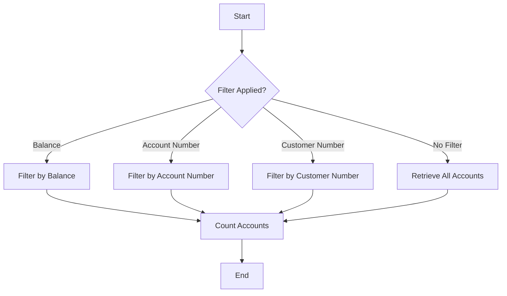

The process of filtering and counting bank accounts involves several steps to ensure accurate retrieval and counting based on specific criteria. This document will cover:

1. Filtering accounts based on balance
2. Filtering accounts based on account number
3. Filtering accounts based on customer number
4. Retrieving all accounts when no filter is applied
5. Counting the number of accounts

Technical document: <SwmLink doc-title="Account Filtering and Counting Flow">[Account Filtering and Counting Flow](/.swm/account-filtering-and-counting-flow.ryscof8m.sw.md)</SwmLink>

# [Filtering accounts based on balance](https://app.swimm.io/repos/Z2l0aHViJTNBJTNBY2ljcy1iYW5raW5nLXNhbXBsZS1hcHBsaWNhdGlvbi1jYnNhLUlCTS1EZW1vLUdQVCUzQSUzQVN3aW1tLURlbW8=/docs/ryscof8m#filtering-accounts-based-on-balance)

When the filter contains 'AND ACCOUNT_AVAILABLE_BALANCE', the system extracts the balance and operator from the filter string. It then retrieves accounts that match the balance criteria. For example, if the filter specifies a balance of <= 33558.0, only accounts with a balance less than or equal to 33558.0 will be retrieved.

# [Filtering accounts based on account number](https://app.swimm.io/repos/Z2l0aHViJTNBJTNBY2ljcy1iYW5raW5nLXNhbXBsZS1hcHBsaWNhdGlvbi1jYnNhLUlCTS1EZW1vLUdQVCUzQSUzQVN3aW1tLURlbW8=/docs/ryscof8m#filtering-accounts-based-on-account-number)

If the filter contains 'AND ACCOUNT_NUMBER', the system extracts the account number from the filter string and retrieves the specific account. This is useful when a user wants to find details about a particular account.

# [Filtering accounts based on customer number](https://app.swimm.io/repos/Z2l0aHViJTNBJTNBY2ljcy1iYW5raW5nLXNhbXBsZS1hcHBsaWNhdGlvbi1jYnNhLUlCTS1EZW1vLUdQVCUzQSUzQVN3aW1tLURlbW8=/docs/ryscof8m#filtering-accounts-based-on-customer-number)

When the filter contains 'AND ACCOUNT_CUSTOMER_NUMBER', the system extracts the customer number and retrieves accounts associated with that customer. This allows users to view all accounts held by a specific customer.

# [Retrieving all accounts](https://app.swimm.io/repos/Z2l0aHViJTNBJTNBY2ljcy1iYW5raW5nLXNhbXBsZS1hcHBsaWNhdGlvbi1jYnNhLUlCTS1EZW1vLUdQVCUzQSUzQVN3aW1tLURlbW8=/docs/ryscof8m#retrieving-all-accounts)

If no specific filter is provided, the system retrieves all accounts within a specified range. This is useful for generating reports or viewing a comprehensive list of all accounts.

# [Counting accounts](https://app.swimm.io/repos/Z2l0aHViJTNBJTNBY2ljcy1iYW5raW5nLXNhbXBsZS1hcHBsaWNhdGlvbi1jYnNhLUlCTS1EZW1vLUdQVCUzQSUzQVN3aW1tLURlbW8=/docs/ryscof8m#counting-accounts)

After retrieving the accounts, the system checks the response status. If successful, it parses the response to count the number of accounts and updates the count variable. This ensures that the user receives an accurate count of the accounts based on the applied filters.

&nbsp;

*This is an auto-generated document by Swimm 🌊 and has not yet been verified by a human*

<SwmMeta version="3.0.0" repo-id="Z2l0aHViJTNBJTNBY2ljcy1iYW5raW5nLXNhbXBsZS1hcHBsaWNhdGlvbi1jYnNhLUlCTS1EZW1vLUdQVCUzQSUzQVN3aW1tLURlbW8=" repo-name="cics-banking-sample-application-cbsa-IBM-Demo-GPT">Powered by [Swimm](/)</SwmMeta>
