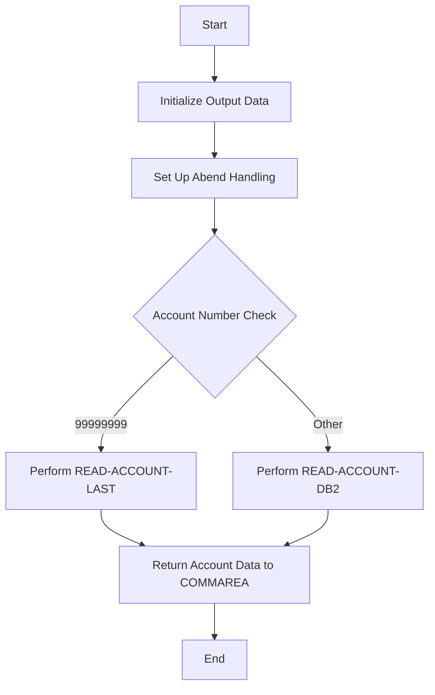

The INQACC program is a COBOL program designed to retrieve account information from a <SwmToken path="src/base/cobol_src/INQACC.cbl" pos="216:13:13" line-data="      *          Get the ACCOUNT row from DB2">`DB2`</SwmToken> database. This document will cover:

1. What the Program Does
2. Program Flow
3. Program Sections

## What the Program Does

The INQACC program retrieves account information from a <SwmToken path="src/base/cobol_src/INQACC.cbl" pos="216:13:13" line-data="      *          Get the ACCOUNT row from DB2">`DB2`</SwmToken> database based on an incoming account number and sort code. It fetches the account details and returns them to the calling program. If any issues occur during the process, the program will abend.

## Program Flow

This is a visualization of the flow:



<SwmSnippet path="/src/base/cobol_src/INQACC.cbl" line="202">

---

### PREMIERE SECTION

First, the program initializes the output data and sets up abend handling. It then checks the account number and performs the appropriate read operation (READ-ACCOUNT-LAST or <SwmToken path="src/base/cobol_src/INQACC.cbl" pos="221:3:7" line-data="             PERFORM READ-ACCOUNT-DB2">`READ-ACCOUNT-DB2`</SwmToken>) based on the account number.

```cobol
       PROCEDURE DIVISION USING DFHCOMMAREA.
       PREMIERE SECTION.
       A010.

           INITIALIZE OUTPUT-DATA.
      *
      *    Set up the abend handling
      *
           EXEC CICS HANDLE
              ABEND LABEL(ABEND-HANDLING)
           END-EXEC.

           MOVE SORTCODE TO REQUIRED-SORT-CODE OF ACCOUNT-KY.
      *
      *          Get the ACCOUNT row from DB2
      *
           IF INQACC-ACCNO = 99999999
             PERFORM READ-ACCOUNT-LAST
           ELSE
             PERFORM READ-ACCOUNT-DB2
           END-IF
```

---

</SwmSnippet>

<SwmSnippet path="/src/base/cobol_src/INQACC.cbl" line="253">

---

### <SwmToken path="src/base/cobol_src/INQACC.cbl" pos="253:1:5" line-data="       READ-ACCOUNT-DB2 SECTION.">`READ-ACCOUNT-DB2`</SwmToken> SECTION

Next, the program reads the <SwmToken path="src/base/cobol_src/INQACC.cbl" pos="253:5:5" line-data="       READ-ACCOUNT-DB2 SECTION.">`DB2`</SwmToken> datastore and processes the data. It opens the <SwmToken path="src/base/cobol_src/INQACC.cbl" pos="253:5:5" line-data="       READ-ACCOUNT-DB2 SECTION.">`DB2`</SwmToken> cursor, fetches the account row, and closes the cursor. If any issues occur during these operations, the program handles the errors and abends if necessary.

```cobol
       READ-ACCOUNT-DB2 SECTION.
       RAD010.

      *
      *     Read the DB2 datastore and process the data
      *

      *
      *    Open the DB2 CURSOR
      *
           MOVE INQACC-ACCNO
              TO HV-ACCOUNT-ACC-NO.
           MOVE SORTCODE TO HV-ACCOUNT-SORTCODE.

      *
      *    Open the DB2 CURSOR
      *
           EXEC SQL OPEN ACC-CURSOR
           END-EXEC.

           IF SQLCODE NOT = 0
```

---

</SwmSnippet>

<SwmSnippet path="/src/base/cobol_src/INQACC.cbl" line="426">

---

### <SwmToken path="src/base/cobol_src/INQACC.cbl" pos="426:1:3" line-data="       FETCH-DATA SECTION.">`FETCH-DATA`</SwmToken> SECTION

Then, the program fetches the matching data from the ACCOUNT table. If no data is found, it returns a low-value record. If an error occurs during the fetch operation, it handles the error and abends if necessary. If a matching account record is found, it moves the data to the output data structure.

```cobol
       FETCH-DATA SECTION.
       FD010.
      *
      *    Gets matching data from the ACCOUNT table
      *
           EXEC SQL FETCH FROM ACC-CURSOR
              INTO :HV-ACCOUNT-EYECATCHER,
                   :HV-ACCOUNT-CUST-NO,
                   :HV-ACCOUNT-SORTCODE,
                   :HV-ACCOUNT-ACC-NO,
                   :HV-ACCOUNT-ACC-TYPE,
                   :HV-ACCOUNT-INT-RATE,
                   :HV-ACCOUNT-OPENED,
                   :HV-ACCOUNT-OVERDRAFT-LIM,
                   :HV-ACCOUNT-LAST-STMT,
                   :HV-ACCOUNT-NEXT-STMT,
                   :HV-ACCOUNT-AVAIL-BAL,
                   :HV-ACCOUNT-ACTUAL-BAL
           END-EXEC.

      *
```

---

</SwmSnippet>

<SwmSnippet path="/src/base/cobol_src/INQACC.cbl" line="578">

---

### <SwmToken path="src/base/cobol_src/INQACC.cbl" pos="578:1:9" line-data="       GET-ME-OUT-OF-HERE SECTION.">`GET-ME-OUT-OF-HERE`</SwmToken> SECTION

Finally, the program returns control back to CICS.

```cobol
       GET-ME-OUT-OF-HERE SECTION.
       GMOFH010.

      *
      *    Return control back to CICS
      *
           EXEC CICS RETURN
           END-EXEC.

           GOBACK.

       GMOFH999.
           EXIT.

```

---

</SwmSnippet>

&nbsp;

*This is an auto-generated document by Swimm 🌊 and has not yet been verified by a human*

<SwmMeta version="3.0.0" repo-id="Z2l0aHViJTNBJTNBY2ljcy1iYW5raW5nLXNhbXBsZS1hcHBsaWNhdGlvbi1jYnNhLUlCTS1EZW1vLUdQVCUzQSUzQVN3aW1tLURlbW8=" repo-name="cics-banking-sample-application-cbsa-IBM-Demo-GPT"><sup>Powered by [Swimm](/)</sup></SwmMeta>
