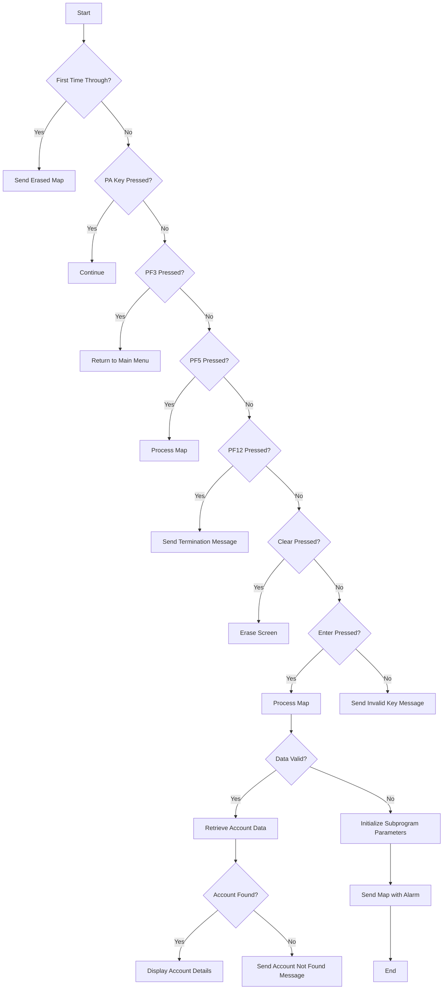

This document will cover the <SwmToken path="src/base/cobol_src/BNK1DAC.cbl" pos="15:6:6" line-data="       PROGRAM-ID. BNK1DAC.">`BNK1DAC`</SwmToken> program. We'll cover:

1. What the Program Does
2. Program Flow
3. Program Sections

## What the Program Does

The <SwmToken path="src/base/cobol_src/BNK1DAC.cbl" pos="15:6:6" line-data="       PROGRAM-ID. BNK1DAC.">`BNK1DAC`</SwmToken> program is designed to handle account display and deletion operations within the BANKING application. It interacts with the user through a map, processes user inputs, and performs actions such as displaying account details or deleting an account based on the user's commands.

## Program Flow

This is a visualization of the flow:



<SwmSnippet path="/src/base/cobol_src/BNK1DAC.cbl" line="188">

---

### PREMIERE SECTION

First, the program evaluates the initial conditions. If it's the first time through, it sends an erased map. If a PA key is pressed, it continues. If PF3 is pressed, it returns to the main menu. If <SwmToken path="src/base/cobol_src/BNK1DAC.cbl" pos="693:21:21" line-data="           STRING &#39;If you wish to delete the Account press &lt;PF5&gt;.&#39;">`PF5`</SwmToken> is pressed, it processes the map. If PF12 is pressed, it sends a termination message. If CLEAR is pressed, it erases the screen. If ENTER is pressed, it processes the map. For any other key, it sends an invalid key message.

```cobol
       PREMIERE SECTION.
       A010.

           EVALUATE TRUE
      *
      *       Is it the first time through? If so, send the map
      *       with erased (empty) data fields.
      *
              WHEN EIBCALEN = ZERO
                 MOVE LOW-VALUE TO BNK1DAO
                 MOVE -1 TO ACCNOL
                 SET SEND-ERASE TO TRUE
                 INITIALIZE WS-COMM-AREA
                 PERFORM SEND-MAP

      *
      *       If a PA key is pressed, just carry on
      *
              WHEN EIBAID = DFHPA1 OR DFHPA2 OR DFHPA3
                 CONTINUE

```

---

</SwmSnippet>

<SwmSnippet path="/src/base/cobol_src/BNK1DAC.cbl" line="366">

---

### <SwmToken path="src/base/cobol_src/BNK1DAC.cbl" pos="366:1:3" line-data="       PROCESS-MAP SECTION.">`PROCESS-MAP`</SwmToken> SECTION

Next, the program processes the map. It retrieves data from the map and validates it. If the data is valid, it retrieves account information. If <SwmToken path="src/base/cobol_src/BNK1DAC.cbl" pos="693:21:21" line-data="           STRING &#39;If you wish to delete the Account press &lt;PF5&gt;.&#39;">`PF5`</SwmToken> is pressed, it validates the data and deletes the account if the data is valid. Finally, it sends the map with an alarm.

```cobol
       PROCESS-MAP SECTION.
       PM010.
      *
      *    Retrieve the data from the map
      *
           PERFORM RECEIVE-MAP.

      *
      *    If enter is pressed validate the data
      *
           IF EIBAID = DFHENTER
      *
      *       Validate the received data
      *
              PERFORM EDIT-DATA

      *
      *       If the data passes validation go on to
      *       retrieve account information.
      *
              IF VALID-DATA
```

---

</SwmSnippet>

<SwmSnippet path="/src/base/cobol_src/BNK1DAC.cbl" line="421">

---

### <SwmToken path="src/base/cobol_src/BNK1DAC.cbl" pos="421:1:3" line-data="       RECEIVE-MAP SECTION.">`RECEIVE-MAP`</SwmToken> SECTION

Then, the program retrieves data from the map using the <SwmToken path="src/base/cobol_src/BNK1DAC.cbl" pos="426:1:1" line-data="           EXEC CICS">`EXEC`</SwmToken>` `<SwmToken path="src/base/cobol_src/BNK1DAC.cbl" pos="426:3:3" line-data="           EXEC CICS">`CICS`</SwmToken>` `<SwmToken path="src/base/cobol_src/BNK1DAC.cbl" pos="421:1:1" line-data="       RECEIVE-MAP SECTION.">`RECEIVE`</SwmToken> command. If the response is not normal, it handles the error by linking to the Abend Handler program.

```cobol
       RECEIVE-MAP SECTION.
       RM010.
      *
      *    Retrieve the data
      *
           EXEC CICS
              RECEIVE MAP('BNK1DA')
              MAPSET('BNK1DAM')
              INTO(BNK1DAI)
              RESP(WS-CICS-RESP)
              RESP2(WS-CICS-RESP2)
           END-EXEC.

           IF WS-CICS-RESP NOT = DFHRESP(NORMAL)
      *
      *       Preserve the RESP and RESP2, then set up the
      *       standard ABEND info before getting the applid,
      *       date/time etc. and linking to the Abend Handler
      *       program.
      *
              INITIALIZE ABNDINFO-REC
```

---

</SwmSnippet>

<SwmSnippet path="/src/base/cobol_src/BNK1DAC.cbl" line="498">

---

### <SwmToken path="src/base/cobol_src/BNK1DAC.cbl" pos="498:1:3" line-data="       EDIT-DATA SECTION.">`EDIT-DATA`</SwmToken> SECTION

Now, the program validates the incoming fields. If the account number is not provided or is invalid, it sets the validation flag to 'N' and sends an error message.

```cobol
       EDIT-DATA SECTION.
       ED010.
      *
      *    Perform validation on the incoming fields
      *
           IF ACCNOI = LOW-VALUES
           OR ACCNOL = 0
             MOVE 'Please enter an account number.' TO
                 MESSAGEO
             MOVE 'N' TO VALID-DATA-SW
             GO TO ED999
           END-IF

           EXEC CICS BIF DEEDIT
              FIELD(ACCNOI)
           END-EXEC

           IF ACCNOI NOT NUMERIC
              MOVE 'Please enter an account number.' TO
                 MESSAGEO
              MOVE 'N' TO VALID-DATA-SW
```

---

</SwmSnippet>

<SwmSnippet path="/src/base/cobol_src/BNK1DAC.cbl" line="525">

---

### <SwmToken path="src/base/cobol_src/BNK1DAC.cbl" pos="525:1:3" line-data="       VALIDATE-DATA SECTION.">`VALIDATE-DATA`</SwmToken> SECTION

Next, the program performs further validation on the incoming fields. If the sort code or account number is missing or invalid, it sets the validation flag to 'N' and sends an error message.

```cobol
       VALIDATE-DATA SECTION.
       VD010.
      *
      *    Perform further validation on the incoming fields
      *
           IF COMM-SCODE = ZEROES OR LOW-VALUES
           OR COMM-ACCNO = ZEROES OR LOW-VALUES
              MOVE 'N' TO VALID-DATA-SW
              MOVE SPACES TO MESSAGEO
              STRING 'Please enter an account number.'
                  DELIMITED BY SIZE,
                  INTO MESSAGEO
              MOVE -1 TO ACCNOL
            END-IF.

       VD999.
           EXIT.
```

---

</SwmSnippet>

<SwmSnippet path="/src/base/cobol_src/BNK1DAC.cbl" line="544">

---

### <SwmToken path="src/base/cobol_src/BNK1DAC.cbl" pos="544:1:5" line-data="       GET-ACC-DATA SECTION.">`GET-ACC-DATA`</SwmToken> SECTION

Then, the program sets up the fields required by the <SwmToken path="src/base/cobol_src/BNK1DAC.cbl" pos="547:15:15" line-data="      *    Set up the fields required by INQACC then link to it">`INQACC`</SwmToken> program and calls it to retrieve account data. If the response is not normal, it handles the error by linking to the Abend Handler program. If the account is not found, it sends an error message. Otherwise, it sets the values on the map with the retrieved account details.

```cobol
       GET-ACC-DATA SECTION.
       GAD010.
      *
      *    Set up the fields required by INQACC then link to it
      *
           INITIALIZE PARMS-SUBPGM INQACC-COMMAREA
           SET INQACC-PCB1-POINTER TO NULL
           MOVE ACCNOI TO PARMS-SUBPGM-ACCNO INQACC-ACCNO.

           EXEC CICS LINK
              PROGRAM('INQACC')
              COMMAREA(INQACC-COMMAREA)
              RESP(WS-CICS-RESP)
              RESP2(WS-CICS-RESP2)
              SYNCONRETURN
           END-EXEC.

           IF WS-CICS-RESP NOT = DFHRESP(NORMAL)
      *
      *       Preserve the RESP and RESP2, then set up the
      *       standard ABEND info before getting the applid,
```

---

</SwmSnippet>

<SwmSnippet path="/src/base/cobol_src/BNK1DAC.cbl" line="701">

---

### <SwmToken path="src/base/cobol_src/BNK1DAC.cbl" pos="701:1:5" line-data="       DEL-ACC-DATA SECTION.">`DEL-ACC-DATA`</SwmToken> SECTION

Next, the program sets up the fields required by the <SwmToken path="src/base/cobol_src/BNK1DAC.cbl" pos="704:15:15" line-data="      *    Set up the fields required by DELACC then link to it">`DELACC`</SwmToken> program and calls it to delete the account. If the response is not normal, it handles the error by linking to the Abend Handler program. If the account is not deleted successfully, it sends an error message. Otherwise, it clears the map fields and sends a success message.

```cobol
       DEL-ACC-DATA SECTION.
       DAD010.
      *
      *    Set up the fields required by DELACC then link to it
      *
           INITIALIZE PARMS-SUBPGM
           COMPUTE PARMS-SUBPGM-ACCNO = FUNCTION NUMVAL(ACCNO2I)
           SET PARMS-SUBPGM-DEL-PCB1 TO NULL.
           SET PARMS-SUBPGM-DEL-PCB2 TO NULL.
           SET PARMS-SUBPGM-DEL-PCB3 TO NULL.

           EXEC CICS LINK
              PROGRAM('DELACC')
              COMMAREA(PARMS-SUBPGM)
              RESP(WS-CICS-RESP)
              RESP2(WS-CICS-RESP2)
              SYNCONRETURN
           END-EXEC.

           IF WS-CICS-RESP NOT = DFHRESP(NORMAL)
              INITIALIZE WS-FAIL-INFO
```

---

</SwmSnippet>

<SwmSnippet path="/src/base/cobol_src/BNK1DAC.cbl" line="820">

---

### <SwmToken path="src/base/cobol_src/BNK1DAC.cbl" pos="820:1:3" line-data="       SEND-MAP SECTION.">`SEND-MAP`</SwmToken> SECTION

Then, the program sends the map. If the map needs to be erased, it sends the map with the <SwmToken path="src/base/cobol_src/BNK1DAC.cbl" pos="825:5:5" line-data="           IF SEND-ERASE">`ERASE`</SwmToken> option. If only the data needs to be resent, it sends the map with the <SwmToken path="src/base/cobol_src/BNK1DAC.cbl" pos="49:5:5" line-data="              88 SEND-DATAONLY            VALUE &#39;2&#39;.">`DATAONLY`</SwmToken> option. If the map needs to be sent with an alarm, it sends the map with the <SwmToken path="src/base/cobol_src/BNK1DAC.cbl" pos="49:5:5" line-data="              88 SEND-DATAONLY            VALUE &#39;2&#39;.">`DATAONLY`</SwmToken> and <SwmToken path="src/base/cobol_src/BNK1DAC.cbl" pos="50:7:7" line-data="              88 SEND-DATAONLY-ALARM      VALUE &#39;3&#39;.">`ALARM`</SwmToken> options. If the response is not normal, it handles the error by linking to the Abend Handler program.

```cobol
       SEND-MAP SECTION.
       SM010.
      *
      *    If the map needs to have its data erased
      *
           IF SEND-ERASE

              EXEC CICS SEND MAP('BNK1DA')
                 MAPSET('BNK1DAM')
                 FROM(BNK1DAO)
                 ERASE
                 RESP(WS-CICS-RESP)
                 RESP2(WS-CICS-RESP2)
              END-EXEC

              IF WS-CICS-RESP NOT = DFHRESP(NORMAL)
      *
      *          Preserve the RESP and RESP2, then set up the
      *          standard ABEND info before getting the applid,
      *          date/time etc. and linking to the Abend Handler
      *          program.
```

---

</SwmSnippet>

<SwmSnippet path="/src/base/cobol_src/BNK1DAC.cbl" line="1055">

---

### <SwmToken path="src/base/cobol_src/BNK1DAC.cbl" pos="1055:1:5" line-data="       SEND-TERMINATION-MSG SECTION.">`SEND-TERMINATION-MSG`</SwmToken> SECTION

Finally, the program sends the termination message using the <SwmToken path="src/base/cobol_src/BNK1DAC.cbl" pos="1060:1:7" line-data="           EXEC CICS SEND TEXT">`EXEC CICS SEND TEXT`</SwmToken> command. If the response is not normal, it handles the error by linking to the Abend Handler program.

```cobol
       SEND-TERMINATION-MSG SECTION.
       STM010.
      *
      *    Send the termination message
      *
           EXEC CICS SEND TEXT
              FROM(END-OF-SESSION-MESSAGE)
              ERASE
              FREEKB
              RESP(WS-CICS-RESP)
              RESP2(WS-CICS-RESP2)
           END-EXEC.

           IF WS-CICS-RESP NOT = DFHRESP(NORMAL)
      *
      *       Preserve the RESP and RESP2, then set up the
      *       standard ABEND info before getting the applid,
      *       date/time etc. and linking to the Abend Handler
      *       program.
      *
              INITIALIZE ABNDINFO-REC
```

---

</SwmSnippet>

&nbsp;

*This is an auto-generated document by Swimm 🌊 and has not yet been verified by a human*

<SwmMeta version="3.0.0" repo-id="Z2l0aHViJTNBJTNBY2ljcy1iYW5raW5nLXNhbXBsZS1hcHBsaWNhdGlvbi1jYnNhLUlCTS1EZW1vLUdQVCUzQSUzQVN3aW1tLURlbW8=" repo-name="cics-banking-sample-application-cbsa-IBM-Demo-GPT"><sup>Powered by [Swimm](/)</sup></SwmMeta>
