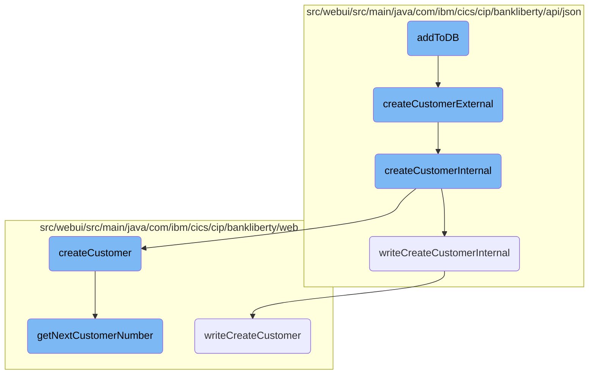

In this document, we will explain the process of adding a new customer to the database. The process involves creating a customer object, validating the customer data, and writing the customer information to the database.

The flow starts with creating a customer object with the necessary details like name, address, and date of birth. This object is then passed to a function that validates the data to ensure all required fields are filled and correct. If the data is valid, the customer information is written to the database, and a customer number is generated and returned. If any step fails, appropriate error messages are logged and returned.

# Flow drill down



<SwmSnippet path="/src/webui/src/main/java/com/ibm/cics/cip/bankliberty/webui/data_access/Customer.java" line="265">

---

## <SwmToken path="src/webui/src/main/java/com/ibm/cics/cip/bankliberty/webui/data_access/Customer.java" pos="265:5:5" line-data="	public String addToDB()">`addToDB`</SwmToken>

The <SwmToken path="src/webui/src/main/java/com/ibm/cics/cip/bankliberty/webui/data_access/Customer.java" pos="265:5:5" line-data="	public String addToDB()">`addToDB`</SwmToken> function initiates the process of adding a new customer to the database. It creates a <SwmToken path="src/webui/src/main/java/com/ibm/cics/cip/bankliberty/webui/data_access/Customer.java" pos="269:1:1" line-data="		CustomerJSON myCustomerJSON = new CustomerJSON();">`CustomerJSON`</SwmToken> object with the customer's details and calls <SwmToken path="src/webui/src/main/java/com/ibm/cics/cip/bankliberty/webui/data_access/Customer.java" pos="276:2:2" line-data="				.createCustomerExternal(myCustomerJSON);">`createCustomerExternal`</SwmToken> to handle the creation process. If the response status is 201, it parses the response to update the customer details and returns the customer number.

```java
	public String addToDB()
	{
		CustomerResource myCustomerResource = new CustomerResource();

		CustomerJSON myCustomerJSON = new CustomerJSON();

		myCustomerJSON.setCustomerAddress(this.getAddress());
		myCustomerJSON.setCustomerName(this.getName());
		myCustomerJSON.setDateOfBirth(this.getDob());
		myCustomerJSON.setSortCode(this.getSortcode());
		Response myCustomerResponse = myCustomerResource
				.createCustomerExternal(myCustomerJSON);

		String myCustomerString = null;
		JSONObject myCustomer = null;

		if (myCustomerResponse.getStatus() == 201)
		{
			myCustomerString = myCustomerResponse.getEntity().toString();
			try
			{
```

---

</SwmSnippet>

<SwmSnippet path="/src/webui/src/main/java/com/ibm/cics/cip/bankliberty/api/json/CustomerResource.java" line="108">

---

## <SwmToken path="src/webui/src/main/java/com/ibm/cics/cip/bankliberty/api/json/CustomerResource.java" pos="110:5:5" line-data="	public Response createCustomerExternal(CustomerJSON customer)">`createCustomerExternal`</SwmToken>

The <SwmToken path="src/webui/src/main/java/com/ibm/cics/cip/bankliberty/api/json/CustomerResource.java" pos="110:5:5" line-data="	public Response createCustomerExternal(CustomerJSON customer)">`createCustomerExternal`</SwmToken> function receives a <SwmToken path="src/webui/src/main/java/com/ibm/cics/cip/bankliberty/api/json/CustomerResource.java" pos="110:7:7" line-data="	public Response createCustomerExternal(CustomerJSON customer)">`CustomerJSON`</SwmToken> object and calls <SwmToken path="src/webui/src/main/java/com/ibm/cics/cip/bankliberty/api/json/CustomerResource.java" pos="114:7:7" line-data="		Response myResponse = createCustomerInternal(customer);">`createCustomerInternal`</SwmToken> to perform the actual customer creation. It logs the entry and exit points and ensures the termination of <SwmToken path="src/webui/src/main/java/com/ibm/cics/cip/bankliberty/api/json/CustomerResource.java" pos="115:1:1" line-data="		HBankDataAccess myHBankDataAccess = new HBankDataAccess();">`HBankDataAccess`</SwmToken>.

```java
	@POST
	@Produces(MediaType.APPLICATION_JSON)
	public Response createCustomerExternal(CustomerJSON customer)
	{
		logger.entering(this.getClass().getName(),
				CREATE_CUSTOMER_EXTERNAL + customer.toString());
		Response myResponse = createCustomerInternal(customer);
		HBankDataAccess myHBankDataAccess = new HBankDataAccess();
		myHBankDataAccess.terminate();
		logger.exiting(this.getClass().getName(), CREATE_CUSTOMER_EXTERNAL_EXIT,
				myResponse);
		return myResponse;
	}
```

---

</SwmSnippet>

<SwmSnippet path="/src/webui/src/main/java/com/ibm/cics/cip/bankliberty/api/json/CustomerResource.java" line="123">

---

## <SwmToken path="src/webui/src/main/java/com/ibm/cics/cip/bankliberty/api/json/CustomerResource.java" pos="123:5:5" line-data="	public Response createCustomerInternal(CustomerJSON customer)">`createCustomerInternal`</SwmToken>

The <SwmToken path="src/webui/src/main/java/com/ibm/cics/cip/bankliberty/api/json/CustomerResource.java" pos="123:5:5" line-data="	public Response createCustomerInternal(CustomerJSON customer)">`createCustomerInternal`</SwmToken> function performs several validations on the customer data, such as checking for null values and validating the customer title and sort code. If any validation fails, it returns an appropriate error response. If all validations pass, it creates a new customer record using the <SwmToken path="src/webui/src/main/java/com/ibm/cics/cip/bankliberty/api/json/CustomerResource.java" pos="228:7:7" line-data="		vsamCustomer = vsamCustomer.createCustomer(customer,">`createCustomer`</SwmToken> function and writes the transaction using <SwmToken path="src/webui/src/main/java/com/ibm/cics/cip/bankliberty/api/json/ProcessedTransactionResource.java" pos="389:5:5" line-data="	public Response writeCreateCustomerInternal(">`writeCreateCustomerInternal`</SwmToken>.

```java
	public Response createCustomerInternal(CustomerJSON customer)
	{
		logger.entering(this.getClass().getName(),
				CREATE_CUSTOMER_INTERNAL + customer.toString());
		JSONObject response = new JSONObject();

		
		if(customer.getCustomerName() == null)
		{
			JSONObject error = new JSONObject();
			error.put(JSON_ERROR_MSG,
					"Customer name is null");
			Response myResponse = Response.status(400).entity(error.toString())
					.build();
			logger.log(Level.WARNING,
					() -> "Customer name is null in CustomerResource.createCustomerInternal(), "
							+ customer.toString());
			logger.exiting(this.getClass().getName(),
					CREATE_CUSTOMER_INTERNAL_EXIT, myResponse);
			return myResponse;
		}
```

---

</SwmSnippet>

<SwmSnippet path="/src/webui/src/main/java/com/ibm/cics/cip/bankliberty/api/json/CustomerResource.java" line="130">

---

### Validating Customer Data

The function checks if the customer's name, sort code, address, and date of birth are not null. It also validates the customer's title and sort code. If any validation fails, it logs a warning and returns a 400 status response with an error message.

```java
		if(customer.getCustomerName() == null)
		{
			JSONObject error = new JSONObject();
			error.put(JSON_ERROR_MSG,
					"Customer name is null");
			Response myResponse = Response.status(400).entity(error.toString())
					.build();
			logger.log(Level.WARNING,
					() -> "Customer name is null in CustomerResource.createCustomerInternal(), "
							+ customer.toString());
			logger.exiting(this.getClass().getName(),
					CREATE_CUSTOMER_INTERNAL_EXIT, myResponse);
			return myResponse;
		}
		
		String[] name = customer.getCustomerName().split(" ");

		if (!customer.validateTitle(name[0].trim()))
		{
			JSONObject error = new JSONObject();
			error.put(JSON_ERROR_MSG,
```

---

</SwmSnippet>

<SwmSnippet path="/src/webui/src/main/java/com/ibm/cics/cip/bankliberty/api/json/CustomerResource.java" line="224">

---

### Creating Customer Record

The function calls <SwmToken path="src/webui/src/main/java/com/ibm/cics/cip/bankliberty/api/json/CustomerResource.java" pos="228:7:7" line-data="		vsamCustomer = vsamCustomer.createCustomer(customer,">`createCustomer`</SwmToken> to create a new customer record in the VSAM file. If the creation fails, it logs a severe error and returns a 500 status response with an error message.

```java
		com.ibm.cics.cip.bankliberty.web.vsam.Customer vsamCustomer = new com.ibm.cics.cip.bankliberty.web.vsam.Customer();

		customer.setSortCode(this.getSortCode().toString());

		vsamCustomer = vsamCustomer.createCustomer(customer,
				this.getSortCode());

		if (vsamCustomer == null)
		{
			JSONObject error = new JSONObject();
			error.put(JSON_ERROR_MSG,
					"Failed to create customer in com.ibm.cics.cip.bankliberty.web.vsam.Customer");
			logger.severe(
					"Failed to create customer in com.ibm.cics.cip.bankliberty.web.vsam.Customer");
			Response myResponse = Response.status(500).entity(error.toString())
					.build();
			logger.exiting(this.getClass().getName(),
					CREATE_CUSTOMER_INTERNAL_EXIT, myResponse);
			return myResponse;
		}
```

---

</SwmSnippet>

<SwmSnippet path="/src/webui/src/main/java/com/ibm/cics/cip/bankliberty/api/json/ProcessedTransactionResource.java" line="389">

---

## <SwmToken path="src/webui/src/main/java/com/ibm/cics/cip/bankliberty/api/json/ProcessedTransactionResource.java" pos="389:5:5" line-data="	public Response writeCreateCustomerInternal(">`writeCreateCustomerInternal`</SwmToken>

The <SwmToken path="src/webui/src/main/java/com/ibm/cics/cip/bankliberty/api/json/ProcessedTransactionResource.java" pos="389:5:5" line-data="	public Response writeCreateCustomerInternal(">`writeCreateCustomerInternal`</SwmToken> function writes the newly created customer data to the <SwmToken path="src/webui/src/main/java/com/ibm/cics/cip/bankliberty/api/json/ProcessedTransactionResource.java" pos="134:4:4" line-data="					&quot;Proctran DB2 table not accessible. Please contact your system administrator.&quot;);">`DB2`</SwmToken> database. It uses the <SwmToken path="src/webui/src/main/java/com/ibm/cics/cip/bankliberty/api/json/ProcessedTransactionResource.java" pos="392:15:15" line-data="		com.ibm.cics.cip.bankliberty.web.db2.ProcessedTransaction myProcessedTransactionDB2 = new com.ibm.cics.cip.bankliberty.web.db2.ProcessedTransaction();">`ProcessedTransaction`</SwmToken> class to perform the write operation and returns an appropriate response based on the success or failure of the operation.

```java
	public Response writeCreateCustomerInternal(
			ProcessedTransactionCreateCustomerJSON myCreatedCustomer)
	{
		com.ibm.cics.cip.bankliberty.web.db2.ProcessedTransaction myProcessedTransactionDB2 = new com.ibm.cics.cip.bankliberty.web.db2.ProcessedTransaction();
		

		if (myProcessedTransactionDB2.writeCreateCustomer(
				myCreatedCustomer.getSortCode(),
				myCreatedCustomer.getAccountNumber(), 0.00,
				myCreatedCustomer.getCustomerDOB(),
				myCreatedCustomer.getCustomerName(),
				myCreatedCustomer.getCustomerNumber()))
		{
			return Response.ok().build();
		}
		else
		{
			return Response.serverError().build();
		}

	}
```

---

</SwmSnippet>

<SwmSnippet path="/src/webui/src/main/java/com/ibm/cics/cip/bankliberty/web/vsam/Customer.java" line="740">

---

## <SwmToken path="src/webui/src/main/java/com/ibm/cics/cip/bankliberty/web/vsam/Customer.java" pos="740:5:5" line-data="	public Customer createCustomer(CustomerJSON customer,">`createCustomer`</SwmToken>

The <SwmToken path="src/webui/src/main/java/com/ibm/cics/cip/bankliberty/web/vsam/Customer.java" pos="740:5:5" line-data="	public Customer createCustomer(CustomerJSON customer,">`createCustomer`</SwmToken> function creates a new customer record in the VSAM file. It sets various customer attributes, including address, name, date of birth, sort code, and customer number. It also handles credit score and review date population. If the record is successfully written to the file, it returns a <SwmToken path="src/webui/src/main/java/com/ibm/cics/cip/bankliberty/web/vsam/Customer.java" pos="740:3:3" line-data="	public Customer createCustomer(CustomerJSON customer,">`Customer`</SwmToken> object; otherwise, it logs an error and returns null.

```java
	public Customer createCustomer(CustomerJSON customer,
			Integer sortCodeInteger)
	{
		logger.entering(this.getClass().getName(), CREATE_CUSTOMER);

		Customer temp = null;

		customerFile.setName(FILENAME);
		myCustomer = new CUSTOMER();

		String sortCodeString = sortCodeInteger.toString();
		long customerNumberAsPrimitive = getNextCustomerNumber(sortCodeString);

		Long customerNumberLong = Long.valueOf(customerNumberAsPrimitive);
		if (customerNumberLong == -1)
		{
			return null;
		}

		byte[] key = buildKey(sortCodeInteger, customerNumberLong);

```

---

</SwmSnippet>

<SwmSnippet path="/src/webui/src/main/java/com/ibm/cics/cip/bankliberty/web/vsam/Customer.java" line="860">

---

## <SwmToken path="src/webui/src/main/java/com/ibm/cics/cip/bankliberty/web/vsam/Customer.java" pos="860:5:5" line-data="	private long getNextCustomerNumber(String sortCodeString)">`getNextCustomerNumber`</SwmToken>

The <SwmToken path="src/webui/src/main/java/com/ibm/cics/cip/bankliberty/web/vsam/Customer.java" pos="860:5:5" line-data="	private long getNextCustomerNumber(String sortCodeString)">`getNextCustomerNumber`</SwmToken> function generates a new customer number by reading and updating the last customer number from the control record. It ensures that the new customer number is unique and increments the number of customers.

```java
	private long getNextCustomerNumber(String sortCodeString)
	{
		// We need to get a NEW customer number
		// We need to enqueue, then get the last customer number

		NameResource enqueue = new NameResource();

		enqueue.setName("HBNKCUST" + sortCodeString + "  ");
		try
		{
			enqueue.enqueue();
		}
		catch (LengthErrorException | ResourceUnavailableException e)
		{
			logger.severe(e.getLocalizedMessage());
			logger.exiting(this.getClass().getName(), CREATE_CUSTOMER, null);
			return -1;
		}
		CustomerControl myCustomerControl = new CustomerControl();

		customerFile.setName(FILENAME);
```

---

</SwmSnippet>

<SwmSnippet path="/src/webui/src/main/java/com/ibm/cics/cip/bankliberty/web/db2/ProcessedTransaction.java" line="693">

---

## <SwmToken path="src/webui/src/main/java/com/ibm/cics/cip/bankliberty/web/db2/ProcessedTransaction.java" pos="693:5:5" line-data="	public boolean writeCreateCustomer(String sortCode2, String accountNumber,">`writeCreateCustomer`</SwmToken>

The <SwmToken path="src/webui/src/main/java/com/ibm/cics/cip/bankliberty/web/db2/ProcessedTransaction.java" pos="693:5:5" line-data="	public boolean writeCreateCustomer(String sortCode2, String accountNumber,">`writeCreateCustomer`</SwmToken> function writes the customer creation transaction to the <SwmToken path="src/webui/src/main/java/com/ibm/cics/cip/bankliberty/api/json/ProcessedTransactionResource.java" pos="134:4:4" line-data="					&quot;Proctran DB2 table not accessible. Please contact your system administrator.&quot;);">`DB2`</SwmToken> database. It prepares an SQL insert statement with the customer details and executes it. If the operation is successful, it returns true; otherwise, it logs an error and returns false.

```java
	public boolean writeCreateCustomer(String sortCode2, String accountNumber,
			double amountWhichWillBeZero, Date customerDOB, String customerName,
			String customerNumber)
	{
		logger.entering(this.getClass().getName(), WRITE_CREATE_CUSTOMER);
		sortOutDateTimeTaskString();
		String createCustomerDescription = "";
		createCustomerDescription = createCustomerDescription
				.concat(padSortCode(Integer.parseInt(sortCode2)));

		createCustomerDescription = createCustomerDescription
				.concat(padCustomerNumber(customerNumber));
		StringBuilder myStringBuilder = new StringBuilder();
		for (int z = customerName.length(); z < 14; z++)
		{
			myStringBuilder.append("0");
		}
		myStringBuilder.append(customerName);
		createCustomerDescription = createCustomerDescription
				.concat(myStringBuilder.substring(0, 14));

```

---

</SwmSnippet>

&nbsp;

*This is an auto-generated document by Swimm 🌊 and has not yet been verified by a human*

<SwmMeta version="3.0.0" repo-id="Z2l0aHViJTNBJTNBY2ljcy1iYW5raW5nLXNhbXBsZS1hcHBsaWNhdGlvbi1jYnNhLUlCTS1EZW1vLUdQVCUzQSUzQVN3aW1tLURlbW8=" repo-name="cics-banking-sample-application-cbsa-IBM-Demo-GPT"><sup>Powered by [Swimm](/)</sup></SwmMeta>
