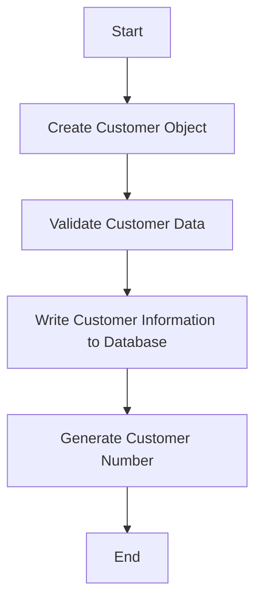

The process of adding a new customer involves several steps to ensure the data is correctly captured and stored. This document will cover:

1. Creating a customer object
2. Validating customer data
3. Writing customer information to the database
4. Generating a customer number

Technical document: <SwmLink doc-title="Adding a New Customer Flow">[Adding a New Customer Flow](/.swm/adding-a-new-customer-flow.mfok0u9y.sw.md)</SwmLink>

# [Creating a Customer Object](https://app.swimm.io/repos/Z2l0aHViJTNBJTNBY2ljcy1iYW5raW5nLXNhbXBsZS1hcHBsaWNhdGlvbi1jYnNhLUlCTS1EZW1vLUdQVCUzQSUzQVN3aW1tLURlbW8=/docs/mfok0u9y#addtodb)

The process begins by creating a customer object that includes all necessary details such as name, address, and date of birth. This object serves as a container for all the customer information that will be validated and eventually stored in the database.

# [Validating Customer Data](https://app.swimm.io/repos/Z2l0aHViJTNBJTNBY2ljcy1iYW5raW5nLXNhbXBsZS1hcHBsaWNhdGlvbi1jYnNhLUlCTS1EZW1vLUdQVCUzQSUzQVN3aW1tLURlbW8=/docs/mfok0u9y#createcustomerinternal)

Once the customer object is created, the next step is to validate the data. This involves checking that all required fields are filled and correct. For example, the customer's name, address, and date of birth must not be null. Additionally, the customer's title and sort code are validated to ensure they meet specific criteria. If any validation fails, an appropriate error message is generated and the process is halted.

# [Writing Customer Information to the Database](https://app.swimm.io/repos/Z2l0aHViJTNBJTNBY2ljcy1iYW5raW5nLXNhbXBsZS1hcHBsaWNhdGlvbi1jYnNhLUlCTS1EZW1vLUdQVCUzQSUzQVN3aW1tLURlbW8=/docs/mfok0u9y#writecreatecustomerinternal)

After the data is validated, the customer information is written to the database. This step involves creating a new customer record and storing it in the database. If the write operation is successful, the process continues; otherwise, an error message is logged and returned.

# [Generating a Customer Number](https://app.swimm.io/repos/Z2l0aHViJTNBJTNBY2ljcy1iYW5raW5nLXNhbXBsZS1hcHBsaWNhdGlvbi1jYnNhLUlCTS1EZW1vLUdQVCUzQSUzQVN3aW1tLURlbW8=/docs/mfok0u9y#getnextcustomernumber)

The final step in the process is generating a unique customer number. This number is created by reading and updating the last customer number from a control record. The new customer number is then assigned to the customer and returned as part of the response. This ensures that each customer has a unique identifier within the system.

&nbsp;

*This is an auto-generated document by Swimm 🌊 and has not yet been verified by a human*

<SwmMeta version="3.0.0" repo-id="Z2l0aHViJTNBJTNBY2ljcy1iYW5raW5nLXNhbXBsZS1hcHBsaWNhdGlvbi1jYnNhLUlCTS1EZW1vLUdQVCUzQSUzQVN3aW1tLURlbW8=" repo-name="cics-banking-sample-application-cbsa-IBM-Demo-GPT">Powered by [Swimm](/)</SwmMeta>
