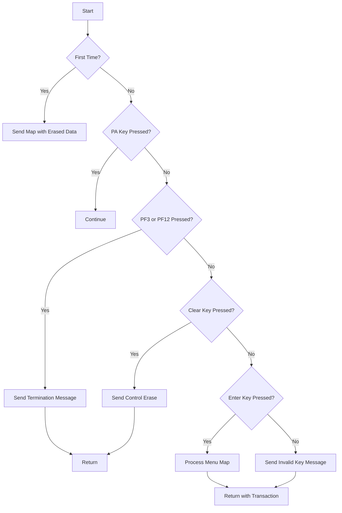

This document will cover the BNKMENU program. We'll cover:

1. What the Program Does
2. Program Flow
3. Program Sections

## What the Program Does

The BNKMENU program is designed to display a bank menu to the user, allowing them to select various banking options. It validates the user's selection and initiates the appropriate transaction based on the input. The program handles different types of user inputs, such as function keys, clear keys, and enter keys, and processes them accordingly.

## Program Flow

This is a visualization of the flow:



<SwmSnippet path="/src/base/cobol_src/BNKMENU.cbl" line="108">

---

### PREMIERE SECTION

First, the program evaluates the user input. If it's the first time through, it sends the map with erased data fields. If a PA key is pressed, it continues without any action. If PF3 or PF12 is pressed, it sends a termination message and returns. If the clear key is pressed, it sends control erase and returns. If the enter key is pressed, it processes the menu map. For any other key, it sends an invalid key message.

```cobol
       PREMIERE SECTION.
       A010.

           EVALUATE TRUE
      *
      *       Is it the first time through? If so, send the map
      *       with erased (empty) data fields.
      *
              WHEN EIBCALEN = ZERO
                 MOVE LOW-VALUE TO BNK1MEO
                 MOVE -1 TO ACTIONL
                 SET SEND-ERASE TO TRUE
                 PERFORM SEND-MAP

      *
      *       If a PA key is pressed, just carry on
      *
              WHEN EIBAID = DFHPA1 OR DFHPA2 OR DFHPA3
                 CONTINUE

      *
```

---

</SwmSnippet>

<SwmSnippet path="/src/base/cobol_src/BNKMENU.cbl" line="241">

---

### <SwmToken path="src/base/cobol_src/BNKMENU.cbl" pos="241:1:5" line-data="       PROCESS-MENU-MAP SECTION.">`PROCESS-MENU-MAP`</SwmToken> SECTION

Next, the program retrieves and validates the data from the map. If the data is valid, it invokes other transactions based on the user's selection. Finally, it sends the map with the updated data.

```cobol
       PROCESS-MENU-MAP SECTION.
       PMM010.
      *
      *    Retrieve the data from the map and validate it
      *
           PERFORM RECEIVE-MENU-MAP.

           PERFORM EDIT-MENU-DATA.

      *
      *    If the data passes validation go on to
      *    invoke other transactions
      *
           IF VALID-DATA
              PERFORM INVOKE-OTHER-TXNS
           END-IF.

           SET SEND-DATAONLY-ALARM TO TRUE.

      *
      *    Output the data to the screen
```

---

</SwmSnippet>

<SwmSnippet path="/src/base/cobol_src/BNKMENU.cbl" line="269">

---

### <SwmToken path="src/base/cobol_src/BNKMENU.cbl" pos="269:1:5" line-data="       RECEIVE-MENU-MAP SECTION.">`RECEIVE-MENU-MAP`</SwmToken> SECTION

Then, the program retrieves the data from the map. If the map retrieval fails, it handles the error by sending an appropriate message or linking to the Abend Handler program.

```cobol
       RECEIVE-MENU-MAP SECTION.
       RMM010.
      *
      *    Retrieve the data
      *
           EXEC CICS
              RECEIVE MAP('BNK1ME')
              MAPSET('BNK1MAI')
              INTO(BNK1MEI)
              RESP(WS-CICS-RESP)
              RESP2(WS-CICS-RESP2)
           END-EXEC.

           IF WS-CICS-RESP NOT = DFHRESP(NORMAL)

              IF WS-CICS-RESP = DFHRESP(MAPFAIL)
                 MOVE LOW-VALUES TO BNK1MEO
                 MOVE -1 TO ACTIONL
                 SET SEND-ERASE TO TRUE
                 PERFORM SEND-MAP
              ELSE
```

---

</SwmSnippet>

<SwmSnippet path="/src/base/cobol_src/BNKMENU.cbl" line="355">

---

### <SwmToken path="src/base/cobol_src/BNKMENU.cbl" pos="355:1:5" line-data="       EDIT-MENU-DATA SECTION.">`EDIT-MENU-DATA`</SwmToken> SECTION

Now, the program validates the incoming field. If the input is not valid, it sets an error message and marks the data as invalid. If the input is valid, it moves the action to the appropriate variable.

```cobol
       EDIT-MENU-DATA SECTION.
       EMD010.
      *
      *    Perform validation on the incoming field
      *
           IF ACTIONI NOT = '1' AND ACTIONI NOT = '2' AND
           ACTIONI NOT = '3' AND ACTIONI NOT = '4' AND
           ACTIONI NOT = '5' AND ACTIONI NOT = '6' AND
           ACTIONI NOT = '7' AND ACTIONI NOT = 'A'

              MOVE SPACES TO MESSAGEO
              MOVE 'You must enter a valid value (1-7 or A).' TO
                 MESSAGEO
              MOVE 'N' TO VALID-DATA-SW
           ELSE
              MOVE ACTIONI TO ACTION-ALPHA
           END-IF.

       EMD999.
           EXIT.
```

---

</SwmSnippet>

<SwmSnippet path="/src/base/cobol_src/BNKMENU.cbl" line="377">

---

### <SwmToken path="src/base/cobol_src/BNKMENU.cbl" pos="377:1:5" line-data="       INVOKE-OTHER-TXNS SECTION.">`INVOKE-OTHER-TXNS`</SwmToken> SECTION

Then, the program invokes the transaction that matches the chosen menu option. It handles different actions such as displaying customer details, displaying account details, creating a customer, creating an account, updating an account, crediting/debiting funds, transferring funds, and looking up accounts for a customer. If any of these actions fail, it links to the Abend Handler program.

```cobol
       INVOKE-OTHER-TXNS SECTION.
       IOT010.
      *
      *    Invoke the transaction that matches the chosen menu option
      *

      *
      *    1 = Display CUSTOMER details
      *
           IF ACTIONI = '1'
              EXEC CICS RETURN
                 TRANSID('ODCS')
                 IMMEDIATE
                 RESP(WS-CICS-RESP)
                 RESP2(WS-CICS-RESP2)
              END-EXEC

              IF WS-CICS-RESP NOT = DFHRESP(NORMAL)
      *
      *          Preserve the RESP and RESP2, then set up the
      *          standard ABEND info before getting the applid,
```

---

</SwmSnippet>

<SwmSnippet path="/src/base/cobol_src/BNKMENU.cbl" line="972">

---

### <SwmToken path="src/base/cobol_src/BNKMENU.cbl" pos="972:1:3" line-data="       SEND-MAP SECTION.">`SEND-MAP`</SwmToken> SECTION

Going into the send map section, the program sends the map to the user. It handles different scenarios such as sending the map with erased data, sending only the data, and sending the map with an alarm. If any of these actions fail, it links to the Abend Handler program.

```cobol
       SEND-MAP SECTION.
       SMM010.
      *
      *    If the map needs to have its data erased
      *

           IF SEND-ERASE
              EXEC CICS SEND MAP('BNK1ME')
                 MAPSET('BNK1MAI')
                 FROM(BNK1MEO)
                 ERASE
                 RESP(WS-CICS-RESP)
                 RESP2(WS-CICS-RESP2)
              END-EXEC

              IF WS-CICS-RESP NOT = DFHRESP(NORMAL)
      *
      *          Preserve the RESP and RESP2, then set up the
      *          standard ABEND info before getting the applid,
      *          date/time etc. and linking to the Abend Handler
      *          program.
```

---

</SwmSnippet>

<SwmSnippet path="/src/base/cobol_src/BNKMENU.cbl" line="1205">

---

### <SwmToken path="src/base/cobol_src/BNKMENU.cbl" pos="1205:1:5" line-data="       SEND-TERMINATION-MSG SECTION.">`SEND-TERMINATION-MSG`</SwmToken> SECTION

Next, the program sends the termination message to the user. If this action fails, it links to the Abend Handler program.

```cobol
       SEND-TERMINATION-MSG SECTION.
       STM010.
      *
      *    Send the termination message
      *
           EXEC CICS SEND TEXT
              FROM(END-OF-SESSION-MESSAGE)
              ERASE
              FREEKB
              RESP(WS-CICS-RESP)
              RESP2(WS-CICS-RESP2)
           END-EXEC.

           IF WS-CICS-RESP NOT = DFHRESP(NORMAL)
      *
      *       Preserve the RESP and RESP2, then set up the
      *       standard ABEND info before getting the applid,
      *       date/time etc. and linking to the Abend Handler
      *       program.
      *
              INITIALIZE ABNDINFO-REC
```

---

</SwmSnippet>

<SwmSnippet path="/src/base/cobol_src/BNKMENU.cbl" line="1282">

---

### <SwmToken path="src/base/cobol_src/BNKMENU.cbl" pos="1282:1:5" line-data="       ABEND-THIS-TASK SECTION.">`ABEND-THIS-TASK`</SwmToken> SECTION

Then, the program displays the failure information and abends the task.

```cobol
       ABEND-THIS-TASK SECTION.
       ATT010.
           DISPLAY WS-FAIL-INFO.

           EXEC CICS ABEND
              ABCODE('HBNK')
              NODUMP
           END-EXEC.

       ATT999.
           EXIT.
```

---

</SwmSnippet>

<SwmSnippet path="/src/base/cobol_src/BNKMENU.cbl" line="1295">

---

### <SwmToken path="src/base/cobol_src/BNKMENU.cbl" pos="1295:1:5" line-data="       POPULATE-TIME-DATE SECTION.">`POPULATE-TIME-DATE`</SwmToken> SECTION

Finally, the program populates the current time and date.

```cobol
       POPULATE-TIME-DATE SECTION.
       PTD010.
      D    DISPLAY 'POPULATE-TIME-DATE SECTION'.

           EXEC CICS ASKTIME
              ABSTIME(WS-U-TIME)
           END-EXEC.

           EXEC CICS FORMATTIME
                     ABSTIME(WS-U-TIME)
                     DDMMYYYY(WS-ORIG-DATE)
                     TIME(WS-TIME-NOW)
                     DATESEP
           END-EXEC.

       PTD999.
           EXIT.
```

---

</SwmSnippet>

&nbsp;

*This is an auto-generated document by Swimm 🌊 and has not yet been verified by a human*

<SwmMeta version="3.0.0" repo-id="Z2l0aHViJTNBJTNBY2ljcy1iYW5raW5nLXNhbXBsZS1hcHBsaWNhdGlvbi1jYnNhLUlCTS1EZW1vLUdQVCUzQSUzQVN3aW1tLURlbW8=" repo-name="cics-banking-sample-application-cbsa-IBM-Demo-GPT"><sup>Powered by [Swimm](/)</sup></SwmMeta>
