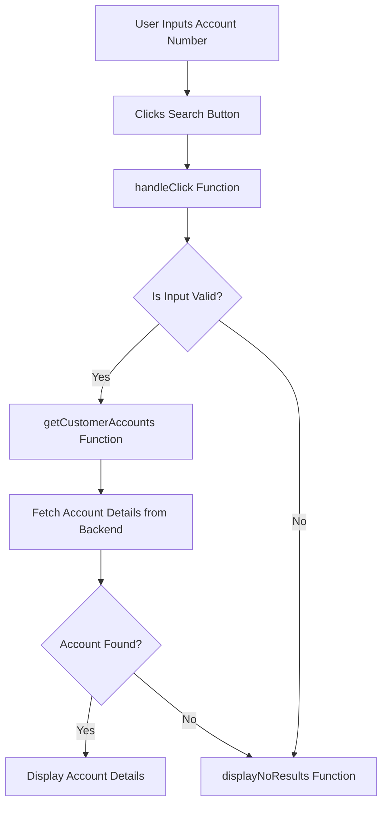

# Overview

The Account Details Page allows users to view detailed information about a specific bank account by entering the account number. This page integrates various components from the Carbon Design System to ensure a consistent and responsive user interface.

# Accessing Account Details

To enquire on an account, click on 'View account details' from the landing page.

# Handling User Input

The function <SwmToken path="src/bank-application-frontend/src/content/AccountDetailsPage/AccountDetailsPage.js" pos="36:3:3" line-data="  function handleChange(value) {">`handleChange`</SwmToken> updates the user input state when the user types in the account number.

<SwmSnippet path="/src/bank-application-frontend/src/content/AccountDetailsPage/AccountDetailsPage.js" line="36">

---

The <SwmToken path="src/bank-application-frontend/src/content/AccountDetailsPage/AccountDetailsPage.js" pos="36:3:3" line-data="  function handleChange(value) {">`handleChange`</SwmToken> function updates the state with the user's input.

```javascript
  function handleChange(value) {
    setUserInput(value)
  }
```

---

</SwmSnippet>

# Initiating the Search

The function <SwmToken path="src/bank-application-frontend/src/content/AccountDetailsPage/AccountDetailsPage.js" pos="44:3:3" line-data="  function handleClick() {">`handleClick`</SwmToken> initiates the search for account details when the user clicks the search button. It calls <SwmToken path="src/bank-application-frontend/src/content/AccountDetailsPage/AccountDetailsPage.js" pos="47:1:1" line-data="        getCustomerAccounts(searchQuery)">`getCustomerAccounts`</SwmToken> if the input is valid; otherwise, it displays the no results modal.

<SwmSnippet path="/src/bank-application-frontend/src/content/AccountDetailsPage/AccountDetailsPage.js" line="44">

---

The <SwmToken path="src/bank-application-frontend/src/content/AccountDetailsPage/AccountDetailsPage.js" pos="44:3:3" line-data="  function handleClick() {">`handleClick`</SwmToken> function validates the input and initiates the search for account details.

```javascript
  function handleClick() {
    let searchQuery = userInput;
    if (userInput.length !== 0){
        getCustomerAccounts(searchQuery)
        setIsOpened(wasOpened => !wasOpened)
      } else {
        displayNoResults()
      }
  }
```

---

</SwmSnippet>



# Fetching Account Details

The function <SwmToken path="src/bank-application-frontend/src/content/AccountDetailsPage/AccountDetailsPage.js" pos="47:1:1" line-data="        getCustomerAccounts(searchQuery)">`getCustomerAccounts`</SwmToken> sends a request to the backend to fetch account details based on the entered account number. It processes the response and updates the state with the account details.

<SwmSnippet path="/src/bank-application-frontend/src/content/AccountDetailsPage/AccountDetailsPage.js" line="66">

---

The <SwmToken path="src/bank-application-frontend/src/content/AccountDetailsPage/AccountDetailsPage.js" pos="70:5:5" line-data="  async function getCustomerAccounts(searchQuery) {">`getCustomerAccounts`</SwmToken> function fetches account details from the backend and updates the state with the response.

```javascript
  /**
   * Get the account for a given accountNumber, create an array of the response and set accountMainRow to this array
   * Calls getOtherAccountsForCustomer to find the other accounts tied to this customer's number
   */
  async function getCustomerAccounts(searchQuery) {
    let account;
    let rowBuild = [];
    await axios
      .get(process.env.REACT_APP_ACCOUNT_URL + `/${searchQuery}`)
      .then(response => {
        account = response.data;
      }).catch (function (error) {
        if (error.response){
          displayNoResults()
          console.log(error)
        }
      })
    try {
      let row;
      let formattedDateOpened = getDay(account.dateOpened) + "-" + getMonth(account.dateOpened) + "-" + getYear(account.dateOpened)
      let formattedLastStatementDue = getDay(account.lastStatementDate) + "-" + getMonth(account.lastStatementDate) + "-" + getYear(account.lastStatementDate)
```

---

</SwmSnippet>

# Handling No Results

The function <SwmToken path="src/bank-application-frontend/src/content/AccountDetailsPage/AccountDetailsPage.js" pos="40:3:3" line-data="  function displayNoResults() {">`displayNoResults`</SwmToken> toggles the modal window to inform the user that no accounts were found for the entered account number.

<SwmSnippet path="/src/bank-application-frontend/src/content/AccountDetailsPage/AccountDetailsPage.js" line="40">

---

The <SwmToken path="src/bank-application-frontend/src/content/AccountDetailsPage/AccountDetailsPage.js" pos="40:3:3" line-data="  function displayNoResults() {">`displayNoResults`</SwmToken> function toggles the modal window to inform the user that no accounts were found.

```javascript
  function displayNoResults() {
    setShowNoResultsModal(wasOpened => !wasOpened)
  }
```

---

</SwmSnippet>

# Main Functions

There are several main functions in this folder. Some of them are <SwmToken path="src/bank-application-frontend/src/content/AccountDetailsPage/AccountDetailsPage.js" pos="22:2:2" line-data="const AccountDetailsPage = () =&gt; {">`AccountDetailsPage`</SwmToken>, <SwmToken path="src/bank-application-frontend/src/content/AccountDetailsPage/AccountDetailsPage.js" pos="47:1:1" line-data="        getCustomerAccounts(searchQuery)">`getCustomerAccounts`</SwmToken>, <SwmToken path="src/bank-application-frontend/src/content/AccountDetailsPage/AccountDetailsPage.js" pos="40:3:3" line-data="  function displayNoResults() {">`displayNoResults`</SwmToken>, <SwmToken path="src/bank-application-frontend/src/content/AccountDetailsPage/AccountDetailsPage.js" pos="44:3:3" line-data="  function handleClick() {">`handleClick`</SwmToken>, <SwmToken path="src/bank-application-frontend/src/content/AccountDetailsPage/AccountDetailsPage.js" pos="36:3:3" line-data="  function handleChange(value) {">`handleChange`</SwmToken>, <SwmToken path="src/bank-application-frontend/src/content/AccountDetailsPage/AccountDetailsPage.js" pos="85:37:37" line-data="      let formattedDateOpened = getDay(account.dateOpened) + &quot;-&quot; + getMonth(account.dateOpened) + &quot;-&quot; + getYear(account.dateOpened)">`getYear`</SwmToken>, <SwmToken path="src/bank-application-frontend/src/content/AccountDetailsPage/AccountDetailsPage.js" pos="85:22:22" line-data="      let formattedDateOpened = getDay(account.dateOpened) + &quot;-&quot; + getMonth(account.dateOpened) + &quot;-&quot; + getYear(account.dateOpened)">`getMonth`</SwmToken>, and <SwmToken path="src/bank-application-frontend/src/content/AccountDetailsPage/AccountDetailsPage.js" pos="85:7:7" line-data="      let formattedDateOpened = getDay(account.dateOpened) + &quot;-&quot; + getMonth(account.dateOpened) + &quot;-&quot; + getYear(account.dateOpened)">`getDay`</SwmToken>. We will dive a little into <SwmToken path="src/bank-application-frontend/src/content/AccountDetailsPage/AccountDetailsPage.js" pos="22:2:2" line-data="const AccountDetailsPage = () =&gt; {">`AccountDetailsPage`</SwmToken> and <SwmToken path="src/bank-application-frontend/src/content/AccountDetailsPage/AccountDetailsPage.js" pos="47:1:1" line-data="        getCustomerAccounts(searchQuery)">`getCustomerAccounts`</SwmToken>.

# <SwmToken path="src/bank-application-frontend/src/content/AccountDetailsPage/AccountDetailsPage.js" pos="22:2:2" line-data="const AccountDetailsPage = () =&gt; {">`AccountDetailsPage`</SwmToken>

The <SwmToken path="src/bank-application-frontend/src/content/AccountDetailsPage/AccountDetailsPage.js" pos="22:2:2" line-data="const AccountDetailsPage = () =&gt; {">`AccountDetailsPage`</SwmToken> function initializes the state variables and handles the main logic for displaying account details. It includes state variables like <SwmToken path="src/bank-application-frontend/src/content/AccountDetailsPage/AccountDetailsPage.js" pos="23:4:4" line-data="  const [isOpened, setIsOpened] = useState(false);">`isOpened`</SwmToken>, <SwmToken path="src/bank-application-frontend/src/content/AccountDetailsPage/AccountDetailsPage.js" pos="24:4:4" line-data="  const [userInput, setUserInput] = useState(&quot;&quot;)">`userInput`</SwmToken>, <SwmToken path="src/bank-application-frontend/src/content/AccountDetailsPage/AccountDetailsPage.js" pos="25:4:4" line-data="  const [accountMainRow, setMainRow] = useState([]);">`accountMainRow`</SwmToken>, and <SwmToken path="src/bank-application-frontend/src/content/AccountDetailsPage/AccountDetailsPage.js" pos="26:4:4" line-data="  const [showNoResultsModal, setShowNoResultsModal] = useState(false)">`showNoResultsModal`</SwmToken> to manage the component's state.

<SwmSnippet path="/src/bank-application-frontend/src/content/AccountDetailsPage/AccountDetailsPage.js" line="22">

---

The <SwmToken path="src/bank-application-frontend/src/content/AccountDetailsPage/AccountDetailsPage.js" pos="22:2:2" line-data="const AccountDetailsPage = () =&gt; {">`AccountDetailsPage`</SwmToken> function initializes state variables and handles the main logic for displaying account details.

```javascript
const AccountDetailsPage = () => {
  const [isOpened, setIsOpened] = useState(false);
  const [userInput, setUserInput] = useState("")
  const [accountMainRow, setMainRow] = useState([]);
  const [showNoResultsModal, setShowNoResultsModal] = useState(false)
```

---

</SwmSnippet>

# <SwmToken path="src/bank-application-frontend/src/content/AccountDetailsPage/AccountDetailsPage.js" pos="47:1:1" line-data="        getCustomerAccounts(searchQuery)">`getCustomerAccounts`</SwmToken>

The <SwmToken path="src/bank-application-frontend/src/content/AccountDetailsPage/AccountDetailsPage.js" pos="47:1:1" line-data="        getCustomerAccounts(searchQuery)">`getCustomerAccounts`</SwmToken> function fetches account details from the backend using the provided account number. It processes the response to extract relevant account information and updates the state with this data. If an error occurs, it calls <SwmToken path="src/bank-application-frontend/src/content/AccountDetailsPage/AccountDetailsPage.js" pos="40:3:3" line-data="  function displayNoResults() {">`displayNoResults`</SwmToken> to show a modal indicating no accounts were found.

<SwmSnippet path="/src/bank-application-frontend/src/content/AccountDetailsPage/AccountDetailsPage.js" line="66">

---

The <SwmToken path="src/bank-application-frontend/src/content/AccountDetailsPage/AccountDetailsPage.js" pos="70:5:5" line-data="  async function getCustomerAccounts(searchQuery) {">`getCustomerAccounts`</SwmToken> function fetches account details from the backend and updates the state with the response.

```javascript
  /**
   * Get the account for a given accountNumber, create an array of the response and set accountMainRow to this array
   * Calls getOtherAccountsForCustomer to find the other accounts tied to this customer's number
   */
  async function getCustomerAccounts(searchQuery) {
    let account;
    let rowBuild = [];
    await axios
      .get(process.env.REACT_APP_ACCOUNT_URL + `/${searchQuery}`)
      .then(response => {
        account = response.data;
      }).catch (function (error) {
        if (error.response){
          displayNoResults()
          console.log(error)
        }
      })
    try {
      let row;
      let formattedDateOpened = getDay(account.dateOpened) + "-" + getMonth(account.dateOpened) + "-" + getYear(account.dateOpened)
      let formattedLastStatementDue = getDay(account.lastStatementDate) + "-" + getMonth(account.lastStatementDate) + "-" + getYear(account.lastStatementDate)
```

---

</SwmSnippet>

&nbsp;

*This is an auto-generated document by Swimm 🌊 and has not yet been verified by a human*

<SwmMeta version="3.0.0" repo-id="Z2l0aHViJTNBJTNBY2ljcy1iYW5raW5nLXNhbXBsZS1hcHBsaWNhdGlvbi1jYnNhLUlCTS1EZW1vLUdQVCUzQSUzQVN3aW1tLURlbW8=" repo-name="cics-banking-sample-application-cbsa-IBM-Demo-GPT"><sup>Powered by [Swimm](/)</sup></SwmMeta>
