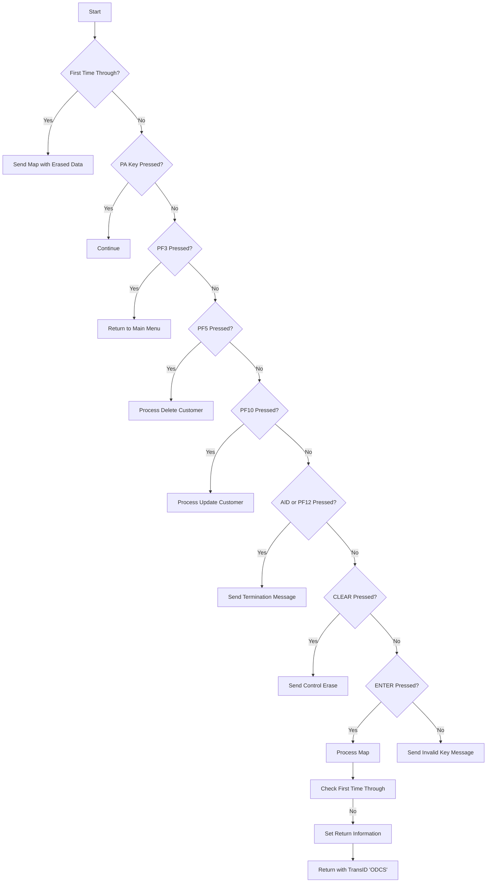

This document will cover the <SwmToken path="src/base/cobol_src/BNK1DCS.cbl" pos="19:6:6" line-data="       PROGRAM-ID. BNK1DCS.">`BNK1DCS`</SwmToken> program. We'll cover:

1. What the Program Does
2. Program Flow
3. Program Sections

## What the Program Does

The <SwmToken path="src/base/cobol_src/BNK1DCS.cbl" pos="19:6:6" line-data="       PROGRAM-ID. BNK1DCS.">`BNK1DCS`</SwmToken> program is designed to display customer details, delete customer records if <SwmToken path="src/base/cobol_src/BNK1DCS.cbl" pos="951:12:12" line-data="           STRING &#39;Customer lookup successful. &lt;PF5&gt; to Delete. &lt;PF10&#39;">`PF5`</SwmToken> is pressed, or allow customer records to be updated if <SwmToken path="src/base/cobol_src/BNK1DCS.cbl" pos="951:21:21" line-data="           STRING &#39;Customer lookup successful. &lt;PF5&gt; to Delete. &lt;PF10&#39;">`PF10`</SwmToken> is pressed. The program handles various user inputs to perform these operations and interacts with other programs to retrieve, update, or delete customer data.

## Program Flow

This is a visualization of the flow:



<SwmSnippet path="/src/base/cobol_src/BNK1DCS.cbl" line="188">

---

### PREMIERE SECTION

First, the program sets up abend handling and evaluates the user input. Depending on the input, it either sends the map with erased data, returns to the main menu, processes delete or update customer actions, sends a termination message, or handles invalid key presses.

```cobol
       PROCEDURE DIVISION USING DFHCOMMAREA.
       PREMIERE SECTION.
       A010.

      *
      *    Set up the Abend handling
      *
           EXEC CICS HANDLE ABEND
                LABEL(ABEND-HANDLING)
           END-EXEC.

           EVALUATE TRUE

      *
      *       Is it the first time through? If so, send the map
      *       with erased (empty) data fields.
      *
              WHEN EIBCALEN = ZERO
                 MOVE LOW-VALUE TO BNK1DCO
                 MOVE -1 TO CUSTNOL
                 SET SEND-ERASE TO TRUE
```

---

</SwmSnippet>

<SwmSnippet path="/src/base/cobol_src/BNK1DCS.cbl" line="400">

---

### <SwmToken path="src/base/cobol_src/BNK1DCS.cbl" pos="400:1:3" line-data="       PROCESS-MAP SECTION.">`PROCESS-MAP`</SwmToken> SECTION

Next, the program processes the map data. It retrieves data from the map, validates it, and depending on the input, either gets customer data, updates customer data, or deletes customer data.

```cobol
       PROCESS-MAP SECTION.
       PM010.
      *
      *    Retrieve the data from the map
      *
           PERFORM RECEIVE-MAP.

      *
      *    Check to see if it just DFHENTER by itself
      *    if it is, then validate the data.
      *
           IF EIBAID = DFHENTER AND COMM-UPD NOT = 'Y'
              MOVE -1 TO CUSTNOL

              PERFORM EDIT-DATA

      *
      *       If the data passes validation go on to
      *       get the customer record
      *
              IF VALID-DATA
```

---

</SwmSnippet>

<SwmSnippet path="/src/base/cobol_src/BNK1DCS.cbl" line="496">

---

### <SwmToken path="src/base/cobol_src/BNK1DCS.cbl" pos="496:1:3" line-data="       RECEIVE-MAP SECTION.">`RECEIVE-MAP`</SwmToken> SECTION

Then, the program retrieves the data from the map, ensuring the correct case is maintained. It handles any errors that occur during this process.

```cobol
       RECEIVE-MAP SECTION.
       RM010.
      *
      *    Retrieve the data
      *

      *
      *    To ensure that we get the correct case and the
      *    terminal doesn't change the case from ower case to
      *    upper case we need to turn off upper case translation, do
      *    the receive and then turn it on again.
      *

           EXEC CICS INQUIRE
                TERMINAL(EIBTRMID)
                UCTRANST(WS-UCTRANS)
                RESP(WS-CICS-RESP)
                RESP2(WS-CICS-RESP2)
           END-EXEC.

      *
```

---

</SwmSnippet>

<SwmSnippet path="/src/base/cobol_src/BNK1DCS.cbl" line="675">

---

### <SwmToken path="src/base/cobol_src/BNK1DCS.cbl" pos="675:1:3" line-data="       EDIT-DATA SECTION.">`EDIT-DATA`</SwmToken> SECTION

Now, the program performs validation on the incoming fields to ensure they are correct and can be processed.

```cobol
       EDIT-DATA SECTION.
       ED010.
      *
      *    Perform validation on the incoming fields
      *
           IF CUSTNOL = ZERO OR CUSTNOI = LOW-VALUES
              MOVE SPACES TO MESSAGEO
              MOVE 'Please enter a customer number.' TO
                 MESSAGEO
              MOVE 'N' TO VALID-DATA-SW
              MOVE -1  TO CUSTNOL
              GO TO ED999
           END-IF.


           EXEC CICS BIF DEEDIT
              FIELD(CUSTNOI)
           END-EXEC

           IF CUSTNOI NOT NUMERIC
              MOVE SPACES TO MESSAGEO
```

---

</SwmSnippet>

<SwmSnippet path="/src/base/cobol_src/BNK1DCS.cbl" line="706">

---

### <SwmToken path="src/base/cobol_src/BNK1DCS.cbl" pos="706:1:3" line-data="       EDIT-DATA2 SECTION.">`EDIT-DATA2`</SwmToken> SECTION

Next, the program performs additional validation on the amended data from the update, ensuring fields like customer name and address are valid.

```cobol
       EDIT-DATA2 SECTION.
       ED2010.
      *
      *    Perform more validation
      *

      *
      *    Validate the amended data from the update starting with
      *    Customer Name, this must have a valid title at the begining.
      *
           MOVE CUSTNAMI TO WS-VALIDATE-NAME.

           UNSTRING WS-VALIDATE-NAME DELIMITED BY SPACE
              INTO WS-UNSTR-TITLE.

           MOVE ' ' TO WS-TITLE-VALID.

           EVALUATE WS-UNSTR-TITLE

              WHEN 'Professor'
                 MOVE 'Y' TO WS-TITLE-VALID
```

---

</SwmSnippet>

<SwmSnippet path="/src/base/cobol_src/BNK1DCS.cbl" line="794">

---

### <SwmToken path="src/base/cobol_src/BNK1DCS.cbl" pos="794:1:3" line-data="       VALIDATE-DATA SECTION.">`VALIDATE-DATA`</SwmToken> SECTION

Then, the program performs further attribute validation to ensure the data is correct and can be processed.

```cobol
       VALIDATE-DATA SECTION.
       VD010.
      *
      *    Perform even more attribute validation
      *
      *
      *    This hasn't been set, so we're relying on it being random!
      *
           IF INQCUST-SCODE = '000000'
              MOVE 'N' TO VALID-DATA-SW
              MOVE SPACES TO MESSAGEO
              STRING 'The Sort code / Customer number combination is'
                  DELIMITED BY SIZE,
                  ' not VALID.' DELIMITED BY SIZE
                  INTO MESSAGEO
           END-IF.
           IF CUSTNOI = ZERO OR CUSTNOI = '9999999999'
              MOVE 'N' TO VALID-DATA-SW
              MOVE SPACES TO MESSAGEO
              STRING 'The customer number is'
                  DELIMITED BY SIZE,
```

---

</SwmSnippet>

<SwmSnippet path="/src/base/cobol_src/BNK1DCS.cbl" line="823">

---

### <SwmToken path="src/base/cobol_src/BNK1DCS.cbl" pos="823:1:5" line-data="       GET-CUST-DATA SECTION.">`GET-CUST-DATA`</SwmToken> SECTION

Next, the program sets up the fields required by the INQCUST program and calls it to retrieve customer data. It then sets the values on the map based on the retrieved data.

```cobol
       GET-CUST-DATA SECTION.
       GCD010.
      *
      *    Set up the fields required by INQCUST then link to it
      *
           INITIALIZE INQCUST-COMMAREA.
           SET INQCUST-PCB-POINTER TO NULL.

           MOVE CUSTNOI TO INQCUST-CUSTNO.

           EXEC CICS LINK
              PROGRAM('INQCUST')
              COMMAREA(INQCUST-COMMAREA)
              RESP(WS-CICS-RESP)
              RESP2(WS-CICS-RESP2)
              SYNCONRETURN
           END-EXEC.

           IF WS-CICS-RESP NOT = DFHRESP(NORMAL)
      *
      *       Preserve the RESP and RESP2, then set up the
```

---

</SwmSnippet>

<SwmSnippet path="/src/base/cobol_src/BNK1DCS.cbl" line="961">

---

### <SwmToken path="src/base/cobol_src/BNK1DCS.cbl" pos="961:1:5" line-data="       DEL-CUST-DATA SECTION.">`DEL-CUST-DATA`</SwmToken> SECTION

Then, the program sets up the fields required by the DELCUS program and calls it to delete customer data. It handles any errors that occur during this process and updates the map accordingly.

```cobol
       DEL-CUST-DATA SECTION.
       DCD010.
      *
      *    Set up the fields required by DELCUS then link to it
      *
           INITIALIZE DELCUS-COMMAREA
           MOVE CUSTNO2I TO COMM-CUSTNO OF DELCUS-COMMAREA.

           EXEC CICS LINK
              PROGRAM('DELCUS')
              COMMAREA(DELCUS-COMMAREA)
              RESP(WS-CICS-RESP)
              RESP2(WS-CICS-RESP2)
              SYNCONRETURN
           END-EXEC.

           IF WS-CICS-RESP NOT = DFHRESP(NORMAL)
      *
      *       Preserve the RESP and RESP2, then set up the
      *       standard ABEND info before getting the applid,
      *       date/time etc. and linking to the Abend Handler
```

---

</SwmSnippet>

<SwmSnippet path="/src/base/cobol_src/BNK1DCS.cbl" line="1121">

---

### <SwmToken path="src/base/cobol_src/BNK1DCS.cbl" pos="1121:1:5" line-data="       UPDATE-CUST-DATA SECTION.">`UPDATE-CUST-DATA`</SwmToken> SECTION

Next, the program sets up the fields required by the UPDCUST program and calls it to update customer data. It handles any errors that occur during this process and updates the map accordingly.

```cobol
       UPDATE-CUST-DATA SECTION.
       UPDCD010.
      *
      *    Set up the fields required by UPDUCUST then link to it
      *
           INITIALIZE UPDCUST-COMMAREA.

           MOVE SORTCI TO COMM-SCODE OF UPDCUST-COMMAREA.
           MOVE CUSTNO2I TO COMM-CUSTNO OF UPDCUST-COMMAREA.
           MOVE CUSTNAMI TO COMM-NAME OF UPDCUST-COMMAREA.
           STRING CUSTAD1I
                    DELIMITED BY SIZE,
                  CUSTAD2I
                    DELIMITED BY SIZE,
                  CUSTAD3I
                    DELIMITED BY SIZE,
           INTO COMM-ADDR OF UPDCUST-COMMAREA.

           MOVE DOBDDI TO COMM-DOBX-DD.
           MOVE DOBMMI TO COMM-DOBX-MM.
           MOVE DOBYYI TO COMM-DOBX-YYYY.
```

---

</SwmSnippet>

<SwmSnippet path="/src/base/cobol_src/BNK1DCS.cbl" line="1321">

---

### <SwmToken path="src/base/cobol_src/BNK1DCS.cbl" pos="1321:1:5" line-data="       UNPROT-CUST-DATA SECTION.">`UNPROT-CUST-DATA`</SwmToken> SECTION

Then, the program unprotects the fields on the screen to allow editing and preserves the information on the screen in the communication area.

```cobol
       UNPROT-CUST-DATA SECTION.
       UCD010.

      *
      *    Unprotect the fields on the screen to allow
      *    editing. Preserve the information on the screen in
      *    the comm area
      *
           MOVE 'CUST'   TO COMM-EYE OF DFHCOMMAREA.
           MOVE SORTCO   TO COMM-SCODE OF DFHCOMMAREA.
           MOVE CUSTNO2O TO COMM-CUSTNO OF DFHCOMMAREA.
           MOVE CUSTNAMO TO COMM-NAME OF DFHCOMMAREA.

           MOVE CUSTAD1O TO COMM-ADDR-UPD1 .
           MOVE CUSTAD2O TO COMM-ADDR-UPD2.
           MOVE CUSTAD3O TO COMM-ADDR-UPD3.
           MOVE COMM-ADDR-UPD-SPLIT TO COMM-ADDR OF DFHCOMMAREA.

           MOVE DOBDDO   TO COMM-DOBX-DD.
           MOVE DOBMMO   TO COMM-DOBX-MM.
           MOVE DOBYYO   TO COMM-DOBX-YYYY.
```

---

</SwmSnippet>

<SwmSnippet path="/src/base/cobol_src/BNK1DCS.cbl" line="1404">

---

### <SwmToken path="src/base/cobol_src/BNK1DCS.cbl" pos="1404:1:3" line-data="       SEND-MAP SECTION.">`SEND-MAP`</SwmToken> SECTION

Next, the program sends the map to the terminal. It handles different scenarios like sending the map with erased data, sending only the data, or sending the map with an alarm.

```cobol
       SEND-MAP SECTION.
       SM010.
      *
      *    If the map needs to have its data erased
      *
           IF SEND-ERASE
              EXEC CICS SEND MAP('BNK1DC')
                 MAPSET('BNK1DCM')
                 FROM(BNK1DCO)
                 ERASE
                 CURSOR
                 RESP(WS-CICS-RESP)
                 RESP2(WS-CICS-RESP2)
              END-EXEC

              IF WS-CICS-RESP NOT = DFHRESP(NORMAL)
      *
      *          Preserve the RESP and RESP2, then set up the
      *          standard ABEND info before getting the applid,
      *          date/time etc. and linking to the Abend Handler
      *          program.
```

---

</SwmSnippet>

<SwmSnippet path="/src/base/cobol_src/BNK1DCS.cbl" line="1642">

---

### <SwmToken path="src/base/cobol_src/BNK1DCS.cbl" pos="1642:1:5" line-data="       STORE-TERM-DEF SECTION.">`STORE-TERM-DEF`</SwmToken> SECTION

Then, the program inquires on the terminal and stores the UCTRANS settings, ensuring uppercase translation is handled correctly.

```cobol
       STORE-TERM-DEF SECTION.
       STD010.

      *
      *    Inquire on the terminal and store the UCTRANS settings
      *
           EXEC CICS INQUIRE
                TERMINAL(EIBTRMID)
                UCTRANST(WS-UCTRANS)
                RESP(WS-CICS-RESP)
                RESP2(WS-CICS-RESP2)
           END-EXEC.

      *
      *    Store the original UCTRAN value
      *
           MOVE WS-UCTRANS TO STORED-UCTRANS.

      *
      *    If Uppercase translation is switched on,
      *    then set it to NOUCTRAN(451).
```

---

</SwmSnippet>

<SwmSnippet path="/src/base/cobol_src/BNK1DCS.cbl" line="1743">

---

### <SwmToken path="src/base/cobol_src/BNK1DCS.cbl" pos="1743:1:5" line-data="       RESTORE-TERM-DEF SECTION.">`RESTORE-TERM-DEF`</SwmToken> SECTION

Next, the program restores the UCTRAN setting back to what it was at the start, ensuring the terminal settings are correctly restored.

```cobol
       RESTORE-TERM-DEF SECTION.
       RTD010.
      *
      *    We must now restore the UCTRAN setting back to what it
      *    was at the start
      *

           MOVE DFHCOMMAREA TO WS-COMM-AREA.

           MOVE WS-COMM-TERM TO WS-UCTRANS.

           EXEC CICS SET TERMINAL(EIBTRMID)
               UCTRANST(WS-UCTRANS)
               RESP(WS-CICS-RESP)
               RESP2(WS-CICS-RESP2)
           END-EXEC.

           IF WS-CICS-RESP NOT = DFHRESP(NORMAL)
      *
      *       Preserve the RESP and RESP2, then set up the
      *       standard ABEND info before getting the applid,
```

---

</SwmSnippet>

<SwmSnippet path="/src/base/cobol_src/BNK1DCS.cbl" line="1828">

---

### <SwmToken path="src/base/cobol_src/BNK1DCS.cbl" pos="1828:1:5" line-data="       SEND-TERMINATION-MSG SECTION.">`SEND-TERMINATION-MSG`</SwmToken> SECTION

Then, the program sends a termination message to the terminal, indicating the end of the session.

```cobol
       SEND-TERMINATION-MSG SECTION.
       STM010.
      *
      *    Send the termination message
      *
           EXEC CICS SEND TEXT
              FROM(END-OF-SESSION-MESSAGE)
              ERASE
              FREEKB
              RESP(WS-CICS-RESP)
              RESP2(WS-CICS-RESP2)
           END-EXEC.

           IF WS-CICS-RESP NOT = DFHRESP(NORMAL)
      *
      *       Preserve the RESP and RESP2, then set up the
      *       standard ABEND info before getting the applid,
      *       date/time etc. and linking to the Abend Handler
      *       program.
      *
              INITIALIZE ABNDINFO-REC
```

---

</SwmSnippet>

<SwmSnippet path="/src/base/cobol_src/BNK1DCS.cbl" line="1907">

---

### <SwmToken path="src/base/cobol_src/BNK1DCS.cbl" pos="1907:1:5" line-data="       ABEND-THIS-TASK SECTION.">`ABEND-THIS-TASK`</SwmToken> SECTION

Next, the program handles abend (abnormal end) scenarios by displaying failure information and abending the task.

```cobol
       ABEND-THIS-TASK SECTION.
       ATT010.
           DISPLAY WS-FAIL-INFO.

           EXEC CICS ABEND
              ABCODE('HBNK')
              NODUMP
              CANCEL
           END-EXEC.

       ATT999.
           EXIT.
```

---

</SwmSnippet>

<SwmSnippet path="/src/base/cobol_src/BNK1DCS.cbl" line="1921">

---

### <SwmToken path="src/base/cobol_src/BNK1DCS.cbl" pos="1921:1:5" line-data="       POPULATE-TIME-DATE SECTION.">`POPULATE-TIME-DATE`</SwmToken> SECTION

Then, the program populates the current time and date, which is used in various sections for logging and error handling.

```cobol
       POPULATE-TIME-DATE SECTION.
       PTD10.
      D    DISPLAY 'POPULATE-TIME-DATE SECTION'.

           EXEC CICS ASKTIME
              ABSTIME(WS-U-TIME)
           END-EXEC.

           EXEC CICS FORMATTIME
                     ABSTIME(WS-U-TIME)
                     DDMMYYYY(WS-ORIG-DATE)
                     TIME(WS-TIME-NOW)
                     DATESEP
           END-EXEC.

       PTD999.
           EXIT.
```

---

</SwmSnippet>

<SwmSnippet path="/src/base/cobol_src/BNK1DCS.cbl" line="1940">

---

### <SwmToken path="src/base/cobol_src/BNK1DCS.cbl" pos="1940:1:5" line-data="       PROT-CUST-DATA SECTION.">`PROT-CUST-DATA`</SwmToken> SECTION

Next, the program resolves data on the map and protects certain fields to prevent editing, ensuring data integrity.

```cobol
       PROT-CUST-DATA SECTION.
       PCD010.
      *
      *    Resolve data on the map
      *
           MOVE COMM-SCODE OF UPDCUST-COMMAREA TO SORTCO.
           MOVE COMM-CUSTNO OF UPDCUST-COMMAREA TO CUSTNO2O.
           MOVE COMM-NAME OF UPDCUST-COMMAREA   TO CUSTNAMO.

           MOVE COMM-ADDR OF UPDCUST-COMMAREA TO COMM-ADDR-SPLIT.
           MOVE COMM-ADDR-SPLIT1     TO CUSTAD1O.
           MOVE COMM-ADDR-SPLIT2     TO CUSTAD2O.
           MOVE COMM-ADDR-SPLIT3     TO CUSTAD3O.

           MOVE COMM-DOB OF UPDCUST-COMMAREA TO COMM-DOB-SPLIT.
           MOVE COMM-DOB-SPLIT-DD    TO DOBDDO.
           MOVE COMM-DOB-SPLIT-MM    TO DOBMMO.
           MOVE COMM-DOB-SPLIT-YYYY  TO DOBYYO.

           MOVE 'CUST'   TO COMM-EYE OF DFHCOMMAREA.
           MOVE SORTCO   TO COMM-SCODE OF DFHCOMMAREA.
```

---

</SwmSnippet>

&nbsp;

*This is an auto-generated document by Swimm 🌊 and has not yet been verified by a human*

<SwmMeta version="3.0.0" repo-id="Z2l0aHViJTNBJTNBY2ljcy1iYW5raW5nLXNhbXBsZS1hcHBsaWNhdGlvbi1jYnNhLUlCTS1EZW1vLUdQVCUzQSUzQVN3aW1tLURlbW8=" repo-name="cics-banking-sample-application-cbsa-IBM-Demo-GPT"><sup>Powered by [Swimm](/)</sup></SwmMeta>
