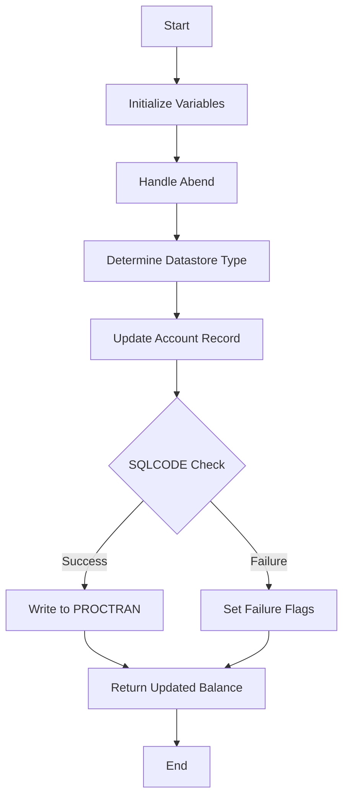

This document will cover the DBCRFUN program. We'll cover:

1. What the Program Does
2. Program Flow
3. Program Sections

## What the Program Does

The DBCRFUN program handles cash transactions over the counter, either deposits or withdrawals. It takes an account number and amount, retrieves the associated account record from the <SwmToken path="src/base/cobol_src/DBCRFUN.cbl" pos="235:5:5" line-data="       UPDATE-ACCOUNT-DB2 SECTION.">`DB2`</SwmToken> datastore, updates the balance, and returns the updated balance. If the update is successful, it writes a record to the PROCTRAN datastore. If the transaction fails, it sets a failure flag and code for the calling routine to handle.

## Program Flow

This is a visualization of the flow:



<SwmSnippet path="/src/base/cobol_src/DBCRFUN.cbl" line="198">

---

### PREMIERE SECTION

First, the program initializes variables and sets up abend handling. It then determines the type of datastore to access and proceeds to update the account record.

```cobol
       PROCEDURE DIVISION USING DFHCOMMAREA.
       PREMIERE SECTION.
       A010.
           MOVE 'N' TO COMM-SUCCESS
           MOVE '0' TO COMM-FAIL-CODE

      *
      *    Set up some Abend handling
      *
           EXEC CICS HANDLE ABEND
              LABEL(ABEND-HANDLING)
           END-EXEC.

           MOVE SORTCODE TO COMM-SORTC.
           MOVE SORTCODE TO DESIRED-SORT-CODE.

      *
      *    Determine what kind of ACCOUNT datastore we should
      *    be accessing
      *

```

---

</SwmSnippet>

<SwmSnippet path="/src/base/cobol_src/DBCRFUN.cbl" line="235">

---

### <SwmToken path="src/base/cobol_src/DBCRFUN.cbl" pos="235:1:5" line-data="       UPDATE-ACCOUNT-DB2 SECTION.">`UPDATE-ACCOUNT-DB2`</SwmToken> SECTION

Next, the program retrieves the account information from the <SwmToken path="src/base/cobol_src/DBCRFUN.cbl" pos="235:5:5" line-data="       UPDATE-ACCOUNT-DB2 SECTION.">`DB2`</SwmToken> datastore. It checks if the transaction is a debit or credit and ensures sufficient funds for debits. It then updates the account balance and writes the updated information back to the <SwmToken path="src/base/cobol_src/DBCRFUN.cbl" pos="235:5:5" line-data="       UPDATE-ACCOUNT-DB2 SECTION.">`DB2`</SwmToken> datastore. If successful, it writes a record to the PROCTRAN datastore.

```cobol
       UPDATE-ACCOUNT-DB2 SECTION.
       UAD010.

           MOVE COMM-ACCNO TO DESIRED-ACC-NO.
           MOVE DESIRED-SORT-CODE TO HV-ACCOUNT-SORTCODE.
           MOVE DESIRED-ACC-NO TO HV-ACCOUNT-ACC-NO.

      *
      *    Retrieve the account information
      *
           EXEC SQL
              SELECT ACCOUNT_EYECATCHER,
                     ACCOUNT_CUSTOMER_NUMBER,
                     ACCOUNT_SORTCODE,
                     ACCOUNT_NUMBER,
                     ACCOUNT_TYPE,
                     ACCOUNT_INTEREST_RATE,
                     ACCOUNT_OPENED,
                     ACCOUNT_OVERDRAFT_LIMIT,
                     ACCOUNT_LAST_STATEMENT,
                     ACCOUNT_NEXT_STATEMENT,
```

---

</SwmSnippet>

<SwmSnippet path="/src/base/cobol_src/DBCRFUN.cbl" line="447">

---

### <SwmToken path="src/base/cobol_src/DBCRFUN.cbl" pos="447:1:5" line-data="       WRITE-TO-PROCTRAN SECTION.">`WRITE-TO-PROCTRAN`</SwmToken> SECTION

Then, the program writes details of the successfully applied transaction to the PROCTRAN datastore. It handles different types of transactions, such as debits and credits, and ensures the data is correctly formatted and written.

```cobol
       WRITE-TO-PROCTRAN SECTION.
       WTP010.

      *
      *          Write to the PROCTRAN datastore deatils regarding the
      *          successfully applied transaction.
      *
            PERFORM WRITE-TO-PROCTRAN-DB2.

       WTP999.
           EXIT.


       WRITE-TO-PROCTRAN-DB2 SECTION.
       WTPD010.

           INITIALIZE HOST-PROCTRAN-ROW.
           INITIALIZE WS-EIBTASKN12.

           MOVE 'PRTR' TO HV-PROCTRAN-EYECATCHER.
           MOVE COMM-SORTC TO HV-PROCTRAN-SORT-CODE.
```

---

</SwmSnippet>

<SwmSnippet path="/src/base/cobol_src/DBCRFUN.cbl" line="658">

---

### <SwmToken path="src/base/cobol_src/DBCRFUN.cbl" pos="658:1:9" line-data="       GET-ME-OUT-OF-HERE SECTION.">`GET-ME-OUT-OF-HERE`</SwmToken> SECTION

Finally, the program returns control to the calling program, indicating the end of the transaction processing.

```cobol
       GET-ME-OUT-OF-HERE SECTION.
       GMOOH010.
           EXEC CICS RETURN
           END-EXEC.
           GOBACK.

       GMOOH999.
           EXIT.

```

---

</SwmSnippet>

<SwmSnippet path="/src/base/cobol_src/DBCRFUN.cbl" line="668">

---

### <SwmToken path="src/base/cobol_src/DBCRFUN.cbl" pos="668:1:9" line-data="       CHECK-FOR-STORM-DRAIN-DB2 SECTION.">`CHECK-FOR-STORM-DRAIN-DB2`</SwmToken> SECTION

This section checks if the SQLCODE indicates a condition that requires special handling, such as a 'storm drain' scenario, and logs the condition if applicable.

```cobol
       CHECK-FOR-STORM-DRAIN-DB2 SECTION.
       CFSDD010.
      *
      *    Check if the Sqclode that is returned one that will
      *    trigger Storm Drain is active in Workload
      *

           EVALUATE SQLCODE

              WHEN 923
                 MOVE 'DB2 Connection lost ' TO STORM-DRAIN-CONDITION

              WHEN OTHER
                 MOVE 'Not Storm Drain     ' TO STORM-DRAIN-CONDITION

           END-EVALUATE.

           IF STORM-DRAIN-CONDITION NOT EQUAL 'Not Storm Drain     '
              DISPLAY 'DBCRFUN: Check-For-Storm-Drain-DB2: Storm '
                      'Drain condition (' STORM-DRAIN-CONDITION ') '
                      'has been met (' SQLCODE-DISPLAY ').'
```

---

</SwmSnippet>

<SwmSnippet path="/src/base/cobol_src/DBCRFUN.cbl" line="701">

---

### <SwmToken path="src/base/cobol_src/DBCRFUN.cbl" pos="701:1:3" line-data="       ABEND-HANDLING SECTION.">`ABEND-HANDLING`</SwmToken> SECTION

This section handles abnormal ends (abends) by evaluating the abend code and taking appropriate actions, such as logging diagnostic information or rolling back transactions.

```cobol
       ABEND-HANDLING SECTION.
       AH010.

           EXEC CICS ASSIGN ABCODE(MY-ABEND-CODE)
           END-EXEC.

      *
      *    Evaluate the Abend code that is returned
      *      - For DB2 AD2Z ... provide some diagnostics
      *      - For VSAM RLS abends: AFCR, AFCS and AFCT record the
      *        Abend as happening but do not abend ... leave this to
      *        CPSM WLM "Storm drain" (Abend probability) to handle
      *    If not a "storm drain" ... take the abend afterwards
      *

           EVALUATE MY-ABEND-CODE
      *
      *       DB2 AD2Z abend
      *
              WHEN 'AD2Z'

```

---

</SwmSnippet>

<SwmSnippet path="/src/base/cobol_src/DBCRFUN.cbl" line="846">

---

### <SwmToken path="src/base/cobol_src/DBCRFUN.cbl" pos="846:1:5" line-data="       POPULATE-TIME-DATE SECTION.">`POPULATE-TIME-DATE`</SwmToken> SECTION

This section populates the current time and date, which is used in transaction records and logging.

```cobol
       POPULATE-TIME-DATE SECTION.
       PTD10.

           EXEC CICS ASKTIME
              ABSTIME(WS-U-TIME)
           END-EXEC.

           EXEC CICS FORMATTIME
                     ABSTIME(WS-U-TIME)
                     DDMMYYYY(WS-ORIG-DATE)
                     TIME(WS-TIME-NOW)
                     DATESEP
           END-EXEC.

       PTD999.
           EXIT.
```

---

</SwmSnippet>

&nbsp;

*This is an auto-generated document by Swimm 🌊 and has not yet been verified by a human*

<SwmMeta version="3.0.0" repo-id="Z2l0aHViJTNBJTNBY2ljcy1iYW5raW5nLXNhbXBsZS1hcHBsaWNhdGlvbi1jYnNhLUlCTS1EZW1vLUdQVCUzQSUzQVN3aW1tLURlbW8=" repo-name="cics-banking-sample-application-cbsa-IBM-Demo-GPT"><sup>Powered by [Swimm](/)</sup></SwmMeta>
