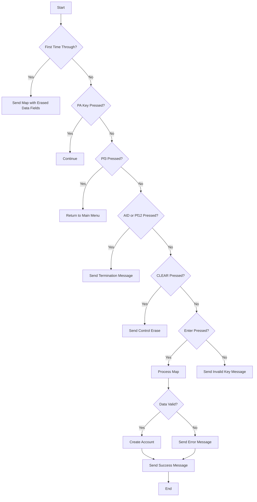

This document will cover the <SwmToken path="src/base/cobol_src/BNK1CAC.cbl" pos="366:4:4" line-data="              MOVE &#39;BNK1CAC - RM010 - RECEIVE MAP FAIL &#39; TO">`BNK1CAC`</SwmToken> program. We'll cover:

1. What the Program Does
2. Program Flow
3. Program Sections

## What the Program Does

The <SwmToken path="src/base/cobol_src/BNK1CAC.cbl" pos="366:4:4" line-data="              MOVE &#39;BNK1CAC - RM010 - RECEIVE MAP FAIL &#39; TO">`BNK1CAC`</SwmToken> program is designed to create a new bank account. It verifies the input data and, if the data passes verification, it calls the CREACC program to add the account to the Account datastore. The main logic involves checking if the input data is valid, processing the input, and then either displaying an error message or proceeding to create the account.

## Program Flow

This is a visualization of the flow:



<SwmSnippet path="/src/base/cobol_src/BNK1CAC.cbl" line="159">

---

### PREMIERE SECTION

First, the program evaluates the input conditions. If it's the first time through, it sends the map with erased data fields. If a PA key is pressed, it continues. If <SwmToken path="src/base/cobol_src/BNK1CAC.cbl" pos="183:5:5" line-data="      *       When Pf3 is pressed, return to the main menu">`Pf3`</SwmToken> is pressed, it returns to the main menu. If AID or <SwmToken path="src/base/cobol_src/BNK1CAC.cbl" pos="194:11:11" line-data="      *       If the aid or Pf12 is pressed, then send a termination">`Pf12`</SwmToken> is pressed, it sends a termination message. If CLEAR is pressed, it sends control erase. If ENTER is pressed, it processes the map. For any other key, it sends an invalid key message.

```cobol
       PROCEDURE DIVISION USING DFHCOMMAREA.
       PREMIERE SECTION.
       A010.

           EVALUATE TRUE

      *
      *       Is it the first time through? If so, send the map
      *       with erased (empty) data fields.
      *
              WHEN EIBCALEN = ZERO
                 MOVE LOW-VALUE TO BNK1CAO
                 MOVE -1 TO CUSTNOL
                 SET SEND-ERASE TO TRUE
                 MOVE SPACES TO MESSAGEO
                 PERFORM SEND-MAP

      *
      *       If a PA key is pressed, just carry on
      *
              WHEN EIBAID = DFHPA1 OR DFHPA2 OR DFHPA3
```

---

</SwmSnippet>

<SwmSnippet path="/src/base/cobol_src/BNK1CAC.cbl" line="320">

---

### <SwmToken path="src/base/cobol_src/BNK1CAC.cbl" pos="320:1:3" line-data="       PROCESS-MAP SECTION.">`PROCESS-MAP`</SwmToken> SECTION

Next, the program retrieves the data from the map and validates it. If the data passes validation, it proceeds to create an account. Finally, it outputs the data to the screen.

```cobol
       PROCESS-MAP SECTION.
       PM010.
      *
      *    Retrieve the data from the map
      *
           PERFORM RECEIVE-MAP.

      *
      *    Validate the received data
      *
           PERFORM EDIT-DATA.

      *
      *    If the data passes validation go on to
      *    create an account
      *
           IF VALID-DATA
              PERFORM CRE-ACC-DATA
           END-IF.

           SET SEND-DATAONLY-ALARM TO TRUE.
```

---

</SwmSnippet>

<SwmSnippet path="/src/base/cobol_src/BNK1CAC.cbl" line="351">

---

### <SwmToken path="src/base/cobol_src/BNK1CAC.cbl" pos="351:1:3" line-data="       RECEIVE-MAP SECTION.">`RECEIVE-MAP`</SwmToken> SECTION

Then, the program retrieves the data from the map. If the data retrieval fails, it initializes the failure information and calls the Abend Handler program.

```cobol
       RECEIVE-MAP SECTION.
       RM010.
      *
      *    Retrieve the data
      *
           EXEC CICS
              RECEIVE MAP('BNK1CA')
              MAPSET('BNK1CAM')
              INTO(BNK1CAI)
              RESP(WS-CICS-RESP)
              RESP2(WS-CICS-RESP2)
           END-EXEC.

           IF WS-CICS-RESP NOT = DFHRESP(NORMAL)
              INITIALIZE WS-FAIL-INFO
              MOVE 'BNK1CAC - RM010 - RECEIVE MAP FAIL ' TO
                 WS-CICS-FAIL-MSG
              MOVE WS-CICS-RESP  TO WS-CICS-RESP-DISP
              MOVE WS-CICS-RESP2 TO WS-CICS-RESP2-DISP

      *
```

---

</SwmSnippet>

<SwmSnippet path="/src/base/cobol_src/BNK1CAC.cbl" line="428">

---

### <SwmToken path="src/base/cobol_src/BNK1CAC.cbl" pos="428:1:3" line-data="       EDIT-DATA SECTION.">`EDIT-DATA`</SwmToken> SECTION

Now, the program performs validation on the incoming fields. It checks if the customer number is valid, if the account type is valid, and if the interest rate is numeric and within the acceptable range. It also checks if the overdraft limit is numeric and positive.

```cobol
       EDIT-DATA SECTION.
       ED010.
      *
      *    Perform validation on the incoming fields
      *
           EXEC CICS BIF DEEDIT
              FIELD(CUSTNOI)
           END-EXEC.

           IF CUSTNOL < 1 OR CUSTNOI = '__________'
              MOVE SPACES TO MESSAGEO
              STRING 'Please enter a 10 digit Customer Number '
                    DELIMITED BY SIZE,
                     ' ' DELIMITED BY SIZE
                 INTO MESSAGEO
              MOVE 'N' TO VALID-DATA-SW
              MOVE -1 TO CUSTNOL
              GO TO ED999
           END-IF.

           IF CUSTNOI NOT NUMERIC
```

---

</SwmSnippet>

<SwmSnippet path="/src/base/cobol_src/BNK1CAC.cbl" line="748">

---

### <SwmToken path="src/base/cobol_src/BNK1CAC.cbl" pos="748:1:5" line-data="       CRE-ACC-DATA SECTION.">`CRE-ACC-DATA`</SwmToken> SECTION

Then, the program sets up the fields required by the CREACC program and calls it to create the account. If the account creation fails, it initializes the failure information and calls the Abend Handler program. If the account creation is successful, it sets the values on the map and sends a success message.

```cobol
       CRE-ACC-DATA SECTION.
       CAD010.
      *
      *    Set up the fields required by CREACC then link to it
      *
           INITIALIZE SUBPGM-PARMS.
           MOVE 'ACCT' TO SUBPGM-EYECATCHER.
           MOVE 'N' TO SUBPGM-SUCCESS.

           MOVE CUSTNOI      TO SUBPGM-CUSTNO.
           MOVE ZEROS        TO SUBPGM-SORTCODE.
           MOVE ZEROS        TO SUBPGM-NUMBER.

           MOVE ACCTYPI      TO SUBPGM-ACC-TYPE.

           COMPUTE INTRTI-COMP-1 = FUNCTION NUMVAL(INTRTI)

           MOVE INTRTI-COMP-1 TO SUBPGM-INT-RT.

           MOVE ZEROS        TO SUBPGM-OPENED.
           MOVE OVERDRI      TO SUBPGM-OVERDR-LIM.
```

---

</SwmSnippet>

<SwmSnippet path="/src/base/cobol_src/BNK1CAC.cbl" line="960">

---

### <SwmToken path="src/base/cobol_src/BNK1CAC.cbl" pos="960:1:3" line-data="        SEND-MAP SECTION.">`SEND-MAP`</SwmToken> SECTION

Finally, the program sends the map. If the map needs to have its data erased, it sends the map with erased data fields. If the map just needs a resend of only the data, it sends the map with only the data. If the map needs to be sent with a beep, it sends the map with a beep.

```cobol
        SEND-MAP SECTION.
        SM010.
      *
      *    If the map needs to have its data erased
      *
           IF SEND-ERASE
              EXEC CICS SEND MAP('BNK1CA')
                 MAPSET('BNK1CAM')
                 FROM(BNK1CAO)
                 ERASE
                 CURSOR
                 RESP(WS-CICS-RESP)
                 RESP2(WS-CICS-RESP2)
              END-EXEC

              IF WS-CICS-RESP NOT = DFHRESP(NORMAL)
                 INITIALIZE WS-FAIL-INFO
                 MOVE 'BNK1CAC - SM010 - SEND MAP ERASE FAIL '
                    TO WS-CICS-FAIL-MSG
                 MOVE WS-CICS-RESP  TO WS-CICS-RESP-DISP
                 MOVE WS-CICS-RESP2 TO WS-CICS-RESP2-DISP
```

---

</SwmSnippet>

<SwmSnippet path="/src/base/cobol_src/BNK1CAC.cbl" line="1192">

---

### <SwmToken path="src/base/cobol_src/BNK1CAC.cbl" pos="1192:1:5" line-data="       SEND-TERMINATION-MSG SECTION.">`SEND-TERMINATION-MSG`</SwmToken> SECTION

The program sends the termination message when the session ends.

```cobol
       SEND-TERMINATION-MSG SECTION.
       STM010.
      *
      *    Send the termination message
      *
           EXEC CICS SEND TEXT
              FROM(END-OF-SESSION-MESSAGE)
              ERASE
              FREEKB
              RESP(WS-CICS-RESP)
              RESP2(WS-CICS-RESP2)
           END-EXEC.

           IF WS-CICS-RESP NOT = DFHRESP(NORMAL)
              INITIALIZE WS-FAIL-INFO
              MOVE 'BNK1CAC - STM010 - SEND TEXT FAIL'
                 TO WS-CICS-FAIL-MSG
              MOVE WS-CICS-RESP  TO WS-CICS-RESP-DISP
              MOVE WS-CICS-RESP2 TO WS-CICS-RESP2-DISP
      *
      *       Preserve the RESP and RESP2, then set up the
```

---

</SwmSnippet>

<SwmSnippet path="/src/base/cobol_src/BNK1CAC.cbl" line="1269">

---

### <SwmToken path="src/base/cobol_src/BNK1CAC.cbl" pos="1269:1:5" line-data="       ABEND-THIS-TASK SECTION.">`ABEND-THIS-TASK`</SwmToken> SECTION

The program displays the failure information and abends the task.

```cobol
       ABEND-THIS-TASK SECTION.
       ATT010.

           DISPLAY WS-FAIL-INFO.

           EXEC CICS ABEND
              ABCODE('HBNK')
              NODUMP
           END-EXEC.

       ATT999.
           EXIT.

```

---

</SwmSnippet>

<SwmSnippet path="/src/base/cobol_src/BNK1CAC.cbl" line="1283">

---

### <SwmToken path="src/base/cobol_src/BNK1CAC.cbl" pos="1283:1:5" line-data="       POPULATE-TIME-DATE SECTION.">`POPULATE-TIME-DATE`</SwmToken> SECTION

The program populates the current time and date.

```cobol
       POPULATE-TIME-DATE SECTION.
       PTD010.

           EXEC CICS ASKTIME
              ABSTIME(WS-U-TIME)
           END-EXEC.

           EXEC CICS FORMATTIME
                     ABSTIME(WS-U-TIME)
                     DDMMYYYY(WS-ORIG-DATE)
                     TIME(WS-TIME-NOW)
                     DATESEP
           END-EXEC.

       PTD999.
           EXIT.
```

---

</SwmSnippet>

&nbsp;

*This is an auto-generated document by Swimm 🌊 and has not yet been verified by a human*

<SwmMeta version="3.0.0" repo-id="Z2l0aHViJTNBJTNBY2ljcy1iYW5raW5nLXNhbXBsZS1hcHBsaWNhdGlvbi1jYnNhLUlCTS1EZW1vLUdQVCUzQSUzQVN3aW1tLURlbW8=" repo-name="cics-banking-sample-application-cbsa-IBM-Demo-GPT"><sup>Powered by [Swimm](/)</sup></SwmMeta>
