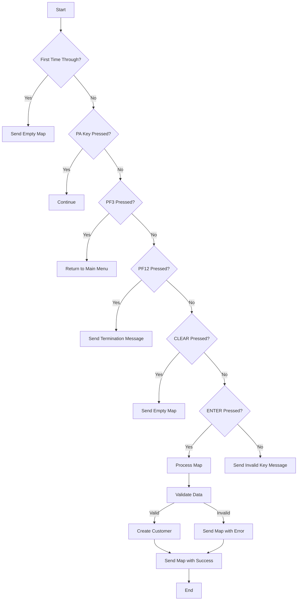

This document will cover the <SwmToken path="src/base/cobol_src/BNK1CCS.cbl" pos="16:6:6" line-data="       PROGRAM-ID. BNK1CCS.">`BNK1CCS`</SwmToken> program. We'll cover:

## What the Program Does

The <SwmToken path="src/base/cobol_src/BNK1CCS.cbl" pos="16:6:6" line-data="       PROGRAM-ID. BNK1CCS.">`BNK1CCS`</SwmToken> program is designed to create a new customer in the banking application. It handles user inputs, validates the data, and calls another program to create the customer record. The program also manages different user interactions such as pressing function keys or entering data.

## Program Flow

This is a visualization of the flow:



<SwmSnippet path="/src/base/cobol_src/BNK1CCS.cbl" line="157">

---

### PREMIERE SECTION

First, the program handles different user interactions. If it's the first time through, it sends an empty map. If a PA key is pressed, it continues. If PF3 is pressed, it returns to the main menu. If PF12 is pressed, it sends a termination message. If CLEAR is pressed, it sends an empty map. If ENTER is pressed, it processes the map. For any other key, it sends an invalid key message.

```cobol
       PROCEDURE DIVISION.
       PREMIERE SECTION.
       A010.

           EXEC CICS HANDLE ABEND
              LABEL(HANDLE-ABEND)
           END-EXEC.

           EVALUATE TRUE
      *
      *       Is it the first time through? If so, send the map
      *       with erased (empty) data fields.
      *
              WHEN EIBCALEN = ZERO
                 MOVE LOW-VALUE TO BNK1CCO
                 MOVE SPACES TO CUSTTITO
                 MOVE SPACES TO CHRISTNO
                 MOVE SPACES TO CUSTINSO
                 MOVE SPACES TO CUSTSNO
                 MOVE SPACES TO CUSTAD1O
                 MOVE SPACES TO CUSTAD2O
```

---

</SwmSnippet>

<SwmSnippet path="/src/base/cobol_src/BNK1CCS.cbl" line="349">

---

### <SwmToken path="src/base/cobol_src/BNK1CCS.cbl" pos="349:1:3" line-data="       PROCESS-MAP SECTION.">`PROCESS-MAP`</SwmToken> SECTION

Next, the program retrieves the data from the map and validates it. If the data is valid, it proceeds to create a customer record.

```cobol
       PROCESS-MAP SECTION.
       PM010.
      *
      *    Retrieve the data from the map
      *
           MOVE DFHCOMMAREA TO WS-COMM-AREA.

           PERFORM RECEIVE-MAP.

      *
      *    Validate the received data
      *
           PERFORM EDIT-DATA.
      *
      *    If the data passes validation go on to
      *    create a CUSTOMER
      *
           IF VALID-DATA
              PERFORM CRE-CUST-DATA
           END-IF.

```

---

</SwmSnippet>

<SwmSnippet path="/src/base/cobol_src/BNK1CCS.cbl" line="380">

---

### <SwmToken path="src/base/cobol_src/BNK1CCS.cbl" pos="380:1:3" line-data="       RECEIVE-MAP SECTION.">`RECEIVE-MAP`</SwmToken> SECTION

Then, the program retrieves the data from the map. It ensures that the terminal doesn't change the case of the input data by turning off uppercase translation, receiving the data, and then turning it back on.

```cobol
       RECEIVE-MAP SECTION.
       RM010.
      *
      *    Retrieve the data
      *

      *
      *    To ensure that we get the correct case and the terminal
      *    doesn't change the case from ower case to upper case we
      *    we need to turn off upper case translation, do the receive
      *    and then turn it on again.
      *
           EXEC CICS INQUIRE
                TERMINAL(EIBTRMID)
                UCTRANST(WS-UCTRANS)
                RESP(WS-CICS-RESP)
                RESP2(WS-CICS-RESP2)
           END-EXEC.


      *
```

---

</SwmSnippet>

<SwmSnippet path="/src/base/cobol_src/BNK1CCS.cbl" line="576">

---

### <SwmToken path="src/base/cobol_src/BNK1CCS.cbl" pos="576:1:3" line-data="       EDIT-DATA SECTION.">`EDIT-DATA`</SwmToken> SECTION

Now, the program validates the received data. It checks for various conditions such as missing or invalid data and sets appropriate messages and flags.

```cobol
       EDIT-DATA SECTION.
       ED010.
      *
      *    Perform validation on the incoming fields
      *
           IF CUSTNO2L > 0
              MOVE 'Please clear screen before creating new user'
                 TO MESSAGEO
              MOVE -1  TO CUSTTITL
              MOVE 'N' TO VALID-DATA-SW
              GO TO ED999
           END-IF

           IF CUSTTITL < 1 OR CUSTTITI = SPACES
           OR CUSTTITI = LOW-VALUES
              MOVE SPACES TO MESSAGEO

              STRING 'Valid titles are: Mr,Mrs,Miss,Ms,Dr,Professor,'
                    DELIMITED BY SIZE,
                     'Drs,Lord,Sir,Lady' DELIMITED BY SIZE
              INTO MESSAGEO
```

---

</SwmSnippet>

<SwmSnippet path="/src/base/cobol_src/BNK1CCS.cbl" line="937">

---

### <SwmToken path="src/base/cobol_src/BNK1CCS.cbl" pos="937:1:5" line-data="       CRE-CUST-DATA SECTION.">`CRE-CUST-DATA`</SwmToken> SECTION

Then, the program sets up the fields required by the <SwmToken path="src/base/cobol_src/BNK1CCS.cbl" pos="940:15:15" line-data="      *    Set up the fields required by CRECUST then link to it">`CRECUST`</SwmToken> program and calls it to create the customer record. It checks if the creation was successful and sets appropriate messages and flags.

```cobol
       CRE-CUST-DATA SECTION.
       CCD010.
      *
      *    Set up the fields required by CRECUST then link to it
      *
           INITIALIZE SUBPGM-PARMS.
           MOVE 'CUST' TO SUBPGM-EYECATCHER.
           MOVE 'N' TO SUBPGM-SUCCESS.

      *
      *    Get rid of any underscores which may be present
      *
           INSPECT CUSTTITI REPLACING ALL '_' BY ' '.
           INSPECT CHRISTNI REPLACING ALL '_' BY ' '.
           INSPECT CUSTINSI REPLACING ALL '_' BY ' '.
           INSPECT CUSTSNI  REPLACING ALL '_' BY ' '.

           STRING CUSTTITI DELIMITED BY SPACE,
                  ' ' DELIMITED BY SIZE,
                  CHRISTNI DELIMITED BY SPACE,
                  ' ' DELIMITED BY SIZE,
```

---

</SwmSnippet>

<SwmSnippet path="/src/base/cobol_src/BNK1CCS.cbl" line="1099">

---

### <SwmToken path="src/base/cobol_src/BNK1CCS.cbl" pos="1099:1:5" line-data="       STORE-TERM-DEF SECTION.">`STORE-TERM-DEF`</SwmToken> SECTION

Going into, the program inquires on the terminal and stores the UCTRANS settings. If uppercase translation is switched on, it sets it to NOUCTRAN.

```cobol
       STORE-TERM-DEF SECTION.
       STD010.

      *
      *    Inquire on the terminal and store the UCTRANS settings
      *
           EXEC CICS INQUIRE
                TERMINAL(EIBTRMID)
                UCTRANST(WS-UCTRANS)
                RESP(WS-CICS-RESP)
                RESP2(WS-CICS-RESP2)
           END-EXEC.

      *
      *    Store the original UCTRAN value
      *

           MOVE WS-UCTRANS TO STORED-UCTRANS.

      *
      *    If Uppercase translation is switched on, then set it to
```

---

</SwmSnippet>

<SwmSnippet path="/src/base/cobol_src/BNK1CCS.cbl" line="1201">

---

### <SwmToken path="src/base/cobol_src/BNK1CCS.cbl" pos="1201:1:5" line-data="       RESTORE-TERM-DEF SECTION.">`RESTORE-TERM-DEF`</SwmToken> SECTION

Next, the program restores the UCTRAN setting back to what it was at the start.

```cobol
       RESTORE-TERM-DEF SECTION.
       RTD010.
      *
      *    We must now restore the UCTRAN setting back to what it
      *    was at the start
      *
           MOVE DFHCOMMAREA TO WS-COMM-AREA.

           MOVE WS-COMM-TERM TO WS-UCTRANS.

           EXEC CICS SET TERMINAL(EIBTRMID)
               UCTRANST(WS-UCTRANS)
               RESP(WS-CICS-RESP)
               RESP2(WS-CICS-RESP2)
           END-EXEC.

           IF WS-CICS-RESP NOT = DFHRESP(NORMAL)
      *
      *       Preserve the RESP and RESP2, then set up the
      *       standard ABEND info before getting the applid,
      *       date/time etc. and linking to the Abend Handler
```

---

</SwmSnippet>

<SwmSnippet path="/src/base/cobol_src/BNK1CCS.cbl" line="1280">

---

### <SwmToken path="src/base/cobol_src/BNK1CCS.cbl" pos="1280:1:3" line-data="       SEND-MAP SECTION.">`SEND-MAP`</SwmToken> SECTION

Then, the program sends the map to the terminal. It handles different conditions such as sending an empty map, resending only the data, or sending the map with an alarm.

```cobol
       SEND-MAP SECTION.
       SM010.
      *
      *    If the map needs to have its data erased
      *
           IF SEND-ERASE
              EXEC CICS SEND MAP('BNK1CC')
                  MAPSET('BNK1CCM')
                  FROM(BNK1CCO)
                  ERASE
                  CURSOR
                  RESP(WS-CICS-RESP)
                  RESP2(WS-CICS-RESP2)
              END-EXEC

              IF WS-CICS-RESP NOT = DFHRESP(NORMAL)
      *
      *          Preserve the RESP and RESP2, then set up the
      *          standard ABEND info before getting the applid,
      *          date/time etc. and linking to the Abend Handler
      *          program.
```

---

</SwmSnippet>

<SwmSnippet path="/src/base/cobol_src/BNK1CCS.cbl" line="1518">

---

### <SwmToken path="src/base/cobol_src/BNK1CCS.cbl" pos="1518:1:5" line-data="       SEND-TERMINATION-MSG SECTION.">`SEND-TERMINATION-MSG`</SwmToken> SECTION

Next, the program sends a termination message to the terminal.

```cobol
       SEND-TERMINATION-MSG SECTION.
       STM010.
      *
      *    Send the termination message
      *
           EXEC CICS SEND TEXT
              FROM(END-OF-SESSION-MESSAGE)
              ERASE
              FREEKB
              RESP(WS-CICS-RESP)
              RESP2(WS-CICS-RESP2)
           END-EXEC.

           IF WS-CICS-RESP NOT = DFHRESP(NORMAL)
      *
      *       Preserve the RESP and RESP2, then set up the
      *       standard ABEND info before getting the applid,
      *       date/time etc. and linking to the Abend Handler
      *       program.
      *
              INITIALIZE ABNDINFO-REC
```

---

</SwmSnippet>

<SwmSnippet path="/src/base/cobol_src/BNK1CCS.cbl" line="1596">

---

### <SwmToken path="src/base/cobol_src/BNK1CCS.cbl" pos="1596:1:5" line-data="       ABEND-THIS-TASK SECTION.">`ABEND-THIS-TASK`</SwmToken> SECTION

Then, the program restores the terminal UCTRAN back to its starting position and abends the task.

```cobol
       ABEND-THIS-TASK SECTION.
       ATT010.

      *
      *    Restore the terminal UCTRAN back to its starting position
      *
           MOVE DFHCOMMAREA  TO WS-COMM-AREA.
           MOVE WS-COMM-TERM TO WS-UCTRANS.

           EXEC CICS SET TERMINAL(EIBTRMID)
               UCTRANST(WS-UCTRANS)
               RESP(WS-CICS-RESP)
               RESP2(WS-CICS-RESP2)
           END-EXEC.

           DISPLAY WS-FAIL-INFO.

           EXEC CICS ABEND
              ABCODE('HBNK')
              NODUMP
              CANCEL
```

---

</SwmSnippet>

<SwmSnippet path="/src/base/cobol_src/BNK1CCS.cbl" line="1623">

---

### <SwmToken path="src/base/cobol_src/BNK1CCS.cbl" pos="1623:1:5" line-data="       POPULATE-TIME-DATE SECTION.">`POPULATE-TIME-DATE`</SwmToken> SECTION

Next, the program populates the current date and time.

```cobol
       POPULATE-TIME-DATE SECTION.
       PTD10.

           EXEC CICS ASKTIME
              ABSTIME(WS-U-TIME)
           END-EXEC.

           EXEC CICS FORMATTIME
                     ABSTIME(WS-U-TIME)
                     DDMMYYYY(WS-ORIG-DATE)
                     TIME(WS-TIME-NOW)
                     DATESEP
           END-EXEC.

       PTD999.
           EXIT.
```

---

</SwmSnippet>

<SwmSnippet path="/src/base/cobol_src/BNK1CCS.cbl" line="1641">

---

### <SwmToken path="src/base/cobol_src/BNK1CCS.cbl" pos="1641:1:3" line-data="       HANDLE-ABEND SECTION.">`HANDLE-ABEND`</SwmToken> SECTION

Finally, the program handles any abends by restoring the terminal UCTRAN and abending the task.

```cobol
       HANDLE-ABEND SECTION.
       HA010.

           PERFORM RESTORE-TERM-DEF.

           EXEC CICS ASSIGN ABCODE(WS-ABCODE)
           END-EXEC.

           EXEC CICS HANDLE ABEND CANCEL
           END-EXEC.

           EXEC CICS ABEND ABCODE(WS-ABCODE)
              NODUMP
           END-EXEC.

       HA999.
           EXIT.
```

---

</SwmSnippet>

&nbsp;

*This is an auto-generated document by Swimm 🌊 and has not yet been verified by a human*

<SwmMeta version="3.0.0" repo-id="Z2l0aHViJTNBJTNBY2ljcy1iYW5raW5nLXNhbXBsZS1hcHBsaWNhdGlvbi1jYnNhLUlCTS1EZW1vLUdQVCUzQSUzQVN3aW1tLURlbW8=" repo-name="cics-banking-sample-application-cbsa-IBM-Demo-GPT"><sup>Powered by [Swimm](/)</sup></SwmMeta>
