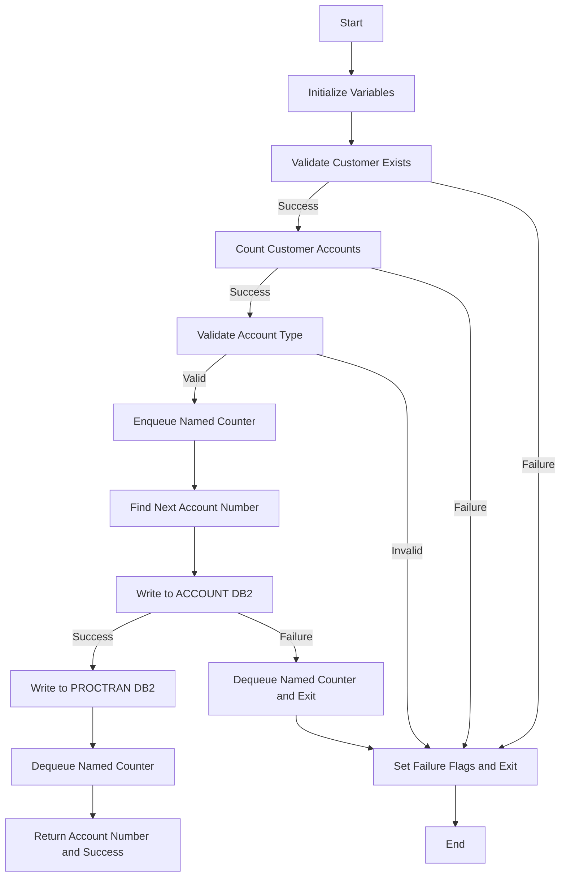

This document will cover the CREACC program. We'll cover:

1. What the Program Does
2. Program Flow
3. Program Sections

## What the Program Does

The CREACC program is designed to handle the creation of new bank accounts. It takes account information from a BMS application, such as customer number, name, address, and date of birth. The program then enqueues a named counter for the account, increments the counter to generate a new account number, and attempts to update the ACCOUNT datastore on Db2. If successful, it writes a record to the PROCTRAN datastore. If any of these operations fail, the program decrements the named counter to restore it to its initial state and dequeues the named counter. The program then returns the new account number if all operations are successful.

## Program Flow

This is a visualization of the flow:



<SwmSnippet path="/src/base/cobol_src/CREACC.cbl" line="286">

---

### PREMIERE SECTION

First, the program initializes variables and validates that the supplied customer exists by calling the INQCUST program. If the customer does not exist, it sets failure flags and exits.

```cobol
       PROCEDURE DIVISION USING DFHCOMMAREA.
       PREMIERE SECTION.
       P010.

           MOVE SORTCODE TO
              REQUIRED-SORT-CODE
              REQUIRED-SORT-CODE2.

           MOVE ZERO TO ACCOUNT-NUMBER.
           INITIALIZE INQCUST-COMMAREA

      *
      *    We need to validate that the supplied CUSTOMER actually
      *    exists by linking to INQCUST.
      *

           MOVE COMM-CUSTNO IN DFHCOMMAREA TO INQCUST-CUSTNO.

           EXEC CICS LINK PROGRAM('INQCUST ')
                     COMMAREA(INQCUST-COMMAREA)
                     RESP(WS-CICS-RESP)
```

---

</SwmSnippet>

<SwmSnippet path="/src/base/cobol_src/CREACC.cbl" line="385">

---

### <SwmToken path="src/base/cobol_src/CREACC.cbl" pos="385:1:5" line-data="       ENQ-NAMED-COUNTER SECTION.">`ENQ-NAMED-COUNTER`</SwmToken> SECTION

Next, the program enqueues the named counter for the account. If this operation fails, it sets failure flags and exits.

```cobol
       ENQ-NAMED-COUNTER SECTION.
       ENC010.

           MOVE SORTCODE TO NCS-ACC-NO-TEST-SORT.

           EXEC CICS ENQ
              RESOURCE(NCS-ACC-NO-NAME)
              LENGTH(16)
              RESP(WS-CICS-RESP)
              RESP2(WS-CICS-RESP2)
           END-EXEC.

           IF WS-CICS-RESP NOT = DFHRESP(NORMAL)
             MOVE 'N' TO COMM-SUCCESS IN DFHCOMMAREA
             MOVE '3' TO COMM-FAIL-CODE IN DFHCOMMAREA
             PERFORM GET-ME-OUT-OF-HERE
           END-IF.

       ENC999.
           EXIT.
```

---

</SwmSnippet>

<SwmSnippet path="/src/base/cobol_src/CREACC.cbl" line="429">

---

### <SwmToken path="src/base/cobol_src/CREACC.cbl" pos="429:1:5" line-data="       FIND-NEXT-ACCOUNT SECTION.">`FIND-NEXT-ACCOUNT`</SwmToken> SECTION

Then, the program finds the next available account number by querying the ACCOUNT CONTROL table. If this operation fails, it sets failure flags and exits.

```cobol
       FIND-NEXT-ACCOUNT SECTION.
       FNA010.

           MOVE 1 TO NCS-ACC-NO-INC.

           INITIALIZE OUTPUT-DATA.

      * <<sortcode>>-ACCOUNT-LAST
           MOVE SPACES TO HV-CONTROL-NAME
           MOVE ZERO TO HV-CONTROL-VALUE-NUM
           MOVE SPACES TO HV-CONTROL-VALUE-STR
           STRING REQUIRED-SORT-CODE DELIMITED BY SIZE
           '-' DELIMITED BY SIZE
           'ACCOUNT-LAST' DELIMITED BY SIZE
           INTO HV-CONTROL-NAME
           EXEC SQL
              SELECT CONTROL_NAME,
                       CONTROL_VALUE_NUM,
                       CONTROL_VALUE_STR
              INTO :HV-CONTROL-NAME,
                      :HV-CONTROL-VALUE-NUM,
```

---

</SwmSnippet>

<SwmSnippet path="/src/base/cobol_src/CREACC.cbl" line="773">

---

### <SwmToken path="src/base/cobol_src/CREACC.cbl" pos="774:1:5" line-data="       WRITE-ACCOUNT-DB2 SECTION.">`WRITE-ACCOUNT-DB2`</SwmToken> SECTION

Going into the next step, the program writes the new account information to the ACCOUNT table in Db2. If this operation fails, it dequeues the named counter and exits.

```cobol
      *
       WRITE-ACCOUNT-DB2 SECTION.
       WAD010.

           INITIALIZE HOST-ACCOUNT-ROW.
           MOVE 'ACCT' TO HV-ACCOUNT-EYECATCHER.
           MOVE COMM-CUSTNO IN DFHCOMMAREA  TO HV-ACCOUNT-CUST-NO.
           MOVE SORTCODE  TO HV-ACCOUNT-SORTCODE.

           MOVE NCS-ACC-NO-VALUE TO NCS-ACC-NO-DISP.
           MOVE NCS-ACC-NO-DISP(9:8) TO HV-ACCOUNT-ACC-NO.
           MOVE COMM-ACC-TYPE IN DFHCOMMAREA    TO HV-ACCOUNT-ACC-TYPE.
           MOVE COMM-INT-RT      TO HV-ACCOUNT-INT-RATE.
           MOVE COMM-OVERDR-LIM  TO HV-ACCOUNT-OVERDRAFT-LIM.
           MOVE COMM-AVAIL-BAL IN DFHCOMMAREA   TO HV-ACCOUNT-AVAIL-BAL.
           MOVE COMM-ACT-BAL     TO HV-ACCOUNT-ACTUAL-BAL.

           PERFORM CALCULATE-DATES.

      *
      *    Convert gregorian date (YYYYMMDD) to an integer
```

---

</SwmSnippet>

<SwmSnippet path="/src/base/cobol_src/CREACC.cbl" line="920">

---

### <SwmToken path="src/base/cobol_src/CREACC.cbl" pos="920:1:3" line-data="       WRITE-PROCTRAN SECTION.">`WRITE-PROCTRAN`</SwmToken> SECTION

If the account creation is successful, the program writes a record to the PROCTRAN table.

```cobol
       WRITE-PROCTRAN SECTION.
       WP010.

               PERFORM WRITE-PROCTRAN-DB2.
       WP999.
           EXIT.
```

---

</SwmSnippet>

<SwmSnippet path="/src/base/cobol_src/CREACC.cbl" line="928">

---

### <SwmToken path="src/base/cobol_src/CREACC.cbl" pos="928:1:5" line-data="       WRITE-PROCTRAN-DB2 SECTION.">`WRITE-PROCTRAN-DB2`</SwmToken> SECTION

Then, the program writes the successfully processed transaction to the PROCTRAN table. If this operation fails, it dequeues the named counter and exits.

```cobol
       WRITE-PROCTRAN-DB2 SECTION.
       WPD010.
      *
      *    Write the successfully processed transaction to the PROCTRAN
      *    table.
      *
           INITIALIZE HOST-PROCTRAN-ROW.
           INITIALIZE WS-EIBTASKN12.

           MOVE 'PRTR'   TO HV-PROCTRAN-EYECATCHER.
           MOVE SORTCODE TO HV-PROCTRAN-SORT-CODE.
           MOVE STORED-ACCNO TO HV-PROCTRAN-ACC-NUMBER.
           MOVE EIBTASKN TO WS-EIBTASKN12.
           MOVE WS-EIBTASKN12 TO HV-PROCTRAN-REF.

      *
      *    Populate the time and date
      *
           EXEC CICS ASKTIME
              ABSTIME(WS-U-TIME)
           END-EXEC.
```

---

</SwmSnippet>

<SwmSnippet path="/src/base/cobol_src/CREACC.cbl" line="1068">

---

### <SwmToken path="src/base/cobol_src/CREACC.cbl" pos="1068:1:9" line-data="       GET-ME-OUT-OF-HERE SECTION.">`GET-ME-OUT-OF-HERE`</SwmToken> SECTION

Finally, the program exits gracefully.

```cobol
       GET-ME-OUT-OF-HERE SECTION.
       GMOFH010.
      *
      *    Finish
      *
           EXEC CICS RETURN
           END-EXEC.

       GMOFH999.
           EXIT.
```

---

</SwmSnippet>

&nbsp;

*This is an auto-generated document by Swimm 🌊 and has not yet been verified by a human*

<SwmMeta version="3.0.0" repo-id="Z2l0aHViJTNBJTNBY2ljcy1iYW5raW5nLXNhbXBsZS1hcHBsaWNhdGlvbi1jYnNhLUlCTS1EZW1vLUdQVCUzQSUzQVN3aW1tLURlbW8=" repo-name="cics-banking-sample-application-cbsa-IBM-Demo-GPT"><sup>Powered by [Swimm](/)</sup></SwmMeta>
