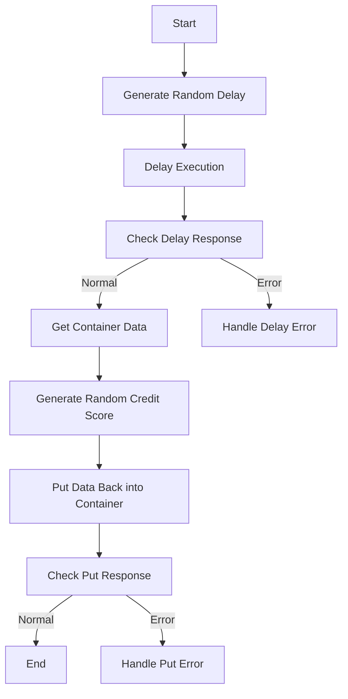

This document will cover the <SwmToken path="src/base/cobol_src/CRDTAGY3.cbl" pos="25:6:6" line-data="       PROGRAM-ID. CRDTAGY3.">`CRDTAGY3`</SwmToken> program. We'll cover:

1. What the Program Does
2. Program Flow
3. Program Sections

## What the Program Does

The <SwmToken path="src/base/cobol_src/CRDTAGY3.cbl" pos="25:6:6" line-data="       PROGRAM-ID. CRDTAGY3.">`CRDTAGY3`</SwmToken> program simulates a credit agency for credit scoring. It delays for a random amount of time (between 0 and 3 seconds) and generates a random credit score (between 1 and 999). The delay emulates the time taken to get a response from an external service, and the random credit score simulates the variability in credit scoring.

## Program Flow

This is a visualization of the flow:



<SwmSnippet path="/src/base/cobol_src/CRDTAGY3.cbl" line="111">

---

### PREMIERE SECTION

First, the program generates a random delay amount between 0 and 3 seconds and delays execution for that amount of time. If the delay fails, it handles the error by calling the ABNDPROC program. Next, it retrieves data from a container, generates a random credit score, and puts the updated data back into the container. If any step fails, it handles the error appropriately.

```cobol
       PROCEDURE DIVISION.
       PREMIERE SECTION.
       A010.
      *
      *    Generate a random  number of seconds between 0 & 3.
      *    This is the delay amount in seconds.
      *

           MOVE 'CIPC            ' TO WS-CONTAINER-NAME.
           MOVE 'CIPCREDCHANN    ' TO WS-CHANNEL-NAME.
           MOVE EIBTASKN           TO WS-SEED.

           COMPUTE WS-DELAY-AMT = ((3 - 1)
                            * FUNCTION RANDOM(WS-SEED)) + 1.

           EXEC CICS DELAY
                FOR SECONDS(WS-DELAY-AMT)
                RESP(WS-CICS-RESP)
                RESP2(WS-CICS-RESP2)
           END-EXEC.

```

---

</SwmSnippet>

<SwmSnippet path="/src/base/cobol_src/CRDTAGY3.cbl" line="247">

---

### <SwmToken path="src/base/cobol_src/CRDTAGY3.cbl" pos="247:1:9" line-data="       GET-ME-OUT-OF-HERE SECTION.">`GET-ME-OUT-OF-HERE`</SwmToken> SECTION

Then, this section ensures the program returns control to CICS, effectively ending the program.

```cobol
       GET-ME-OUT-OF-HERE SECTION.
       GMOFH010.

           EXEC CICS RETURN
           END-EXEC.

       GMOFH999.
           EXIT.
```

---

</SwmSnippet>

<SwmSnippet path="/src/base/cobol_src/CRDTAGY3.cbl" line="257">

---

### <SwmToken path="src/base/cobol_src/CRDTAGY3.cbl" pos="257:1:5" line-data="       POPULATE-TIME-DATE SECTION.">`POPULATE-TIME-DATE`</SwmToken> SECTION

Going into this section, the program populates the current date and time, which is used for logging and error handling purposes.

```cobol
       POPULATE-TIME-DATE SECTION.
       PTD010.

           EXEC CICS ASKTIME
              ABSTIME(WS-U-TIME)
           END-EXEC.

           EXEC CICS FORMATTIME
                     ABSTIME(WS-U-TIME)
                     DDMMYYYY(WS-ORIG-DATE)
                     TIME(WS-TIME-NOW)
                     DATESEP
           END-EXEC.

       PTD999.
           EXIT.
```

---

</SwmSnippet>

&nbsp;

*This is an auto-generated document by Swimm 🌊 and has not yet been verified by a human*

<SwmMeta version="3.0.0" repo-id="Z2l0aHViJTNBJTNBY2ljcy1iYW5raW5nLXNhbXBsZS1hcHBsaWNhdGlvbi1jYnNhLUlCTS1EZW1vLUdQVCUzQSUzQVN3aW1tLURlbW8=" repo-name="cics-banking-sample-application-cbsa-IBM-Demo-GPT"><sup>Powered by [Swimm](/)</sup></SwmMeta>
