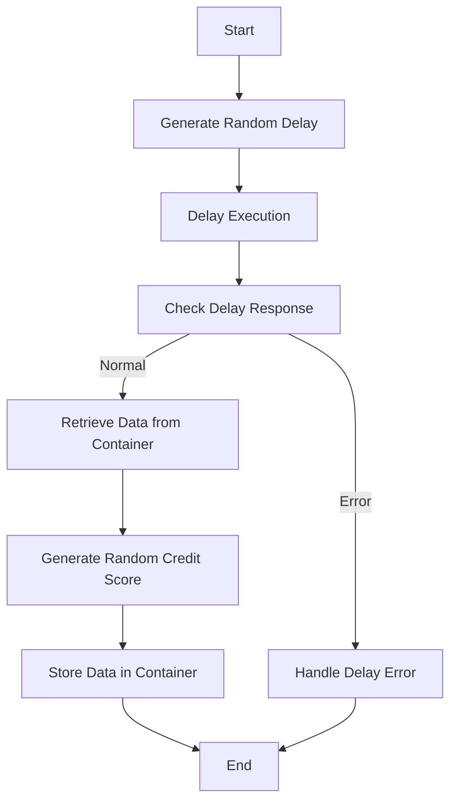

This document will cover the <SwmToken path="src/base/cobol_src/CRDTAGY4.cbl" pos="25:6:6" line-data="       PROGRAM-ID. CRDTAGY4.">`CRDTAGY4`</SwmToken> program. We'll cover:

1. What the Program Does
2. Program Flow
3. Program Sections

## What the Program Does

The <SwmToken path="src/base/cobol_src/CRDTAGY4.cbl" pos="25:6:6" line-data="       PROGRAM-ID. CRDTAGY4.">`CRDTAGY4`</SwmToken> program is designed to simulate a credit agency for credit scoring purposes. It introduces a delay to emulate the time taken to receive data from an external source and generates a random credit score. The delay ranges between 0 and 3 seconds, and the credit score generated is a random number between 1 and 999. This program is driven using the Async API, which means it operates asynchronously, allowing the parent program to continue processing while waiting for the credit score.

## Program Flow

This is a visualization of the flow:



<SwmSnippet path="/src/base/cobol_src/CRDTAGY4.cbl" line="112">

---

### PREMIERE SECTION

First, the program generates a random delay amount between 0 and 3 seconds. This delay is introduced to simulate the time taken to receive data from an external source. The program then checks the response of the delay operation. If the delay operation is not successful, it handles the error by calling the Abend Handler program and abending the task. Next, the program retrieves data from a container using the <SwmToken path="src/base/cobol_src/CRDTAGY4.cbl" pos="194:1:7" line-data="           EXEC CICS GET CONTAINER(WS-CONTAINER-NAME)">`EXEC CICS GET CONTAINER`</SwmToken> command. It then generates a random credit score between 1 and 999 and stores this score back into the container using the <SwmToken path="src/base/cobol_src/CRDTAGY4.cbl" pos="227:1:7" line-data="           EXEC CICS PUT CONTAINER(WS-CONTAINER-NAME)">`EXEC CICS PUT CONTAINER`</SwmToken> command. Finally, the program performs the <SwmToken path="src/base/cobol_src/CRDTAGY4.cbl" pos="250:1:9" line-data="       GET-ME-OUT-OF-HERE SECTION.">`GET-ME-OUT-OF-HERE`</SwmToken> section to return control to CICS.

```cobol
       PROCEDURE DIVISION.
       PREMIERE SECTION.
       A010.
      *
      *    Generate a random  number of seconds between 0 & 3.
      *    This is the delay amount in seconds.
      *

           MOVE 'CIPD            ' TO WS-CONTAINER-NAME.
           MOVE 'CIPCREDCHANN    ' TO WS-CHANNEL-NAME.
           MOVE EIBTASKN           TO WS-SEED.

           COMPUTE WS-DELAY-AMT = ((3 - 1)
                            * FUNCTION RANDOM(WS-SEED)) + 1.

           EXEC CICS DELAY
                FOR SECONDS(WS-DELAY-AMT)
                RESP(WS-CICS-RESP)
                RESP2(WS-CICS-RESP2)
           END-EXEC.

```

---

</SwmSnippet>

<SwmSnippet path="/src/base/cobol_src/CRDTAGY4.cbl" line="250">

---

### <SwmToken path="src/base/cobol_src/CRDTAGY4.cbl" pos="250:1:9" line-data="       GET-ME-OUT-OF-HERE SECTION.">`GET-ME-OUT-OF-HERE`</SwmToken> SECTION

Then, this section simply returns control to CICS using the <SwmToken path="src/base/cobol_src/CRDTAGY4.cbl" pos="253:1:5" line-data="           EXEC CICS RETURN">`EXEC CICS RETURN`</SwmToken> command.

```cobol
       GET-ME-OUT-OF-HERE SECTION.
       GMOFH010.

           EXEC CICS RETURN
           END-EXEC.

       GMOFH999.
           EXIT.
```

---

</SwmSnippet>

<SwmSnippet path="/src/base/cobol_src/CRDTAGY4.cbl" line="260">

---

### <SwmToken path="src/base/cobol_src/CRDTAGY4.cbl" pos="260:1:5" line-data="       POPULATE-TIME-DATE SECTION.">`POPULATE-TIME-DATE`</SwmToken> SECTION

Going into this section, the program populates the current date and time using the <SwmToken path="src/base/cobol_src/CRDTAGY4.cbl" pos="263:1:5" line-data="           EXEC CICS ASKTIME">`EXEC CICS ASKTIME`</SwmToken> and <SwmToken path="src/base/cobol_src/CRDTAGY4.cbl" pos="267:1:5" line-data="           EXEC CICS FORMATTIME">`EXEC CICS FORMATTIME`</SwmToken> commands. This information is used for logging and error handling purposes.

```cobol
       POPULATE-TIME-DATE SECTION.
       PTD010.

           EXEC CICS ASKTIME
              ABSTIME(WS-U-TIME)
           END-EXEC.

           EXEC CICS FORMATTIME
                     ABSTIME(WS-U-TIME)
                     DDMMYYYY(WS-ORIG-DATE)
                     TIME(WS-TIME-NOW)
                     DATESEP
           END-EXEC.

       PTD999.
           EXIT.
```

---

</SwmSnippet>

&nbsp;

*This is an auto-generated document by Swimm 🌊 and has not yet been verified by a human*

<SwmMeta version="3.0.0" repo-id="Z2l0aHViJTNBJTNBY2ljcy1iYW5raW5nLXNhbXBsZS1hcHBsaWNhdGlvbi1jYnNhLUlCTS1EZW1vLUdQVCUzQSUzQVN3aW1tLURlbW8=" repo-name="cics-banking-sample-application-cbsa-IBM-Demo-GPT"><sup>Powered by [Swimm](/)</sup></SwmMeta>
