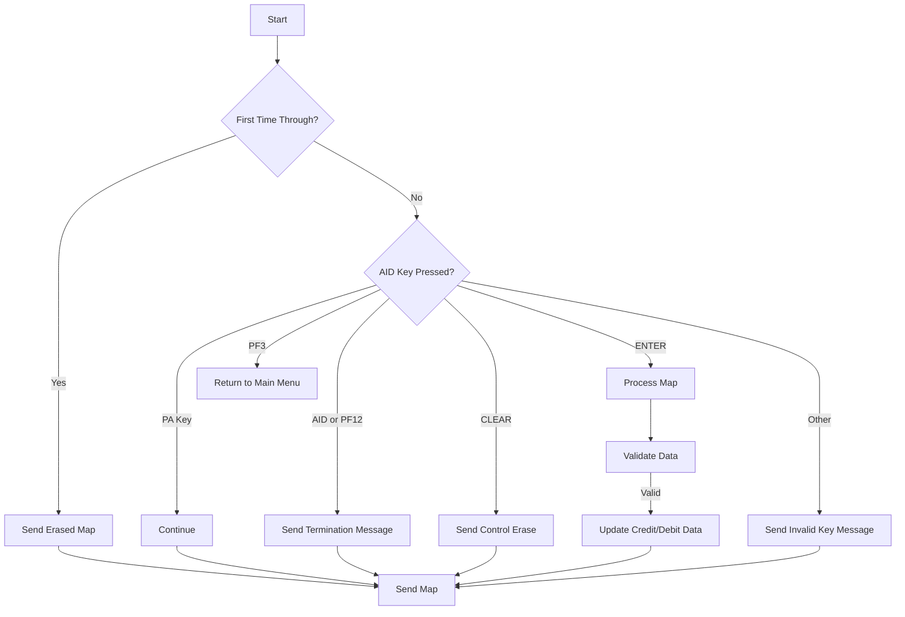

This document will cover the <SwmToken path="src/base/cobol_src/BNK1CRA.cbl" pos="16:6:6" line-data="       PROGRAM-ID. BNK1CRA.">`BNK1CRA`</SwmToken> program. We'll cover:

1. What the Program Does
2. Program Flow
3. Program Sections

## What the Program Does

The <SwmToken path="src/base/cobol_src/BNK1CRA.cbl" pos="16:6:6" line-data="       PROGRAM-ID. BNK1CRA.">`BNK1CRA`</SwmToken> program is designed to handle credit and debit operations within the banking application. It processes user inputs, validates them, and performs the necessary credit or debit operations by calling another program. The program also handles various user interactions such as sending maps, handling termination messages, and managing errors.

## Program Flow

This is a visualization of the flow:



<SwmSnippet path="/src/base/cobol_src/BNK1CRA.cbl" line="176">

---

## Program Sections

First, the program evaluates the initial conditions and user inputs. If it's the first time through, it sends an erased map. Depending on the AID key pressed, it either continues, returns to the main menu, sends a termination message, sends control erase, processes the map, or sends an invalid key message.

```cobol
       PROCEDURE DIVISION USING DFHCOMMAREA.
       PREMIERE SECTION.
       A010.

           EVALUATE TRUE
      *
      *       Is it the first time through? If so, send the map
      *       with erased (empty) data fields.
      *
              WHEN EIBCALEN = ZERO
                 MOVE LOW-VALUE TO BNK1CDO
                 MOVE -1 TO ACCNOL
                 SET SEND-ERASE TO TRUE
                 PERFORM SEND-MAP

      *
      *       If a PA key is pressed, just carry on
      *
              WHEN EIBAID = DFHPA1 OR DFHPA2 OR DFHPA3
                 CONTINUE

```

---

</SwmSnippet>

<SwmSnippet path="/src/base/cobol_src/BNK1CRA.cbl" line="249">

---

Next, if it's not the first time through, the program moves the communication area data to the working storage area and returns control to the transaction with the updated communication area.

```cobol
      *
      *    Provided that we have been around this way before
      *    (i.e. it is NOT the first time through, put the data
      *    returned from the sub program into the area that we use
      *    as the COMMAREA on the RETURN.
      *
           IF EIBCALEN NOT = ZERO

              MOVE COMM-ACCNO  TO WS-COMM-ACCNO
              MOVE COMM-SIGN   TO  WS-COMM-SIGN
              MOVE COMM-AMT    TO WS-COMM-AMT

           END-IF.

           EXEC CICS
              RETURN TRANSID('OCRA')
              COMMAREA(WS-COMM-AREA)
              LENGTH(21)
              RESP(WS-CICS-RESP)
              RESP2(WS-CICS-RESP2)
           END-EXEC.
```

---

</SwmSnippet>

<SwmSnippet path="/src/base/cobol_src/BNK1CRA.cbl" line="271">

---

Then, if there's an error in the response, the program initializes the ABEND information, assigns supplemental information, and calls the ABEND handler program.

```cobol
           IF WS-CICS-RESP NOT = DFHRESP(NORMAL)
      *
      *       Preserve the RESP and RESP2, then set up the
      *       standard ABEND info before getting the applid,
      *       date/time etc. and linking to the Abend Handler
      *       program.
      *
              INITIALIZE ABNDINFO-REC
              MOVE EIBRESP    TO ABND-RESPCODE
              MOVE EIBRESP2   TO ABND-RESP2CODE
      *
      *       Get supplemental information
      *
              EXEC CICS ASSIGN APPLID(ABND-APPLID)
              END-EXEC

              MOVE EIBTASKN   TO ABND-TASKNO-KEY
              MOVE EIBTRNID   TO ABND-TRANID

              PERFORM POPULATE-TIME-DATE

```

---

</SwmSnippet>

<SwmSnippet path="/src/base/cobol_src/BNK1CRA.cbl" line="334">

---

Going into the <SwmToken path="src/base/cobol_src/BNK1CRA.cbl" pos="334:1:3" line-data="       PROCESS-MAP SECTION.">`PROCESS-MAP`</SwmToken> section, the program retrieves data from the map, validates it, and if valid, updates the credit or debit data. It then sets the flag to send data with an alarm and outputs the data to the screen.

```cobol
       PROCESS-MAP SECTION.
       PM010.
      *
      *    Retrieve the data from the map
      *
           PERFORM RECEIVE-MAP.

      *
      *    Validate the received data
      *
           PERFORM EDIT-DATA.

      *
      *    If the data passes validation go on to apply the debit or
      *    credit.
      *
           IF VALID-DATA
              PERFORM UPD-CRED-DATA
           END-IF.

           SET SEND-DATAONLY-ALARM TO TRUE.
```

---

</SwmSnippet>

<SwmSnippet path="/src/base/cobol_src/BNK1CRA.cbl" line="365">

---

In the <SwmToken path="src/base/cobol_src/BNK1CRA.cbl" pos="365:1:3" line-data="       RECEIVE-MAP SECTION.">`RECEIVE-MAP`</SwmToken> section, the program retrieves data from the map and handles any errors by initializing the ABEND information and calling the ABEND handler program if necessary.

```cobol
       RECEIVE-MAP SECTION.
       RM010.
      *
      *    Retrieve the data
      *
           EXEC CICS
              RECEIVE MAP('BNK1CD')
              MAPSET('BNK1CDM')
              INTO(BNK1CDI)
              RESP(WS-CICS-RESP)
              RESP2(WS-CICS-RESP2)
           END-EXEC.

           IF WS-CICS-RESP NOT = DFHRESP(NORMAL)
      *
      *       Preserve the RESP and RESP2, then set up the
      *       standard ABEND info before getting the applid,
      *       date/time etc. and linking to the Abend Handler
      *       program.
      *
              INITIALIZE ABNDINFO-REC
```

---

</SwmSnippet>

<SwmSnippet path="/src/base/cobol_src/BNK1CRA.cbl" line="441">

---

In the <SwmToken path="src/base/cobol_src/BNK1CRA.cbl" pos="441:1:3" line-data="       EDIT-DATA SECTION.">`EDIT-DATA`</SwmToken> section, the program performs validation on the incoming fields, ensuring that the account number and amount are valid.

```cobol
       EDIT-DATA SECTION.
       ED010.
      *
      *    Perform validation on the incoming fields
      *
           EXEC CICS BIF
              DEEDIT FIELD(ACCNOI)
           END-EXEC.

           IF ACCNOI NOT NUMERIC
              MOVE 'Please enter an account number.  ' TO
                 MESSAGEO
              MOVE 'N' TO VALID-DATA-SW
              GO TO ED999
           END-IF.

           IF ACCNOI = ZERO
              MOVE 'Please enter a non zero account number.   ' TO
                 MESSAGEO
              MOVE 'N' TO VALID-DATA-SW
              GO TO ED999
```

---

</SwmSnippet>

<SwmSnippet path="/src/base/cobol_src/BNK1CRA.cbl" line="480">

---

In the <SwmToken path="src/base/cobol_src/BNK1CRA.cbl" pos="480:1:5" line-data="       UPD-CRED-DATA SECTION.">`UPD-CRED-DATA`</SwmToken> section, the program sets up the communication area fields required by the DBCRFUN program and calls it. It then checks if the debit or credit was successful and updates the map with the results.

```cobol
       UPD-CRED-DATA SECTION.
       UCD010.
      *
      *    Set up the COMMAREA fields required by DBCRFUN and then
      *    link to it.
      *
           INITIALIZE SUBPGM-PARMS.

           MOVE ACCNOI TO SUBPGM-ACCNO.
           MOVE 0 TO SUBPGM-AMT.

      *
      *    Provide the correct Amount
      *
           IF SIGNI = '-'
              COMPUTE WS-AMOUNT-AS-FLOAT = WS-AMOUNT-AS-FLOAT * -1
           END-IF.

           MOVE WS-AMOUNT-AS-FLOAT TO SUBPGM-AMT.

      *
```

---

</SwmSnippet>

<SwmSnippet path="/src/base/cobol_src/BNK1CRA.cbl" line="643">

---

In the <SwmToken path="src/base/cobol_src/BNK1CRA.cbl" pos="643:1:3" line-data="       SEND-MAP SECTION.">`SEND-MAP`</SwmToken> section, the program sends the map to the screen, handling different scenarios such as sending erased data, data only, or data with an alarm. It also handles any errors by initializing the ABEND information and calling the ABEND handler program if necessary.

```cobol
       SEND-MAP SECTION.
       SM010.
      *
      *    If the map needs to have its data erased
      *
           IF SEND-ERASE
              EXEC CICS SEND MAP('BNK1CD')
                 MAPSET('BNK1CDM')
                 FROM(BNK1CDO)
                 ERASE
                 RESP(WS-CICS-RESP)
                 RESP2(WS-CICS-RESP2)
              END-EXEC

              IF WS-CICS-RESP NOT = DFHRESP(NORMAL)
      *
      *          Preserve the RESP and RESP2, then set up the
      *          standard ABEND info before getting the applid,
      *          date/time etc. and linking to the Abend Handler
      *          program.
      *
```

---

</SwmSnippet>

<SwmSnippet path="/src/base/cobol_src/BNK1CRA.cbl" line="871">

---

In the <SwmToken path="src/base/cobol_src/BNK1CRA.cbl" pos="871:1:5" line-data="       SEND-TERMINATION-MSG SECTION.">`SEND-TERMINATION-MSG`</SwmToken> section, the program sends a termination message to the screen and handles any errors by initializing the ABEND information and calling the ABEND handler program if necessary.

```cobol
       SEND-TERMINATION-MSG SECTION.
       STM010.
      *
      *    Send the termination message
      *
           EXEC CICS SEND TEXT
              FROM(END-OF-SESSION-MESSAGE)
              ERASE
              FREEKB
              RESP(WS-CICS-RESP)
              RESP2(WS-CICS-RESP2)
           END-EXEC.

           IF WS-CICS-RESP NOT = DFHRESP(NORMAL)
      *
      *       Preserve the RESP and RESP2, then set up the
      *       standard ABEND info before getting the applid,
      *       date/time etc. and linking to the Abend Handler
      *       program.
      *
              INITIALIZE ABNDINFO-REC
```

---

</SwmSnippet>

<SwmSnippet path="/src/base/cobol_src/BNK1CRA.cbl" line="947">

---

In the <SwmToken path="src/base/cobol_src/BNK1CRA.cbl" pos="947:1:5" line-data="       ABEND-THIS-TASK SECTION.">`ABEND-THIS-TASK`</SwmToken> section, the program displays the failure information and abends the task.

```cobol
       ABEND-THIS-TASK SECTION.
       ATT010.
           DISPLAY WS-FAIL-INFO.
           EXEC CICS ABEND
              ABCODE('HBNK')
              NODUMP
           END-EXEC.

       ATT999.
           EXIT.
```

---

</SwmSnippet>

<SwmSnippet path="/src/base/cobol_src/BNK1CRA.cbl" line="959">

---

In the <SwmToken path="src/base/cobol_src/BNK1CRA.cbl" pos="959:1:3" line-data="       VALIDATE-AMOUNT SECTION.">`VALIDATE-AMOUNT`</SwmToken> section, the program validates the amount entered by the user, ensuring it is numeric and within acceptable limits.

```cobol
       VALIDATE-AMOUNT SECTION.
       VA010.

           MOVE 0 TO WS-AMOUNT-AS-FLOAT.

           IF AMTL = ZERO
              MOVE 'The Amount entered must be numeric.' TO
                 MESSAGEO
              MOVE 'N' TO VALID-DATA-SW
              MOVE -1 TO AMTL
              GO TO VA999
           END-IF.


           IF AMTI(1:AMTL) IS NUMERIC
              COMPUTE WS-AMOUNT-AS-FLOAT =
                 FUNCTION NUMVAL(AMTI(1:AMTL))

              MOVE 'Y' TO VALID-DATA-SW
              GO TO VA999
           END-IF.
```

---

</SwmSnippet>

<SwmSnippet path="/src/base/cobol_src/BNK1CRA.cbl" line="1151">

---

Finally, in the <SwmToken path="src/base/cobol_src/BNK1CRA.cbl" pos="1151:1:5" line-data="       POPULATE-TIME-DATE SECTION.">`POPULATE-TIME-DATE`</SwmToken> section, the program retrieves the current date and time and formats it for use in the ABEND information.

```cobol
       POPULATE-TIME-DATE SECTION.
       PTD010.

           EXEC CICS ASKTIME
              ABSTIME(WS-U-TIME)
           END-EXEC.

           EXEC CICS FORMATTIME
                     ABSTIME(WS-U-TIME)
                     DDMMYYYY(WS-ORIG-DATE)
                     TIME(WS-TIME-NOW)
                     DATESEP
           END-EXEC.

       PTD999.
           EXIT.
```

---

</SwmSnippet>

&nbsp;

*This is an auto-generated document by Swimm 🌊 and has not yet been verified by a human*

<SwmMeta version="3.0.0" repo-id="Z2l0aHViJTNBJTNBY2ljcy1iYW5raW5nLXNhbXBsZS1hcHBsaWNhdGlvbi1jYnNhLUlCTS1EZW1vLUdQVCUzQSUzQVN3aW1tLURlbW8=" repo-name="cics-banking-sample-application-cbsa-IBM-Demo-GPT"><sup>Powered by [Swimm](/)</sup></SwmMeta>
