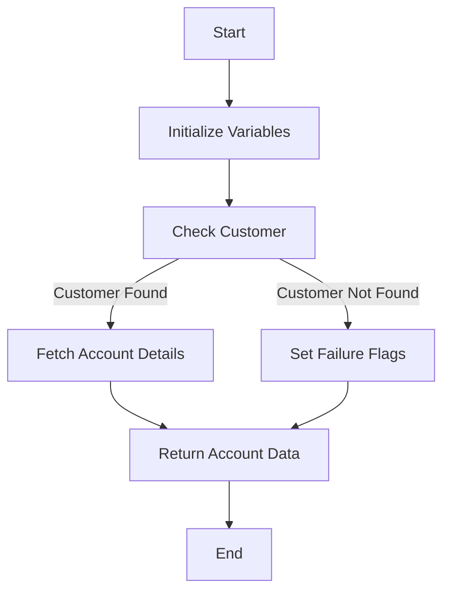

This document will cover the INQACCCU program. We'll cover:

1. What the Program Does
2. Program Flow
3. Program Sections

## What the Program Does

The INQACCCU program is designed to take an incoming customer number and determine which accounts are associated with it by accessing the datastore and retrieving the associated account records matching the customer number. The main logic involves checking if the customer exists and then fetching the account details for that customer.

## Program Flow

This is a visualization of the flow:



<SwmSnippet path="/src/base/cobol_src/INQACCCU.cbl" line="193">

---

### PREMIERE SECTION

First, the program initializes variables and sets up the environment for handling potential abends. It then moves the sort code to the required sort code field and performs a customer check by calling the <SwmToken path="src/base/cobol_src/INQACCCU.cbl" pos="206:13:13" line-data="      *    CUSTOMER-CHECK LINKS to program INQCUST to retrieve the">`INQCUST`</SwmToken> program.

```cobol
       PROCEDURE DIVISION USING DFHCOMMAREA.
       PREMIERE SECTION.
       A010.
           MOVE 'N' TO COMM-SUCCESS
           MOVE '0' TO COMM-FAIL-CODE

           EXEC CICS HANDLE ABEND
              LABEL(ABEND-HANDLING)
           END-EXEC.

           MOVE SORTCODE TO REQUIRED-SORT-CODE OF CUSTOMER-KY.

      *
      *    CUSTOMER-CHECK LINKS to program INQCUST to retrieve the
      *    customer information.
      *

           PERFORM CUSTOMER-CHECK.

      *
      *    If a  matching customer was not returned then set fail flags
```

---

</SwmSnippet>

<SwmSnippet path="/src/base/cobol_src/INQACCCU.cbl" line="233">

---

### <SwmToken path="src/base/cobol_src/INQACCCU.cbl" pos="233:1:5" line-data="       READ-ACCOUNT-DB2 SECTION.">`READ-ACCOUNT-DB2`</SwmToken> SECTION

Next, the program opens a <SwmToken path="src/base/cobol_src/INQACCCU.cbl" pos="233:5:5" line-data="       READ-ACCOUNT-DB2 SECTION.">`DB2`</SwmToken> cursor to fetch account details for the customer. It handles potential errors during the cursor open operation and performs a fetch operation to retrieve account data. If successful, it stores the account data in the communication area.

```cobol
       READ-ACCOUNT-DB2 SECTION.
       RAD010.
      *
      *    Get accounts from account datastore
      *

      *
      *    Open the DB2 CURSOR
      *

           MOVE CUSTOMER-NUMBER IN DFHCOMMAREA TO HV-ACCOUNT-CUST-NO.
           MOVE  SORTCODE TO HV-ACCOUNT-SORTCODE.

           EXEC SQL OPEN
              ACC-CURSOR
           END-EXEC.

           MOVE SQLCODE TO SQLCODE-DISPLAY.

           IF SQLCODE NOT = 0
              MOVE SQLCODE TO SQLCODE-DISPLAY
```

---

</SwmSnippet>

<SwmSnippet path="/src/base/cobol_src/INQACCCU.cbl" line="454">

---

### <SwmToken path="src/base/cobol_src/INQACCCU.cbl" pos="454:1:3" line-data="       FETCH-DATA SECTION.">`FETCH-DATA`</SwmToken> SECTION

Then, the program fetches each account in turn and stores the data until there are no more rows to process or a maximum of 20 accounts is reached. It handles potential errors during the fetch operation and stores the account data in the communication area.

```cobol
       FETCH-DATA SECTION.
       FD010.
      *
      *    Fetch each account in turn, & store data until there are no
      *    more rows to process. (There is a maximum of 20 accounts per
      *    customer).
      *
           MOVE ZERO TO NUMBER-OF-ACCOUNTS.

           PERFORM UNTIL SQLCODE NOT = 0 OR
           NUMBER-OF-ACCOUNTS = 20

              EXEC SQL FETCH FROM ACC-CURSOR
              INTO :HV-ACCOUNT-EYECATCHER,
                   :HV-ACCOUNT-CUST-NO,
                   :HV-ACCOUNT-SORTCODE,
                   :HV-ACCOUNT-ACC-NO,
                   :HV-ACCOUNT-ACC-TYPE,
                   :HV-ACCOUNT-INT-RATE,
                   :HV-ACCOUNT-OPENED,
                   :HV-ACCOUNT-OVERDRAFT-LIM,
```

---

</SwmSnippet>

<SwmSnippet path="/src/base/cobol_src/INQACCCU.cbl" line="638">

---

### <SwmToken path="src/base/cobol_src/INQACCCU.cbl" pos="638:1:9" line-data="       GET-ME-OUT-OF-HERE SECTION.">`GET-ME-OUT-OF-HERE`</SwmToken> SECTION

Finally, the program returns control back to CICS, effectively ending the program.

```cobol
       GET-ME-OUT-OF-HERE SECTION.
       GMOFH010.
      *
      *    Return control back to CICS
      *
           EXEC CICS RETURN
           END-EXEC.

           GOBACK.

       GMOFH999.
           EXIT.
```

---

</SwmSnippet>

<SwmSnippet path="/src/base/cobol_src/INQACCCU.cbl" line="829">

---

### <SwmToken path="src/base/cobol_src/INQACCCU.cbl" pos="829:1:3" line-data="       CUSTOMER-CHECK SECTION.">`CUSTOMER-CHECK`</SwmToken> SECTION

Going into the customer check section, the program retrieves customer information by calling the <SwmToken path="src/base/cobol_src/INQACCCU.cbl" pos="832:15:15" line-data="      *    Retrieve customer information by linking to INQCUST">`INQCUST`</SwmToken> program. If a matching customer is found, it sets the customer found flag to 'Y'. Otherwise, it sets the flag to 'N' and initializes the number of accounts to zero.

```cobol
       CUSTOMER-CHECK SECTION.
       CC010.
      *
      *    Retrieve customer information by linking to INQCUST
      *

           IF CUSTOMER-NUMBER IN DFHCOMMAREA = ZERO
              MOVE 'N' TO CUSTOMER-FOUND
              MOVE ZERO TO NUMBER-OF-ACCOUNTS
              GO TO CC999
           END-IF.

           IF CUSTOMER-NUMBER IN DFHCOMMAREA = '9999999999'
              MOVE 'N' TO CUSTOMER-FOUND
              MOVE ZERO TO NUMBER-OF-ACCOUNTS
              GO TO CC999
           END-IF.

           INITIALIZE INQCUST-COMMAREA.

           MOVE CUSTOMER-NUMBER IN DFHCOMMAREA TO INQCUST-CUSTNO.
```

---

</SwmSnippet>

&nbsp;

*This is an auto-generated document by Swimm 🌊 and has not yet been verified by a human*

<SwmMeta version="3.0.0" repo-id="Z2l0aHViJTNBJTNBY2ljcy1iYW5raW5nLXNhbXBsZS1hcHBsaWNhdGlvbi1jYnNhLUlCTS1EZW1vLUdQVCUzQSUzQVN3aW1tLURlbW8=" repo-name="cics-banking-sample-application-cbsa-IBM-Demo-GPT"><sup>Powered by [Swimm](/)</sup></SwmMeta>
