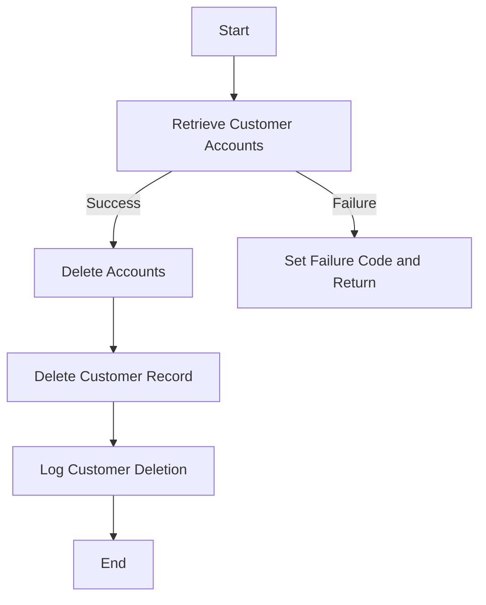

The DELCUS program is a COBOL program designed to handle the deletion of customer records and their associated accounts. This document will cover:

1. What the Program Does
2. Program Flow
3. Program Sections

## What the Program Does

The DELCUS program is responsible for deleting a customer record and all associated accounts. It retrieves the accounts linked to a customer, deletes each account, and logs the deletion in the PROCTRAN datastore. After all accounts are deleted, it deletes the customer record and logs this deletion as well. If any failure occurs during the deletion process, the program will abend to ensure data consistency, except when an account has already been deleted.

## Program Flow

This is a visualization of the flow:



<SwmSnippet path="/src/base/cobol_src/DELCUS.cbl" line="245">

---

### PREMIERE SECTION

First, the program initializes necessary variables and links to the INQCUST program to retrieve customer details. If the retrieval is successful, it proceeds to get the accounts associated with the customer. If not, it sets the failure code and returns.

```cobol
       PROCEDURE DIVISION USING DFHCOMMAREA.
       PREMIERE SECTION.
       A010.

           MOVE SORTCODE TO REQUIRED-SORT-CODE
                            REQUIRED-SORT-CODE OF CUSTOMER-KY
                            DESIRED-KEY-SORTCODE.

           MOVE COMM-CUSTNO OF DFHCOMMAREA
             TO DESIRED-KEY-CUSTOMER.

           INITIALIZE INQCUST-COMMAREA.
           MOVE COMM-CUSTNO OF DFHCOMMAREA TO
              INQCUST-CUSTNO.

           EXEC CICS LINK PROGRAM(INQCUST-PROGRAM)
                     COMMAREA(INQCUST-COMMAREA)
           END-EXEC.

           IF INQCUST-INQ-SUCCESS = 'N'
             MOVE 'N' TO COMM-DEL-SUCCESS
```

---

</SwmSnippet>

<SwmSnippet path="/src/base/cobol_src/DELCUS.cbl" line="298">

---

### <SwmToken path="src/base/cobol_src/DELCUS.cbl" pos="298:1:3" line-data="       DELETE-ACCOUNTS SECTION.">`DELETE-ACCOUNTS`</SwmToken> SECTION

Next, the program iterates through the retrieved accounts and calls the DELACC program to delete each account. This ensures that all accounts linked to the customer are removed.

```cobol
       DELETE-ACCOUNTS SECTION.
       DA010.

      *
      *    Go through the entries (accounts) in the array,
      *    and for each one link to DELACC to delete that
      *    account.
      *
           PERFORM VARYING WS-INDEX FROM 1 BY 1
           UNTIL WS-INDEX > NUMBER-OF-ACCOUNTS
              INITIALIZE DELACC-COMMAREA
              MOVE WS-APPLID TO DELACC-COMM-APPLID
              MOVE COMM-ACCNO(WS-INDEX) TO DELACC-COMM-ACCNO

              EXEC CICS LINK PROGRAM('DELACC  ')
                       COMMAREA(DELACC-COMMAREA)
              END-EXEC

           END-PERFORM.

       DA999.
```

---

</SwmSnippet>

<SwmSnippet path="/src/base/cobol_src/DELCUS.cbl" line="322">

---

### <SwmToken path="src/base/cobol_src/DELCUS.cbl" pos="322:1:3" line-data="       GET-ACCOUNTS SECTION.">`GET-ACCOUNTS`</SwmToken> SECTION

Then, the program links to the INQACCCU program to retrieve all accounts associated with the customer number. This step is crucial for identifying which accounts need to be deleted.

```cobol
       GET-ACCOUNTS SECTION.
       GAC010.
      *
      *    Link to INQACCCU to get all of the accounts for a
      *    given customer number.
      *
           MOVE COMM-CUSTNO OF DFHCOMMAREA
              TO CUSTOMER-NUMBER OF INQACCCU-COMMAREA.
           MOVE 20 TO NUMBER-OF-ACCOUNTS IN INQACCCU-COMMAREA.
           SET COMM-PCB-POINTER OF INQACCCU-COMMAREA
              TO DELACC-COMM-PCB1

           EXEC CICS LINK PROGRAM('INQACCCU')
                     COMMAREA(INQACCCU-COMMAREA)
                     SYNCONRETURN
           END-EXEC.

       GAC999.
           EXIT.
```

---

</SwmSnippet>

<SwmSnippet path="/src/base/cobol_src/DELCUS.cbl" line="343">

---

### <SwmToken path="src/base/cobol_src/DELCUS.cbl" pos="343:1:5" line-data="       DEL-CUST-VSAM SECTION.">`DEL-CUST-VSAM`</SwmToken> SECTION

Going into the <SwmToken path="src/base/cobol_src/DELCUS.cbl" pos="343:1:5" line-data="       DEL-CUST-VSAM SECTION.">`DEL-CUST-VSAM`</SwmToken> section, the program reads the customer record, stores the details for logging, and then deletes the customer record. If any error occurs during this process, it handles the error and abends the program to maintain data integrity.

```cobol
       DEL-CUST-VSAM SECTION.
       DCV010.

      *
      *    Read the CUSTOMER record and store the details
      *    for inclusion on PROCTRAN later, then delete the CUSTOMER
      *    record and write to PROCTRAN.
      *
           INITIALIZE OUTPUT-CUST-DATA.

           EXEC CICS READ FILE('CUSTOMER')
                RIDFLD(DESIRED-KEY)
                INTO(OUTPUT-CUST-DATA)
                UPDATE
                TOKEN(WS-TOKEN)
                RESP(WS-CICS-RESP)
                RESP2(WS-CICS-RESP2)
           END-EXEC.

           IF WS-CICS-RESP = DFHRESP(SYSIDERR)
              PERFORM VARYING SYSIDERR-RETRY FROM 1 BY 1
```

---

</SwmSnippet>

<SwmSnippet path="/src/base/cobol_src/DELCUS.cbl" line="586">

---

### <SwmToken path="src/base/cobol_src/DELCUS.cbl" pos="586:1:5" line-data="       WRITE-PROCTRAN-CUST SECTION.">`WRITE-PROCTRAN-CUST`</SwmToken> SECTION

Finally, the program logs the customer deletion in the PROCTRAN datastore. This ensures that there is a record of the deletion for auditing and tracking purposes.

```cobol
       WRITE-PROCTRAN-CUST SECTION.
       WPC010.

      *
      *    Record the CUSTOMER deletion on PROCTRAN
      *
              PERFORM WRITE-PROCTRAN-CUST-DB2.
       WPC999.
           EXIT.
```

---

</SwmSnippet>

&nbsp;

*This is an auto-generated document by Swimm 🌊 and has not yet been verified by a human*

<SwmMeta version="3.0.0" repo-id="Z2l0aHViJTNBJTNBY2ljcy1iYW5raW5nLXNhbXBsZS1hcHBsaWNhdGlvbi1jYnNhLUlCTS1EZW1vLUdQVCUzQSUzQVN3aW1tLURlbW8=" repo-name="cics-banking-sample-application-cbsa-IBM-Demo-GPT"><sup>Powered by [Swimm](/)</sup></SwmMeta>
