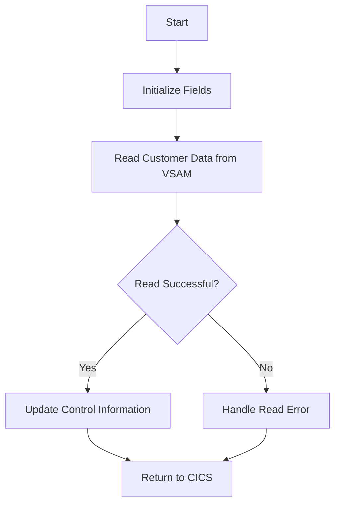

This document will cover the CUSTCTRL program. We'll cover:

1. What the Program Does
2. Program Flow
3. Program Sections

## What the Program Does

The CUSTCTRL program is designed to manage customer control information. It primarily reads customer data from a VSAM file and updates the control information based on the read results. The program initializes necessary fields, performs a read operation on the 'CUSTOMER' file, and handles any errors that may occur during this process.

## Program Flow

This is a visualization of the flow:



<SwmSnippet path="/src/base/cobol_src/CUSTCTRL.cbl" line="131">

---

### PREMIERE SECTION

First, the program initializes the required sort code by moving the value from <SwmToken path="src/base/cobol_src/CUSTCTRL.cbl" pos="134:3:3" line-data="           MOVE SORTCODE TO">`SORTCODE`</SwmToken> to <SwmToken path="src/base/cobol_src/CUSTCTRL.cbl" pos="135:1:5" line-data="              REQUIRED-SORT-CODE.">`REQUIRED-SORT-CODE`</SwmToken>. Then, it performs the <SwmToken path="src/base/cobol_src/CUSTCTRL.cbl" pos="137:3:11" line-data="           PERFORM GET-NUMBER-OF-CUSTOMERS-VSAM">`GET-NUMBER-OF-CUSTOMERS-VSAM`</SwmToken> section to read customer data from the VSAM file. Finally, it displays the output data and performs the <SwmToken path="src/base/cobol_src/CUSTCTRL.cbl" pos="144:3:11" line-data="           PERFORM GET-ME-OUT-OF-HERE.">`GET-ME-OUT-OF-HERE`</SwmToken> section to return control to CICS.

```cobol
       PROCEDURE DIVISION USING DFHCOMMAREA.
       PREMIERE SECTION.
       P010.
           MOVE SORTCODE TO
              REQUIRED-SORT-CODE.

           PERFORM GET-NUMBER-OF-CUSTOMERS-VSAM


      D    DISPLAY 'OUTPUT DATA IS='
      D       DFHCOMMAREA.


           PERFORM GET-ME-OUT-OF-HERE.

       P999.
           EXIT.
```

---

</SwmSnippet>

<SwmSnippet path="/src/base/cobol_src/CUSTCTRL.cbl" line="152">

---

### <SwmToken path="src/base/cobol_src/CUSTCTRL.cbl" pos="152:1:9" line-data="       GET-NUMBER-OF-CUSTOMERS-VSAM SECTION.">`GET-NUMBER-OF-CUSTOMERS-VSAM`</SwmToken> SECTION

Next, the program initializes the <SwmToken path="src/base/cobol_src/CUSTCTRL.cbl" pos="155:3:3" line-data="           INITIALIZE DFHCOMMAREA.">`DFHCOMMAREA`</SwmToken> and sets the customer control sort code and number to zero and '9' respectively. It then attempts to read the customer data from the VSAM file. If a system ID error occurs, it retries the read operation up to 100 times with a 3-second delay between each attempt. If the read operation is unsuccessful, it updates the control flags to indicate failure.

```cobol
       GET-NUMBER-OF-CUSTOMERS-VSAM SECTION.
       WCV010.

           INITIALIZE DFHCOMMAREA.


           MOVE ZERO TO CUSTOMER-CONTROL-SORTCODE
           MOVE ALL '9' TO CUSTOMER-CONTROL-NUMBER


           EXEC CICS READ
                FILE('CUSTOMER')
                INTO(DFHCOMMAREA)
                RIDFLD(CUSTOMER-CONTROL-KEY)
                KEYLENGTH(16)
                RESP(WS-CICS-RESP)
                RESP2(WS-CICS-RESP2)
           END-EXEC.

           if ws-cics-resp = dfhresp(sysiderr)
             perform varying SYSIDERR-RETRY from 1 by 1
```

---

</SwmSnippet>

<SwmSnippet path="/src/base/cobol_src/CUSTCTRL.cbl" line="206">

---

### <SwmToken path="src/base/cobol_src/CUSTCTRL.cbl" pos="206:1:9" line-data="       GET-ME-OUT-OF-HERE SECTION.">`GET-ME-OUT-OF-HERE`</SwmToken> SECTION

Then, the program returns control to CICS using the <SwmToken path="src/base/cobol_src/CUSTCTRL.cbl" pos="209:1:5" line-data="           EXEC CICS RETURN">`EXEC CICS RETURN`</SwmToken> command.

```cobol
       GET-ME-OUT-OF-HERE SECTION.
       GMOFH010.

           EXEC CICS RETURN
           END-EXEC.

       GMOFH999.
           EXIT.
```

---

</SwmSnippet>

<SwmSnippet path="/src/base/cobol_src/CUSTCTRL.cbl" line="216">

---

### <SwmToken path="src/base/cobol_src/CUSTCTRL.cbl" pos="216:1:5" line-data="       POPULATE-TIME-DATE SECTION.">`POPULATE-TIME-DATE`</SwmToken> SECTION

Finally, the program populates the current time and date by using the <SwmToken path="src/base/cobol_src/CUSTCTRL.cbl" pos="220:1:5" line-data="           EXEC CICS ASKTIME">`EXEC CICS ASKTIME`</SwmToken> and <SwmToken path="src/base/cobol_src/CUSTCTRL.cbl" pos="224:1:5" line-data="           EXEC CICS FORMATTIME">`EXEC CICS FORMATTIME`</SwmToken> commands. This section is used to get the current time and format it into a readable date format.

```cobol
       POPULATE-TIME-DATE SECTION.
       PTD010.
      D    DISPLAY 'POPULATE-TIME-DATE SECTION'.

           EXEC CICS ASKTIME
              ABSTIME(WS-U-TIME)
           END-EXEC.

           EXEC CICS FORMATTIME
                     ABSTIME(WS-U-TIME)
                     DDMMYYYY(WS-ORIG-DATE)
                     TIME(WS-TIME-NOW)
                     DATESEP
           END-EXEC.

       PTD999.
           EXIT.
```

---

</SwmSnippet>

&nbsp;

*This is an auto-generated document by Swimm 🌊 and has not yet been verified by a human*

<SwmMeta version="3.0.0" repo-id="Z2l0aHViJTNBJTNBY2ljcy1iYW5raW5nLXNhbXBsZS1hcHBsaWNhdGlvbi1jYnNhLUlCTS1EZW1vLUdQVCUzQSUzQVN3aW1tLURlbW8=" repo-name="cics-banking-sample-application-cbsa-IBM-Demo-GPT"><sup>Powered by [Swimm](/)</sup></SwmMeta>
