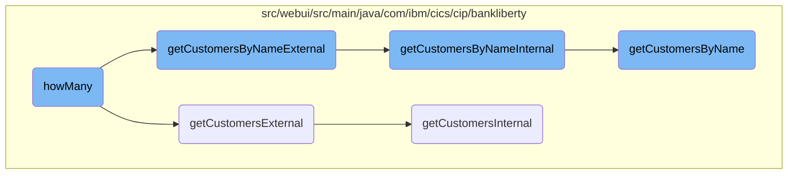
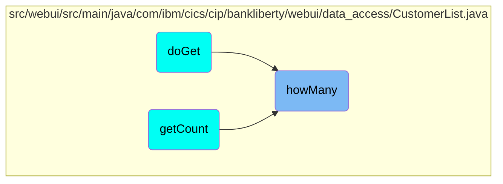

This document explains the process of determining the number of customers based on various filters. The process involves filtering customers by name, by number, or retrieving all customers when no filter is applied.

The flow starts by checking the filter criteria. If the filter is based on the customer name, it extracts the name and retrieves the matching customers, then counts them. If the filter is based on the customer number, it extracts the number and checks if a customer with that number exists, setting the count to 1 if found. If there is no filter, it retrieves all customers up to a limit and counts them. The count is then stored for further use.

# Flow drill down



<SwmSnippet path="/src/webui/src/main/java/com/ibm/cics/cip/bankliberty/webui/data_access/CustomerList.java" line="77">

---

## Filtering customers by name

When the filter starts with 'AND <SwmToken path="src/webui/src/main/java/com/ibm/cics/cip/bankliberty/webui/data_access/CustomerList.java" pos="77:12:12" line-data="			if (filter.startsWith(&quot; AND CUSTOMER_NAME like &#39;&quot;))">`CUSTOMER_NAME`</SwmToken> like', the code extracts the customer name from the filter and calls <SwmToken path="src/webui/src/main/java/com/ibm/cics/cip/bankliberty/webui/data_access/CustomerList.java" pos="85:2:2" line-data="						.getCustomersByNameExternal(customerNameFilter, 0, 0,">`getCustomersByNameExternal`</SwmToken> to retrieve customers matching the name. The response is parsed to get the number of customers, which is then stored in the <SwmToken path="src/webui/src/main/java/com/ibm/cics/cip/bankliberty/webui/data_access/CustomerList.java" pos="93:3:3" line-data="				this.count = (int) customerCount;">`count`</SwmToken> variable.

```java
			if (filter.startsWith(" AND CUSTOMER_NAME like '"))
			{

				String customerNameFilter = filter.substring(25);
				customerNameFilter = customerNameFilter.substring(0,
						customerNameFilter.length() - 1);

				myCustomerResponse = myCustomerResource
						.getCustomersByNameExternal(customerNameFilter, 0, 0,
								true);
				String myCustomersString = myCustomerResponse.getEntity()
						.toString();
				JSONObject myCustomersJSON;
				myCustomersJSON = JSONObject.parse(myCustomersString);
				long customerCount = (Long) myCustomersJSON
						.get(JSON_NUMBER_OF_CUSTOMERS);
				this.count = (int) customerCount;
			}
```

---

</SwmSnippet>

<SwmSnippet path="/src/webui/src/main/java/com/ibm/cics/cip/bankliberty/webui/data_access/CustomerList.java" line="97">

---

## Filtering customers by number

When the filter starts with 'AND <SwmToken path="src/webui/src/main/java/com/ibm/cics/cip/bankliberty/webui/data_access/CustomerList.java" pos="97:12:12" line-data="			if (filter.startsWith(&quot; AND CUSTOMER_NUMBER = &quot;))">`CUSTOMER_NUMBER`</SwmToken> =', the code extracts the customer number from the filter and calls <SwmToken path="src/webui/src/main/java/com/ibm/cics/cip/bankliberty/webui/data_access/CustomerList.java" pos="103:2:2" line-data="						.getCustomerExternal(customerNumber);">`getCustomerExternal`</SwmToken> to retrieve the customer with that number. If the response status is 200, it indicates that the customer exists, and the <SwmToken path="src/webui/src/main/java/com/ibm/cics/cip/bankliberty/webui/data_access/CustomerList.java" pos="107:3:3" line-data="				this.count = 0;">`count`</SwmToken> is set to 1.

```java
			if (filter.startsWith(" AND CUSTOMER_NUMBER = "))
			{
				String customerNumberFilter = filter.substring(23);
				Long customerNumber = Long.parseLong(customerNumberFilter);

				myCustomerResponse = myCustomerResource
						.getCustomerExternal(customerNumber);
				String myCustomersString = myCustomerResponse.getEntity()
						.toString();
				JSONObject myCustomerJSON;
				this.count = 0;
				if (myCustomerResponse.getStatus() == 200)
				{
					myCustomerJSON = JSONObject.parse(myCustomersString);
					String id = (String) myCustomerJSON.get(JSON_ID);
					if (id != null)
					{
						this.count = 1;
					}
				}
			}
```

---

</SwmSnippet>

<SwmSnippet path="/src/webui/src/main/java/com/ibm/cics/cip/bankliberty/webui/data_access/CustomerList.java" line="119">

---

## Retrieving all customers

If the filter is empty, the code calls <SwmToken path="src/webui/src/main/java/com/ibm/cics/cip/bankliberty/webui/data_access/CustomerList.java" pos="123:2:2" line-data="						.getCustomersExternal(250000, 0, true);">`getCustomersExternal`</SwmToken> to retrieve all customers with a limit of 250,000. The response is parsed to get the total number of customers, which is then stored in the <SwmToken path="src/webui/src/main/java/com/ibm/cics/cip/bankliberty/webui/data_access/CustomerList.java" pos="132:3:3" line-data="					this.count = (int) customerCount;">`count`</SwmToken> variable.

```java
			if (filter.length() == 0)
			{

				myCustomerResponse = myCustomerResource
						.getCustomersExternal(250000, 0, true);
				String myCustomersString = myCustomerResponse.getEntity()
						.toString();
				if (myCustomerResponse.getStatus() == 200)
				{
					JSONObject myCustomersJSON;
					myCustomersJSON = JSONObject.parse(myCustomersString);
					long customerCount = (Long) myCustomersJSON
							.get(JSON_NUMBER_OF_CUSTOMERS);
					this.count = (int) customerCount;

				}
				else
				{
					logger.log(Level.SEVERE, () -> "Error getting customers");
				}
			}
```

---

</SwmSnippet>

<SwmSnippet path="/src/webui/src/main/java/com/ibm/cics/cip/bankliberty/api/json/CustomerResource.java" line="942">

---

## External customer retrieval

The <SwmToken path="src/webui/src/main/java/com/ibm/cics/cip/bankliberty/api/json/CustomerResource.java" pos="942:5:5" line-data="	public Response getCustomersExternal(@QueryParam(&quot;limit&quot;) Integer limit,">`getCustomersExternal`</SwmToken> method is responsible for retrieving customers based on the provided limit, offset, and <SwmToken path="src/webui/src/main/java/com/ibm/cics/cip/bankliberty/api/json/CustomerResource.java" pos="944:5:5" line-data="			@QueryParam(&quot;countOnly&quot;) Boolean countOnly)">`countOnly`</SwmToken> parameters. It calls <SwmToken path="src/webui/src/main/java/com/ibm/cics/cip/bankliberty/api/json/CustomerResource.java" pos="954:7:7" line-data="		Response myResponse = getCustomersInternal(limit, offset,">`getCustomersInternal`</SwmToken> to perform the actual data retrieval and then terminates the data access session.

```java
	public Response getCustomersExternal(@QueryParam("limit") Integer limit,
			@QueryParam("offset") Integer offset,
			@QueryParam("countOnly") Boolean countOnly)
	{
		logger.entering(this.getClass().getName(),
				"getCustomersExternal(Integer limit, Integer offset, Boolean countOnly) "
						+ limit + " " + offset + " " + countOnly);
		boolean countOnlyReal = false;
		if (countOnly != null)
		{
			countOnlyReal = countOnly.booleanValue();
		}
		Response myResponse = getCustomersInternal(limit, offset,
				countOnlyReal);
		HBankDataAccess myHBankDataAccess = new HBankDataAccess();
		myHBankDataAccess.terminate();
		logger.exiting(this.getClass().getName(),
				"getCustomersExternal(Integer limit, Integer offset, Boolean countOnly)",
				myResponse);
		return myResponse;
```

---

</SwmSnippet>

<SwmSnippet path="/src/webui/src/main/java/com/ibm/cics/cip/bankliberty/api/json/CustomerResource.java" line="1058">

---

## External customer retrieval by name

The <SwmToken path="src/webui/src/main/java/com/ibm/cics/cip/bankliberty/api/json/CustomerResource.java" pos="1060:5:5" line-data="	public Response getCustomersByNameExternal(@QueryParam(&quot;name&quot;) String name,">`getCustomersByNameExternal`</SwmToken> method retrieves customers by name based on the provided limit, offset, and <SwmToken path="src/webui/src/main/java/com/ibm/cics/cip/bankliberty/api/json/CustomerResource.java" pos="1063:5:5" line-data="			@QueryParam(&quot;countOnly&quot;) Boolean countOnly)">`countOnly`</SwmToken> parameters. It calls <SwmToken path="src/webui/src/main/java/com/ibm/cics/cip/bankliberty/api/json/CustomerResource.java" pos="1099:5:5" line-data="	public Response getCustomersByNameInternal(@QueryParam(&quot;name&quot;) String name,">`getCustomersByNameInternal`</SwmToken> to perform the actual data retrieval and then terminates the data access session.

```java
	@Path("/name")
	@Produces(MediaType.APPLICATION_JSON)
	public Response getCustomersByNameExternal(@QueryParam("name") String name,
			@QueryParam("limit") Integer limit,
			@QueryParam("offset") Integer offset,
			@QueryParam("countOnly") Boolean countOnly)
	{
		logger.entering(this.getClass().getName(),
				"getCustomersByNameExternal(String name, Integer limit, Integer offset, Boolean countOnly) "
						+ name + " " + limit + " " + offset + " " + countOnly);

		boolean countOnlyReal = false;
		if (countOnly != null)
		{
			countOnlyReal = countOnly.booleanValue();
		}
		if (offset == null)
		{
			offset = 0;
		}

```

---

</SwmSnippet>

<SwmSnippet path="/src/webui/src/main/java/com/ibm/cics/cip/bankliberty/api/json/CustomerResource.java" line="1099">

---

## Internal customer retrieval by name

The <SwmToken path="src/webui/src/main/java/com/ibm/cics/cip/bankliberty/api/json/CustomerResource.java" pos="1099:5:5" line-data="	public Response getCustomersByNameInternal(@QueryParam(&quot;name&quot;) String name,">`getCustomersByNameInternal`</SwmToken> method performs the actual retrieval of customers by name. It checks if only the count is needed or if the full customer data should be retrieved. The retrieved data is then formatted into a JSON response.

```java
	public Response getCustomersByNameInternal(@QueryParam("name") String name,
			@QueryParam("limit") int limit, @QueryParam("offset") int offset,
			boolean countOnly)
	{
		logger.entering(this.getClass().getName(),
				"getCustomersByNameInternal(String name, Integer limit, Integer offset, Boolean countOnly) "
						+ name + " " + limit + " " + offset + " " + countOnly);
		Integer sortCode = this.getSortCode();

		JSONObject response = new JSONObject();
		JSONArray customers = null;

		if (countOnly)
		{
			com.ibm.cics.cip.bankliberty.web.vsam.Customer vsamCustomer = new com.ibm.cics.cip.bankliberty.web.vsam.Customer();
			long numberOfCustomers = 0;
			numberOfCustomers = vsamCustomer
					.getCustomersByNameCountOnly(sortCode.intValue(), name);
			response.put(JSON_NUMBER_OF_CUSTOMERS, numberOfCustomers);
		}
		else
```

---

</SwmSnippet>

<SwmSnippet path="/src/webui/src/main/java/com/ibm/cics/cip/bankliberty/api/json/CustomerResource.java" line="965">

---

## Internal customer retrieval

The <SwmToken path="src/webui/src/main/java/com/ibm/cics/cip/bankliberty/api/json/CustomerResource.java" pos="965:5:5" line-data="	public Response getCustomersInternal(@QueryParam(&quot;limit&quot;) Integer limit,">`getCustomersInternal`</SwmToken> method performs the actual retrieval of customers based on the provided limit, offset, and <SwmToken path="src/webui/src/main/java/com/ibm/cics/cip/bankliberty/api/json/CustomerResource.java" pos="966:16:16" line-data="			@QueryParam(&quot;offset&quot;) Integer offset, boolean countOnly)">`countOnly`</SwmToken> parameters. The retrieved data is then formatted into a JSON response.

```java
	public Response getCustomersInternal(@QueryParam("limit") Integer limit,
			@QueryParam("offset") Integer offset, boolean countOnly)
	{
		logger.entering(this.getClass().getName(),
				"getCustomersInternal(Integer limit, Integer offset, Boolean countOnly) "
						+ limit + " " + offset + " " + countOnly);
		Integer sortCode = this.getSortCode();

		JSONObject response = new JSONObject();
		JSONArray customers = null;

		if (offset == null)
		{
			offset = 0;
		}

		if (limit == null)
		{
			limit = 250000;
		}

```

---

</SwmSnippet>

<SwmSnippet path="/src/webui/src/main/java/com/ibm/cics/cip/bankliberty/web/vsam/Customer.java" line="1118">

---

## Retrieving customers by name from VSAM

The <SwmToken path="src/webui/src/main/java/com/ibm/cics/cip/bankliberty/web/vsam/Customer.java" pos="1118:7:7" line-data="	public Customer[] getCustomersByName(int sortCode, int limit, int offset,">`getCustomersByName`</SwmToken> method retrieves customers from the VSAM file based on the provided sort code, limit, offset, and name. It iterates through the VSAM records, filtering customers by name and storing the matching customers in an array.

```java
	public Customer[] getCustomersByName(int sortCode, int limit, int offset,
			String name)
	{
		logger.entering(this.getClass().getName(),
				GET_CUSTOMERS_BY_NAME_WITH_OFFSET_AND_LIMIT);
		Customer[] temp = new Customer[1000000];

		int stored = 0;

		customerFile.setName(FILENAME);

		myCustomer = new CUSTOMER();

		holder = new RecordHolder();
		keyHolder = new KeyHolder();
		byte[] key = buildKey(sortCode, 0);

		// We need to convert the key to EBCDIC
		String keyString = new String(key);
		try
		{
```

---

</SwmSnippet>

# Where is this flow used?

This flow is used multiple times in the codebase as represented in the following diagram:



&nbsp;

*This is an auto-generated document by Swimm 🌊 and has not yet been verified by a human*

<SwmMeta version="3.0.0" repo-id="Z2l0aHViJTNBJTNBY2ljcy1iYW5raW5nLXNhbXBsZS1hcHBsaWNhdGlvbi1jYnNhLUlCTS1EZW1vLUdQVCUzQSUzQVN3aW1tLURlbW8=" repo-name="cics-banking-sample-application-cbsa-IBM-Demo-GPT"><sup>Powered by [Swimm](/)</sup></SwmMeta>
