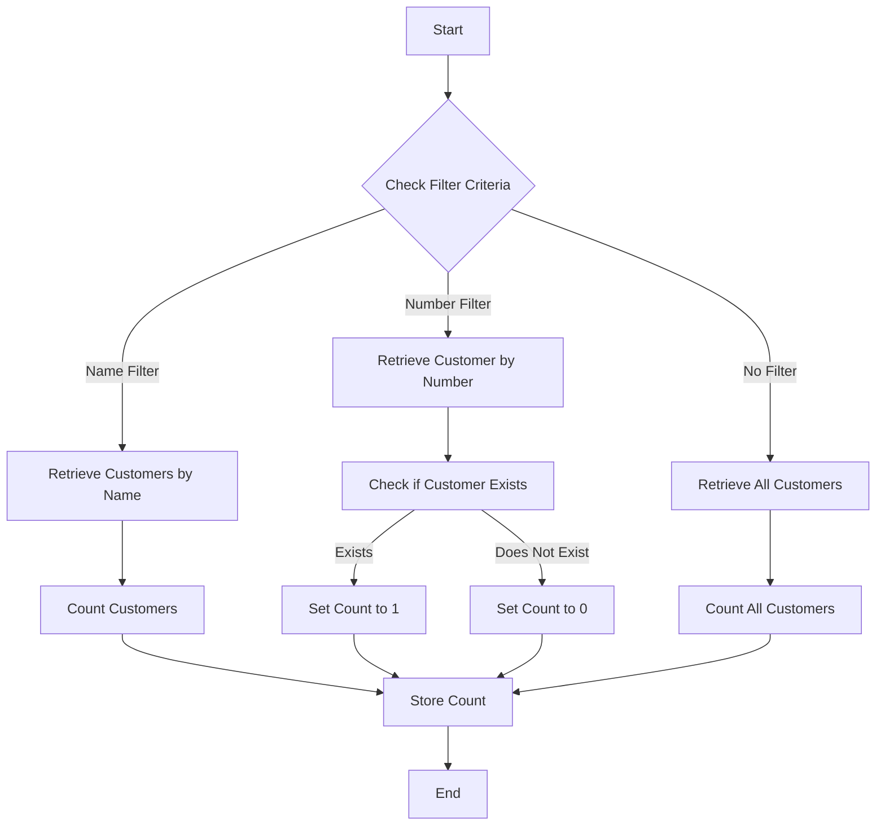

This document will cover the Customer Count Retrieval Flow, which includes:

1. Filtering customers by name
2. Filtering customers by number
3. Retrieving all customers when no filter is applied.

Technical document: <SwmLink doc-title="Customer Count Retrieval Flow">[Customer Count Retrieval Flow](/.swm/customer-count-retrieval-flow.b98w4tc0.sw.md)</SwmLink>

# [Filtering customers by name](https://app.swimm.io/repos/Z2l0aHViJTNBJTNBY2ljcy1iYW5raW5nLXNhbXBsZS1hcHBsaWNhdGlvbi1jYnNhLUlCTS1EZW1vLUdQVCUzQSUzQVN3aW1tLURlbW8=/docs/b98w4tc0#filtering-customers-by-name)

When the filter criteria is based on the customer name, the system extracts the name from the filter. It then retrieves all customers that match this name. The number of matching customers is counted and stored. This allows the system to provide a precise count of customers with a specific name, which can be useful for customer service representatives when they need to quickly find and verify customer information.

# [Filtering customers by number](https://app.swimm.io/repos/Z2l0aHViJTNBJTNBY2ljcy1iYW5raW5nLXNhbXBsZS1hcHBsaWNhdGlvbi1jYnNhLUlCTS1EZW1vLUdQVCUzQSUzQVN3aW1tLURlbW8=/docs/b98w4tc0#filtering-customers-by-number)

When the filter criteria is based on the customer number, the system extracts the number from the filter. It then checks if a customer with this number exists. If a customer is found, the count is set to 1. If no customer is found, the count is set to 0. This step ensures that customer service representatives can quickly verify the existence of a customer based on their unique customer number.

# [Retrieving all customers](https://app.swimm.io/repos/Z2l0aHViJTNBJTNBY2ljcy1iYW5raW5nLXNhbXBsZS1hcHBsaWNhdGlvbi1jYnNhLUlCTS1EZW1vLUdQVCUzQSUzQVN3aW1tLURlbW8=/docs/b98w4tc0#retrieving-all-customers)

When no filter is applied, the system retrieves all customers up to a predefined limit (e.g., 250,000 customers). The total number of customers retrieved is then counted and stored. This step is useful for generating reports or for administrative purposes where a comprehensive count of all customers is required.

&nbsp;

*This is an auto-generated document by Swimm 🌊 and has not yet been verified by a human*

<SwmMeta version="3.0.0" repo-id="Z2l0aHViJTNBJTNBY2ljcy1iYW5raW5nLXNhbXBsZS1hcHBsaWNhdGlvbi1jYnNhLUlCTS1EZW1vLUdQVCUzQSUzQVN3aW1tLURlbW8=" repo-name="cics-banking-sample-application-cbsa-IBM-Demo-GPT">Powered by [Swimm](/)</SwmMeta>
