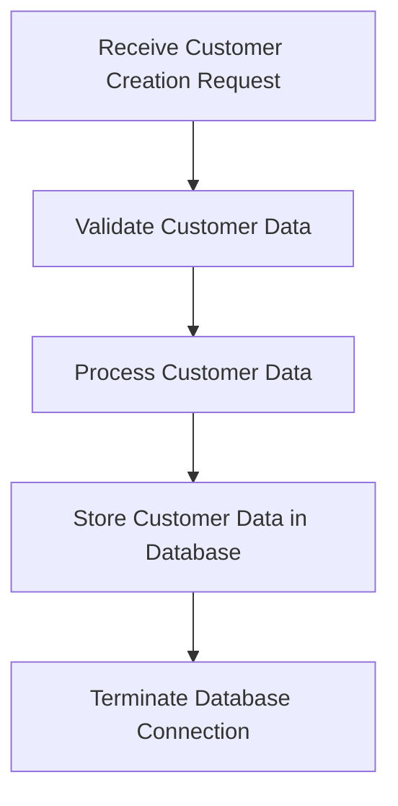

The process of creating a new customer in the banking system involves several steps to ensure data accuracy and proper storage. This document will cover:

1. Receiving the customer creation request
2. Validating and processing the customer data
3. Storing the customer data in the database
4. Terminating the database connection

Technical document: <SwmLink doc-title="Customer Creation Process">[Customer Creation Process](/.swm/customer-creation-process.neyf8ajf.sw.md)</SwmLink>

# [Receiving the Customer Creation Request](https://app.swimm.io/repos/Z2l0aHViJTNBJTNBY2ljcy1iYW5raW5nLXNhbXBsZS1hcHBsaWNhdGlvbi1jYnNhLUlCTS1EZW1vLUdQVCUzQSUzQVN3aW1tLURlbW8=/docs/neyf8ajf#handling-the-customer-creation-request)

The process begins when a customer creation request is received. This request contains all the necessary details about the new customer, such as their name, date of birth, account number, and sort code. The system must ensure that this request is properly formatted and contains all required information before proceeding to the next step.

# [Validating and Processing the Customer Data](https://app.swimm.io/repos/Z2l0aHViJTNBJTNBY2ljcy1iYW5raW5nLXNhbXBsZS1hcHBsaWNhdGlvbi1jYnNhLUlCTS1EZW1vLUdQVCUzQSUzQVN3aW1tLURlbW8=/docs/neyf8ajf#processing-customer-creation-internally)

Once the request is received, the system validates the customer data to ensure it is accurate and complete. This involves checking that all required fields are present and correctly formatted. For example, the system verifies that the date of birth is in a valid date format and that the account number and sort code are numeric and of the correct length. After validation, the data is processed internally to prepare it for storage in the database.

# [Storing the Customer Data in the Database](https://app.swimm.io/repos/Z2l0aHViJTNBJTNBY2ljcy1iYW5raW5nLXNhbXBsZS1hcHBsaWNhdGlvbi1jYnNhLUlCTS1EZW1vLUdQVCUzQSUzQVN3aW1tLURlbW8=/docs/neyf8ajf#writing-customer-data-to-the-database)

The validated customer data is then stored in the database. This step involves constructing a data string that includes all the customer details and inserting it into the appropriate database table. The system ensures that the data is correctly formatted and handles any potential errors that may occur during the insertion process, such as SQL exceptions. Successfully storing the data in the database is crucial for maintaining accurate customer records.

# [Terminating the Database Connection](https://app.swimm.io/repos/Z2l0aHViJTNBJTNBY2ljcy1iYW5raW5nLXNhbXBsZS1hcHBsaWNhdGlvbi1jYnNhLUlCTS1EZW1vLUdQVCUzQSUzQVN3aW1tLURlbW8=/docs/neyf8ajf#opening-a-database-connection)

After the customer data has been successfully stored in the database, the system terminates the database connection. This step is important to ensure that no resources are left hanging and that the database connection is properly closed. Properly terminating the connection helps maintain the performance and stability of the database system.

&nbsp;

*This is an auto-generated document by Swimm 🌊 and has not yet been verified by a human*

<SwmMeta version="3.0.0" repo-id="Z2l0aHViJTNBJTNBY2ljcy1iYW5raW5nLXNhbXBsZS1hcHBsaWNhdGlvbi1jYnNhLUlCTS1EZW1vLUdQVCUzQSUzQVN3aW1tLURlbW8=" repo-name="cics-banking-sample-application-cbsa-IBM-Demo-GPT">Powered by [Swimm](/)</SwmMeta>
