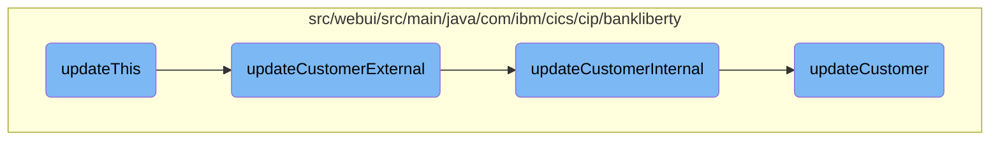

This document explains the process of updating customer information. The process involves initiating the update, handling external and internal updates, and finally updating the customer record in the database.

The flow starts with initiating the customer data update. It then handles the external update request, which involves calling an internal update function. The internal update function performs detailed validation of the customer data. If the data is valid, it updates the customer record in the database. If any validation fails, it returns an error response.

# Flow drill down



<SwmSnippet path="/src/webui/src/main/java/com/ibm/cics/cip/bankliberty/webui/data_access/Customer.java" line="174">

---

## Handling customer data updates

The <SwmToken path="src/webui/src/main/java/com/ibm/cics/cip/bankliberty/webui/data_access/Customer.java" pos="174:5:5" line-data="	public boolean updateThis()">`updateThis`</SwmToken> method initiates the customer data update process. It creates a <SwmToken path="src/webui/src/main/java/com/ibm/cics/cip/bankliberty/webui/data_access/Customer.java" pos="176:1:1" line-data="		CustomerResource myCustomerResource = new CustomerResource();">`CustomerResource`</SwmToken> and a <SwmToken path="src/webui/src/main/java/com/ibm/cics/cip/bankliberty/webui/data_access/Customer.java" pos="178:1:1" line-data="		CustomerJSON myCustomerJSON = new CustomerJSON();">`CustomerJSON`</SwmToken> object, sets the customer details, and calls <SwmToken path="src/webui/src/main/java/com/ibm/cics/cip/bankliberty/webui/data_access/Customer.java" pos="185:9:9" line-data="		Response myCustomerResponse = myCustomerResource.updateCustomerExternal(">`updateCustomerExternal`</SwmToken>. If the response status is 200, it updates the customer object with the new data.

```java
	public boolean updateThis()
	{
		CustomerResource myCustomerResource = new CustomerResource();

		CustomerJSON myCustomerJSON = new CustomerJSON();

		myCustomerJSON.setCustomerAddress(this.getAddress());
		myCustomerJSON.setCustomerName(this.getName());
		myCustomerJSON.setSortCode(this.getSortcode());
		myCustomerJSON.setSortCode(this.getSortcode());

		Response myCustomerResponse = myCustomerResource.updateCustomerExternal(
				Long.parseLong(this.getCustomerNumber()), myCustomerJSON);

		String myCustomerString = null;
		JSONObject myCustomer = null;

		if (myCustomerResponse.getStatus() == 200)
		{
			myCustomerString = myCustomerResponse.getEntity().toString();
			try
```

---

</SwmSnippet>

<SwmSnippet path="/src/webui/src/main/java/com/ibm/cics/cip/bankliberty/api/json/CustomerResource.java" line="309">

---

## External customer update

The <SwmToken path="src/webui/src/main/java/com/ibm/cics/cip/bankliberty/api/json/CustomerResource.java" pos="313:5:5" line-data="	public Response updateCustomerExternal(@PathParam(JSON_ID) Long id,">`updateCustomerExternal`</SwmToken> method handles the external update request. It calls <SwmToken path="src/webui/src/main/java/com/ibm/cics/cip/bankliberty/api/json/CustomerResource.java" pos="318:7:7" line-data="		Response myResponse = updateCustomerInternal(id, customer);">`updateCustomerInternal`</SwmToken> to perform the actual update and then terminates the <SwmToken path="src/webui/src/main/java/com/ibm/cics/cip/bankliberty/api/json/CustomerResource.java" pos="319:1:1" line-data="		HBankDataAccess myHBankDataAccess = new HBankDataAccess();">`HBankDataAccess`</SwmToken> session.

```java
	@PUT
	@Path("/{id}")
	@Consumes(MediaType.APPLICATION_JSON)
	@Produces(MediaType.APPLICATION_JSON)
	public Response updateCustomerExternal(@PathParam(JSON_ID) Long id,
			CustomerJSON customer)
	{
		logger.entering(this.getClass().getName(),
				UPDATE_CUSTOMER_EXTERNAL + id);
		Response myResponse = updateCustomerInternal(id, customer);
		HBankDataAccess myHBankDataAccess = new HBankDataAccess();
		myHBankDataAccess.terminate();
		logger.exiting(this.getClass().getName(), UPDATE_CUSTOMER_EXTERNAL + id,
				myResponse);
		return myResponse;

```

---

</SwmSnippet>

<SwmSnippet path="/src/webui/src/main/java/com/ibm/cics/cip/bankliberty/api/json/CustomerResource.java" line="328">

---

## Internal customer update and validation

The <SwmToken path="src/webui/src/main/java/com/ibm/cics/cip/bankliberty/api/json/CustomerResource.java" pos="328:5:5" line-data="	public Response updateCustomerInternal(@PathParam(JSON_ID) Long id,">`updateCustomerInternal`</SwmToken> method performs detailed validation of the customer data. It checks for null values, validates the customer title and sort code, and updates the customer record in the VSAM database. If any validation fails, it returns an appropriate error response.

```java
	public Response updateCustomerInternal(@PathParam(JSON_ID) Long id,
			CustomerJSON customer)
	{
		logger.entering(this.getClass().getName(),
				UPDATE_CUSTOMER_INTERNAL + id);
		
		if(customer.getCustomerName() == null)
		{
			JSONObject error = new JSONObject();
			error.put(JSON_ERROR_MSG,
					"Customer name is null");
			Response myResponse = Response.status(400).entity(error.toString())
					.build();
			logger.log(Level.WARNING,
					() -> "Customer name is null in CustomerResource.updateCustomerInternal(), "
							+ customer.toString());
			logger.exiting(this.getClass().getName(),
					UPDATE_CUSTOMER_INTERNAL_EXIT, myResponse);
			return myResponse;
		}
		
```

---

</SwmSnippet>

<SwmSnippet path="/src/webui/src/main/java/com/ibm/cics/cip/bankliberty/web/vsam/Customer.java" line="509">

---

## Updating customer record in VSAM

The <SwmToken path="src/webui/src/main/java/com/ibm/cics/cip/bankliberty/web/vsam/Customer.java" pos="509:5:5" line-data="	public Customer updateCustomer(CustomerJSON customer)">`updateCustomer`</SwmToken> method updates the customer record in the VSAM database. It reads the existing record, updates the necessary fields, and rewrites the record. If the record is not found, it returns a <SwmToken path="src/webui/src/main/java/com/ibm/cics/cip/bankliberty/web/vsam/Customer.java" pos="509:3:3" line-data="	public Customer updateCustomer(CustomerJSON customer)">`Customer`</SwmToken> object with a <SwmToken path="src/webui/src/main/java/com/ibm/cics/cip/bankliberty/web/vsam/Customer.java" pos="119:5:5" line-data="	private boolean notFound;">`notFound`</SwmToken> flag set to true.

```java
	public Customer updateCustomer(CustomerJSON customer)
	{
		logger.entering(this.getClass().getName(), UPDATE_CUSTOMER, null);

		customerFile.setName(FILENAME);
		Customer temp;
		holder = new RecordHolder();

		Long customerNumberLong = Long.parseLong(customer.getId());

		customer.setId(padCustomerNumber(customer.getId()));

		byte[] key = buildKey(Integer.valueOf(customer.getSortCode()),
				Long.valueOf(customer.getId()));

		try
		{
			customerFile.readForUpdate(key, holder);
			myCustomer = new CUSTOMER(holder.getValue());
			myCustomer.setCustomerAddress(customer.getCustomerAddress());
			myCustomer.setCustomerName(customer.getCustomerName());
```

---

</SwmSnippet>

&nbsp;

*This is an auto-generated document by Swimm 🌊 and has not yet been verified by a human*

<SwmMeta version="3.0.0" repo-id="Z2l0aHViJTNBJTNBY2ljcy1iYW5raW5nLXNhbXBsZS1hcHBsaWNhdGlvbi1jYnNhLUlCTS1EZW1vLUdQVCUzQSUzQVN3aW1tLURlbW8=" repo-name="cics-banking-sample-application-cbsa-IBM-Demo-GPT"><sup>Powered by [Swimm](/)</sup></SwmMeta>
