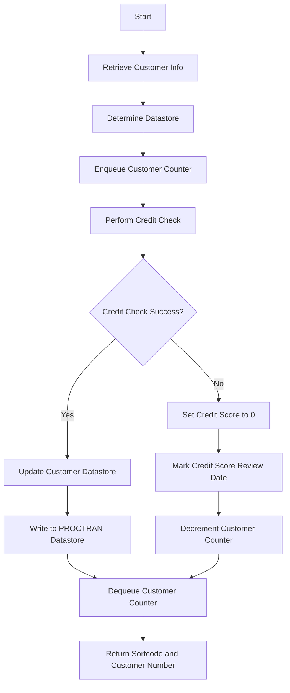

This document will cover the CRECUST program. We'll cover:

1. What the Program Does
2. Program Flow
3. Program Sections

## What the Program Does

The CRECUST program is designed to handle customer information from a BMS application. It retrieves customer details such as name, address, and date of birth, determines the appropriate datastore (VSAM or <SwmToken path="src/base/cobol_src/CRECUST.cbl" pos="1123:7:7" line-data="              PERFORM WRITE-PROCTRAN-DB2.">`DB2`</SwmToken>), and manages a customer counter. The program performs a credit check using multiple credit agencies asynchronously, aggregates the credit scores, and updates the customer datastore. If the update is successful, it writes a record to the PROCTRAN datastore. If any operation fails, it ensures the customer counter is decremented and dequeued.

## Program Flow

This is a visualization of the flow:



<SwmSnippet path="/src/base/cobol_src/CRECUST.cbl" line="354">

---

### PREMIERE SECTION

First, the program initializes by moving the sort code to the required sort code and populating the date and time. It then performs a credit check asynchronously. If the credit check fails, it sets the credit score to 0 and exits. If the date of birth check fails, it also exits. Otherwise, it enqueues the customer counter, updates the named counter server, and writes the customer data to the VSAM datastore.

```cobol
       PREMIERE SECTION.
       P010.

           MOVE SORTCODE TO REQUIRED-SORT-CODE.


      *
      *    Derive the date and time
      *

           PERFORM POPULATE-TIME-DATE.

      *
      *    Perform the Asynchronous credit check
      *
           PERFORM CREDIT-CHECK.

           IF WS-CREDIT-CHECK-ERROR = 'Y'
              MOVE 0 TO COMM-CREDIT-SCORE

              STRING WS-ORIG-DATE-DD DELIMITED BY SIZE,
```

---

</SwmSnippet>

<SwmSnippet path="/src/base/cobol_src/CRECUST.cbl" line="423">

---

### <SwmToken path="src/base/cobol_src/CRECUST.cbl" pos="423:1:5" line-data="       POPULATE-TIME-DATE SECTION.">`POPULATE-TIME-DATE`</SwmToken> SECTION

Next, the program derives the current date and time using CICS commands.

```cobol
       POPULATE-TIME-DATE SECTION.
       PTD010.

           EXEC CICS ASKTIME
              ABSTIME(WS-U-TIME)
           END-EXEC.

           EXEC CICS FORMATTIME
                     ABSTIME(WS-U-TIME)
                     DDMMYYYY(WS-ORIG-DATE)
                     TIME(PROC-TRAN-TIME OF PROCTRAN-AREA )
                     DATESEP
           END-EXEC.

       PTD999.
           EXIT.
```

---

</SwmSnippet>

<SwmSnippet path="/src/base/cobol_src/CRECUST.cbl" line="441">

---

### <SwmToken path="src/base/cobol_src/CRECUST.cbl" pos="441:1:5" line-data="       ENQ-NAMED-COUNTER SECTION.">`ENQ-NAMED-COUNTER`</SwmToken> SECTION

Then, the program enqueues the named counter for the customer. If the enqueue operation fails, it sets the success flag to 'N' and exits.

```cobol
       ENQ-NAMED-COUNTER SECTION.
       ENC010.
           MOVE SORTCODE TO
              NCS-CUST-NO-TEST-SORT.

           EXEC CICS ENQ
              RESOURCE(NCS-CUST-NO-NAME)
              LENGTH(16)
              RESP(WS-CICS-RESP)
              RESP2(WS-CICS-RESP2)
           END-EXEC.

           IF WS-CICS-RESP NOT = DFHRESP(NORMAL)
             MOVE 'N' TO COMM-SUCCESS
             MOVE '3' TO COMM-FAIL-CODE
             PERFORM GET-ME-OUT-OF-HERE
           END-IF.

       ENC999.
           EXIT.
```

---

</SwmSnippet>

<SwmSnippet path="/src/base/cobol_src/CRECUST.cbl" line="488">

---

### <SwmToken path="src/base/cobol_src/CRECUST.cbl" pos="488:1:3" line-data="       UPD-NCS SECTION.">`UPD-NCS`</SwmToken> SECTION

Going into the next section, the program updates the named counter server by performing a VSAM read to get the last customer number and increments it.

```cobol
       UPD-NCS SECTION.
       UN010.
      *
      *    Update the Named Counter Server
      *
           MOVE 1 TO NCS-CUST-NO-INC.

           PERFORM GET-LAST-CUSTOMER-VSAM

           MOVE 'Y' TO NCS-UPDATED.

       UN999.
           EXIT.
```

---

</SwmSnippet>

<SwmSnippet path="/src/base/cobol_src/CRECUST.cbl" line="505">

---

### <SwmToken path="src/base/cobol_src/CRECUST.cbl" pos="505:1:3" line-data="       CREDIT-CHECK SECTION.">`CREDIT-CHECK`</SwmToken> SECTION

Now, the program performs an asynchronous credit check by initiating multiple transactions and fetching the results. It aggregates the credit scores and sets a new review date. If no data is retrieved, it sets the credit score to 0 and exits.

```cobol
       CREDIT-CHECK SECTION.
       CC010.
      *
      *    Carry out the Credit Check Asynchronously
      *


      *
      *    Retrieve the table of transaction IDs to use &
      *    initiate each Asynchronous transaction
      *
           MOVE 'CIPCREDCHANN    ' TO WS-CHANNEL-NAME.
           MOVE 0 TO WS-CHILD-ISSUED-CNT.

           COMPUTE WS-PUT-CONT-LEN = LENGTH OF DFHCOMMAREA.

           PERFORM VARYING WS-CC-CNT FROM 1 BY 1
           UNTIL WS-CC-CNT > 5

      *
      *       Use transactions OCR1 - OCR5
```

---

</SwmSnippet>

<SwmSnippet path="/src/base/cobol_src/CRECUST.cbl" line="1011">

---

### <SwmToken path="src/base/cobol_src/CRECUST.cbl" pos="1011:1:5" line-data="       WRITE-CUSTOMER-VSAM SECTION.">`WRITE-CUSTOMER-VSAM`</SwmToken> SECTION

Next, the program writes the customer data to the VSAM datastore. If the write operation fails, it dequeues the named counter and exits. If successful, it updates the customer control record and writes to the PROCTRAN datastore.

```cobol
       WRITE-CUSTOMER-VSAM SECTION.
       WCV010.
      *
      *    Write a record to the CUSTOMER VSAM file
      *
           INITIALIZE OUTPUT-DATA.

           MOVE 'CUST'              TO CUSTOMER-EYECATCHER.
           MOVE SORTCODE            TO CUSTOMER-SORTCODE.
           MOVE NCS-CUST-NO-VALUE   TO CUSTOMER-NUMBER.
           MOVE COMM-NAME           TO CUSTOMER-NAME.
           MOVE COMM-ADDRESS        TO CUSTOMER-ADDRESS.
           MOVE COMM-DATE-OF-BIRTH  TO CUSTOMER-DATE-OF-BIRTH.
           MOVE COMM-CREDIT-SCORE   TO CUSTOMER-CREDIT-SCORE.
           MOVE COMM-CS-REVIEW-DATE TO CUSTOMER-CS-REVIEW-DATE.

           COMPUTE WS-CUST-REC-LEN = LENGTH OF OUTPUT-DATA.

           EXEC CICS WRITE
                FILE('CUSTOMER')
                FROM(OUTPUT-DATA)
```

---

</SwmSnippet>

<SwmSnippet path="/src/base/cobol_src/CRECUST.cbl" line="1121">

---

### <SwmToken path="src/base/cobol_src/CRECUST.cbl" pos="1121:1:3" line-data="       WRITE-PROCTRAN SECTION.">`WRITE-PROCTRAN`</SwmToken> SECTION

Then, the program writes a record to the PROCTRAN datastore.

```cobol
       WRITE-PROCTRAN SECTION.
       WP010.
              PERFORM WRITE-PROCTRAN-DB2.

       WP999.
           EXIT.
```

---

</SwmSnippet>

<SwmSnippet path="/src/base/cobol_src/CRECUST.cbl" line="1129">

---

### <SwmToken path="src/base/cobol_src/CRECUST.cbl" pos="1129:1:5" line-data="       WRITE-PROCTRAN-DB2 SECTION.">`WRITE-PROCTRAN-DB2`</SwmToken> SECTION

In this section, the program records the creation of a new customer in the PROCTRAN <SwmToken path="src/base/cobol_src/CRECUST.cbl" pos="1129:5:5" line-data="       WRITE-PROCTRAN-DB2 SECTION.">`DB2`</SwmToken> datastore. If the write operation fails, it links to an abend handler program and abends the transaction.

```cobol
       WRITE-PROCTRAN-DB2 SECTION.
       WPD010.
      *
      *    Record the creation of a new CUSTOMER on PROCTRAN
      *
           INITIALIZE HOST-PROCTRAN-ROW.
           INITIALIZE WS-EIBTASKN12.

           MOVE 'PRTR' TO HV-PROCTRAN-EYECATCHER.
           MOVE SORTCODE TO HV-PROCTRAN-SORT-CODE.
           MOVE ZEROS TO HV-PROCTRAN-ACC-NUMBER.
           MOVE EIBTASKN TO WS-EIBTASKN12.
           MOVE WS-EIBTASKN12 TO HV-PROCTRAN-REF.

      *
      *    Populate the time and date
      *
           EXEC CICS ASKTIME
              ABSTIME(WS-U-TIME)
           END-EXEC.

```

---

</SwmSnippet>

<SwmSnippet path="/src/base/cobol_src/CRECUST.cbl" line="1271">

---

### <SwmToken path="src/base/cobol_src/CRECUST.cbl" pos="1271:1:9" line-data="       GET-ME-OUT-OF-HERE SECTION.">`GET-ME-OUT-OF-HERE`</SwmToken> SECTION

Finally, the program returns control to CICS, effectively ending the transaction.

```cobol
       GET-ME-OUT-OF-HERE SECTION.
       GMOFH010.
      *
      *    Finish
      *
           EXEC CICS RETURN
           END-EXEC.

       GMOFH999.
           EXIT.

```

---

</SwmSnippet>

&nbsp;

*This is an auto-generated document by Swimm 🌊 and has not yet been verified by a human*

<SwmMeta version="3.0.0" repo-id="Z2l0aHViJTNBJTNBY2ljcy1iYW5raW5nLXNhbXBsZS1hcHBsaWNhdGlvbi1jYnNhLUlCTS1EZW1vLUdQVCUzQSUzQVN3aW1tLURlbW8=" repo-name="cics-banking-sample-application-cbsa-IBM-Demo-GPT"><sup>Powered by [Swimm](/)</sup></SwmMeta>
