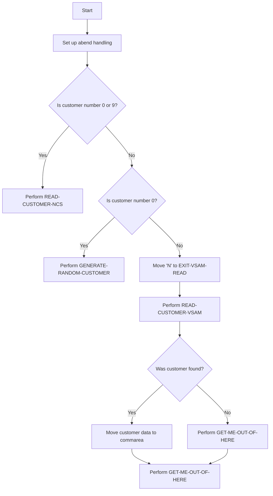

This document will cover the INQCUST program. We'll cover:

1. What the Program Does
2. Program Flow
3. Program Sections

## What the Program Does

The INQCUST program takes a customer number as input and returns a communication area (commarea) containing all the customer information for that record. If the customer is found, the customer data is returned; otherwise, a record set to low values is returned. If any problem occurs, an appropriate abend (abnormal end) is issued.

## Program Flow

This is a visualization of the flow:



<SwmSnippet path="/src/base/cobol_src/INQCUST.cbl" line="165">

---

### PREMIERE SECTION

First, the program sets up abend handling and initializes some variables. It then checks if the incoming customer number is set to <SwmToken path="src/base/cobol_src/INQCUST.cbl" pos="181:17:19" line-data="      *    Is the incoming CUSTOMER number set to 0&#39;s, 9&#39;s or">`0's`</SwmToken> or <SwmToken path="src/base/cobol_src/INQCUST.cbl" pos="181:22:24" line-data="      *    Is the incoming CUSTOMER number set to 0&#39;s, 9&#39;s or">`9's`</SwmToken>. If so, it performs the <SwmToken path="src/base/cobol_src/INQCUST.cbl" pos="246:1:5" line-data="       READ-CUSTOMER-NCS SECTION.">`READ-CUSTOMER-NCS`</SwmToken> section to retrieve the last customer number in use.

```cobol
       PROCEDURE DIVISION USING DFHCOMMAREA.
       PREMIERE SECTION.
       P010.
      *
      *    Set up abend handling
      *
           EXEC CICS HANDLE ABEND
              LABEL(ABEND-HANDLING)
           END-EXEC.

           MOVE 'N' TO INQCUST-INQ-SUCCESS
           MOVE '0' TO INQCUST-INQ-FAIL-CD

           MOVE SORTCODE TO REQUIRED-SORT-CODE.
           MOVE INQCUST-CUSTNO TO REQUIRED-CUST-NUMBER.
      *
      *    Is the incoming CUSTOMER number set to 0's, 9's or
      *    an actual value?
      *
      *    If the incoming CUSTOMER number is 0's (random
      *    customer) or the incoming CUSTOMER number is 9's
```

---

</SwmSnippet>

<SwmSnippet path="/src/base/cobol_src/INQCUST.cbl" line="200">

---

Next, if the customer number is 0, it performs the <SwmToken path="src/base/cobol_src/INQCUST.cbl" pos="205:3:7" line-data="              PERFORM GENERATE-RANDOM-CUSTOMER">`GENERATE-RANDOM-CUSTOMER`</SwmToken> section to generate a random customer number. It then moves 'N' to <SwmToken path="src/base/cobol_src/INQCUST.cbl" pos="208:9:13" line-data="           MOVE &#39;N&#39; TO EXIT-VSAM-READ.">`EXIT-VSAM-READ`</SwmToken> and performs the <SwmToken path="src/base/cobol_src/INQCUST.cbl" pos="215:3:7" line-data="           PERFORM READ-CUSTOMER-VSAM">`READ-CUSTOMER-VSAM`</SwmToken> section until <SwmToken path="src/base/cobol_src/INQCUST.cbl" pos="208:9:13" line-data="           MOVE &#39;N&#39; TO EXIT-VSAM-READ.">`EXIT-VSAM-READ`</SwmToken> is 'Y'. If the customer is found, it moves the customer data to the commarea.

```cobol
      * For a random customer generate a CUSTOMER number
      * randomly which is less than the highest CUSTOMER
      * number that is currently in use.
      *
           IF INQCUST-CUSTNO = 0000000000
              PERFORM GENERATE-RANDOM-CUSTOMER
              MOVE RANDOM-CUSTOMER TO REQUIRED-CUST-NUMBER
           END-IF.
           MOVE 'N' TO EXIT-VSAM-READ.
           MOVE 'N' TO EXIT-DB2-READ.
           MOVE 'N' TO WS-D-RETRIED.
           MOVE 'N' TO WS-V-RETRIED.
      *
      *          Get the customer information
      *
           PERFORM READ-CUSTOMER-VSAM
             UNTIL EXIT-VSAM-READ = 'Y'.
      *
      * Return the CUSTOMER data in the commarea.
      *
           IF INQCUST-INQ-SUCCESS = 'Y'
```

---

</SwmSnippet>

<SwmSnippet path="/src/base/cobol_src/INQCUST.cbl" line="246">

---

### <SwmToken path="src/base/cobol_src/INQCUST.cbl" pos="246:1:5" line-data="       READ-CUSTOMER-NCS SECTION.">`READ-CUSTOMER-NCS`</SwmToken> SECTION

This section retrieves the last customer number in use by performing the <SwmToken path="src/base/cobol_src/INQCUST.cbl" pos="251:3:9" line-data="           PERFORM GET-LAST-CUSTOMER-VSAM">`GET-LAST-CUSTOMER-VSAM`</SwmToken> section. If successful, it moves the required customer number to <SwmToken path="src/base/cobol_src/INQCUST.cbl" pos="253:11:17" line-data="             MOVE REQUIRED-CUST-NUMBER2 TO NCS-CUST-NO-VALUE">`NCS-CUST-NO-VALUE`</SwmToken>.

```cobol
       READ-CUSTOMER-NCS SECTION.
       RCN010.
      *
      *    Retrieve the last CUSTOMER number in use
      *
           PERFORM GET-LAST-CUSTOMER-VSAM
           IF INQCUST-INQ-SUCCESS = 'Y'
             MOVE REQUIRED-CUST-NUMBER2 TO NCS-CUST-NO-VALUE
           END-IF.
       RCN999.
           EXIT.
```

---

</SwmSnippet>

<SwmSnippet path="/src/base/cobol_src/INQCUST.cbl" line="258">

---

### <SwmToken path="src/base/cobol_src/INQCUST.cbl" pos="258:1:5" line-data="       READ-CUSTOMER-VSAM SECTION.">`READ-CUSTOMER-VSAM`</SwmToken> SECTION

This section reads the VSAM customer file. If the read is successful, it sets <SwmToken path="src/base/cobol_src/INQCUST.cbl" pos="277:9:13" line-data="              MOVE &#39;Y&#39; TO EXIT-VSAM-READ">`EXIT-VSAM-READ`</SwmToken> and <SwmToken path="src/base/cobol_src/INQCUST.cbl" pos="278:9:13" line-data="              MOVE &#39;Y&#39; TO INQCUST-INQ-SUCCESS">`INQCUST-INQ-SUCCESS`</SwmToken> to 'Y'. If the customer is not found and the incoming customer number is 0, it retries generating a random customer number. If the customer is not found and the incoming customer number is 9, it performs the <SwmToken path="src/base/cobol_src/INQCUST.cbl" pos="251:3:9" line-data="           PERFORM GET-LAST-CUSTOMER-VSAM">`GET-LAST-CUSTOMER-VSAM`</SwmToken> section again. If the customer is still not found, it initializes the output record and sets <SwmToken path="src/base/cobol_src/INQCUST.cbl" pos="278:9:13" line-data="              MOVE &#39;Y&#39; TO INQCUST-INQ-SUCCESS">`INQCUST-INQ-SUCCESS`</SwmToken> to 'N'. If any other error occurs, it reports the error and abends.

```cobol
       READ-CUSTOMER-VSAM SECTION.
       RCV010.
      *
      *    Read the VSAM CUSTOMER file
      *
           INITIALIZE OUTPUT-DATA.

           EXEC CICS READ FILE('CUSTOMER')
                RIDFLD(CUSTOMER-KY)
                INTO(OUTPUT-DATA)
                RESP(WS-CICS-RESP)
                RESP2(WS-CICS-RESP2)
           END-EXEC.

      *
      *    Check that the READ was successful. If it was
      *    exit this loop
      *
           IF WS-CICS-RESP = DFHRESP(NORMAL)
              MOVE 'Y' TO EXIT-VSAM-READ
              MOVE 'Y' TO INQCUST-INQ-SUCCESS
```

---

</SwmSnippet>

<SwmSnippet path="/src/base/cobol_src/INQCUST.cbl" line="428">

---

### <SwmToken path="src/base/cobol_src/INQCUST.cbl" pos="428:1:9" line-data="       GET-ME-OUT-OF-HERE SECTION.">`GET-ME-OUT-OF-HERE`</SwmToken> SECTION

This section finishes the program by executing a CICS RETURN command.

```cobol
       GET-ME-OUT-OF-HERE SECTION.
       GMOFH010.
      *
      *    Finish
      *
           EXEC CICS RETURN
           END-EXEC.

       GMOFH999.
           EXIT.
```

---

</SwmSnippet>

<SwmSnippet path="/src/base/cobol_src/INQCUST.cbl" line="440">

---

### <SwmToken path="src/base/cobol_src/INQCUST.cbl" pos="440:1:3" line-data="       ABEND-HANDLING SECTION.">`ABEND-HANDLING`</SwmToken> SECTION

This section handles abends by evaluating the abend code and taking appropriate actions. For certain VSAM RLS abends, it performs a SYNCPOINT ROLLBACK and reports the issue. If the abend is not handled, it performs a CICS ABEND command.

```cobol
       ABEND-HANDLING SECTION.
       AH010.
      *
      * How ABENDs are dealt with
      *
           EXEC CICS ASSIGN
              ABCODE(MY-ABEND-CODE)
           END-EXEC.

      *    Evaluate the Abend code that is returned
      *    for DB2 AD2Z ... provide some diagnostics,
      *    for VSAM RLS abends: AFCR, AFCS and AFCT record the
      *    abend as happening but do not abend ... leave this to
      *    CPSM WLM "Storm drain" (Abend probability) to handle.
      *    If not a "storm drain" ... take the abend afterwards
      *
           EVALUATE MY-ABEND-CODE


      *
      *      VSAM RLS abends, subject to CPSM WLM Storm Drain check
```

---

</SwmSnippet>

<SwmSnippet path="/src/base/cobol_src/INQCUST.cbl" line="564">

---

### <SwmToken path="src/base/cobol_src/INQCUST.cbl" pos="564:1:7" line-data="       GET-LAST-CUSTOMER-VSAM SECTION.">`GET-LAST-CUSTOMER-VSAM`</SwmToken> SECTION

This section retrieves the last customer number in use on the VSAM customer file. It performs a STARTBR command to start browsing the file and a READPREV command to read the previous record. If successful, it sets <SwmToken path="src/base/cobol_src/INQCUST.cbl" pos="175:9:13" line-data="           MOVE &#39;N&#39; TO INQCUST-INQ-SUCCESS">`INQCUST-INQ-SUCCESS`</SwmToken> to 'Y'.

```cobol
       GET-LAST-CUSTOMER-VSAM SECTION.
       GLCV010.
      *
      *    Retrieves the last customer number in use on the
      *    CUSTOMER file
      *
           INITIALIZE OUTPUT-DATA.

           MOVE HIGH-VALUES TO CUSTOMER-KY2.

           EXEC CICS STARTBR FILE('CUSTOMER')
                RIDFLD(CUSTOMER-KY2)
                RESP(WS-CICS-RESP)
                RESP2(WS-CICS-RESP2)
           END-EXEC.

           IF WS-CICS-RESP = DFHRESP(SYSIDERR)
              PERFORM VARYING SYSIDERR-RETRY FROM 1 BY 1
              UNTIL SYSIDERR-RETRY > 100
              OR WS-CICS-RESP = DFHRESP(NORMAL)
              OR WS-CICS-RESP IS NOT EQUAL TO DFHRESP(SYSIDERR)
```

---

</SwmSnippet>

<SwmSnippet path="/src/base/cobol_src/INQCUST.cbl" line="675">

---

### <SwmToken path="src/base/cobol_src/INQCUST.cbl" pos="675:1:5" line-data="       POPULATE-TIME-DATE SECTION.">`POPULATE-TIME-DATE`</SwmToken> SECTION

This section populates the current date and time using CICS ASKTIME and FORMATTIME commands.

```cobol
       POPULATE-TIME-DATE SECTION.
       PTD010.

           EXEC CICS ASKTIME
              ABSTIME(WS-U-TIME)
           END-EXEC.

           EXEC CICS FORMATTIME
                     ABSTIME(WS-U-TIME)
                     DDMMYYYY(WS-ORIG-DATE)
                     TIME(WS-TIME-NOW)
                     DATESEP
           END-EXEC.

       PTD999.
           EXIT.
```

---

</SwmSnippet>

<SwmSnippet path="/src/base/cobol_src/INQCUST.cbl" line="693">

---

### <SwmToken path="src/base/cobol_src/INQCUST.cbl" pos="695:1:5" line-data="       GENERATE-RANDOM-CUSTOMER SECTION.">`GENERATE-RANDOM-CUSTOMER`</SwmToken> SECTION

This section generates a random customer number by computing a random value based on the last customer number in use.

```cobol
      * Generate a random customer number
      *
       GENERATE-RANDOM-CUSTOMER SECTION.
       GRC010.
           MOVE ZERO TO INQCUST-RETRY.
           COMPUTE RANDOM-CUSTOMER = ((NCS-CUST-NO-VALUE - 1)
                                     * FUNCTION RANDOM(EIBTASKN)) + 1.
       GRC999.
           EXIT.
```

---

</SwmSnippet>

<SwmSnippet path="/src/base/cobol_src/INQCUST.cbl" line="703">

---

### <SwmToken path="src/base/cobol_src/INQCUST.cbl" pos="705:1:7" line-data="       GENERATE-RANDOM-CUSTOMER-AGAIN SECTION.">`GENERATE-RANDOM-CUSTOMER-AGAIN`</SwmToken> SECTION

This section retries generating a random customer number if the previous attempt was unsuccessful.

```cobol
      * Generate a random customer number
      *
       GENERATE-RANDOM-CUSTOMER-AGAIN SECTION.
       GRCA10.
           ADD 1 TO INQCUST-RETRY GIVING INQCUST-RETRY.
           COMPUTE RANDOM-CUSTOMER = ((NCS-CUST-NO-VALUE - 1)
                                                * FUNCTION RANDOM) + 1.
        GRCA99.
            EXIT.
```

---

</SwmSnippet>

&nbsp;

*This is an auto-generated document by Swimm 🌊 and has not yet been verified by a human*

<SwmMeta version="3.0.0" repo-id="Z2l0aHViJTNBJTNBY2ljcy1iYW5raW5nLXNhbXBsZS1hcHBsaWNhdGlvbi1jYnNhLUlCTS1EZW1vLUdQVCUzQSUzQVN3aW1tLURlbW8=" repo-name="cics-banking-sample-application-cbsa-IBM-Demo-GPT"><sup>Powered by [Swimm](/)</sup></SwmMeta>
