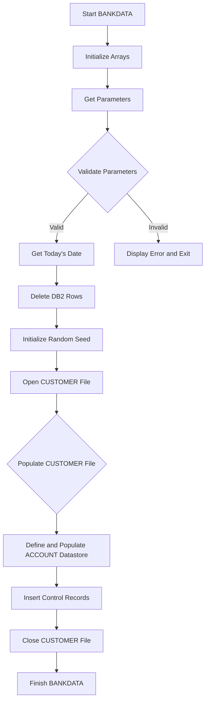

The BANKDATA program is a batch program designed to initialize data used in the bank application. This document will cover:

1. What the Program Does
2. Program Flow
3. Program Sections

## What the Program Does

The BANKDATA program initializes data for the bank application by populating the CUSTOMER (VSAM) and ACCOUNT <SwmToken path="src/base/cobol_src/BANKDATA.cbl" pos="18:3:4" line-data="      *              (DB2).                                            *">`(DB2`</SwmToken>) datastores. It generates customer and account records based on input parameters, which include the starting key, ending key, step for generation, and a random event seed. The program ensures that the generated data is consistent and valid, and it handles the deletion of existing data in the ACCOUNT and CONTROL tables before populating new data.

## Program Flow

This is a visualization of the flow:



<SwmSnippet path="/src/base/cobol_src/BANKDATA.cbl" line="368">

---

### PREMIERE SECTION

First, the program starts by displaying a message and initializing arrays. It then retrieves the input parameters and validates them. If the parameters are invalid, it displays an error message and exits.

```cobol
       PROCEDURE DIVISION USING PARM-BUFFER.
       PREMIERE SECTION.
       A010.
           MOVE 'Starting BANKDATA'
             to TIMESTAMP-FUNCTION
           perform TIMESTAMP

      *
      * Initialise the arrays
      *
      D    DISPLAY 'About to initialise arrays'.
           PERFORM INITIALISE-ARRAYS.


      *
      * Get the parameters
      *
           UNSTRING PARM(1:PARM-LENGTH)
                    DELIMITED BY SPACE OR ','
                    INTO START-KEY
                         END-KEY
```

---

</SwmSnippet>

<SwmSnippet path="/src/base/cobol_src/BANKDATA.cbl" line="410">

---

Next, the program gets today's date and stores it as an integer. It then deletes existing rows in the <SwmToken path="src/base/cobol_src/BANKDATA.cbl" pos="415:7:7" line-data="      * Delete the DB2 TABLE contents that match the SortCode">`DB2`</SwmToken> ACCOUNT table that match the sort code.

```cobol
      * Get today's date and store it as an INTEGER
      *
           PERFORM GET-TODAYS-DATE.

      *
      * Delete the DB2 TABLE contents that match the SortCode
      *
      D    DISPLAY 'About to delete DB2 rows'.

           PERFORM DELETE-DB2-ROWS.
      D    DISPLAY 'Back from delete DB2 rows'.
      *
```

---

</SwmSnippet>

<SwmSnippet path="/src/base/cobol_src/BANKDATA.cbl" line="424">

---

Then, the program initializes the random seed and opens the CUSTOMER file. If the file cannot be opened, it displays an error message and exits.

```cobol
      *    MOVE FUNCTION CURRENT-DATE TO RDATE.


      D    DISPLAY 'RANDOM SEED IS ' RANDOM-SEED-NUMERIC
           COMPUTE FORENAMES-PTR = FORENAMES-CNT *
                                   FUNCTION RANDOM(RANDOM-SEED-NUMERIC).
      D    DISPLAY 'FORENAMES-PTR IS ' FORENAMES-PTR.
           COMPUTE INITIALS-PTR =  INITIALS-CNT *
                                   FUNCTION RANDOM.
      D    DISPLAY 'INITIALS-PTR IS ' INITIALS-PTR
           COMPUTE SURNAMES-PTR  =  SURNAMES-CNT *
                                   FUNCTION RANDOM.
           COMPUTE TOWN-PTR  =  TOWN-COUNT *
                                   FUNCTION RANDOM.
           COMPUTE STREET-NAME-R-PTR =  STREET-NAME-R-CNT *
                                   FUNCTION RANDOM.
           COMPUTE STREET-NAME-T-PTR =  STREET-NAME-T-CNT *
                                   FUNCTION RANDOM.
           COMPUTE ACCOUNT-TYPES-PTR = ACCOUNT-TYPES-COUNT *
                                   FUNCTION RANDOM.

```

---

</SwmSnippet>

<SwmSnippet path="/src/base/cobol_src/BANKDATA.cbl" line="459">

---

Going into the main processing loop, the program populates the CUSTOMER file by generating customer data and writing it to the file. It also generates related account data and populates the ACCOUNT datastore.

```cobol
      * Populate the CUSTOMER file
      *
           MOVE 'Populating Customer + Account files'
             to TIMESTAMP-FUNCTION
           perform TIMESTAMP
           MOVE ZERO TO COMMIT-COUNT
           MOVE ZERO TO LAST-CUSTOMER-NUMBER NUMBER-OF-CUSTOMERS
           MOVE ZERO TO LAST-ACCOUNT-NUMBER NUMBER-OF-ACCOUNTS
           PERFORM TEST BEFORE
                   VARYING NEXT-KEY FROM START-KEY BY STEP-KEY
                     UNTIL NEXT-KEY > END-KEY

               INITIALIZE CUSTOMER-RECORD IN CUSTOMER-RECORD-STRUCTURE

               SET CUSTOMER-EYECATCHER-VALUE TO TRUE

               MOVE NEXT-KEY TO CUSTOMER-NUMBER
               MOVE NEXT-KEY TO LAST-CUSTOMER-NUMBER
               ADD 1 TO NUMBER-OF-CUSTOMERS GIVING NUMBER-OF-CUSTOMERS

      D        DISPLAY 'Generating data for customer ' customer-number
```

---

</SwmSnippet>

<SwmSnippet path="/src/base/cobol_src/BANKDATA.cbl" line="588">

---

After populating the CUSTOMER file, the program writes a control record to the CUSTOMER datastore.

```cobol
           MOVE '000000' TO CUSTOMER-CONTROL-SORTCODE
           MOVE '9999999999' TO CUSTOMER-CONTROL-NUMBER
           SET CUSTOMER-CONTROL-EYECATCHER-V TO TRUE
      D    DISPLAY 'ABOUT TO WRITE CUSTOMER-CONTROL-RECORD'
           MOVE CUSTOMER-CONTROL-RECORD
             TO CUSTOMER-RECORD IN CUSTOMER-RECORD-STRUCTURE
           WRITE CUSTOMER-RECORD-STRUCTURE
           IF CUSTOMER-VSAM-STATUS NOT EQUAL '00' THEN
                   DISPLAY 'Error writing CUSTOMER-CONTROL-RECORD file'
                   ', status=' CUSTOMER-VSAM-STATUS
                   MOVE 12 TO RETURN-CODE
                   PERFORM PROGRAM-DONE
           END-IF.
```

---

</SwmSnippet>

<SwmSnippet path="/src/base/cobol_src/BANKDATA.cbl" line="606">

---

Next, the program inserts control records into the <SwmToken path="src/base/cobol_src/BANKDATA.cbl" pos="415:7:7" line-data="      * Delete the DB2 TABLE contents that match the SortCode">`DB2`</SwmToken> CONTROL table to store the last account number and the number of accounts generated.

```cobol
           MOVE SPACES TO HV-CONTROL-NAME
           MOVE LAST-ACCOUNT-NUMBER TO HV-CONTROL-VALUE-NUM
           MOVE SPACES TO HV-CONTROL-VALUE-STR
           STRING SORTCODE DELIMITED BY SIZE
           '-' DELIMITED BY SIZE
           'ACCOUNT-LAST' DELIMITED BY SIZE
           INTO HV-CONTROL-NAME
           EXEC SQL
              INSERT INTO CONTROL
                      (CONTROL_NAME,
                       CONTROL_VALUE_NUM,
                       CONTROL_VALUE_STR
                      )
              VALUES (:HV-CONTROL-NAME,
                      :HV-CONTROL-VALUE-NUM,
                      :HV-CONTROL-VALUE-STR
                     )
           END-EXEC.

           IF SQLCODE IS NOT EQUAL TO ZERO
             MOVE SQLCODE TO WS-SQLCODE-DISPLAY
```

---

</SwmSnippet>

<SwmSnippet path="/src/base/cobol_src/BANKDATA.cbl" line="667">

---

Finally, the program closes the CUSTOMER file and displays a finishing message.

```cobol
      *** Close the files
      *
           CLOSE CUSTOMER-FILE.

           MOVE 'Finishing BANKDATA'
             to TIMESTAMP-FUNCTION
           perform TIMESTAMP.

       A999.
           EXIT.
```

---

</SwmSnippet>

<SwmSnippet path="/src/base/cobol_src/BANKDATA.cbl" line="691">

---

### <SwmToken path="src/base/cobol_src/BANKDATA.cbl" pos="691:1:3" line-data="       DEFINE-ACC SECTION.">`DEFINE-ACC`</SwmToken> SECTION

In this section, the program defines and populates the ACCOUNT datastore. It determines the number of accounts for each customer and populates the account records.

```cobol
       DEFINE-ACC SECTION.
       DA010.
      D    DISPLAY 'IN DEFINE-ACC SECTION'.

      *
      * Decide how many accounts this customer will have. To allow
      * for growth make it between 1 and 5 (max is 10 at the moment
      * this maximum is dictated by the alternate key index which is
      * currently set to 10).
      *
           COMPUTE NO-OF-ACCOUNTS =  ((5 - 1)
                                        * FUNCTION RANDOM) + 1
      D    DISPLAY 'Creating accounts ' NO-OF-ACCOUNTS
           PERFORM POPULATE-ACC VARYING WS-CNT FROM 1 BY 1
               UNTIL WS-CNT > NO-OF-ACCOUNTS.
           EXEC SQL
             COMMIT WORK
           END-EXEC.

       DA999.
           EXIT.
```

---

</SwmSnippet>

<SwmSnippet path="/src/base/cobol_src/BANKDATA.cbl" line="716">

---

### <SwmToken path="src/base/cobol_src/BANKDATA.cbl" pos="716:1:3" line-data="       POPULATE-ACC SECTION.">`POPULATE-ACC`</SwmToken> SECTION

Now, the program generates account data, ensuring that the account open date is valid. It then inserts the account records into the ACCOUNT table and checks for any SQL errors.

```cobol
       POPULATE-ACC SECTION.
       PA010.

      *
      * Generate the account open date but it MUST be after
      * the DOB (otherwise that would just be silly)
      *
           MOVE 0 TO HV-ACCOUNT-OPENED-DAY
                     HV-ACCOUNT-OPENED-MONTH
                     HV-ACCOUNT-OPENED-YEAR
           MOVE 0 TO OPENED-DATE-ATTEMPTS
      D    DISPLAY 'About to generate opened date'
           MOVE 'N' TO OPENED-DATE-VALID
           PERFORM GENERATE-OPENED-DATE
                   UNTIL OPENED-DATE-VALID = 'Y'.
      D    DISPLAY 'Back from generate opened date after '
      D    OPENED-DATE-ATTEMPTS ' goes'


      *
```

---

</SwmSnippet>

<SwmSnippet path="/src/base/cobol_src/BANKDATA.cbl" line="930">

---

### <SwmToken path="src/base/cobol_src/BANKDATA.cbl" pos="930:1:3" line-data="       INITIALISE-ARRAYS SECTION.">`INITIALISE-ARRAYS`</SwmToken> SECTION

This section initializes various arrays used in the program, such as forenames, surnames, street names, towns, account types, interest rates, and overdraft limits.

```cobol
       INITIALISE-ARRAYS SECTION.
       IA010.

           MOVE TITLE-ALPHABET TO TITLE-WORDS.

           MOVE 50 TO FORENAMES-CNT.

           MOVE 'Michael' TO FORENAME(01).
           MOVE 'Will'    TO FORENAME(02).
           MOVE 'Geoff'   TO FORENAME(03).
           MOVE 'Chris'   TO FORENAME(04).
           MOVE 'Dave'    TO FORENAME(05).
           MOVE 'Luke'    TO FORENAME(06).
           MOVE 'Adam'    TO FORENAME(07).
           MOVE 'Giuseppe' TO FORENAME(08).
           MOVE 'James'   TO FORENAME(09).
           MOVE 'Jon'     TO FORENAME(10).
           MOVE 'Andy'    TO FORENAME(11).
           MOVE 'Lou'     TO FORENAME(12).
           MOVE 'Robert'  TO FORENAME(13).
           MOVE 'Sam'     TO FORENAME(14).
```

---

</SwmSnippet>

<SwmSnippet path="/src/base/cobol_src/BANKDATA.cbl" line="1183">

---

### <SwmToken path="src/base/cobol_src/BANKDATA.cbl" pos="1183:1:5" line-data="       DELETE-DB2-ROWS SECTION.">`DELETE-DB2-ROWS`</SwmToken> SECTION

In this section, the program deletes rows from the ACCOUNT and CONTROL tables in the <SwmToken path="src/base/cobol_src/BANKDATA.cbl" pos="1183:3:3" line-data="       DELETE-DB2-ROWS SECTION.">`DB2`</SwmToken> database that match the sort code. It checks for SQL errors and handles them appropriately.

```cobol
       DELETE-DB2-ROWS SECTION.
       DBR010.
      *
      * Delete the ACCOUNT table data
      *
           MOVE SORTCODE TO HV-ACCOUNT-SORT-CODE.
           MOVE 'Deleting from ACCOUNT table'
             to TIMESTAMP-FUNCTION
           perform TIMESTAMP
           EXEC SQL
              DELETE FROM ACCOUNT
              WHERE ACCOUNT_SORTCODE = :HV-ACCOUNT-SORT-CODE
           END-EXEC.


      *
      * Check the SQL code if it was NOT OK (0) or NOTFND (+100)
      * then abend
      *
           MOVE 'Deleting from ACCOUNT table COMPLETE'
             to TIMESTAMP-FUNCTION
```

---

</SwmSnippet>

<SwmSnippet path="/src/base/cobol_src/BANKDATA.cbl" line="1392">

---

### <SwmToken path="src/base/cobol_src/BANKDATA.cbl" pos="1392:1:5" line-data="       GET-TODAYS-DATE SECTION.">`GET-TODAYS-DATE`</SwmToken> SECTION

This section retrieves today's date and stores it as an integer for use in date calculations.

```cobol
       GET-TODAYS-DATE SECTION.
       GTD010.
      D    DISPLAY 'IN GET-TODAYS-DATE SECTION'.

           MOVE FUNCTION CURRENT-DATE TO WS-CURRENT-DATE-DATA.

           MOVE WS-CURRENT-DATE-DATA (1:8) TO WS-CURRENT-DATE-9.

           COMPUTE WS-TODAY-INT =
              FUNCTION INTEGER-OF-DATE (WS-CURRENT-DATE-9).

       GTD999.
           EXIT.
```

---

</SwmSnippet>

&nbsp;

*This is an auto-generated document by Swimm 🌊 and has not yet been verified by a human*

<SwmMeta version="3.0.0" repo-id="Z2l0aHViJTNBJTNBY2ljcy1iYW5raW5nLXNhbXBsZS1hcHBsaWNhdGlvbi1jYnNhLUlCTS1EZW1vLUdQVCUzQSUzQVN3aW1tLURlbW8=" repo-name="cics-banking-sample-application-cbsa-IBM-Demo-GPT"><sup>Powered by [Swimm](/)</sup></SwmMeta>
