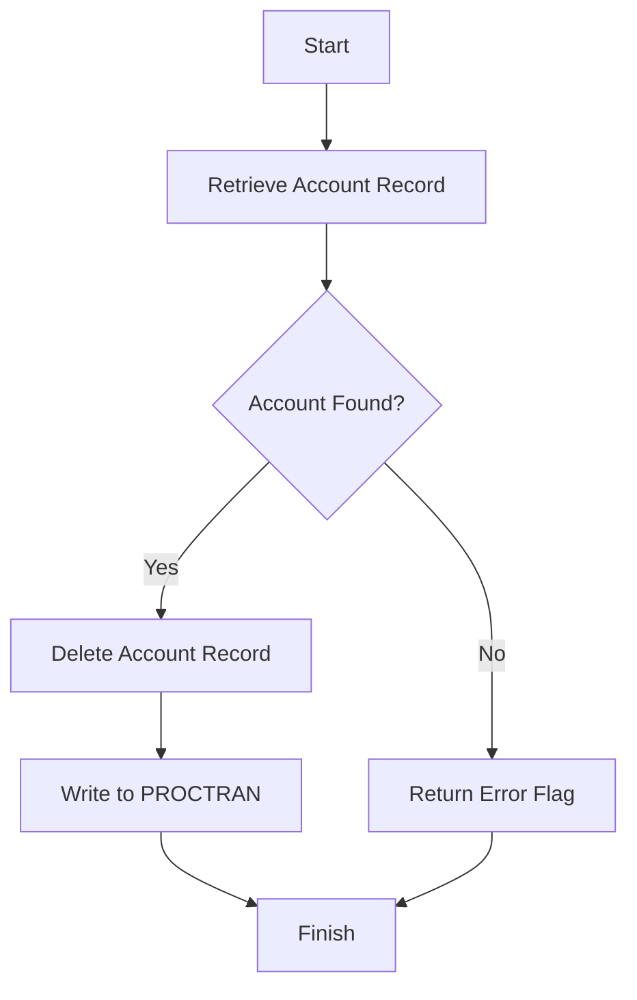

This document will cover the DELACC program. We'll cover:

1. What the Program Does
2. Program Flow
3. Program Sections

## What the Program Does

The DELACC program is designed to delete an account record from the datastore based on an incoming account number, customer number, and account type. The program retrieves the account record matching the provided details and deletes it. If no matching record is found, it returns an error flag. In case of any issues, the program will abend. The program assumes that the incoming customer number is valid.

## Program Flow

This is a visualization of the flow:



<SwmSnippet path="/src/base/cobol_src/DELACC.cbl" line="203">

---

### PREMIERE SECTION

First, the program initializes the required variables and performs the <SwmToken path="src/base/cobol_src/DELACC.cbl" pos="212:3:7" line-data="           PERFORM READ-ACCOUNT-DB2.">`READ-ACCOUNT-DB2`</SwmToken> section to retrieve the account record from the datastore. If a matching account record is found, it proceeds to delete the account by performing the <SwmToken path="src/base/cobol_src/DELACC.cbl" pos="220:3:7" line-data="             PERFORM DEL-ACCOUNT-DB2">`DEL-ACCOUNT-DB2`</SwmToken> section. If the deletion is successful, it then performs the <SwmToken path="src/base/cobol_src/DELACC.cbl" pos="222:3:5" line-data="               PERFORM WRITE-PROCTRAN">`WRITE-PROCTRAN`</SwmToken> section to log the transaction.

```cobol
       PROCEDURE DIVISION USING DFHCOMMAREA.
       PREMIERE SECTION.
       A010.

           MOVE SORTCODE TO REQUIRED-SORT-CODE OF ACCOUNT-KEY-RID.

      *
      *          Get the account record
      *
           PERFORM READ-ACCOUNT-DB2.

      *
      *          If a matching account record was successfully
      *          retrieved then delete it
      *
           IF DELACC-DEL-SUCCESS = 'Y'

             PERFORM DEL-ACCOUNT-DB2
             IF DELACC-DEL-SUCCESS = 'Y'
               PERFORM WRITE-PROCTRAN
             END-IF
```

---

</SwmSnippet>

<SwmSnippet path="/src/base/cobol_src/DELACC.cbl" line="236">

---

### <SwmToken path="src/base/cobol_src/DELACC.cbl" pos="236:1:5" line-data="       READ-ACCOUNT-DB2 SECTION.">`READ-ACCOUNT-DB2`</SwmToken> SECTION

Next, the program retrieves the account record from the <SwmToken path="src/base/cobol_src/DELACC.cbl" pos="236:5:5" line-data="       READ-ACCOUNT-DB2 SECTION.">`DB2`</SwmToken> datastore using the provided account number and sort code. If the account is not found, it sets an error flag and exits. If the account is found, it sets the success flag and prepares the account data for further processing.

```cobol
       READ-ACCOUNT-DB2 SECTION.
       RAD010.

      *
      *    Take the Account number from the comm area and retrieve
      *    the account record from the datastore.
      *
           MOVE DELACC-ACCNO
              TO HV-ACCOUNT-ACC-NO.

           MOVE SORTCODE TO HV-ACCOUNT-SORTCODE.

           EXEC SQL
              SELECT ACCOUNT_EYECATCHER,
                     ACCOUNT_CUSTOMER_NUMBER,
                     ACCOUNT_SORTCODE,
                     ACCOUNT_NUMBER,
                     ACCOUNT_TYPE,
                     ACCOUNT_INTEREST_RATE,
                     ACCOUNT_OPENED,
                     ACCOUNT_OVERDRAFT_LIMIT,
```

---

</SwmSnippet>

<SwmSnippet path="/src/base/cobol_src/DELACC.cbl" line="431">

---

### <SwmToken path="src/base/cobol_src/DELACC.cbl" pos="431:1:5" line-data="       DEL-ACCOUNT-DB2 SECTION.">`DEL-ACCOUNT-DB2`</SwmToken> SECTION

Then, the program deletes the account record from the <SwmToken path="src/base/cobol_src/DELACC.cbl" pos="431:5:5" line-data="       DEL-ACCOUNT-DB2 SECTION.">`DB2`</SwmToken> datastore where the sort code and account number match. If the deletion fails, it sets an error flag.

```cobol
       DEL-ACCOUNT-DB2 SECTION.
       DADB010.

      *
      *    Delete the ACCOUNT row where the SORTCODE and ACCOUNT
      *    NUMBER match.
      *
           EXEC SQL
              DELETE FROM ACCOUNT
              WHERE ACCOUNT_SORTCODE = :HV-ACCOUNT-SORTCODE AND
                    ACCOUNT_NUMBER = :HV-ACCOUNT-ACC-NO
           END-EXEC.

           IF SQLCODE NOT = 0
              MOVE ' ' TO DELACC-SUCCESS
              MOVE 'N' TO DELACC-DEL-SUCCESS
              MOVE '3' TO DELACC-DEL-FAIL-CD
           END-IF.

       DADB999.
           EXIT.
```

---

</SwmSnippet>

<SwmSnippet path="/src/base/cobol_src/DELACC.cbl" line="454">

---

### <SwmToken path="src/base/cobol_src/DELACC.cbl" pos="454:1:3" line-data="       WRITE-PROCTRAN SECTION.">`WRITE-PROCTRAN`</SwmToken> SECTION

Going into the <SwmToken path="src/base/cobol_src/DELACC.cbl" pos="454:1:3" line-data="       WRITE-PROCTRAN SECTION.">`WRITE-PROCTRAN`</SwmToken> section, the program logs the transaction details into the PROCTRAN datastore.

```cobol
       WRITE-PROCTRAN SECTION.
       WP010.

           PERFORM WRITE-PROCTRAN-DB2.
       WP999.
           EXIT.
```

---

</SwmSnippet>

<SwmSnippet path="/src/base/cobol_src/DELACC.cbl" line="462">

---

### <SwmToken path="src/base/cobol_src/DELACC.cbl" pos="462:1:5" line-data="       WRITE-PROCTRAN-DB2 SECTION.">`WRITE-PROCTRAN-DB2`</SwmToken> SECTION

Finally, the program inserts the transaction details into the PROCTRAN datastore. If the insertion fails, it abends the program.

```cobol
       WRITE-PROCTRAN-DB2 SECTION.
       WPD010.

      *
      *    If the DELETE of the account row was successful then record
      *    this on the PROCTRAN datastore.
      *
           INITIALIZE HOST-PROCTRAN-ROW.
           INITIALIZE WS-EIBTASKN12.

           MOVE 'PRTR' TO HV-PROCTRAN-EYECATCHER.
           MOVE ACCOUNT-SORT-CODE  TO HV-PROCTRAN-SORT-CODE.
           MOVE ACCOUNT-NUMBER     TO HV-PROCTRAN-ACC-NUMBER.
           MOVE EIBTASKN           TO WS-EIBTASKN12.
           MOVE WS-EIBTASKN12      TO HV-PROCTRAN-REF.

      *
      *    Populate the time and date
      *
           EXEC CICS ASKTIME
              ABSTIME(WS-U-TIME)
```

---

</SwmSnippet>

<SwmSnippet path="/src/base/cobol_src/DELACC.cbl" line="625">

---

### <SwmToken path="src/base/cobol_src/DELACC.cbl" pos="625:1:9" line-data="       GET-ME-OUT-OF-HERE SECTION.">`GET-ME-OUT-OF-HERE`</SwmToken> SECTION

The program concludes by performing the <SwmToken path="src/base/cobol_src/DELACC.cbl" pos="625:1:9" line-data="       GET-ME-OUT-OF-HERE SECTION.">`GET-ME-OUT-OF-HERE`</SwmToken> section, which executes the <SwmToken path="src/base/cobol_src/DELACC.cbl" pos="628:1:1" line-data="           GOBACK.">`GOBACK`</SwmToken> statement to return control to the calling program.

```cobol
       GET-ME-OUT-OF-HERE SECTION.
       GMOFH010.

           GOBACK.

```

---

</SwmSnippet>

&nbsp;

*This is an auto-generated document by Swimm 🌊 and has not yet been verified by a human*

<SwmMeta version="3.0.0" repo-id="Z2l0aHViJTNBJTNBY2ljcy1iYW5raW5nLXNhbXBsZS1hcHBsaWNhdGlvbi1jYnNhLUlCTS1EZW1vLUdQVCUzQSUzQVN3aW1tLURlbW8=" repo-name="cics-banking-sample-application-cbsa-IBM-Demo-GPT"><sup>Powered by [Swimm](/)</sup></SwmMeta>
