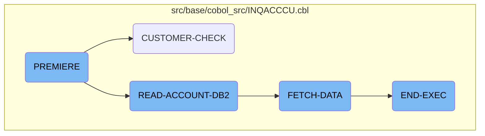
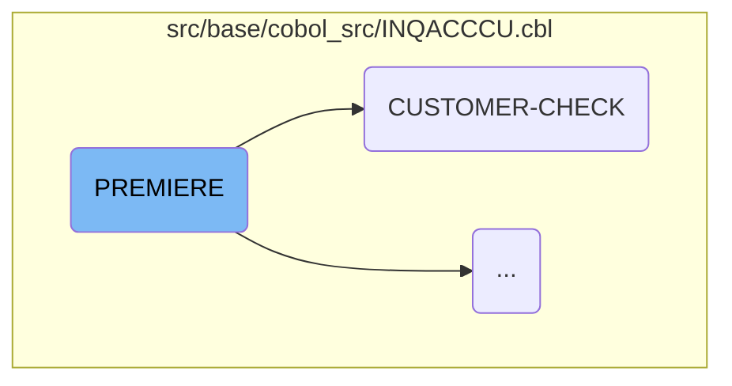
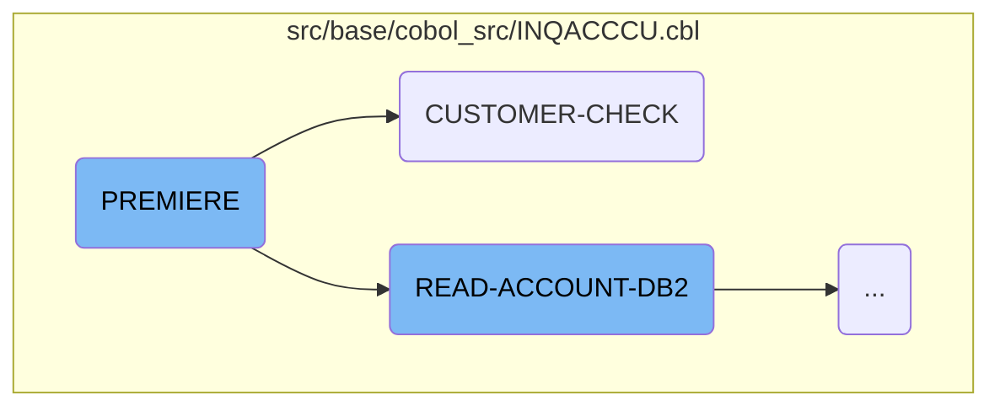
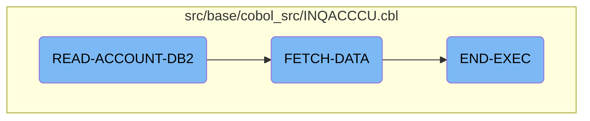

The document introduces the flow of fetching customer accounts in the CICS Bank Sample Application (CBSA).

Here is a high level diagram of the flow, showing only the most important functions:



# Flow drill down

First, we'll zoom into this section of the flow:



<SwmSnippet path="/src/base/cobol_src/INQACCCU.cbl" line="194">

---

The <SwmToken path="/src/base/cobol_src/INQACCCU.cbl" pos="194:1:1" line-data="       PREMIERE SECTION.">`PREMIERE`</SwmToken> section is used to check if the customer exists and to retrieve the customer information. It first sets the success and failure codes to <SwmToken path="/src/base/cobol_src/INQACCCU.cbl" pos="196:4:4" line-data="           MOVE &#39;N&#39; TO COMM-SUCCESS">`N`</SwmToken> and <SwmToken path="/src/base/cobol_src/INQACCCU.cbl" pos="197:4:4" line-data="           MOVE &#39;0&#39; TO COMM-FAIL-CODE">`0`</SwmToken> respectively. It then performs the customer check and if a matching customer is not found, it sets the success and failure codes to <SwmToken path="/src/base/cobol_src/INQACCCU.cbl" pos="196:4:4" line-data="           MOVE &#39;N&#39; TO COMM-SUCCESS">`N`</SwmToken> and <SwmToken path="/src/base/cobol_src/INQACCCU.cbl" pos="217:4:4" line-data="              MOVE &#39;1&#39; TO COMM-FAIL-CODE">`1`</SwmToken> respectively. If a matching customer is found, it then performs the read account database function and returns the account data to the <SwmToken path="/src/base/cobol_src/INQACCCU.cbl" pos="224:15:15" line-data="      * Return the ACCOUNT data to the COMMAREA">`COMMAREA`</SwmToken>.

```cobol
       PREMIERE SECTION.
       A010.
           MOVE 'N' TO COMM-SUCCESS
           MOVE '0' TO COMM-FAIL-CODE

           EXEC CICS HANDLE ABEND
              LABEL(ABEND-HANDLING)
           END-EXEC.

           MOVE SORTCODE TO REQUIRED-SORT-CODE OF CUSTOMER-KY.

      *
      *    CUSTOMER-CHECK LINKS to program INQCUST to retrieve the
      *    customer information.
      *

           PERFORM CUSTOMER-CHECK.

      *
      *    If a  matching customer was not returned then set fail flags
      *
```

---

</SwmSnippet>

<SwmSnippet path="/src/base/cobol_src/INQACCCU.cbl" line="829">

---

The <SwmToken path="/src/base/cobol_src/INQACCCU.cbl" pos="829:1:3" line-data="       CUSTOMER-CHECK SECTION.">`CUSTOMER-CHECK`</SwmToken> function is used to check if the customer exists. It first sets the customer found flag to <SwmToken path="/src/base/cobol_src/INQACCCU.cbl" pos="836:4:4" line-data="              MOVE &#39;N&#39; TO CUSTOMER-FOUND">`N`</SwmToken>. It then performs a CICS HANDLE ABEND and then ends the execution. It then sets the required sort code to the sort code and then performs the customer check. If the customer is found, it sets the customer found flag to 'Y'.

```cobol
       CUSTOMER-CHECK SECTION.
       CC010.
      *
      *    Retrieve customer information by linking to INQCUST
      *

           IF CUSTOMER-NUMBER IN DFHCOMMAREA = ZERO
              MOVE 'N' TO CUSTOMER-FOUND
              MOVE ZERO TO NUMBER-OF-ACCOUNTS
              GO TO CC999
           END-IF.

           IF CUSTOMER-NUMBER IN DFHCOMMAREA = '9999999999'
              MOVE 'N' TO CUSTOMER-FOUND
              MOVE ZERO TO NUMBER-OF-ACCOUNTS
              GO TO CC999
           END-IF.

           INITIALIZE INQCUST-COMMAREA.

           MOVE CUSTOMER-NUMBER IN DFHCOMMAREA TO INQCUST-CUSTNO.
```

---

</SwmSnippet>

Now, lets zoom into this section of the flow:



After performing <SwmToken path="/src/base/cobol_src/INQACCCU.cbl" pos="829:1:3" line-data="       CUSTOMER-CHECK SECTION.">`CUSTOMER-CHECK`</SwmToken>, in case it was succesasful, <SwmToken path="/src/base/cobol_src/INQACCCU.cbl" pos="194:1:1" line-data="       PREMIERE SECTION.">`PREMIERE`</SwmToken> moves on to perform <SwmToken path="/src/base/cobol_src/INQACCCU.cbl" pos="233:1:5" line-data="       READ-ACCOUNT-DB2 SECTION.">`READ-ACCOUNT-DB2`</SwmToken>.

<SwmSnippet path="/src/base/cobol_src/INQACCCU.cbl" line="233">

---

The <SwmToken path="/src/base/cobol_src/INQACCCU.cbl" pos="233:1:5" line-data="       READ-ACCOUNT-DB2 SECTION.">`READ-ACCOUNT-DB2`</SwmToken>  function is used to get accounts from the account datastore by opening a <SwmToken path="/src/base/cobol_src/INQACCCU.cbl" pos="233:5:5" line-data="       READ-ACCOUNT-DB2 SECTION.">`DB2`</SwmToken> cursor and retrieving the associated account records matching the customer number and sort code.

```cobol
       READ-ACCOUNT-DB2 SECTION.
       RAD010.
      *
      *    Get accounts from account datastore
      *

      *
      *    Open the DB2 CURSOR
      *

           MOVE CUSTOMER-NUMBER IN DFHCOMMAREA TO HV-ACCOUNT-CUST-NO.
           MOVE  SORTCODE TO HV-ACCOUNT-SORTCODE.

           EXEC SQL OPEN
              ACC-CURSOR
           END-EXEC.

           MOVE SQLCODE TO SQLCODE-DISPLAY.

           IF SQLCODE NOT = 0
              MOVE SQLCODE TO SQLCODE-DISPLAY
```

---

</SwmSnippet>

Now, let's zoom into this section of the flow:



<SwmSnippet path="/src/base/cobol_src/INQACCCU.cbl" line="454">

---

The <SwmToken path="/src/base/cobol_src/INQACCCU.cbl" pos="454:1:3" line-data="       FETCH-DATA SECTION.">`FETCH-DATA`</SwmToken> function is responsible for fetching each account in turn and storing the data until there are no more rows to process. It also handles any errors that may occur during the fetch process.

```cobol
       FETCH-DATA SECTION.
       FD010.
      *
      *    Fetch each account in turn, & store data until there are no
      *    more rows to process. (There is a maximum of 20 accounts per
      *    customer).
      *
           MOVE ZERO TO NUMBER-OF-ACCOUNTS.

           PERFORM UNTIL SQLCODE NOT = 0 OR
           NUMBER-OF-ACCOUNTS = 20

              EXEC SQL FETCH FROM ACC-CURSOR
              INTO :HV-ACCOUNT-EYECATCHER,
                   :HV-ACCOUNT-CUST-NO,
                   :HV-ACCOUNT-SORTCODE,
                   :HV-ACCOUNT-ACC-NO,
                   :HV-ACCOUNT-ACC-TYPE,
                   :HV-ACCOUNT-INT-RATE,
                   :HV-ACCOUNT-OPENED,
                   :HV-ACCOUNT-OVERDRAFT-LIM,
```

---

</SwmSnippet>

&nbsp;

*This is an auto-generated document by Swimm AI 🌊 and has not yet been verified by a human*

<SwmMeta version="3.0.0" repo-id="Z2l0aHViJTNBJTNBY2ljcy1iYW5raW5nLXNhbXBsZS1hcHBsaWNhdGlvbi1jYnNhLUlCTS1EZW1vJTNBJTNBU3dpbW0tRGVtbw==" repo-name="cics-banking-sample-application-cbsa"><sup>Powered by [Swimm](https://app.swimm.io/)</sup></SwmMeta>
