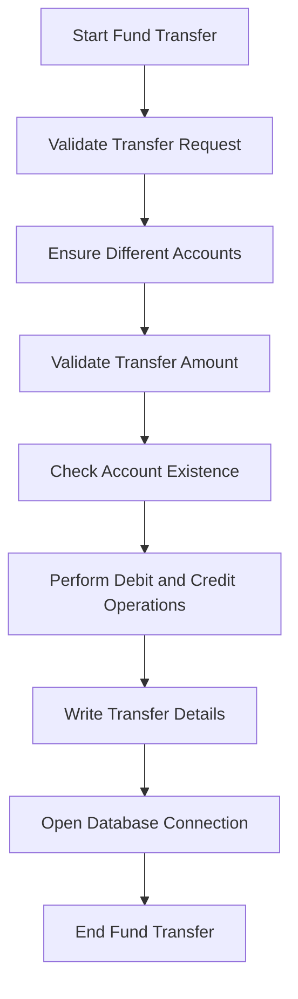

The process of transferring funds between accounts within the same bank involves several steps to ensure the security and accuracy of the transaction. This document will cover:

1. Validating the transfer request
2. Ensuring different accounts
3. Validating transfer amount
4. Checking account existence
5. Performing debit and credit operations
6. Writing transfer details
7. Opening database connection

Technical document: <SwmLink doc-title="Fund Transfer Process">[Fund Transfer Process](/.swm/fund-transfer-process.yg11wd78.sw.md)</SwmLink>

# [Validating the Transfer Request](https://app.swimm.io/repos/Z2l0aHViJTNBJTNBY2ljcy1iYW5raW5nLXNhbXBsZS1hcHBsaWNhdGlvbi1jYnNhLUlCTS1EZW1vLUdQVCUzQSUzQVN3aW1tLURlbW8=/docs/yg11wd78#validating-the-transfer-request)

The process begins by validating the transfer request. This involves checking the account number and the transfer amount. The system ensures that the account number is valid and the transfer amount is a positive number. This step is crucial to prevent any invalid or fraudulent transactions from proceeding.

# [Ensuring Different Accounts](https://app.swimm.io/repos/Z2l0aHViJTNBJTNBY2ljcy1iYW5raW5nLXNhbXBsZS1hcHBsaWNhdGlvbi1jYnNhLUlCTS1EZW1vLUdQVCUzQSUzQVN3aW1tLURlbW8=/docs/yg11wd78#ensuring-different-accounts)

Next, the system ensures that the source and target accounts are different. This is to prevent any errors or fraudulent activities where funds are transferred within the same account. If the source and target accounts are the same, an error response is generated, and the transfer process is halted.

# [Validating Transfer Amount](https://app.swimm.io/repos/Z2l0aHViJTNBJTNBY2ljcy1iYW5raW5nLXNhbXBsZS1hcHBsaWNhdGlvbi1jYnNhLUlCTS1EZW1vLUdQVCUzQSUzQVN3aW1tLURlbW8=/docs/yg11wd78#validating-transfer-amount)

The system then checks if the transfer amount is positive. This is to ensure that no negative or zero amounts are transferred, which could indicate an error or fraudulent activity. If the transfer amount is not positive, an error response is generated, and the transfer process is halted.

# [Checking Account Existence](https://app.swimm.io/repos/Z2l0aHViJTNBJTNBY2ljcy1iYW5raW5nLXNhbXBsZS1hcHBsaWNhdGlvbi1jYnNhLUlCTS1EZW1vLUdQVCUzQSUzQVN3aW1tLURlbW8=/docs/yg11wd78#checking-account-existence)

The system verifies the existence of both the source and target accounts. This step is essential to ensure that the accounts involved in the transfer are valid and active. If either account does not exist, an appropriate error response is generated, and the transfer process is halted.

# [Performing Debit and Credit Operations](https://app.swimm.io/repos/Z2l0aHViJTNBJTNBY2ljcy1iYW5raW5nLXNhbXBsZS1hcHBsaWNhdGlvbi1jYnNhLUlCTS1EZW1vLUdQVCUzQSUzQVN3aW1tLURlbW8=/docs/yg11wd78#performing-debit-and-credit-operations)

Once the accounts are validated, the system performs the actual debit and credit operations. This involves deducting the transfer amount from the source account and adding it to the target account. The system ensures that the account balances are updated accurately and that the database reflects these changes.

# [Writing Transfer Details](https://app.swimm.io/repos/Z2l0aHViJTNBJTNBY2ljcy1iYW5raW5nLXNhbXBsZS1hcHBsaWNhdGlvbi1jYnNhLUlCTS1EZW1vLUdQVCUzQSUzQVN3aW1tLURlbW8=/docs/yg11wd78#writing-transfer-details)

The system records the transfer details in the database. This step ensures that the transaction is logged for future reference and auditing purposes. It includes details such as the source and target account numbers, the transfer amount, and the date and time of the transaction.

# [Opening Database Connection](https://app.swimm.io/repos/Z2l0aHViJTNBJTNBY2ljcy1iYW5raW5nLXNhbXBsZS1hcHBsaWNhdGlvbi1jYnNhLUlCTS1EZW1vLUdQVCUzQSUzQVN3aW1tLURlbW8=/docs/yg11wd78#opening-database-connection)

Finally, the system establishes a connection to the DB2 database. This step is necessary to perform all subsequent database operations, such as updating account balances and recording transfer details. The connection ensures that the database operations are executed smoothly and efficiently.

&nbsp;

*This is an auto-generated document by Swimm 🌊 and has not yet been verified by a human*

<SwmMeta version="3.0.0" repo-id="Z2l0aHViJTNBJTNBY2ljcy1iYW5raW5nLXNhbXBsZS1hcHBsaWNhdGlvbi1jYnNhLUlCTS1EZW1vLUdQVCUzQSUzQVN3aW1tLURlbW8=" repo-name="cics-banking-sample-application-cbsa-IBM-Demo-GPT">Powered by [Swimm](/)</SwmMeta>
