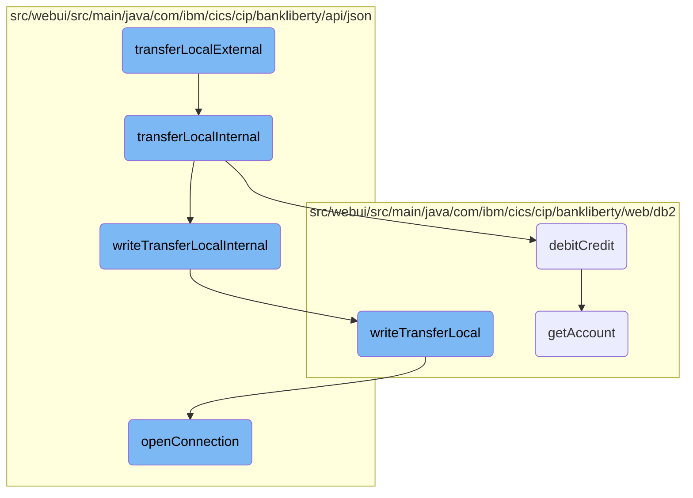

This document explains the process of transferring funds between accounts within the same bank. The process involves validating the transfer request, ensuring the accounts are different, checking account existence, performing debit and credit operations, and recording the transfer details.

The flow starts with validating the transfer request by checking the account number and transfer amount. If valid, it ensures the source and target accounts are different. Then, it verifies the existence of both accounts. If both accounts exist, it performs the debit and credit operations to update the account balances. Finally, it records the transfer details in the database for future reference.

# Flow drill down



<SwmSnippet path="/src/webui/src/main/java/com/ibm/cics/cip/bankliberty/api/json/AccountsResource.java" line="922">

---

## Validating the Transfer Request

The <SwmToken path="src/webui/src/main/java/com/ibm/cics/cip/bankliberty/api/json/AccountsResource.java" pos="926:5:5" line-data="	public Response transferLocalExternal(@PathParam(&quot;id&quot;) String accountNumber,">`transferLocalExternal`</SwmToken> method validates the transfer request by checking the account number and transfer amount. If the validation passes, it calls <SwmToken path="src/webui/src/main/java/com/ibm/cics/cip/bankliberty/api/json/AccountsResource.java" pos="977:5:5" line-data="	public Response transferLocalInternal(@PathParam(&quot;id&quot;) String accountNumber,">`transferLocalInternal`</SwmToken> to proceed with the transfer.

```java
	@PUT
	@Path("/transfer/{id}")
	@Consumes(MediaType.APPLICATION_JSON)
	@Produces(MediaType.APPLICATION_JSON)
	public Response transferLocalExternal(@PathParam("id") String accountNumber,
			TransferLocalJSON transferLocal)
	{
		// we use this to move money between two accounts at the same bank
		logger.entering(this.getClass().getName(),
				"transferLocalExternal(String accountNumber, TransferLocalJSON transferLocal)");
		Integer accountNumberInteger;
		try
		{
			accountNumberInteger = Integer.parseInt(accountNumber);
			if (accountNumberInteger.intValue() < 1
					|| accountNumberInteger.intValue() == 99999999)
			{
				return null;
			}
		}
		catch (NumberFormatException e)
```

---

</SwmSnippet>

<SwmSnippet path="/src/webui/src/main/java/com/ibm/cics/cip/bankliberty/api/json/AccountsResource.java" line="977">

---

## Ensuring Different Accounts

In <SwmToken path="src/webui/src/main/java/com/ibm/cics/cip/bankliberty/api/json/AccountsResource.java" pos="977:5:5" line-data="	public Response transferLocalInternal(@PathParam(&quot;id&quot;) String accountNumber,">`transferLocalInternal`</SwmToken>, the system ensures that the source and target accounts are different. If they are the same, an error response is generated.

```java
	public Response transferLocalInternal(@PathParam("id") String accountNumber,
			TransferLocalJSON transferLocal)
	{
		// we use this to move money between two accounts at the same bank
		logger.entering(this.getClass().getName(), TRANSFER_LOCAL_INTERNAL);
		Response myResponse = null;

		// * We are transferring money from account "id" at this bank, to
		// another account at this bank
		// * The amount MUST be positive
		JSONObject response = new JSONObject();

		if (Integer.parseInt(accountNumber) == transferLocal.getTargetAccount())
		{
			JSONObject error = new JSONObject();
			error.put(JSON_ERROR_MSG, NEED_DIFFERENT_ACCOUNTS);
			logger.log(Level.WARNING, () -> (NEED_DIFFERENT_ACCOUNTS));
			myResponse = Response.status(400).entity(error.toString()).build();
			logger.exiting(this.getClass().getName(), TRANSFER_LOCAL_INTERNAL,
					myResponse);
			return myResponse;
```

---

</SwmSnippet>

<SwmSnippet path="/src/webui/src/main/java/com/ibm/cics/cip/bankliberty/api/json/AccountsResource.java" line="1000">

---

## Validating Transfer Amount

The method checks if the transfer amount is positive. If not, it returns an error response.

```java
		if (transferLocal.getAmount().doubleValue() <= 0.00)
		{
			JSONObject error = new JSONObject();
			error.put(JSON_ERROR_MSG, "Amount to transfer must be positive");
			logger.log(Level.WARNING, () -> (NEED_DIFFERENT_ACCOUNTS));
			myResponse = Response.status(400).entity(error.toString()).build();
			logger.exiting(this.getClass().getName(), TRANSFER_LOCAL_INTERNAL,
					myResponse);
			return myResponse;
		}
```

---

</SwmSnippet>

<SwmSnippet path="/src/webui/src/main/java/com/ibm/cics/cip/bankliberty/api/json/AccountsResource.java" line="1019">

---

## Checking Account Existence

The system verifies the existence of both the source and target accounts. If either account does not exist, an appropriate error response is generated.

```java
		// Let's make sure that from account and to account exist
		AccountsResource checkAccount = new AccountsResource();
		Response checkAccountResponse = checkAccount
				.getAccountInternal(Long.parseLong(accountNumber));

		if (checkAccountResponse.getStatus() == 404)
		{
			JSONObject error = new JSONObject();
			error.put(JSON_ERROR_MSG,
					SOURCE_ACCOUNT_NUMBER + accountNumber + CANNOT_BE_FOUND);
			logger.log(Level.WARNING, () -> (SOURCE_ACCOUNT_NUMBER
					+ accountNumber + CANNOT_BE_FOUND));
			myResponse = Response.status(404).entity(error.toString()).build();
			logger.exiting(this.getClass().getName(), TRANSFER_LOCAL_INTERNAL,
					myResponse);
			return myResponse;
		}

		if (checkAccountResponse.getStatus() != 200)
		{
			JSONObject error = new JSONObject();
```

---

</SwmSnippet>

<SwmSnippet path="/src/webui/src/main/java/com/ibm/cics/cip/bankliberty/web/db2/Account.java" line="1000">

---

## Performing Debit and Credit Operations

The <SwmToken path="src/webui/src/main/java/com/ibm/cics/cip/bankliberty/web/db2/Account.java" pos="1000:5:5" line-data="	public boolean debitCredit(BigDecimal apiAmount)">`debitCredit`</SwmToken> method performs the actual debit and credit operations on the accounts. It updates the account balances and ensures the database reflects these changes.

```java
	public boolean debitCredit(BigDecimal apiAmount)
	{
		logger.entering(this.getClass().getName(), DEBIT_CREDIT_ACCOUNT);
		Account temp = this.getAccount(
				Integer.parseInt(this.getAccountNumber()),
				Integer.parseInt(this.getSortcode()));
		if (temp == null)
		{
			logger.log(Level.WARNING,
					() -> "Unable to find account " + this.getAccountNumber());
			logger.exiting(this.getClass().getName(), DEBIT_CREDIT_ACCOUNT,
					false);
			return false;
		}

		openConnection();
		String accountNumberString = temp.getAccountNumber();

		String sortCodeString = padSortCode(
				Integer.parseInt(this.getSortcode()));
		String sql1 = SQL_SELECT;
```

---

</SwmSnippet>

<SwmSnippet path="/src/webui/src/main/java/com/ibm/cics/cip/bankliberty/api/json/ProcessedTransactionResource.java" line="320">

---

## Writing Transfer Details

The <SwmToken path="src/webui/src/main/java/com/ibm/cics/cip/bankliberty/api/json/ProcessedTransactionResource.java" pos="320:5:5" line-data="	public Response writeTransferLocalInternal(">`writeTransferLocalInternal`</SwmToken> method records the transfer details in the database. It ensures that the transaction is logged for future reference.

```java
	public Response writeTransferLocalInternal(
			ProcessedTransactionTransferLocalJSON proctranLocal)
	{
		com.ibm.cics.cip.bankliberty.web.db2.ProcessedTransaction myProcessedTransactionDB2 = new com.ibm.cics.cip.bankliberty.web.db2.ProcessedTransaction();

		if (myProcessedTransactionDB2.writeTransferLocal(
				proctranLocal.getSortCode(), proctranLocal.getAccountNumber(),
				proctranLocal.getAmount(),
				proctranLocal.getTargetAccountNumber()))
		{
			return Response.ok().build();
		}
		else
		{
			return Response.serverError().build();
		}
	}
```

---

</SwmSnippet>

<SwmSnippet path="/src/webui/src/main/java/com/ibm/cics/cip/bankliberty/api/json/HBankDataAccess.java" line="69">

---

## Opening Database Connection

The <SwmToken path="src/webui/src/main/java/com/ibm/cics/cip/bankliberty/api/json/HBankDataAccess.java" pos="69:5:5" line-data="	protected void openConnection()">`openConnection`</SwmToken> method establishes a connection to the <SwmToken path="src/webui/src/main/java/com/ibm/cics/cip/bankliberty/api/json/HBankDataAccess.java" pos="71:13:13" line-data="		// Open a connection to the DB2 database">`DB2`</SwmToken> database, ensuring that all subsequent database operations can be performed.

```java
	protected void openConnection()
	{
		// Open a connection to the DB2 database
		logger.entering(this.getClass().getName(), "openConnection()");

		Integer taskNumberInteger = Task.getTask().getTaskNumber();
		String db2ConnString = DB2CONN.concat(taskNumberInteger.toString());
		logger.log(Level.FINE,
				() -> "Attempting to get DB2CONN for task number "
						+ taskNumberInteger.toString());
		this.conn = (Connection) cornedBeef.get(db2ConnString);
		if (this.conn == null)
		{
			HBankDataAccess.incrementConnCount();
			logger.log(Level.FINE,
					() -> "Attempting to create DB2CONN for task number "
							+ taskNumberInteger.toString());
			// Attempt to open a connection
			openConnectionInternal();
			logger.log(Level.FINE,
					() -> "Creation succcessful for DB2CONN for task number "
```

---

</SwmSnippet>

&nbsp;

*This is an auto-generated document by Swimm 🌊 and has not yet been verified by a human*

<SwmMeta version="3.0.0" repo-id="Z2l0aHViJTNBJTNBY2ljcy1iYW5raW5nLXNhbXBsZS1hcHBsaWNhdGlvbi1jYnNhLUlCTS1EZW1vLUdQVCUzQSUzQVN3aW1tLURlbW8=" repo-name="cics-banking-sample-application-cbsa-IBM-Demo-GPT"><sup>Powered by [Swimm](/)</sup></SwmMeta>
