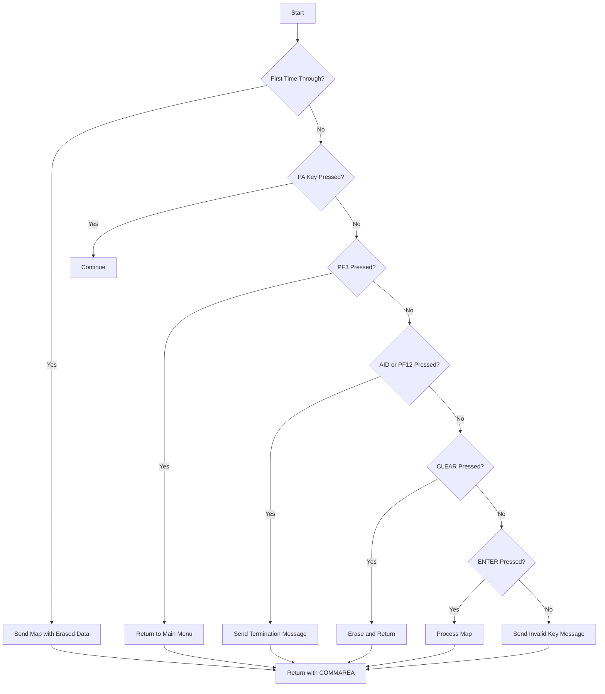

The <SwmToken path="src/base/cobol_src/BNK1TFN.cbl" pos="16:6:6" line-data="       PROGRAM-ID. BNK1TFN.">`BNK1TFN`</SwmToken> program is a COBOL program designed to handle fund transfers between accounts within the same bank. This document will cover:

1. What the Program Does
2. Program Flow
3. Program Sections

## What the Program Does

The <SwmToken path="src/base/cobol_src/BNK1TFN.cbl" pos="16:6:6" line-data="       PROGRAM-ID. BNK1TFN.">`BNK1TFN`</SwmToken> program facilitates the transfer of funds between accounts within the same bank. It handles user interactions, validates input data, and processes the fund transfer by calling another program. The program ensures that the transfer is successful and provides appropriate feedback to the user.

## Program Flow

This is a visualization of the flow:



<SwmSnippet path="/src/base/cobol_src/BNK1TFN.cbl" line="173">

---

### PREMIERE SECTION

First, the program evaluates the initial conditions. If it's the first time through, it sends the map with erased data fields. If a PA key is pressed, it continues without action. If PF3 is pressed, it returns to the main menu. If AID or PF12 is pressed, it sends a termination message. If CLEAR is pressed, it erases the screen and returns. If ENTER is pressed, it processes the map. For any other key, it sends an invalid key message.

```cobol
       PROCEDURE DIVISION.
       PREMIERE SECTION.
       A010.

           EVALUATE TRUE

      *
      *       Is it the first time through? If so, send the map
      *       with erased (empty) data fields.
      *
              WHEN EIBCALEN = ZERO
                 MOVE LOW-VALUE TO BNK1TFO
                 SET SEND-ERASE TO TRUE
                 PERFORM SEND-MAP

      *
      *       If a PA key is pressed, just carry on
      *
              WHEN EIBAID = DFHPA1 OR DFHPA2 OR DFHPA3
                 CONTINUE

```

---

</SwmSnippet>

<SwmSnippet path="/src/base/cobol_src/BNK1TFN.cbl" line="319">

---

### <SwmToken path="src/base/cobol_src/BNK1TFN.cbl" pos="319:1:3" line-data="       PROCESS-MAP SECTION.">`PROCESS-MAP`</SwmToken> SECTION

Next, the program retrieves data from the map, validates the received data, and if valid, proceeds to get account data. It then outputs the data to the screen.

```cobol
       PROCESS-MAP SECTION.
       PM010.
      *
      *    Retrieve the data from the map
      *

           PERFORM RECEIVE-MAP.

      *
      *    Validate the received data
      *
           PERFORM EDIT-DATA.

      *
      *    If the data passes validation go on to
      *    get an account
      *
           IF VALID-DATA
              PERFORM GET-ACC-DATA
           END-IF.

```

---

</SwmSnippet>

<SwmSnippet path="/src/base/cobol_src/BNK1TFN.cbl" line="351">

---

### <SwmToken path="src/base/cobol_src/BNK1TFN.cbl" pos="351:1:3" line-data="       RECEIVE-MAP SECTION.">`RECEIVE-MAP`</SwmToken> SECTION

Then, the program retrieves data from the map using the <SwmToken path="src/base/cobol_src/BNK1TFN.cbl" pos="356:1:1" line-data="           EXEC CICS">`EXEC`</SwmToken>` `<SwmToken path="src/base/cobol_src/BNK1TFN.cbl" pos="356:3:3" line-data="           EXEC CICS">`CICS`</SwmToken>` `<SwmToken path="src/base/cobol_src/BNK1TFN.cbl" pos="351:1:1" line-data="       RECEIVE-MAP SECTION.">`RECEIVE`</SwmToken>` `<SwmToken path="src/base/cobol_src/BNK1TFN.cbl" pos="351:3:3" line-data="       RECEIVE-MAP SECTION.">`MAP`</SwmToken> command. If the response is not normal, it sets up the standard ABEND info and calls the Abend Handler program.

```cobol
       RECEIVE-MAP SECTION.
       RM010.
      *
      *    Retrieve the data
      *
           EXEC CICS
              RECEIVE MAP('BNK1TF')
              MAPSET('BNK1TFM')
              INTO(BNK1TFI)
              RESP(WS-CICS-RESP)
              RESP2(WS-CICS-RESP2)
           END-EXEC.

           IF WS-CICS-RESP NOT = DFHRESP(NORMAL)
      *
      *       Preserve the RESP and RESP2, then set up the
      *       standard ABEND info before getting the applid,
      *       date/time etc. and linking to the Abend Handler
      *       program.
      *
              INITIALIZE ABNDINFO-REC
```

---

</SwmSnippet>

<SwmSnippet path="/src/base/cobol_src/BNK1TFN.cbl" line="428">

---

### <SwmToken path="src/base/cobol_src/BNK1TFN.cbl" pos="428:1:3" line-data="       EDIT-DATA SECTION.">`EDIT-DATA`</SwmToken> SECTION

Now, the program performs validation on the incoming fields. It checks if the account numbers are numeric, different, and not zero. It also validates the amount entered.

```cobol
       EDIT-DATA SECTION.
       ED010.
      *
      *    Perform validation on the incoming fields
      *
           EXEC CICS BIF DEEDIT
              FIELD(FACCNOI)
           END-EXEC.

           IF FACCNOI NOT NUMERIC
              MOVE 'Please enter a FROM account no  ' TO
                 MESSAGEO
              MOVE 'N' TO VALID-DATA-SW
              GO TO ED999
           END-IF.

           EXEC CICS BIF DEEDIT
              FIELD(TACCNOI)
           END-EXEC.

           IF TACCNOI NOT NUMERIC
```

---

</SwmSnippet>

<SwmSnippet path="/src/base/cobol_src/BNK1TFN.cbl" line="478">

---

### <SwmToken path="src/base/cobol_src/BNK1TFN.cbl" pos="478:1:5" line-data="       GET-ACC-DATA SECTION.">`GET-ACC-DATA`</SwmToken> SECTION

Then, the program sets up the fields required by the <SwmToken path="src/base/cobol_src/BNK1TFN.cbl" pos="481:15:15" line-data="      *    Set up the fields required by XFRFUN then link to it to">`XFRFUN`</SwmToken> program and calls it to get account information and perform the transfer. It checks the returned data and maps it to the screen output fields. If an error is flagged, it sets up an appropriate error message.

```cobol
       GET-ACC-DATA SECTION.
       GCD010.
      *
      *    Set up the fields required by XFRFUN then link to it to
      *    get account information and perform the transfer, then
      *    check what gets returned.
      *
           INITIALIZE SUBPGM-PARMS.

           MOVE FACCNOI TO  SUBPGM-FACCNO.
           MOVE TACCNOI TO  SUBPGM-TACCNO.
           MOVE 'N'     TO  SUBPGM-SUCCESS.

      *
      * Provide the correct Amount
      *
           MOVE WS-AMOUNT-AS-FLOAT TO SUBPGM-AMT.

           EXEC CICS LINK
              PROGRAM('XFRFUN')
              COMMAREA(SUBPGM-PARMS)
```

---

</SwmSnippet>

<SwmSnippet path="/src/base/cobol_src/BNK1TFN.cbl" line="662">

---

### <SwmToken path="src/base/cobol_src/BNK1TFN.cbl" pos="662:1:3" line-data="       SEND-MAP SECTION.">`SEND-MAP`</SwmToken> SECTION

Going into the <SwmToken path="src/base/cobol_src/BNK1TFN.cbl" pos="662:1:3" line-data="       SEND-MAP SECTION.">`SEND-MAP`</SwmToken> section, the program sends or shows the map. Depending on the flags, it either erases the map, sends only the data, or sends the data with an alarm.

```cobol
       SEND-MAP SECTION.
       SM010.
      *
      *    Send/show the MAP
      *

      *
      *    If the map needs to have its data erased
      *
           IF SEND-ERASE
              EXEC CICS SEND MAP('BNK1TF')
                 MAPSET('BNK1TFM')
                 FROM(BNK1TFO)
                 ERASE
                 RESP(WS-CICS-RESP)
                 RESP2(WS-CICS-RESP2)
              END-EXEC

              IF WS-CICS-RESP NOT = DFHRESP(NORMAL)
      *
      *          Preserve the RESP and RESP2, then set up the
```

---

</SwmSnippet>

<SwmSnippet path="/src/base/cobol_src/BNK1TFN.cbl" line="894">

---

### <SwmToken path="src/base/cobol_src/BNK1TFN.cbl" pos="894:1:5" line-data="       SEND-TERMINATION-MSG SECTION.">`SEND-TERMINATION-MSG`</SwmToken> SECTION

Finally, the program sends the termination message using the <SwmToken path="src/base/cobol_src/BNK1TFN.cbl" pos="899:1:7" line-data="           EXEC CICS SEND TEXT">`EXEC CICS SEND TEXT`</SwmToken> command. If the response is not normal, it sets up the standard ABEND info and calls the Abend Handler program.

```cobol
       SEND-TERMINATION-MSG SECTION.
       STM010.
      *
      *    Send the termination message
      *
           EXEC CICS SEND TEXT
              FROM(END-OF-SESSION-MESSAGE)
              ERASE
              FREEKB
              RESP(WS-CICS-RESP)
              RESP2(WS-CICS-RESP2)
           END-EXEC.

           IF WS-CICS-RESP NOT = DFHRESP(NORMAL)
      *
      *       Preserve the RESP and RESP2, then set up the
      *       standard ABEND info before getting the applid,
      *       date/time etc. and linking to the Abend Handler
      *       program.
      *
              INITIALIZE ABNDINFO-REC
```

---

</SwmSnippet>

&nbsp;

*This is an auto-generated document by Swimm 🌊 and has not yet been verified by a human*

<SwmMeta version="3.0.0" repo-id="Z2l0aHViJTNBJTNBY2ljcy1iYW5raW5nLXNhbXBsZS1hcHBsaWNhdGlvbi1jYnNhLUlCTS1EZW1vLUdQVCUzQSUzQVN3aW1tLURlbW8=" repo-name="cics-banking-sample-application-cbsa-IBM-Demo-GPT"><sup>Powered by [Swimm](/)</sup></SwmMeta>
