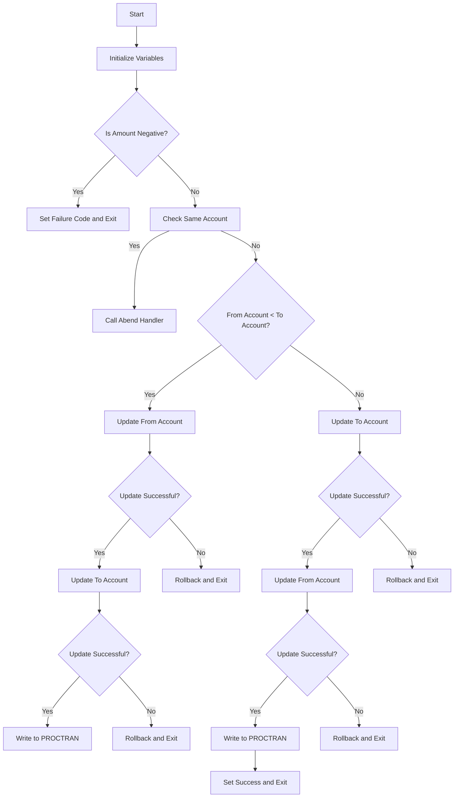

This document will cover the XFRFUN program. We'll cover:

1. What the Program Does
2. Program Flow
3. Program Sections

## What the Program Does

The XFRFUN program is designed to handle the transfer of funds between two accounts. It takes the sort code and account number of both the source and destination accounts, along with the transfer amount. The program updates the account balances and records the transaction in the PROCTRAN datastore. If any part of the process fails, it rolls back the transaction and reports the error.

## Program Flow

This is a visualization of the flow:



<SwmSnippet path="/src/base/cobol_src/XFRFUN.cbl" line="268">

---

### PREMIERE SECTION

First, the program initializes variables and handles any abends. It then checks if the transfer amount is negative. If it is, the program sets the failure code and exits.

```cobol
       PROCEDURE DIVISION USING DFHCOMMAREA.
       PREMIERE SECTION.
       A010.

           EXEC CICS HANDLE ABEND
              LABEL(ABEND-HANDLING)
           END-EXEC.

           MOVE '0' TO HV-ACCOUNT-EYECATCHER.
           MOVE '0' TO HV-ACCOUNT-SORTCODE.
           MOVE '0' TO HV-ACCOUNT-ACC-NO.
           MOVE  0  TO DB2-DEADLOCK-RETRY.

           MOVE SORTCODE TO COMM-FSCODE COMM-TSCODE.

           MOVE SORTCODE TO DESIRED-SORT-CODE.

      *
      *    If the amount being transferred is negative, then
      *    flag this as a failure and finish.
      *
```

---

</SwmSnippet>

<SwmSnippet path="/src/base/cobol_src/XFRFUN.cbl" line="308">

---

### <SwmToken path="src/base/cobol_src/XFRFUN.cbl" pos="308:1:5" line-data="       UPDATE-ACCOUNT-DB2 SECTION.">`UPDATE-ACCOUNT-DB2`</SwmToken> SECTION

Next, the program checks if the source and destination accounts are the same. If they are, it calls the Abend Handler. Otherwise, it proceeds to update the accounts. Depending on whether the source account number is less than the destination account number, it updates the source account first or the destination account first. If any update fails, it rolls back the transaction and exits.

```cobol
       UPDATE-ACCOUNT-DB2 SECTION.
       UAD010.

           MOVE 'N' TO COMM-SUCCESS.
      *
      *    Are we trying to transfer from and to the same account?
      *    We don't allow that.
      *
           IF COMM-FACCNO = COMM-TACCNO
              AND COMM-FSCODE = COMM-TSCODE
      *
      *       Preserve the RESP and RESP2, then set up the
      *       standard ABEND info before getting the applid,
      *       date/time etc. and linking to the Abend Handler
      *       program.
      *
              INITIALIZE ABNDINFO-REC
              MOVE EIBRESP    TO ABND-RESPCODE
              MOVE EIBRESP2   TO ABND-RESP2CODE
      *
      *       Get supplemental information
```

---

</SwmSnippet>

<SwmSnippet path="/src/base/cobol_src/XFRFUN.cbl" line="919">

---

### <SwmToken path="src/base/cobol_src/XFRFUN.cbl" pos="919:1:7" line-data="       UPDATE-ACCOUNT-DB2-FROM SECTION.">`UPDATE-ACCOUNT-DB2-FROM`</SwmToken> SECTION

Then, the program updates the source account's balance by subtracting the transfer amount. If the update is successful, it stores the updated balances.

```cobol
       UPDATE-ACCOUNT-DB2-FROM SECTION.
       UADF010.
      *
      *    Position ourself at the matching FROM account record
      *
           MOVE COMM-FACCNO TO DESIRED-ACC-NO.
           MOVE COMM-FSCODE TO DESIRED-SORT-CODE.

           MOVE DESIRED-SORT-CODE TO HV-ACCOUNT-SORTCODE.
           MOVE DESIRED-ACC-NO TO HV-ACCOUNT-ACC-NO.

           EXEC SQL
              SELECT ACCOUNT_EYECATCHER,
                ACCOUNT_CUSTOMER_NUMBER,
                ACCOUNT_SORTCODE,
                ACCOUNT_NUMBER,
                ACCOUNT_TYPE,
                ACCOUNT_INTEREST_RATE,
                ACCOUNT_OPENED,
                ACCOUNT_OVERDRAFT_LIMIT,
                ACCOUNT_LAST_STATEMENT,
```

---

</SwmSnippet>

<SwmSnippet path="/src/base/cobol_src/XFRFUN.cbl" line="1041">

---

### <SwmToken path="src/base/cobol_src/XFRFUN.cbl" pos="1041:1:7" line-data="       UPDATE-ACCOUNT-DB2-TO SECTION.">`UPDATE-ACCOUNT-DB2-TO`</SwmToken> SECTION

Next, the program updates the destination account's balance by adding the transfer amount. If the update is successful, it stores the updated balances.

```cobol
       UPDATE-ACCOUNT-DB2-TO SECTION.
       UADT010.

           MOVE 'N' TO COMM-SUCCESS.
      *
      *    Position ourself at the matching account record
      *    for the TO account
      *
           INITIALIZE HOST-ACCOUNT-ROW.

           MOVE COMM-TACCNO TO DESIRED-ACC-NO.
           MOVE COMM-TSCODE TO DESIRED-SORT-CODE.

           MOVE DESIRED-SORT-CODE TO HV-ACCOUNT-SORTCODE.
           MOVE DESIRED-ACC-NO TO HV-ACCOUNT-ACC-NO.

           EXEC SQL
                SELECT ACCOUNT_EYECATCHER,
                ACCOUNT_CUSTOMER_NUMBER,
                ACCOUNT_SORTCODE,
                ACCOUNT_NUMBER,
```

---

</SwmSnippet>

<SwmSnippet path="/src/base/cobol_src/XFRFUN.cbl" line="1563">

---

### <SwmToken path="src/base/cobol_src/XFRFUN.cbl" pos="1563:1:5" line-data="       WRITE-TO-PROCTRAN SECTION.">`WRITE-TO-PROCTRAN`</SwmToken> SECTION

Finally, the program writes the details of the successful transfer to the PROCTRAN datastore. If this write fails, it calls the Abend Handler.

```cobol
       WRITE-TO-PROCTRAN SECTION.
       WTP010.

           PERFORM WRITE-TO-PROCTRAN-DB2.
       WTP999.
           EXIT.


       WRITE-TO-PROCTRAN-DB2 SECTION.
       WTPD010.
      *
      *    Writes details of the successful transfer to the
      *    PROCTRAN (Processed Transaction) datastore.
      *
           INITIALIZE HOST-PROCTRAN-ROW.
           INITIALIZE WS-EIBTASKN12.

           MOVE 'PRTR' TO HV-PROCTRAN-EYECATCHER.
           MOVE COMM-FSCODE TO HV-PROCTRAN-SORT-CODE.
           MOVE COMM-FACCNO TO HV-PROCTRAN-ACC-NUMBER.
           MOVE EIBTASKN TO WS-EIBTASKN12.
```

---

</SwmSnippet>

&nbsp;

*This is an auto-generated document by Swimm 🌊 and has not yet been verified by a human*

<SwmMeta version="3.0.0" repo-id="Z2l0aHViJTNBJTNBY2ljcy1iYW5raW5nLXNhbXBsZS1hcHBsaWNhdGlvbi1jYnNhLUlCTS1EZW1vLUdQVCUzQSUzQVN3aW1tLURlbW8=" repo-name="cics-banking-sample-application-cbsa-IBM-Demo-GPT"><sup>Powered by [Swimm](/)</sup></SwmMeta>
