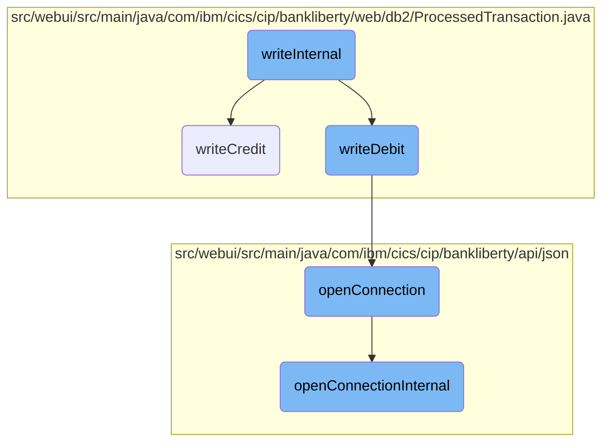
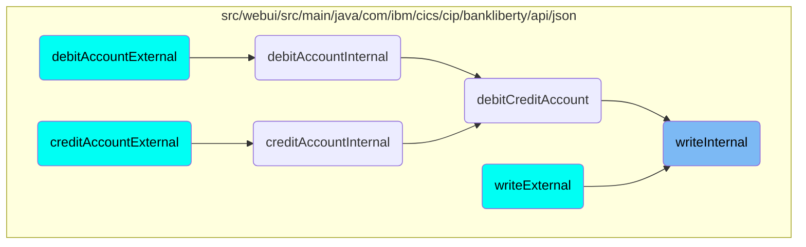

In this document, we will explain the process of handling debit and credit transactions. The process involves determining the type of transaction based on the amount and then processing it accordingly.

The flow starts by checking if the transaction amount is negative. If it is, the transaction is identified as a debit and processed using the debit handling method. If the amount is positive, it is identified as a credit and processed using the credit handling method. Both methods involve preparing an SQL statement to insert the transaction details into the database and establishing a connection to the database if one does not already exist.

# Flow drill down



<SwmSnippet path="/src/webui/src/main/java/com/ibm/cics/cip/bankliberty/api/json/ProcessedTransactionResource.java" line="270">

---

## Handling Debit and Credit Transactions

The <SwmToken path="src/webui/src/main/java/com/ibm/cics/cip/bankliberty/api/json/ProcessedTransactionResource.java" pos="270:5:5" line-data="	public Response writeInternal(">`writeInternal`</SwmToken> method is responsible for processing both debit and credit transactions. It first checks if the transaction amount is negative to determine if it is a debit. If it is, it calls the <SwmToken path="src/webui/src/main/java/com/ibm/cics/cip/bankliberty/api/json/ProcessedTransactionResource.java" pos="277:6:6" line-data="			if (myProcessedTransactionDB2.writeDebit(">`writeDebit`</SwmToken> method; otherwise, it calls the <SwmToken path="src/webui/src/main/java/com/ibm/cics/cip/bankliberty/web/db2/ProcessedTransaction.java" pos="545:5:5" line-data="	public boolean writeCredit(String accountNumber, String sortcode,">`writeCredit`</SwmToken> method. This ensures that the correct type of transaction is processed based on the amount.

```java
	public Response writeInternal(
			ProcessedTransactionDebitCreditJSON proctranDbCr)
	{
		com.ibm.cics.cip.bankliberty.web.db2.ProcessedTransaction myProcessedTransactionDB2 = new com.ibm.cics.cip.bankliberty.web.db2.ProcessedTransaction();

		if (proctranDbCr.getAmount().compareTo(new BigDecimal(0)) < 0)
		{
			if (myProcessedTransactionDB2.writeDebit(
					proctranDbCr.getAccountNumber(), proctranDbCr.getSortCode(),
					proctranDbCr.getAmount()))
			{
				return Response.ok().build();
			}
			else
			{
				logger.severe("PROCTRAN Insert debit didn't work");
				return Response.serverError().build();
			}
		}
		else
		{
```

---

</SwmSnippet>

<SwmSnippet path="/src/webui/src/main/java/com/ibm/cics/cip/bankliberty/web/db2/ProcessedTransaction.java" line="545">

---

### Processing Credit Transactions

The <SwmToken path="src/webui/src/main/java/com/ibm/cics/cip/bankliberty/web/db2/ProcessedTransaction.java" pos="545:5:5" line-data="	public boolean writeCredit(String accountNumber, String sortcode,">`writeCredit`</SwmToken> method handles the logic for credit transactions. It prepares an SQL statement to insert the credit transaction details into the database. If the insertion is successful, it returns true; otherwise, it logs an error and returns false.

```java
	public boolean writeCredit(String accountNumber, String sortcode,
			BigDecimal amount2)
	{
		logger.entering(this.getClass().getName(), WRITE_CREDIT, false);
		sortOutDateTimeTaskString();

		openConnection();

		logger.log(Level.FINE, () -> ABOUT_TO_INSERT + SQL_INSERT + ">");
		try (PreparedStatement stmt = conn.prepareStatement(SQL_INSERT);)
		{
			stmt.setString(1, PROCTRAN.PROC_TRAN_VALID);
			stmt.setString(2, sortcode);
			stmt.setString(3,
					String.format("%08d", Integer.parseInt(accountNumber)));
			stmt.setString(4, dateString);
			stmt.setString(5, timeString);
			stmt.setString(6, taskRef);
			stmt.setString(7, PROCTRAN.PROC_TY_CREDIT);
			stmt.setString(8, "INTERNET RECVED");
			stmt.setBigDecimal(9, amount2);
```

---

</SwmSnippet>

<SwmSnippet path="/src/webui/src/main/java/com/ibm/cics/cip/bankliberty/web/db2/ProcessedTransaction.java" line="510">

---

### Processing Debit Transactions

The <SwmToken path="src/webui/src/main/java/com/ibm/cics/cip/bankliberty/web/db2/ProcessedTransaction.java" pos="510:5:5" line-data="	public boolean writeDebit(String accountNumber, String sortcode,">`writeDebit`</SwmToken> method is similar to <SwmToken path="src/webui/src/main/java/com/ibm/cics/cip/bankliberty/web/db2/ProcessedTransaction.java" pos="545:5:5" line-data="	public boolean writeCredit(String accountNumber, String sortcode,">`writeCredit`</SwmToken> but is used for debit transactions. It also prepares an SQL statement to insert the debit transaction details into the database. The method returns true if the insertion is successful and false if it encounters an error.

```java
	public boolean writeDebit(String accountNumber, String sortcode,
			BigDecimal amount2)
	{
		logger.entering(this.getClass().getName(), WRITE_DEBIT);

		sortOutDateTimeTaskString();

		openConnection();

		logger.log(Level.FINE, () -> ABOUT_TO_INSERT + SQL_INSERT + ">");
		try (PreparedStatement stmt = conn.prepareStatement(SQL_INSERT);)
		{
			stmt.setString(1, PROCTRAN.PROC_TRAN_VALID);
			stmt.setString(2, sortcode);
			stmt.setString(3,
					String.format("%08d", Integer.parseInt(accountNumber)));
			stmt.setString(4, dateString);
			stmt.setString(5, timeString);
			stmt.setString(6, taskRef);
			stmt.setString(7, PROCTRAN.PROC_TY_DEBIT);
			stmt.setString(8, "INTERNET WTHDRW");
```

---

</SwmSnippet>

<SwmSnippet path="/src/webui/src/main/java/com/ibm/cics/cip/bankliberty/api/json/HBankDataAccess.java" line="69">

---

### Opening Database Connection

The <SwmToken path="src/webui/src/main/java/com/ibm/cics/cip/bankliberty/api/json/HBankDataAccess.java" pos="69:5:5" line-data="	protected void openConnection()">`openConnection`</SwmToken> method is responsible for establishing a connection to the <SwmToken path="src/webui/src/main/java/com/ibm/cics/cip/bankliberty/api/json/HBankDataAccess.java" pos="71:13:13" line-data="		// Open a connection to the DB2 database">`DB2`</SwmToken> database. It first checks if a connection already exists for the current task. If not, it calls <SwmToken path="src/webui/src/main/java/com/ibm/cics/cip/bankliberty/api/json/HBankDataAccess.java" pos="87:1:1" line-data="			openConnectionInternal();">`openConnectionInternal`</SwmToken> to create a new connection.

```java
	protected void openConnection()
	{
		// Open a connection to the DB2 database
		logger.entering(this.getClass().getName(), "openConnection()");

		Integer taskNumberInteger = Task.getTask().getTaskNumber();
		String db2ConnString = DB2CONN.concat(taskNumberInteger.toString());
		logger.log(Level.FINE,
				() -> "Attempting to get DB2CONN for task number "
						+ taskNumberInteger.toString());
		this.conn = (Connection) cornedBeef.get(db2ConnString);
		if (this.conn == null)
		{
			HBankDataAccess.incrementConnCount();
			logger.log(Level.FINE,
					() -> "Attempting to create DB2CONN for task number "
							+ taskNumberInteger.toString());
			// Attempt to open a connection
			openConnectionInternal();
			logger.log(Level.FINE,
					() -> "Creation succcessful for DB2CONN for task number "
```

---

</SwmSnippet>

<SwmSnippet path="/src/webui/src/main/java/com/ibm/cics/cip/bankliberty/api/json/HBankDataAccess.java" line="162">

---

### Establishing Internal Database Connection

The <SwmToken path="src/webui/src/main/java/com/ibm/cics/cip/bankliberty/api/json/HBankDataAccess.java" pos="163:3:3" line-data="	void openConnectionInternal()">`openConnectionInternal`</SwmToken> method performs the actual work of establishing a new database connection. It uses JNDI to look up the data source and attempts to get a connection. If successful, it sets the transaction isolation level and stores the connection for reuse.

```java
	@SuppressWarnings("unchecked")
	void openConnectionInternal()
	{
		logger.entering(this.getClass().getName(), "openConnectionInternal");
		String jndiString = "jdbc/defaultCICSDataSource";
		Context ctx;

		try
		{
			ctx = new InitialContext();
			DataSource ds = (DataSource) ctx.lookup(jndiString);
			logger.log(Level.FINE, () -> "jndi string is " + jndiString);
			// If there is no current connection
			if (this.conn == null)
			{
				logger.log(Level.FINE,
						() -> "About to attempt to get DB2 connection");
				// Try and get a connection
				this.conn = ds.getConnection();
				this.conn.setTransactionIsolation(
						Connection.TRANSACTION_READ_UNCOMMITTED);
```

---

</SwmSnippet>

# Where is this flow used?

This flow is used multiple times in the codebase as represented in the following diagram:



&nbsp;

*This is an auto-generated document by Swimm 🌊 and has not yet been verified by a human*

<SwmMeta version="3.0.0" repo-id="Z2l0aHViJTNBJTNBY2ljcy1iYW5raW5nLXNhbXBsZS1hcHBsaWNhdGlvbi1jYnNhLUlCTS1EZW1vLUdQVCUzQSUzQVN3aW1tLURlbW8=" repo-name="cics-banking-sample-application-cbsa-IBM-Demo-GPT"><sup>Powered by [Swimm](/)</sup></SwmMeta>
