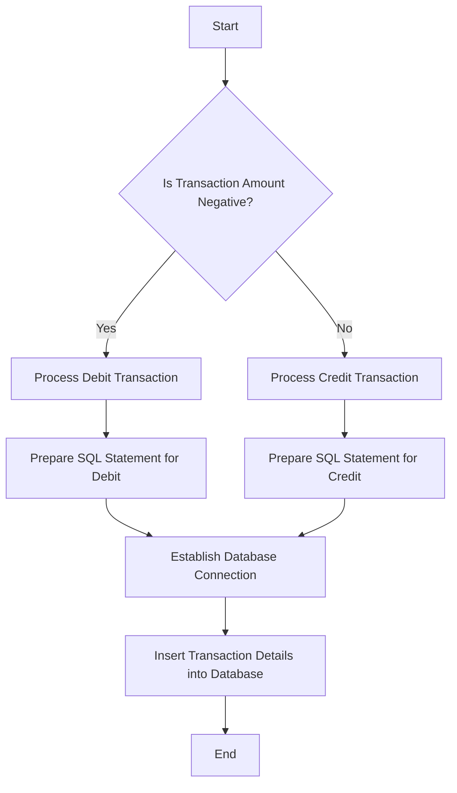

This document will cover the process of handling debit and credit transactions, which includes:

1. Determining the transaction type
2. Processing debit transactions
3. Processing credit transactions
4. Establishing a database connection

Technical document: <SwmLink doc-title="Handling Debit and Credit Transactions">[Handling Debit and Credit Transactions](/.swm/handling-debit-and-credit-transactions.7z83mwhf.sw.md)</SwmLink>

# [Determining the transaction type](https://app.swimm.io/repos/Z2l0aHViJTNBJTNBY2ljcy1iYW5raW5nLXNhbXBsZS1hcHBsaWNhdGlvbi1jYnNhLUlCTS1EZW1vLUdQVCUzQSUzQVN3aW1tLURlbW8=/docs/7z83mwhf#the-flow-starts-by-checking-if-the-transaction-amount-is-negative)

The process begins by determining whether the transaction amount is negative or positive. This step is crucial as it identifies the type of transaction. If the amount is negative, it is classified as a debit transaction. Conversely, if the amount is positive, it is classified as a credit transaction. This classification ensures that the appropriate processing method is used for each transaction type.

# [Processing debit transactions](https://app.swimm.io/repos/Z2l0aHViJTNBJTNBY2ljcy1iYW5raW5nLXNhbXBsZS1hcHBsaWNhdGlvbi1jYnNhLUlCTS1EZW1vLUdQVCUzQSUzQVN3aW1tLURlbW8=/docs/7z83mwhf#if-it-is-the-transaction-is-identified-as-a-debit-and-processed-using-the-debit-handling-method)

When a transaction is identified as a debit, the system prepares to handle it accordingly. This involves preparing an SQL statement specifically designed to insert debit transaction details into the database. The system ensures that all necessary information, such as account number, sort code, and transaction amount, is included in the SQL statement. This step is essential for accurately recording the debit transaction in the database.

# [Processing credit transactions](https://app.swimm.io/repos/Z2l0aHViJTNBJTNBY2ljcy1iYW5raW5nLXNhbXBsZS1hcHBsaWNhdGlvbi1jYnNhLUlCTS1EZW1vLUdQVCUzQSUzQVN3aW1tLURlbW8=/docs/7z83mwhf#if-the-amount-is-positive-it-is-identified-as-a-credit-and-processed-using-the-credit-handling-method)

For credit transactions, the system follows a similar process to that of debit transactions but uses a different SQL statement tailored for credit transactions. This statement includes details such as the account number, sort code, and transaction amount. The system ensures that the credit transaction is accurately recorded in the database, maintaining the integrity of the financial records.

# [Establishing a database connection](https://app.swimm.io/repos/Z2l0aHViJTNBJTNBY2ljcy1iYW5raW5nLXNhbXBsZS1hcHBsaWNhdGlvbi1jYnNhLUlCTS1EZW1vLUdQVCUzQSUzQVN3aW1tLURlbW8=/docs/7z83mwhf#both-methods-involve-preparing-an-sql-statement-to-insert-the-transaction-details-into-the-database-and-establishing-a-connection-to-the-database-if-one-does-not-already-exist)

Before any transaction details can be inserted into the database, the system must establish a connection to the database. If a connection does not already exist, the system initiates a new connection. This step is crucial for ensuring that the transaction details are securely and accurately recorded in the database. The system uses a predefined method to open the connection, ensuring consistency and reliability in the database operations.

&nbsp;

*This is an auto-generated document by Swimm 🌊 and has not yet been verified by a human*

<SwmMeta version="3.0.0" repo-id="Z2l0aHViJTNBJTNBY2ljcy1iYW5raW5nLXNhbXBsZS1hcHBsaWNhdGlvbi1jYnNhLUlCTS1EZW1vLUdQVCUzQSUzQVN3aW1tLURlbW8=" repo-name="cics-banking-sample-application-cbsa-IBM-Demo-GPT">Powered by [Swimm](/)</SwmMeta>
