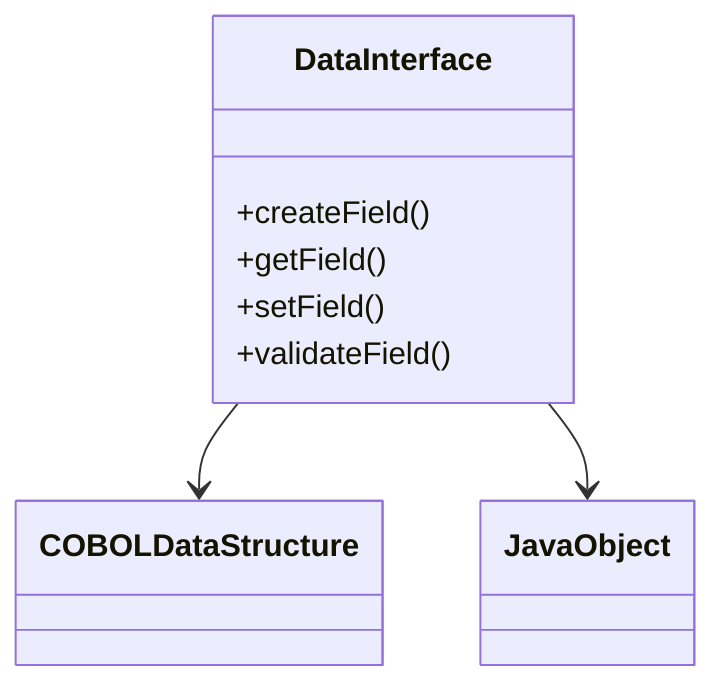

# Introduction to Data Interfaces

Data interfaces are Java classes that facilitate the interaction between the web UI and the underlying data structures. They are responsible for mapping data fields from COBOL data structures to Java objects, ensuring seamless data exchange.

# Overview of Data Interfaces

Data interfaces handle data conversion and validation, ensuring that data integrity is maintained when transferring information between different layers of the application. They use a factory pattern to create and manage data fields, providing methods to get and set values for various customer attributes.

# How to Use Data Interfaces

Data interfaces use a factory pattern to create and manage data fields. They provide methods to get and set values for various customer attributes. This ensures that data integrity is maintained when transferring information between different layers of the application.

&nbsp;

*This is an auto-generated document by Swimm 🌊 and has not yet been verified by a human*

<SwmMeta version="3.0.0" repo-id="Z2l0aHViJTNBJTNBY2ljcy1iYW5raW5nLXNhbXBsZS1hcHBsaWNhdGlvbi1jYnNhLUlCTS1EZW1vLUdQVCUzQSUzQVN3aW1tLURlbW8=" repo-name="cics-banking-sample-application-cbsa-IBM-Demo-GPT">Powered by [Swimm](/)</SwmMeta>
