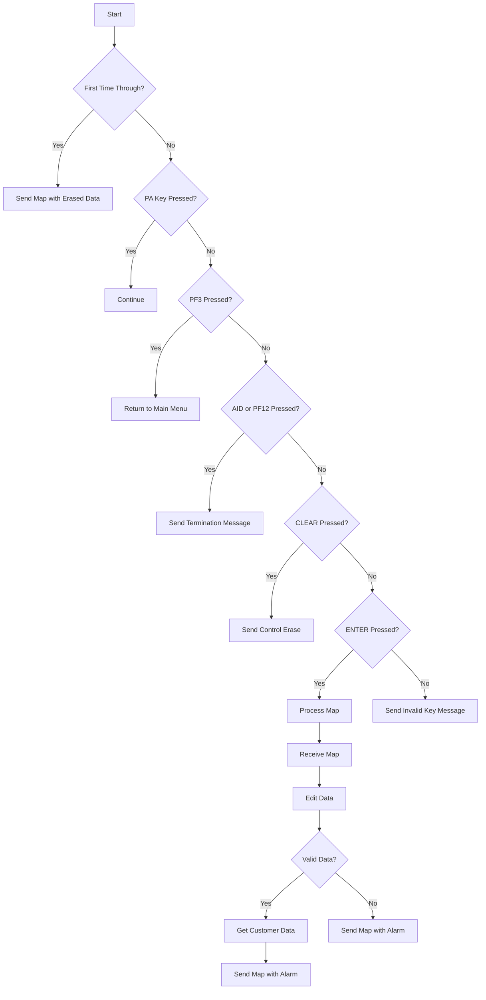

This document will cover the <SwmToken path="src/base/cobol_src/BNK1CCA.cbl" pos="15:6:6" line-data="       PROGRAM-ID. BNK1CCA.">`BNK1CCA`</SwmToken> program. We'll cover:

1. What the Program Does
2. Program Flow
3. Program Sections

## What the Program Does

The <SwmToken path="src/base/cobol_src/BNK1CCA.cbl" pos="15:6:6" line-data="       PROGRAM-ID. BNK1CCA.">`BNK1CCA`</SwmToken> program lists accounts belonging to a specified customer number. It interacts with the CICS system to retrieve and display account information based on user input. The program handles various user actions such as sending maps, processing input data, and linking to other programs to fetch customer data.

## Program Flow

This is a visualization of the flow:



<SwmSnippet path="/src/base/cobol_src/BNK1CCA.cbl" line="152">

---

### PREMIERE SECTION

First, the program evaluates the initial conditions. If it's the first time through, it sends the map with erased data fields. It handles various user actions such as PA key presses, PF3 for returning to the main menu, AID or PF12 for sending a termination message, CLEAR for sending control erase, and ENTER for processing the map. If an invalid key is pressed, it sends an invalid key message.

```cobol
       PROCEDURE DIVISION.
       PREMIERE SECTION.
       A010.

           EVALUATE TRUE

      *
      *       Is it the first time through? If so, send the map
      *       with erased (empty) data fields.
      *
              WHEN EIBCALEN = ZERO
                 MOVE LOW-VALUE TO BNK1ACCO
                 MOVE -1 TO CUSTNOL
                 SET SEND-ERASE TO TRUE
                 PERFORM SEND-MAP

      *
      *       If a PA key is pressed, just carry on
      *
              WHEN EIBAID = DFHPA1 OR DFHPA2 OR DFHPA3
                 CONTINUE
```

---

</SwmSnippet>

<SwmSnippet path="/src/base/cobol_src/BNK1CCA.cbl" line="296">

---

### <SwmToken path="src/base/cobol_src/BNK1CCA.cbl" pos="296:1:3" line-data="        PROCESS-MAP SECTION.">`PROCESS-MAP`</SwmToken> SECTION

Next, the program processes the map. It retrieves data from the map, validates the received data, and if the data is valid, it retrieves the customer information. Finally, it sets the flag to send the map with an alarm and outputs the data to the screen.

```cobol
        PROCESS-MAP SECTION.
        PM010.
      *
      *    Retrieve the data from the map
      *
           PERFORM RECEIVE-MAP.

      *
      *    Validate the received data
      *
           PERFORM EDIT-DATA.

      *
      *    If the data passes validation go on to
      *    retrieve the CUSTOMER information
      *
           IF VALID-DATA
              PERFORM GET-CUST-DATA
           END-IF.

           SET SEND-DATAONLY-ALARM TO TRUE.
```

---

</SwmSnippet>

<SwmSnippet path="/src/base/cobol_src/BNK1CCA.cbl" line="327">

---

### <SwmToken path="src/base/cobol_src/BNK1CCA.cbl" pos="327:1:3" line-data="        RECEIVE-MAP SECTION.">`RECEIVE-MAP`</SwmToken> SECTION

Then, the program retrieves the data from the map. If the response is not normal, it sets up the standard ABEND info and links to the Abend Handler program.

```cobol
        RECEIVE-MAP SECTION.
        RM010.
      *
      *    Retrieve the data
      *
            INITIALIZE BNK1ACCI.
            EXEC CICS
               RECEIVE MAP('BNK1ACC')
               MAPSET('BNK1ACC')
               INTO(BNK1ACCI)
               RESP(WS-CICS-RESP)
               RESP2(WS-CICS-RESP2)
            END-EXEC.

            IF WS-CICS-RESP NOT = DFHRESP(NORMAL)

      *
      *        Preserve the RESP and RESP2, then set up the
      *        standard ABEND info before getting the applid,
      *        date/time etc. and linking to the Abend Handler
      *        program.
```

---

</SwmSnippet>

<SwmSnippet path="/src/base/cobol_src/BNK1CCA.cbl" line="406">

---

### <SwmToken path="src/base/cobol_src/BNK1CCA.cbl" pos="406:1:3" line-data="        EDIT-DATA SECTION.">`EDIT-DATA`</SwmToken> SECTION

Now, the program performs validation on the incoming fields. If the customer number is not numeric, it sets the valid data switch to 'N' and displays an error message.

```cobol
        EDIT-DATA SECTION.
        ED010.
      *
      *    Perform validation on the incoming fields
      *
           IF CUSTNOI NOT NUMERIC
              MOVE 'Please enter a customer number.' TO
                  MESSAGEO
              MOVE 'N' TO VALID-DATA-SW
           END-IF.

        ED999.
            EXIT.
```

---

</SwmSnippet>

<SwmSnippet path="/src/base/cobol_src/BNK1CCA.cbl" line="421">

---

### <SwmToken path="src/base/cobol_src/BNK1CCA.cbl" pos="421:1:5" line-data="        GET-CUST-DATA SECTION.">`GET-CUST-DATA`</SwmToken> SECTION

Going into the next section, the program sets up the fields required by the INQACCCU program and calls it to retrieve customer data. If the response is not normal, it sets up the standard ABEND info and links to the Abend Handler program. If no matching customer is found, it displays an error message. If a customer is found, it populates the account numbers on the screen along with other information returned from INQACCCU.

```cobol
        GET-CUST-DATA SECTION.
        GCD010.
      *
      *    Set up the fields required by INQACCCU then link to it
      *
           MOVE 20 TO NUMBER-OF-ACCOUNTS.
           MOVE 'N' TO COMM-SUCCESS OF INQACCCU-COMMAREA.

           MOVE CUSTNOI TO CUSTOMER-NUMBER OF INQACCCU-COMMAREA.
           SET COMM-PCB-POINTER TO NULL.

      *
      *    Link to INQACCCU
      *
           EXEC CICS LINK
               PROGRAM(INQACCCU-PROGRAM)
               COMMAREA(INQACCCU-COMMAREA)
               RESP(WS-CICS-RESP)
               RESP2(WS-CICS-RESP2)
               SYNCONRETURN
           END-EXEC.
```

---

</SwmSnippet>

<SwmSnippet path="/src/base/cobol_src/BNK1CCA.cbl" line="615">

---

### <SwmToken path="src/base/cobol_src/BNK1CCA.cbl" pos="615:1:3" line-data="        SEND-MAP SECTION.">`SEND-MAP`</SwmToken> SECTION

Then, the program sends the map. If the map needs to have its data erased, it sends the map with the erase option. If the map just needs a resend of only the data, it sends the map with the data only option. If the map needs to be sent with an alarm, it sends the map with the data only and alarm options.

```cobol
        SEND-MAP SECTION.
        SM010.

      *
      *    If the map needs to have its data erased
      *
           IF SEND-ERASE
               EXEC CICS SEND MAP('BNK1ACC')
                  MAPSET('BNK1ACC')
                  FROM(BNK1ACCO)
                  ERASE
                  RESP(WS-CICS-RESP)
                  RESP2(WS-CICS-RESP2)
               END-EXEC

              IF WS-CICS-RESP NOT = DFHRESP(NORMAL)
      *
      *          Preserve the RESP and RESP2, then set up the
      *          standard ABEND info before getting the applid,
      *          date/time etc. and linking to the Abend Handler
      *          program.
```

---

</SwmSnippet>

<SwmSnippet path="/src/base/cobol_src/BNK1CCA.cbl" line="849">

---

### <SwmToken path="src/base/cobol_src/BNK1CCA.cbl" pos="849:1:5" line-data="       SEND-TERMINATION-MSG SECTION.">`SEND-TERMINATION-MSG`</SwmToken> SECTION

Finally, the program sends the termination message. If the response is not normal, it sets up the standard ABEND info and links to the Abend Handler program.

```cobol
       SEND-TERMINATION-MSG SECTION.
       STM010.
      *
      *    Send the termination message
      *
           EXEC CICS SEND TEXT
              FROM(END-OF-SESSION-MESSAGE)
              ERASE
              FREEKB
              RESP(WS-CICS-RESP)
              RESP2(WS-CICS-RESP2)
           END-EXEC.

           IF WS-CICS-RESP NOT = DFHRESP(NORMAL)
      *
      *       Preserve the RESP and RESP2, then set up the
      *       standard ABEND info before getting the applid,
      *       date/time etc. and linking to the Abend Handler
      *       program.
      *
              INITIALIZE ABNDINFO-REC
```

---

</SwmSnippet>

<SwmSnippet path="/src/base/cobol_src/BNK1CCA.cbl" line="925">

---

### <SwmToken path="src/base/cobol_src/BNK1CCA.cbl" pos="925:1:5" line-data="       ABEND-THIS-TASK SECTION.">`ABEND-THIS-TASK`</SwmToken> SECTION

This section handles the task abend. It displays the failure information and abends the task with the code 'HBNK'.

```cobol
       ABEND-THIS-TASK SECTION.
       ATT010.
           DISPLAY WS-FAIL-INFO.
           EXEC CICS ABEND
              ABCODE('HBNK')
              NODUMP
           END-EXEC.

       ATT999.
           EXIT.
```

---

</SwmSnippet>

<SwmSnippet path="/src/base/cobol_src/BNK1CCA.cbl" line="937">

---

### <SwmToken path="src/base/cobol_src/BNK1CCA.cbl" pos="937:1:5" line-data="       POPULATE-TIME-DATE SECTION.">`POPULATE-TIME-DATE`</SwmToken> SECTION

This section populates the current time and date. It uses the CICS ASKTIME and FORMATTIME commands to get the current time and date and formats them accordingly.

```cobol
       POPULATE-TIME-DATE SECTION.
       PTD010.

           EXEC CICS ASKTIME
              ABSTIME(WS-U-TIME)
           END-EXEC.

           EXEC CICS FORMATTIME
                     ABSTIME(WS-U-TIME)
                     DDMMYYYY(WS-ORIG-DATE)
                     TIME(WS-TIME-NOW)
                     DATESEP
           END-EXEC.

       PTD999.
           EXIT.
```

---

</SwmSnippet>

&nbsp;

*This is an auto-generated document by Swimm 🌊 and has not yet been verified by a human*

<SwmMeta version="3.0.0" repo-id="Z2l0aHViJTNBJTNBY2ljcy1iYW5raW5nLXNhbXBsZS1hcHBsaWNhdGlvbi1jYnNhLUlCTS1EZW1vLUdQVCUzQSUzQVN3aW1tLURlbW8=" repo-name="cics-banking-sample-application-cbsa-IBM-Demo-GPT"><sup>Powered by [Swimm](/)</sup></SwmMeta>
