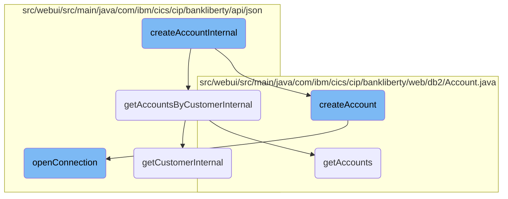
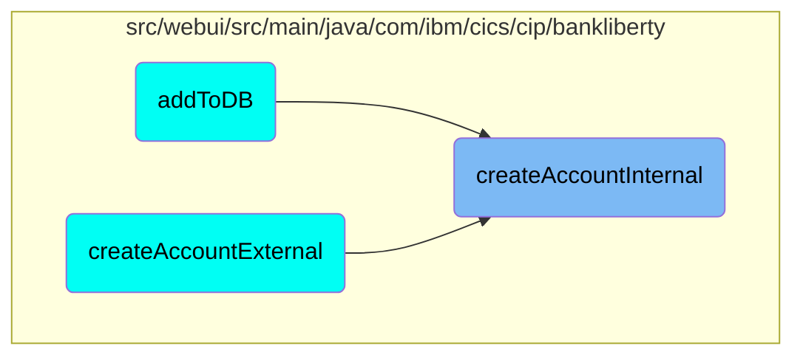

This document explains the process of creating a new account. The process involves validating the new account details, checking the customer's existing accounts, limiting the number of accounts per customer, creating the account in the database, and finalizing the account creation.

The flow starts by validating the new account details to ensure they are correct. If the details are valid, it retrieves the customer's existing accounts. If the customer has too many accounts, it stops the process. Otherwise, it creates the new account in the database and returns a response with the account details.

# Flow drill down



<SwmSnippet path="/src/webui/src/main/java/com/ibm/cics/cip/bankliberty/api/json/AccountsResource.java" line="194">

---

## Validating the New Account

The first step in <SwmToken path="src/webui/src/main/java/com/ibm/cics/cip/bankliberty/api/json/AccountsResource.java" pos="57:14:14" line-data="	private static final String CREATE_ACCOUNT_INTERNAL = &quot;createAccountInternal(AccountJSON account)&quot;;">`createAccountInternal`</SwmToken> is to validate the new account details using <SwmToken path="src/webui/src/main/java/com/ibm/cics/cip/bankliberty/api/json/AccountsResource.java" pos="194:7:7" line-data="		JSONObject error = validateNewAccount(account);">`validateNewAccount`</SwmToken>. If the validation fails, an error response is returned, ensuring that only valid account details are processed further.

```java
		JSONObject error = validateNewAccount(account);
		if (error != null)
		{
			myResponse = Response.status(400).entity(error.toString()).build();
			logger.exiting(this.getClass().getName(), CREATE_ACCOUNT_INTERNAL,
					myResponse);
			return myResponse;

```

---

</SwmSnippet>

<SwmSnippet path="/src/webui/src/main/java/com/ibm/cics/cip/bankliberty/api/json/AccountsResource.java" line="211">

---

## Checking Customer's Existing Accounts

The function then retrieves the customer's existing accounts using <SwmToken path="src/webui/src/main/java/com/ibm/cics/cip/bankliberty/api/json/AccountsResource.java" pos="212:2:2" line-data="					.getAccountsByCustomerInternal(customerNumberLong);">`getAccountsByCustomerInternal`</SwmToken>. If the customer cannot be found or accessed, an appropriate error response is returned. This ensures that the account creation process only proceeds for valid customers.

```java
			Response accountsOfThisCustomer = thisAccountsResource
					.getAccountsByCustomerInternal(customerNumberLong);
			if (accountsOfThisCustomer.getStatus() != 200)
			{
				// If accountsOfThisCustomer returns status 404, create new
				// JSONObject containing the error message
				if (accountsOfThisCustomer.getStatus() == 404)
				{
					error = new JSONObject();
					error.put(JSON_ERROR_MSG, CUSTOMER_NUMBER_LITERAL
							+ customerNumberLong.longValue() + CANNOT_BE_FOUND);
					logger.log(Level.WARNING, () -> CUSTOMER_NUMBER_LITERAL
							+ customerNumberLong.longValue() + CANNOT_BE_FOUND);
					myResponse = Response.status(404).entity(error.toString())
							.build();
					logger.exiting(this.getClass().getName(),
							CREATE_ACCOUNT_INTERNAL, myResponse);
					return myResponse;
				}
```

---

</SwmSnippet>

<SwmSnippet path="/src/webui/src/main/java/com/ibm/cics/cip/bankliberty/api/json/AccountsResource.java" line="258">

---

## Limiting the Number of Accounts

The function checks if the customer already has the maximum allowed number of accounts. If the customer has ten or more accounts, an error response is returned, enforcing the business rule that limits the number of accounts per customer.

```java
		long accountCount = (Long) myAccountsJSON.get(JSON_NUMBER_OF_ACCOUNTS);

		// Does the customer have ten or more accounts?

		if (accountCount >= MAXIMUM_ACCOUNTS_PER_CUSTOMER)
		{
			error = new JSONObject();
			error.put(JSON_ERROR_MSG,
					CUSTOMER_NUMBER_LITERAL + customerNumberLong.longValue()
							+ " cannot have more than ten accounts.");
			logger.log(Level.WARNING,
					() -> (CUSTOMER_NUMBER_LITERAL
							+ customerNumberLong.longValue()
							+ " cannot have more than ten accounts."));
			myResponse = Response.status(400).entity(error.toString()).build();
			logger.exiting(this.getClass().getName(), CREATE_ACCOUNT_INTERNAL,
					myResponse);
			return myResponse;
		}
```

---

</SwmSnippet>

<SwmSnippet path="/src/webui/src/main/java/com/ibm/cics/cip/bankliberty/web/db2/Account.java" line="723">

---

## Creating the Account

The <SwmToken path="src/webui/src/main/java/com/ibm/cics/cip/bankliberty/web/db2/Account.java" pos="723:5:5" line-data="	public Account createAccount(AccountJSON account, Integer sortcode)">`createAccount`</SwmToken> function is called to create the new account in the database. This involves opening a database connection, generating a new account number, and inserting the account details into the database.

```java
	public Account createAccount(AccountJSON account, Integer sortcode)
	{
		logger.entering(this.getClass().getName(), CREATE_ACCOUNT);

		Account temp = null;
		openConnection();
		String accountNumberString = null;

		temp = new Account();

		String sortCodeString = padSortCode(sortcode);

		Integer accountNumberInteger = 0;
		String controlString = sortcode.toString() + "-" + "ACCOUNT-LAST";
		String sqlControl = "SELECT * from CONTROL where CONTROL_NAME = ?";
		controlString = sortCodeString + "-" + "ACCOUNT-LAST";
		sqlControl = "SELECT * from CONTROL where CONTROL_NAME = ?";
		String sqlUpdate = "UPDATE CONTROL " + "SET" + " CONTROL_VALUE_NUM = ?"
				+ " WHERE CONTROL_NAME = ?";
		String sqlInsert = "INSERT INTO ACCOUNT (ACCOUNT_EYECATCHER, ACCOUNT_CUSTOMER_NUMBER, ACCOUNT_SORTCODE, ACCOUNT_NUMBER, ACCOUNT_TYPE, ACCOUNT_INTEREST_RATE, ACCOUNT_OPENED, ACCOUNT_OVERDRAFT_LIMIT, ACCOUNT_LAST_STATEMENT, ACCOUNT_NEXT_STATEMENT, ACCOUNT_AVAILABLE_BALANCE, ACCOUNT_ACTUAL_BALANCE) VALUES ('ACCT',?,?,?,?,?,?,?,?,?,0.00,0.00)";

```

---

</SwmSnippet>

<SwmSnippet path="/src/webui/src/main/java/com/ibm/cics/cip/bankliberty/api/json/AccountsResource.java" line="352">

---

## Finalizing the Account Creation

If the account creation is successful, a response with the account details is returned. This final step confirms the successful creation of the new account and provides the necessary account information.

```java
		myResponse = Response.status(201).entity(response.toString()).build();
		logger.exiting(this.getClass().getName(), CREATE_ACCOUNT_INTERNAL,
				myResponse);
		return myResponse;
```

---

</SwmSnippet>

# Where is this flow used?

This flow is used multiple times in the codebase as represented in the following diagram:



&nbsp;

*This is an auto-generated document by Swimm 🌊 and has not yet been verified by a human*

<SwmMeta version="3.0.0" repo-id="Z2l0aHViJTNBJTNBY2ljcy1iYW5raW5nLXNhbXBsZS1hcHBsaWNhdGlvbi1jYnNhLUlCTS1EZW1vLUdQVCUzQSUzQVN3aW1tLURlbW8=" repo-name="cics-banking-sample-application-cbsa-IBM-Demo-GPT"><sup>Powered by [Swimm](/)</sup></SwmMeta>
