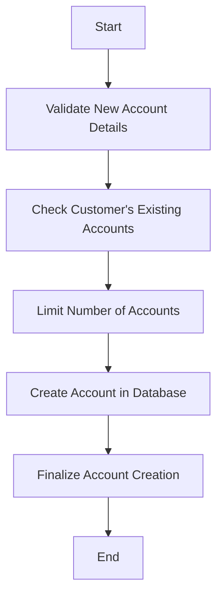

The process of creating a new account involves several steps to ensure the validity and compliance of the account creation. This document will cover:

1. Validating the new account details
2. Checking the customer's existing accounts
3. Limiting the number of accounts per customer
4. Creating the account in the database
5. Finalizing the account creation

Technical document: <SwmLink doc-title="New Account Creation Flow">[New Account Creation Flow](/.swm/new-account-creation-flow.8n1r6www.sw.md)</SwmLink>

# [Validating the New Account Details](https://app.swimm.io/repos/Z2l0aHViJTNBJTNBY2ljcy1iYW5raW5nLXNhbXBsZS1hcHBsaWNhdGlvbi1jYnNhLUlCTS1EZW1vLUdQVCUzQSUzQVN3aW1tLURlbW8=/docs/8n1r6www#validating-the-new-account)

The first step in the account creation process is to validate the new account details. This ensures that all the information provided for the new account is correct and complete. If any details are incorrect or missing, an error response is generated, and the process is halted. This step is crucial to prevent the creation of accounts with invalid or incomplete information, which could lead to issues later on.

# [Checking the Customer's Existing Accounts](https://app.swimm.io/repos/Z2l0aHViJTNBJTNBY2ljcy1iYW5raW5nLXNhbXBsZS1hcHBsaWNhdGlvbi1jYnNhLUlCTS1EZW1vLUdQVCUzQSUzQVN3aW1tLURlbW8=/docs/8n1r6www#checking-customers-existing-accounts)

After validating the new account details, the system retrieves the customer's existing accounts. This step ensures that the customer is valid and can be accessed. If the customer cannot be found or accessed, an appropriate error response is returned, and the process is stopped. This step is essential to ensure that the account creation process only proceeds for valid customers.

# [Limiting the Number of Accounts](https://app.swimm.io/repos/Z2l0aHViJTNBJTNBY2ljcy1iYW5raW5nLXNhbXBsZS1hcHBsaWNhdGlvbi1jYnNhLUlCTS1EZW1vLUdQVCUzQSUzQVN3aW1tLURlbW8=/docs/8n1r6www#limiting-the-number-of-accounts)

The system checks if the customer already has the maximum allowed number of accounts. If the customer has ten or more accounts, an error response is generated, and the process is halted. This step enforces the business rule that limits the number of accounts per customer, ensuring that customers do not exceed the allowed limit.

# [Creating the Account in the Database](https://app.swimm.io/repos/Z2l0aHViJTNBJTNBY2ljcy1iYW5raW5nLXNhbXBsZS1hcHBsaWNhdGlvbi1jYnNhLUlCTS1EZW1vLUdQVCUzQSUzQVN3aW1tLURlbW8=/docs/8n1r6www#creating-the-account)

If all previous checks are passed, the system proceeds to create the new account in the database. This involves opening a database connection, generating a new account number, and inserting the account details into the database. This step is crucial as it officially creates the account and stores all the necessary information in the database.

# [Finalizing the Account Creation](https://app.swimm.io/repos/Z2l0aHViJTNBJTNBY2ljcy1iYW5raW5nLXNhbXBsZS1hcHBsaWNhdGlvbi1jYnNhLUlCTS1EZW1vLUdQVCUzQSUzQVN3aW1tLURlbW8=/docs/8n1r6www#finalizing-the-account-creation)

Once the account is successfully created in the database, a response with the account details is returned. This final step confirms the successful creation of the new account and provides the necessary account information to the customer. This step is essential to ensure that the customer receives confirmation and details of the newly created account.

&nbsp;

*This is an auto-generated document by Swimm 🌊 and has not yet been verified by a human*

<SwmMeta version="3.0.0" repo-id="Z2l0aHViJTNBJTNBY2ljcy1iYW5raW5nLXNhbXBsZS1hcHBsaWNhdGlvbi1jYnNhLUlCTS1EZW1vLUdQVCUzQSUzQVN3aW1tLURlbW8=" repo-name="cics-banking-sample-application-cbsa-IBM-Demo-GPT">Powered by [Swimm](/)</SwmMeta>
