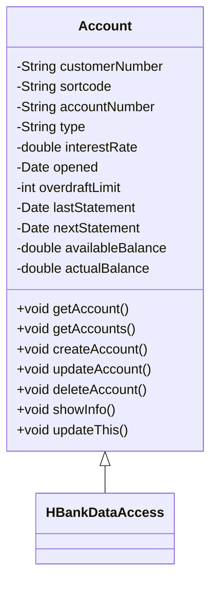

# Account Class

The <SwmToken path="src/webui/src/main/java/com/ibm/cics/cip/bankliberty/web/db2/Account.java" pos="23:4:4" line-data="public class Account extends HBankDataAccess">`Account`</SwmToken> class represents a bank account and extends the <SwmToken path="src/webui/src/main/java/com/ibm/cics/cip/bankliberty/web/db2/Account.java" pos="19:16:16" line-data="import com.ibm.cics.cip.bankliberty.api.json.HBankDataAccess;">`HBankDataAccess`</SwmToken> class, which provides database access functionalities. This class is fundamental for managing bank accounts within the application.

<SwmSnippet path="/src/webui/src/main/java/com/ibm/cics/cip/bankliberty/web/db2/Account.java" line="99">

---

These fields are used to store detailed information about each account, ensuring that all necessary data is available for account operations.

```java
	private String customerNumber;

	private String sortcode;

	private String accountNumber;

	private String type;

	private double interestRate;

	private Date opened;

	private int overdraftLimit;

	private Date lastStatement;

	private Date nextStatement;

	private double availableBalance;

	private double actualBalance;
```

---

</SwmSnippet>

# Account Methods

The <SwmToken path="src/webui/src/main/java/com/ibm/cics/cip/bankliberty/web/db2/Account.java" pos="23:4:4" line-data="public class Account extends HBankDataAccess">`Account`</SwmToken> class provides multiple methods to perform operations on accounts, including creating, updating, deleting, and retrieving account details. Key methods include <SwmToken path="src/webui/src/main/java/com/ibm/cics/cip/bankliberty/web/db2/Account.java" pos="30:14:14" line-data="	private static final String GET_ACCOUNT = &quot;getAccount(int accountNumber, int sortCode) for account &quot;;">`getAccount`</SwmToken>, <SwmToken path="src/webui/src/main/java/com/ibm/cics/cip/bankliberty/web/db2/Account.java" pos="32:14:14" line-data="	private static final String GET_ACCOUNTS_CUSTNO = &quot;getAccounts(long l, int sortCode) for customer &quot;;">`getAccounts`</SwmToken>, <SwmToken path="src/webui/src/main/java/com/ibm/cics/cip/bankliberty/web/db2/Account.java" pos="40:14:14" line-data="	private static final String CREATE_ACCOUNT = &quot;createAccount(AccountJSON account, Integer sortcode, boolean use NamedCounter)&quot;;">`createAccount`</SwmToken>, <SwmToken path="src/webui/src/main/java/com/ibm/cics/cip/bankliberty/web/db2/Account.java" pos="42:14:14" line-data="	private static final String UPDATE_ACCOUNT = &quot;updateAccount(AccountJSON account)&quot;;">`updateAccount`</SwmToken>, and <SwmToken path="src/webui/src/main/java/com/ibm/cics/cip/bankliberty/web/db2/Account.java" pos="38:14:14" line-data="	private static final String DELETE_ACCOUNT = &quot;deleteAccount(int account, int sortCode)&quot;;">`deleteAccount`</SwmToken>.

<SwmSnippet path="/src/webui/src/main/java/com/ibm/cics/cip/bankliberty/web/db2/Account.java" line="377">

---

The <SwmToken path="src/webui/src/main/java/com/ibm/cics/cip/bankliberty/web/db2/Account.java" pos="377:5:5" line-data="	public void updateThis()">`updateThis`</SwmToken> method updates the account details in the database by executing an SQL <SwmToken path="src/webui/src/main/java/com/ibm/cics/cip/bankliberty/web/db2/Account.java" pos="381:8:8" line-data="		String sql = &quot;UPDATE ACCOUNT SET ACCOUNT_TYPE = ? ,ACCOUNT_INTEREST_RATE = ? ,ACCOUNT_OVERDRAFT_LIMIT = ? ,ACCOUNT_LAST_STATEMENT = ? ,ACCOUNT_NEXT_STATEMENT = ? ,ACCOUNT_AVAILABLE_BALANCE = ? ,ACCOUNT_ACTUAL_BALANCE = ? WHERE ACCOUNT_NUMBER like ? AND ACCOUNT_SORTCODE like ?&quot;;">`UPDATE`</SwmToken> statement with the current account information.

```java
	public void updateThis()
	{
		openConnection();

		String sql = "UPDATE ACCOUNT SET ACCOUNT_TYPE = ? ,ACCOUNT_INTEREST_RATE = ? ,ACCOUNT_OVERDRAFT_LIMIT = ? ,ACCOUNT_LAST_STATEMENT = ? ,ACCOUNT_NEXT_STATEMENT = ? ,ACCOUNT_AVAILABLE_BALANCE = ? ,ACCOUNT_ACTUAL_BALANCE = ? WHERE ACCOUNT_NUMBER like ? AND ACCOUNT_SORTCODE like ?";
		try (PreparedStatement stmt = conn.prepareStatement(sql);)
		{
			stmt.setString(1, this.type);
			stmt.setDouble(2, this.interestRate);
			stmt.setInt(3, this.overdraftLimit);
			stmt.setString(4, this.lastStatement.toString());
			stmt.setString(5, this.nextStatement.toString());
			stmt.setDouble(6, this.availableBalance);
			stmt.setDouble(7, this.actualBalance);
			stmt.setString(8, this.accountNumber);
			stmt.setString(9, this.sortcode);
			stmt.executeUpdate();
		}
		catch (SQLException e)
		{
			logger.severe(e.toString());
```

---

</SwmSnippet>

# Account SQL Queries

The <SwmToken path="src/webui/src/main/java/com/ibm/cics/cip/bankliberty/web/db2/Account.java" pos="23:4:4" line-data="public class Account extends HBankDataAccess">`Account`</SwmToken> class defines several constants for SQL queries and account attributes, such as <SwmToken path="src/webui/src/main/java/com/ibm/cics/cip/bankliberty/web/db2/Account.java" pos="30:9:9" line-data="	private static final String GET_ACCOUNT = &quot;getAccount(int accountNumber, int sortCode) for account &quot;;">`GET_ACCOUNT`</SwmToken>, <SwmToken path="src/webui/src/main/java/com/ibm/cics/cip/bankliberty/web/db2/Account.java" pos="34:9:9" line-data="	private static final String GET_ACCOUNTS = &quot;getAccounts(int sortCode)&quot;;">`GET_ACCOUNTS`</SwmToken>, <SwmToken path="src/webui/src/main/java/com/ibm/cics/cip/bankliberty/web/db2/Account.java" pos="40:9:9" line-data="	private static final String CREATE_ACCOUNT = &quot;createAccount(AccountJSON account, Integer sortcode, boolean use NamedCounter)&quot;;">`CREATE_ACCOUNT`</SwmToken>, <SwmToken path="src/webui/src/main/java/com/ibm/cics/cip/bankliberty/web/db2/Account.java" pos="42:9:9" line-data="	private static final String UPDATE_ACCOUNT = &quot;updateAccount(AccountJSON account)&quot;;">`UPDATE_ACCOUNT`</SwmToken>, <SwmToken path="src/webui/src/main/java/com/ibm/cics/cip/bankliberty/web/db2/Account.java" pos="82:34:34" line-data="	private static final String SQL_SELECT = &quot;SELECT * from ACCOUNT where ACCOUNT_EYECATCHER LIKE &#39;ACCT&#39; AND ACCOUNT_NUMBER like ? and ACCOUNT_SORTCODE like ?&quot;;">`ACCOUNT_NUMBER`</SwmToken>, <SwmToken path="src/webui/src/main/java/com/ibm/cics/cip/bankliberty/web/db2/Account.java" pos="381:14:14" line-data="		String sql = &quot;UPDATE ACCOUNT SET ACCOUNT_TYPE = ? ,ACCOUNT_INTEREST_RATE = ? ,ACCOUNT_OVERDRAFT_LIMIT = ? ,ACCOUNT_LAST_STATEMENT = ? ,ACCOUNT_NEXT_STATEMENT = ? ,ACCOUNT_AVAILABLE_BALANCE = ? ,ACCOUNT_ACTUAL_BALANCE = ? WHERE ACCOUNT_NUMBER like ? AND ACCOUNT_SORTCODE like ?&quot;;">`ACCOUNT_TYPE`</SwmToken>, and others.

<SwmSnippet path="/src/webui/src/main/java/com/ibm/cics/cip/bankliberty/web/db2/Account.java" line="82">

---

These constants are used to construct SQL queries for various account operations, ensuring consistency and reducing the risk of errors.

```java
	private static final String SQL_SELECT = "SELECT * from ACCOUNT where ACCOUNT_EYECATCHER LIKE 'ACCT' AND ACCOUNT_NUMBER like ? and ACCOUNT_SORTCODE like ?";

	private static final String SQL_LESS_THAN = " AND ACCOUNT_ACTUAL_BALANCE <= ?";

	private static final String SQL_MORE_THAN = " AND ACCOUNT_ACTUAL_BALANCE >= ?";
```

---

</SwmSnippet>

# Account Logging

The <SwmToken path="src/webui/src/main/java/com/ibm/cics/cip/bankliberty/web/db2/Account.java" pos="166:5:5" line-data="	public void showInfo()">`showInfo`</SwmToken> method logs detailed information about the account, including the account number, customer number, type, interest rate, opened date, overdraft limit, last statement date, next statement date, available balance, and actual balance.

<SwmSnippet path="/src/webui/src/main/java/com/ibm/cics/cip/bankliberty/web/db2/Account.java" line="166">

---

This method is useful for debugging and monitoring account details, providing a comprehensive overview of the account's current state.

```java
	public void showInfo()
	{
		logger.log(Level.FINE, () -> "------------" + this.accountNumber + ":"
				+ this.sortcode + "------------");
		logger.log(Level.FINE,
				() -> "Customer number - " + this.customerNumber);
		logger.log(Level.FINE, () -> "Type - " + this.type);
		logger.log(Level.FINE, () -> "Interest rate - " + this.interestRate);
		logger.log(Level.FINE, () -> "Opened - " + this.opened.toString());
		logger.log(Level.FINE,
				() -> "Overdraft Limit - " + this.overdraftLimit);
		logger.log(Level.FINE,
				() -> "Last Statement - " + this.lastStatement.toString());
		logger.log(Level.FINE,
				() -> "Next Statement - " + this.nextStatement.toString());
		logger.log(Level.FINE,
				() -> "Available Balance - " + this.availableBalance);
		logger.log(Level.FINE, () -> "Actual Balance - " + this.actualBalance);
	}
```

---

</SwmSnippet>



&nbsp;

*This is an auto-generated document by Swimm 🌊 and has not yet been verified by a human*

<SwmMeta version="3.0.0" repo-id="Z2l0aHViJTNBJTNBY2ljcy1iYW5raW5nLXNhbXBsZS1hcHBsaWNhdGlvbi1jYnNhLUlCTS1EZW1vLUdQVCUzQSUzQVN3aW1tLURlbW8=" repo-name="cics-banking-sample-application-cbsa-IBM-Demo-GPT"><sup>Powered by [Swimm](/)</sup></SwmMeta>
