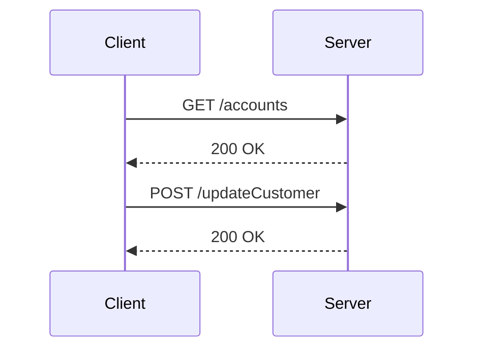

# Overview of Web UI

The Web UI refers to the WebSphere Liberty Profile User Interface. It is an Eclipse project that needs to be built using Maven. After building, the created .war file in the 'target' directory must be copied to the 'apps' folder of the JVM server. The Web UI contains the WebSphere Liberty Profile application.

## Building the Web UI

The Web UI project needs to be built using Maven. This process compiles the project and packages it into a .war file.

## Deploying the Web UI

After building the Web UI project, the generated .war file found in the 'target' directory must be copied to the 'apps' folder of the JVM server. This deployment step is essential for making the Web UI accessible.

## Main Functions

There are several main functions in this folder. Some of them are <SwmToken path="src/webui/src/main/java/com/ibm/cics/cip/bankliberty/webui/data_access/AccountList.java" pos="25:4:4" line-data="public class AccountList">`AccountList`</SwmToken>, <SwmToken path="src/webui/src/main/java/com/ibm/cics/cip/bankliberty/webui/data_access/GetUserSortCode.java" pos="12:4:4" line-data="public class GetUserSortCode">`GetUserSortCode`</SwmToken>, Account, Customer, and CustomerList. We will dive a little into <SwmToken path="src/webui/src/main/java/com/ibm/cics/cip/bankliberty/webui/data_access/AccountList.java" pos="25:4:4" line-data="public class AccountList">`AccountList`</SwmToken> and <SwmToken path="src/webui/src/main/java/com/ibm/cics/cip/bankliberty/webui/data_access/GetUserSortCode.java" pos="12:4:4" line-data="public class GetUserSortCode">`GetUserSortCode`</SwmToken>.

<SwmSnippet path="/src/webui/src/main/java/com/ibm/cics/cip/bankliberty/webui/data_access/AccountList.java" line="1">

---

### <SwmToken path="src/webui/src/main/java/com/ibm/cics/cip/bankliberty/webui/data_access/AccountList.java" pos="25:4:4" line-data="public class AccountList">`AccountList`</SwmToken>

The <SwmToken path="src/webui/src/main/java/com/ibm/cics/cip/bankliberty/webui/data_access/AccountList.java" pos="25:4:4" line-data="public class AccountList">`AccountList`</SwmToken> function is responsible for managing a list of bank accounts. It provides methods to add, remove, and retrieve accounts from the list. This function is essential for handling multiple accounts and performing operations on them.

```java
/*
 *
 *    Copyright IBM Corp. 2023
 *
 */
package com.ibm.cics.cip.bankliberty.webui.data_access;

import java.util.ArrayList;
import java.util.Calendar;
import java.util.List;
import java.util.logging.LogManager;
import java.util.logging.Logger;
import java.io.IOException;
import java.math.BigDecimal;
import java.math.RoundingMode;
import java.sql.Date;

import jakarta.ws.rs.core.Response;

import com.ibm.cics.cip.bankliberty.api.json.AccountsResource;
```

---

</SwmSnippet>

<SwmSnippet path="/src/webui/src/main/java/com/ibm/cics/cip/bankliberty/webui/data_access/GetUserSortCode.java" line="1">

---

### <SwmToken path="src/webui/src/main/java/com/ibm/cics/cip/bankliberty/webui/data_access/GetUserSortCode.java" pos="12:4:4" line-data="public class GetUserSortCode">`GetUserSortCode`</SwmToken>

The <SwmToken path="src/webui/src/main/java/com/ibm/cics/cip/bankliberty/webui/data_access/GetUserSortCode.java" pos="12:4:4" line-data="public class GetUserSortCode">`GetUserSortCode`</SwmToken> function retrieves the sort code associated with a user. This function is essential for identifying the user's bank branch and facilitating transactions that require branch-specific information.

```java
/*
 *
 *    Copyright IBM Corp. 2023
 *
 */
package com.ibm.cics.cip.bankliberty.webui.data_access;

import com.ibm.jzos.fields.*;

// Generated by com.ibm.jzos.recordgen.cobol.RecordClassGenerator on Wed Dec 14 10:38:47 GMT 2016

public class GetUserSortCode
{

	protected static CobolDatatypeFactory factory = new CobolDatatypeFactory();
	static
	{
		factory.setStringTrimDefault(false);
	}
```

---

</SwmSnippet>

## Web UI Endpoints

The Web UI provides several endpoints for interacting with the banking system.

<SwmSnippet path="/src/webui/src/main/java/com/ibm/cics/cip/bankliberty/webui/data_access/AccountList.java" line="128">

---

### <SwmToken path="src/webui/src/main/java/com/ibm/cics/cip/bankliberty/webui/data_access/AccountList.java" pos="128:7:7" line-data="				myAccountsResponse = myAccountsResource.getAccountsExternal(Integer.valueOf(0),Integer.valueOf(999999),true);">`getAccountsExternal`</SwmToken>

The <SwmToken path="src/webui/src/main/java/com/ibm/cics/cip/bankliberty/webui/data_access/AccountList.java" pos="128:7:7" line-data="				myAccountsResponse = myAccountsResource.getAccountsExternal(Integer.valueOf(0),Integer.valueOf(999999),true);">`getAccountsExternal`</SwmToken> endpoint is used to retrieve account information. It takes parameters for pagination and returns account details in JSON format.

```java
				myAccountsResponse = myAccountsResource.getAccountsExternal(Integer.valueOf(0),Integer.valueOf(999999),true);
				String myAccountsString = myAccountsResponse.getEntity().toString();
```

---

</SwmSnippet>

<SwmSnippet path="/src/webui/src/main/java/com/ibm/cics/cip/bankliberty/webui/data_access/Customer.java" line="185">

---

### <SwmToken path="src/webui/src/main/java/com/ibm/cics/cip/bankliberty/webui/data_access/Customer.java" pos="185:9:9" line-data="		Response myCustomerResponse = myCustomerResource.updateCustomerExternal(">`updateCustomerExternal`</SwmToken>

The <SwmToken path="src/webui/src/main/java/com/ibm/cics/cip/bankliberty/webui/data_access/Customer.java" pos="185:9:9" line-data="		Response myCustomerResponse = myCustomerResource.updateCustomerExternal(">`updateCustomerExternal`</SwmToken> endpoint is used to update customer information. It sends the updated customer data to the server and processes the response.

```java
		Response myCustomerResponse = myCustomerResource.updateCustomerExternal(
				Long.parseLong(this.getCustomerNumber()), myCustomerJSON);

		String myCustomerString = null;
```

---

</SwmSnippet>



&nbsp;

*This is an auto-generated document by Swimm 🌊 and has not yet been verified by a human*

<SwmMeta version="3.0.0" repo-id="Z2l0aHViJTNBJTNBY2ljcy1iYW5raW5nLXNhbXBsZS1hcHBsaWNhdGlvbi1jYnNhLUlCTS1EZW1vLUdQVCUzQSUzQVN3aW1tLURlbW8=" repo-name="cics-banking-sample-application-cbsa-IBM-Demo-GPT"><sup>Powered by [Swimm](/)</sup></SwmMeta>
