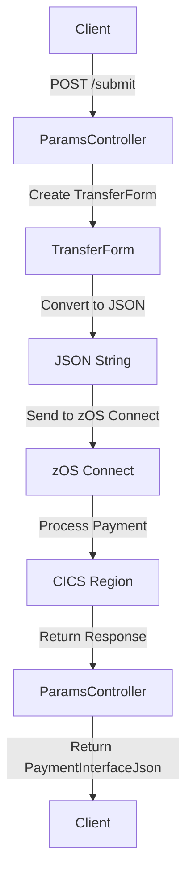

# Payment API Overview

The Payment API is a Spring Boot application designed to handle payment processing for companies interacting with CBSA Bank. It facilitates transactions by allowing companies to request payments for goods and services or issue refunds to accounts within CBSA. The API communicates with a zOS Connect server, which routes the requests to a CICS region, ensuring secure and efficient transaction processing.

## Accessing the Payment Interface

The Payment API can be accessed via a specific URL, and it provides a landing page where companies can input transaction details such as account numbers, transaction amounts, and company names. The URL structure is as follows: <http://your-host-name:your-host-port-number/paymentinterface-1.1/>.

## The Payment Landing Page

The Payment interface is comprised of one page, the landing page. From here, a company can request money (payment) for its goods and services from accounts at CBSA Bank or issue a refund to an account within CBSA.

## Requesting a Payment

To request a payment, the company (e.g., 'Gas Corp') needs to supply the account number of its customer, select the 'Debit' radio button, provide the amount, and the requesting company's name.

## Error Handling

The Payment API includes error handling mechanisms to manage issues like account not found, insufficient funds, and invalid account types. Below is a snippet from <SwmPath>[src/Z-OS-Connect-Payment-Interface/src/main/java/com/ibm/cics/cip/bank/springboot/paymentinterface/controllers/WebController.java](src/Z-OS-Connect-Payment-Interface/src/main/java/com/ibm/cics/cip/bank/springboot/paymentinterface/controllers/WebController.java)</SwmPath> that demonstrates how these errors are handled:

<SwmSnippet path="/src/Z-OS-Connect-Payment-Interface/src/main/java/com/ibm/cics/cip/bank/springboot/paymentinterface/controllers/WebController.java" line="118">

---

This code snippet shows the error handling mechanism in the Payment API. It logs the error and sets appropriate error messages in the model.

```java
		catch (AccountNotFoundException | InsufficientFundsException | InvalidAccountTypeException e)
		{
			log.info(e.toString());
			model.addAttribute(LARGE_TEXT, PAYMENT_ERROR);
			model.addAttribute(SMALL_TEXT, e.getMessage());
		}
		catch (WebClientRequestException e)
		{
			log.info(e.toString());
			model.addAttribute(LARGE_TEXT, PAYMENT_ERROR);
			model.addAttribute(SMALL_TEXT,
					"Connection refused or failed to resolve; Are you using the right address and port? Is the server running?");
		}
		catch (Exception e)
		{
			log.info(e.toString());
			model.addAttribute(LARGE_TEXT, PAYMENT_ERROR);
			model.addAttribute(SMALL_TEXT,
					"There was an error processing the request; Please try again later or check logs for more info.");
		}
```

---

</SwmSnippet>

## Payment API Endpoints

The Payment API provides several endpoints for handling different types of transactions. One of the key endpoints is <SwmToken path="src/Z-OS-Connect-Payment-Interface/src/main/java/com/ibm/cics/cip/bank/springboot/paymentinterface/controllers/ParamsController.java" pos="35:5:6" line-data="	@PostMapping(&quot;/submit&quot;)">`/submit`</SwmToken>.

### /submit Endpoint

The <SwmToken path="src/Z-OS-Connect-Payment-Interface/src/main/java/com/ibm/cics/cip/bank/springboot/paymentinterface/controllers/ParamsController.java" pos="35:5:6" line-data="	@PostMapping(&quot;/submit&quot;)">`/submit`</SwmToken> endpoint is used to handle payment submissions. It accepts parameters such as account number, amount, and organization name. The endpoint processes these parameters, creates a <SwmToken path="src/Z-OS-Connect-Payment-Interface/src/main/java/com/ibm/cics/cip/bank/springboot/paymentinterface/controllers/ParamsController.java" pos="44:1:1" line-data="		TransferForm transferForm = new TransferForm(acctNumber, amount,">`TransferForm`</SwmToken> object, converts it to JSON, and sends it to the zOS Connect server for further processing. The response from the server is then returned as a <SwmToken path="src/Z-OS-Connect-Payment-Interface/src/main/java/com/ibm/cics/cip/bank/springboot/paymentinterface/controllers/ParamsController.java" pos="36:3:3" line-data="	public PaymentInterfaceJson submit(">`PaymentInterfaceJson`</SwmToken> object.

<SwmSnippet path="/src/Z-OS-Connect-Payment-Interface/src/main/java/com/ibm/cics/cip/bank/springboot/paymentinterface/controllers/ParamsController.java" line="35">

---

This code snippet shows the implementation of the <SwmToken path="src/Z-OS-Connect-Payment-Interface/src/main/java/com/ibm/cics/cip/bank/springboot/paymentinterface/controllers/ParamsController.java" pos="35:5:6" line-data="	@PostMapping(&quot;/submit&quot;)">`/submit`</SwmToken> endpoint in the <SwmToken path="src/Z-OS-Connect-Payment-Interface/src/main/java/com/ibm/cics/cip/bank/springboot/paymentinterface/controllers/ParamsController.java" pos="23:4:4" line-data="public class ParamsController">`ParamsController`</SwmToken> class. It logs the input parameters, creates a <SwmToken path="src/Z-OS-Connect-Payment-Interface/src/main/java/com/ibm/cics/cip/bank/springboot/paymentinterface/controllers/ParamsController.java" pos="44:1:1" line-data="		TransferForm transferForm = new TransferForm(acctNumber, amount,">`TransferForm`</SwmToken>, converts it to JSON, and sends it to the zOS Connect server.

```java
	@PostMapping("/submit")
	public PaymentInterfaceJson submit(
			@RequestParam(name = "acctnum", required = true) String acctNumber,
			@RequestParam(name = "amount", required = true) float amount,
			@RequestParam(name = "organisation", required = true) String organisation)
			throws JsonProcessingException
	{
		log.info("AcctNumber: {}, Amount {}, Organisation {}", acctNumber,
				amount, organisation);
		TransferForm transferForm = new TransferForm(acctNumber, amount,
				organisation);

		PaymentInterfaceJson transferJson = new PaymentInterfaceJson(
				transferForm);

		String jsonString = new ObjectMapper().writeValueAsString(transferJson);
		log.info(jsonString);

		WebClient client = WebClient.create(
				ConnectionInfo.getAddressAndPort() + "/makepayment/dbcr");
		PaymentInterfaceJson responseObj;
```

---

</SwmSnippet>



&nbsp;

*This is an auto-generated document by Swimm 🌊 and has not yet been verified by a human*

<SwmMeta version="3.0.0" repo-id="Z2l0aHViJTNBJTNBY2ljcy1iYW5raW5nLXNhbXBsZS1hcHBsaWNhdGlvbi1jYnNhLUlCTS1EZW1vLUdQVCUzQSUzQVN3aW1tLURlbW8=" repo-name="cics-banking-sample-application-cbsa-IBM-Demo-GPT"><sup>Powered by [Swimm](/)</sup></SwmMeta>
