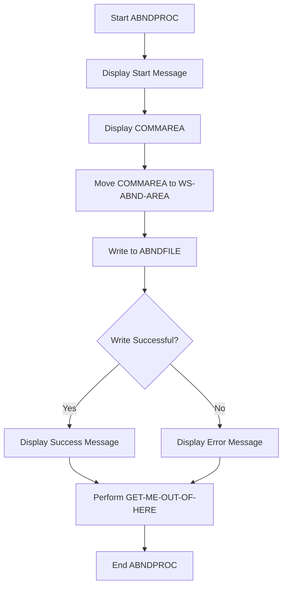

This document will cover the ABNDPROC program. We'll cover:

1. What the Program Does
2. Program Flow
3. Program Sections

## What the Program Does

The ABNDPROC program processes application abends (abnormal ends) and writes them to a centralized VSAM (Virtual Storage Access Method) datastore. This allows for centralized viewing of abend information without needing to search through multiple locations. The program reads the abend information from the communication area (DFHCOMMAREA) and writes it to the 'ABNDFILE' VSAM file.

## Program Flow

This is a visualization of the flow:



<SwmSnippet path="/src/base/cobol_src/ABNDPROC.cbl" line="130">

---

### PREMIERE SECTION

First, the program starts by displaying a start message and the contents of the communication area (DFHCOMMAREA). It then moves the contents of DFHCOMMAREA to <SwmToken path="src/base/cobol_src/ABNDPROC.cbl" pos="139:7:11" line-data="           MOVE DFHCOMMAREA TO WS-ABND-AREA.">`WS-ABND-AREA`</SwmToken>. Next, it attempts to write the abend information to the 'ABNDFILE' VSAM file. If the write is successful, it displays a success message. If the write fails, it displays an error message with the response codes. Finally, it performs the <SwmToken path="src/base/cobol_src/ABNDPROC.cbl" pos="169:1:9" line-data="       GET-ME-OUT-OF-HERE SECTION.">`GET-ME-OUT-OF-HERE`</SwmToken> section.

```cobol
       PROCEDURE DIVISION USING DFHCOMMAREA.
       PREMIERE SECTION.
       A010.


      D    DISPLAY 'Started ABNDPROC:'.
      D    DISPLAY 'COMMAREA passed=' DFHCOMMAREA.


           MOVE DFHCOMMAREA TO WS-ABND-AREA.

           EXEC CICS WRITE
              FILE('ABNDFILE')
              FROM(WS-ABND-AREA)
              RIDFLD(ABND-VSAM-KEY)
              RESP(WS-CICS-RESP)
              RESP2(WS-CICS-RESP2)
           END-EXEC.

           IF WS-CICS-RESP NOT= DFHRESP(NORMAL)
              DISPLAY '*********************************************'
```

---

</SwmSnippet>

<SwmSnippet path="/src/base/cobol_src/ABNDPROC.cbl" line="169">

---

### <SwmToken path="src/base/cobol_src/ABNDPROC.cbl" pos="169:1:9" line-data="       GET-ME-OUT-OF-HERE SECTION.">`GET-ME-OUT-OF-HERE`</SwmToken> SECTION

Then, the <SwmToken path="src/base/cobol_src/ABNDPROC.cbl" pos="169:1:9" line-data="       GET-ME-OUT-OF-HERE SECTION.">`GET-ME-OUT-OF-HERE`</SwmToken> section is executed, which simply returns control to CICS and ends the program.

```cobol
       GET-ME-OUT-OF-HERE SECTION.
       GMOOH010.
           EXEC CICS RETURN
           END-EXEC.
           GOBACK.

       GMOOH999.
           EXIT.
```

---

</SwmSnippet>

&nbsp;

*This is an auto-generated document by Swimm 🌊 and has not yet been verified by a human*

<SwmMeta version="3.0.0" repo-id="Z2l0aHViJTNBJTNBY2ljcy1iYW5raW5nLXNhbXBsZS1hcHBsaWNhdGlvbi1jYnNhLUlCTS1EZW1vLUdQVCUzQSUzQVN3aW1tLURlbW8=" repo-name="cics-banking-sample-application-cbsa-IBM-Demo-GPT"><sup>Powered by [Swimm](/)</sup></SwmMeta>
