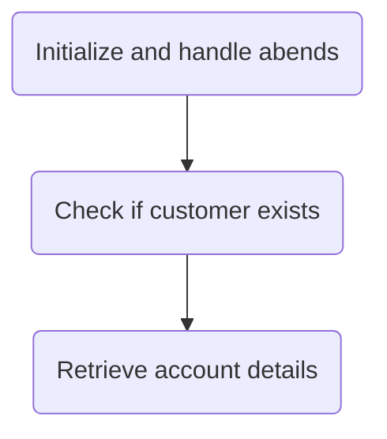
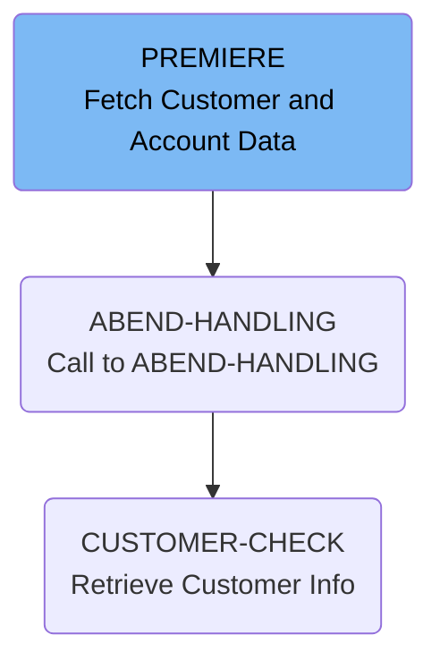
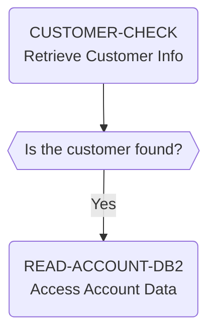

The INQACCCU program accepts a customer number as input and retrieves the associated account records that match the customer number.



# Flow drill down

First, we'll zoom into this section of the flow:



<SwmSnippet path="src/base/cobol_src/INQACCCU.cbl" line="194" repo-id="Z2l0aHViJTNBJTNBY2ljcy1iYW5raW5nLXNhbXBsZS1hcHBsaWNhdGlvbi1jYnNhLUlCTS1EZW1vJTNBJTNBU3dpbW0tRGVtbw==">

---

## PREMIERE

This section retrieves customer and account information from a DB2 database. It first checks if the customer exists by calling the INQCUST program, and if found, proceeds to fetch the account details for that customer from the DB2 database using a cursor.

```
       PREMIERE SECTION.
       A010.
           MOVE 'N' TO COMM-SUCCESS
           MOVE '0' TO COMM-FAIL-CODE

           EXEC CICS HANDLE ABEND
              LABEL(ABEND-HANDLING)
           END-EXEC.

           MOVE SORTCODE TO REQUIRED-SORT-CODE OF CUSTOMER-KY.

      *
      *    CUSTOMER-CHECK LINKS to program INQCUST to retrieve the
      *    customer information.
      *

           PERFORM CUSTOMER-CHECK.
```

---

</SwmSnippet>

<SwmSnippet path="src/base/cobol_src/INQACCCU.cbl" line="688" repo-id="Z2l0aHViJTNBJTNBY2ljcy1iYW5raW5nLXNhbXBsZS1hcHBsaWNhdGlvbi1jYnNhLUlCTS1EZW1vJTNBJTNBU3dpbW0tRGVtbw==">

---

### ABEND-HANDLING

This section handles abnormal program terminations (ABENDs) by evaluating the abnormal code and taking appropriate action.

```
       ABEND-HANDLING SECTION.
       AH010.

           EXEC CICS ASSIGN
              ABCODE(MY-ABEND-CODE)
           END-EXEC.

      *
      *    Evaluate the Abend code that is returned
      *     - For DB2 AD2Z ... provide some diagnostics.
      *     - For VSAM RLS abends: AFCR, AFCS and AFCT record the
      *       Abend as happening but do not abend ... leave this to
      *       CPSM WLM "Storm drain" (Abend probability) to handle
      *     If not a "storm drain" ... take the abend afterwards
      *
           EVALUATE MY-ABEND-CODE
```

---

</SwmSnippet>

Now, lets zoom into this section of the flow:



<SwmSnippet path="src/base/cobol_src/INQACCCU.cbl" line="829" repo-id="Z2l0aHViJTNBJTNBY2ljcy1iYW5raW5nLXNhbXBsZS1hcHBsaWNhdGlvbi1jYnNhLUlCTS1EZW1vJTNBJTNBU3dpbW0tRGVtbw==">

---

### CUSTOMER-CHECK

This section retrieves customer information by linking to the INQCUST program, which queries the customer details based on the customer number provided in the communication area.

```
       CUSTOMER-CHECK SECTION.
       CC010.
      *
      *    Retrieve customer information by linking to INQCUST
      *

           IF CUSTOMER-NUMBER IN DFHCOMMAREA = ZERO
              MOVE 'N' TO CUSTOMER-FOUND
              MOVE ZERO TO NUMBER-OF-ACCOUNTS
              GO TO CC999
           END-IF.

           IF CUSTOMER-NUMBER IN DFHCOMMAREA = '9999999999'
              MOVE 'N' TO CUSTOMER-FOUND
              MOVE ZERO TO NUMBER-OF-ACCOUNTS
              GO TO CC999
           END-IF.
```

---

</SwmSnippet>

<SwmSnippet path="/src/base/cobol_src/INQACCCU.cbl" line="233" repo-id="Z2l0aHViJTNBJTNBY2ljcy1iYW5raW5nLXNhbXBsZS1hcHBsaWNhdGlvbi1jYnNhLUlCTS1EZW1vJTNBJTNBU3dpbW0tRGVtbw==">

---

## <SwmToken path="/src/base/cobol_src/INQACCCU.cbl" pos="233:1:5" line-data="       READ-ACCOUNT-DB2 SECTION." repo-id="Z2l0aHViJTNBJTNBY2ljcy1iYW5raW5nLXNhbXBsZS1hcHBsaWNhdGlvbi1jYnNhLUlCTS1EZW1vJTNBJTNBU3dpbW0tRGVtbw==" repo-name="cics-banking-sample-application-cbsa">`READ-ACCOUNT-DB2`</SwmToken>

The `READ-ACCOUNT-DB2` function is responsible for opening a DB2 cursor to retrieve accounts from the account datastore using the customer number and sort code from the COMMAREA. It checks if the cursor open was successful and sets the `COMM-SUCCESS` flag to 'N' and the `COMM-FAIL-CODE` to '2' if there was an error. It also checks for storm drain processing if activated and sets the `COMM-SUCCESS` flag to 'N' and the `COMM-FAIL-CODE` to '4' if there was an error. Finally, it closes the DB2 cursor and sets the `COMM-SUCCESS` flag to 'Y' if the cursor close was successful.

```cobol
       READ-ACCOUNT-DB2 SECTION.
       RAD010.
      *
      *    Get accounts from account datastore
      *

      *
      *    Open the DB2 CURSOR
      *

           MOVE CUSTOMER-NUMBER IN DFHCOMMAREA TO HV-ACCOUNT-CUST-NO.
           MOVE  SORTCODE TO HV-ACCOUNT-SORTCODE.
```

---

</SwmSnippet>

<SwmSnippet path="/src/base/cobol_src/INQACCCU.cbl" line="454" repo-id="Z2l0aHViJTNBJTNBY2ljcy1iYW5raW5nLXNhbXBsZS1hcHBsaWNhdGlvbi1jYnNhLUlCTS1EZW1vJTNBJTNBU3dpbW0tRGVtbw==">

---

### `FETCH-DATA`&nbsp;

The `FETCH-DATA` function is responsible for fetching the account details from the database cursor. It uses the `ACCOUNT-DETAILS` structure to store the fetched data. If any errors occur during the fetch, the function handles them by setting the appropriate flags and invoking the error handler.

```cobol
       FETCH-DATA SECTION.
       FD010.
      *
      *    Fetch each account in turn, & store data until there are no
      *    more rows to process. (There is a maximum of 20 accounts per
      *    customer).
      *
           MOVE ZERO TO NUMBER-OF-ACCOUNTS.

           PERFORM UNTIL SQLCODE NOT = 0 OR
           NUMBER-OF-ACCOUNTS = 20
```

---

</SwmSnippet>

*This is an auto-generated document by Swimm AI 🌊 and has not yet been verified by a human*

<SwmMeta version="3.0.0"><sup>Powered by [Swimm](https://staging.swimm.cloud/)</sup></SwmMeta>
