This document explains the process of retrieving account data based on different filters such as balance, account number, and customer number. The process involves clearing the current list of accounts, calling the appropriate method to fetch the data, and then parsing the response to update the list of accounts.

The flow starts by clearing the current list of accounts. Then, based on the filter provided, it calls the appropriate method to fetch the account data. Once the data is fetched, it parses the response and updates the list of accounts with the new data.

# Flow drill down

```mermaid
graph TD;
      subgraph srcwebuisrcmainjavacomibmcicscipbankliberty["src/webui/src/main/java/com/ibm/cics/cip/bankliberty"]
ac821f430a9f96b4dd5d98762ec5cd0458db600734c152093f997c625a6c232a(doGet):::mainFlowStyle --> 794e13c52f4e067a87b3998ca069abfaaab55aaf982fa884b761de1fd2bed917(howMany)
end

subgraph srcwebuisrcmainjavacomibmcicscipbankliberty["src/webui/src/main/java/com/ibm/cics/cip/bankliberty"]
ac821f430a9f96b4dd5d98762ec5cd0458db600734c152093f997c625a6c232a(doGet):::mainFlowStyle --> 54c76050bc31bae722ccb4eba88977a371def7041a6eaef2a7b9a65d25d3b5e2(getAccountsByCustomerExternal)
end

subgraph srcwebuisrcmainjavacomibmcicscipbankliberty["src/webui/src/main/java/com/ibm/cics/cip/bankliberty"]
ac821f430a9f96b4dd5d98762ec5cd0458db600734c152093f997c625a6c232a(doGet):::mainFlowStyle --> 4f2f0bafd943f550283f3afd1a1767bc07cf86c38a74a3579f8789f97cd47fbb(getAccountsExternal)
end

subgraph srcwebuisrcmainjavacomibmcicscipbankliberty["src/webui/src/main/java/com/ibm/cics/cip/bankliberty"]
ac821f430a9f96b4dd5d98762ec5cd0458db600734c152093f997c625a6c232a(doGet):::mainFlowStyle --> e43313d53c6cce88a6bb3670816a64c497a6fee87272cb391fdc984910ee32a1(getAccountsByBalanceWithOffsetAndLimitExternal):::mainFlowStyle
end

subgraph srcwebuisrcmainjavacomibmcicscipbankliberty["src/webui/src/main/java/com/ibm/cics/cip/bankliberty"]
e43313d53c6cce88a6bb3670816a64c497a6fee87272cb391fdc984910ee32a1(getAccountsByBalanceWithOffsetAndLimitExternal):::mainFlowStyle --> 0a5d1f571b1877e6a39e7db30f58096b297abe3220c2e11f6f5fb4ea449a9b39(getAccountsByBalanceWithOffsetAndLimitInternal):::mainFlowStyle
end

subgraph srcwebuisrcmainjavacomibmcicscipbankliberty["src/webui/src/main/java/com/ibm/cics/cip/bankliberty"]
4f2f0bafd943f550283f3afd1a1767bc07cf86c38a74a3579f8789f97cd47fbb(getAccountsExternal) --> 8c29c8c7270508b4037a5859e90f131ddfde51a2fc89f18d806b01ddcea980f8(getAccountsInternal)
end

subgraph srcwebuisrcmainjavacomibmcicscipbankliberty["src/webui/src/main/java/com/ibm/cics/cip/bankliberty"]
54c76050bc31bae722ccb4eba88977a371def7041a6eaef2a7b9a65d25d3b5e2(getAccountsByCustomerExternal) --> 9f1d4b63259741678a7c0c7ed2019d4a91de568c643875c72c5810e44e5ba0fc(getAccountsByCustomerInternal)
end

subgraph srcwebuisrcmainjavacomibmcicscipbankliberty["src/webui/src/main/java/com/ibm/cics/cip/bankliberty"]
794e13c52f4e067a87b3998ca069abfaaab55aaf982fa884b761de1fd2bed917(howMany) --> 54c76050bc31bae722ccb4eba88977a371def7041a6eaef2a7b9a65d25d3b5e2(getAccountsByCustomerExternal)
end

subgraph srcwebuisrcmainjavacomibmcicscipbankliberty["src/webui/src/main/java/com/ibm/cics/cip/bankliberty"]
794e13c52f4e067a87b3998ca069abfaaab55aaf982fa884b761de1fd2bed917(howMany) --> 4f2f0bafd943f550283f3afd1a1767bc07cf86c38a74a3579f8789f97cd47fbb(getAccountsExternal)
end


      classDef mainFlowStyle color:#000000,fill:#7CB9F4
classDef rootsStyle color:#000000,fill:#00FFF4
classDef Style1 color:#000000,fill:#00FFAA
classDef Style2 color:#000000,fill:#FFFF00
classDef Style3 color:#000000,fill:#AA7CB9
```



<SwmSnippet path="/src/webui/src/main/java/com/ibm/cics/cip/bankliberty/webui/data_access/AccountList.java" line="167">

---

## Filtering and retrieving account data

The <SwmToken path="src/webui/src/main/java/com/ibm/cics/cip/bankliberty/webui/data_access/AccountList.java" pos="167:5:5" line-data="	public void doGet(int limit, int offset, String filter) throws IOException">`doGet`</SwmToken> method is responsible for retrieving account data based on different filters such as balance, account number, and customer number. It clears the current list of accounts and then calls the appropriate method from <SwmToken path="src/webui/src/main/java/com/ibm/cics/cip/bankliberty/webui/data_access/AccountList.java" pos="170:1:1" line-data="		AccountsResource myAccountsResource = new AccountsResource();">`AccountsResource`</SwmToken> to fetch the data. The response is then parsed, and the account details are added to the list of accounts.

```java
	public void doGet(int limit, int offset, String filter) throws IOException
	{

		AccountsResource myAccountsResource = new AccountsResource();

		Response myAccountsResponse = null;
		String myAccountsString = null;
		JSONObject myAccountsJSON = null;

		try
		{

			if (filter.contains(" AND ACCOUNT_AVAILABLE_BALANCE"))
			{
				this.listOfAccounts.clear();
				String operator = filter.substring(31, 32);
				BigDecimal balance = BigDecimal
						.valueOf(Double.parseDouble(filter.substring(34)));

				myAccountsResponse = myAccountsResource
						.getAccountsByBalanceWithOffsetAndLimitExternal(balance,
```

---

</SwmSnippet>

<SwmSnippet path="/src/webui/src/main/java/com/ibm/cics/cip/bankliberty/webui/data_access/AccountList.java" line="75">

---

### Counting accounts based on filters

The <SwmToken path="src/webui/src/main/java/com/ibm/cics/cip/bankliberty/webui/data_access/AccountList.java" pos="75:5:5" line-data="	public int howMany(String filter)">`howMany`</SwmToken> method counts the number of accounts that match the given filter. It calls different methods from <SwmToken path="src/webui/src/main/java/com/ibm/cics/cip/bankliberty/webui/data_access/AccountList.java" pos="81:1:1" line-data="		AccountsResource myAccountsResource = new AccountsResource();">`AccountsResource`</SwmToken> based on the filter criteria and updates the count of accounts.

```java
	public int howMany(String filter)
	{

		// AND ACCOUNT_NUMBER = 0000000024
		// AND ACCOUNT_CUSTOMER_NUMBER

		AccountsResource myAccountsResource = new AccountsResource();
		Response myAccountsResponse = null;
		this.count = 0;

		try
		{
			if (filter.contains("AND ACCOUNT_AVAILABLE_BALANCE"))
			{
				// 01234567890123456789012345678901234567890
				// AND ACCOUNT_AVAILABLE_BALANCE <= 33558.0

				String operator = filter.substring(31, 32);
				BigDecimal balance = BigDecimal
						.valueOf(Double.parseDouble(filter.substring(34)));

```

---

</SwmSnippet>

<SwmSnippet path="/src/webui/src/main/java/com/ibm/cics/cip/bankliberty/api/json/AccountsResource.java" line="471">

---

### Retrieving accounts by customer number

The <SwmToken path="src/webui/src/main/java/com/ibm/cics/cip/bankliberty/api/json/AccountsResource.java" pos="474:5:5" line-data="	public Response getAccountsByCustomerExternal(">`getAccountsByCustomerExternal`</SwmToken> method retrieves accounts owned by a specified customer. It calls the internal method <SwmToken path="src/webui/src/main/java/com/ibm/cics/cip/bankliberty/api/json/AccountsResource.java" pos="482:7:7" line-data="		Response myResponse = getAccountsByCustomerInternal(customerNumber);">`getAccountsByCustomerInternal`</SwmToken> and returns the response.

```java
	@GET
	@Path("/retrieveByCustomerNumber/{customerNumber}")
	@Produces("application/json")
	public Response getAccountsByCustomerExternal(
			@PathParam(JSON_CUSTOMER_NUMBER) Long customerNumber,
			@QueryParam("countOnly") Boolean countOnly)
	{
		/** This will list accounts owned by a specified customer */
		logger.entering(this.getClass().getName(),
				"getAccountsByCustomerExternal(Long customerNumber, Boolean countOnly)");

		Response myResponse = getAccountsByCustomerInternal(customerNumber);
		HBankDataAccess myHBankDataAccess = new HBankDataAccess();
		myHBankDataAccess.terminate();
		logger.exiting(this.getClass().getName(),
				"getAccountsByCustomerExternal(Long customerNumber, Boolean countOnly)",
				myResponse);
		return myResponse;
	}
```

---

</SwmSnippet>

<SwmSnippet path="/src/webui/src/main/java/com/ibm/cics/cip/bankliberty/api/json/AccountsResource.java" line="1342">

---

### Retrieving accounts with pagination

The <SwmToken path="src/webui/src/main/java/com/ibm/cics/cip/bankliberty/api/json/AccountsResource.java" pos="1344:5:5" line-data="	public Response getAccountsExternal(@QueryParam(&quot;limit&quot;) Integer limit,">`getAccountsExternal`</SwmToken> method retrieves a fixed number of accounts starting at a specified offset. It calls the internal method <SwmToken path="src/webui/src/main/java/com/ibm/cics/cip/bankliberty/api/json/AccountsResource.java" pos="1357:7:7" line-data="		Response myResponse = getAccountsInternal(limit, offset, countOnlyReal);">`getAccountsInternal`</SwmToken> and returns the response.

```java
	@GET
	@Produces("application/json")
	public Response getAccountsExternal(@QueryParam("limit") Integer limit,
			@QueryParam("offset") Integer offset,
			@QueryParam("countOnly") Boolean countOnly)
	{
		// This method returns a fixed number of accounts, up to limit "limit",
		// starting at offset "offset"
		logger.entering(this.getClass().getName(),
				"getAccountsExternal(Integer limit, Integer offset,Boolean countOnly)");
		boolean countOnlyReal = false;
		if (countOnly != null)
		{
			countOnlyReal = countOnly.booleanValue();
		}
		Response myResponse = getAccountsInternal(limit, offset, countOnlyReal);
		HBankDataAccess myHBankDataAccess = new HBankDataAccess();
		myHBankDataAccess.terminate();
		logger.exiting(this.getClass().getName(),
				"getAccountsExternal(Integer limit, Integer offset,Boolean countOnly)",
				myResponse);
```

---

</SwmSnippet>

<SwmSnippet path="/src/webui/src/main/java/com/ibm/cics/cip/bankliberty/api/json/AccountsResource.java" line="1462">

---

### Retrieving accounts by balance

The <SwmToken path="src/webui/src/main/java/com/ibm/cics/cip/bankliberty/api/json/AccountsResource.java" pos="1465:5:5" line-data="	public Response getAccountsByBalanceWithOffsetAndLimitExternal(">`getAccountsByBalanceWithOffsetAndLimitExternal`</SwmToken> method retrieves accounts that match a specified balance condition. It calls the internal method <SwmToken path="src/webui/src/main/java/com/ibm/cics/cip/bankliberty/api/json/AccountsResource.java" pos="1481:7:7" line-data="		Response myResponse = getAccountsByBalanceWithOffsetAndLimitInternal(">`getAccountsByBalanceWithOffsetAndLimitInternal`</SwmToken> and returns the response.

```java
	@GET
	@Path("/balance")
	@Produces("application/json")
	public Response getAccountsByBalanceWithOffsetAndLimitExternal(
			@QueryParam("balance") BigDecimal balance,
			@QueryParam("operator") String operator,
			@QueryParam("offset") Integer offset,
			@QueryParam("limit") Integer limit,
			@QueryParam("countOnly") Boolean countOnly)
	{
		// return only accounts with a certain balance
		logger.entering(this.getClass().getName(),
				"getAccountsByBalanceWithOffsetAndLimitExternal(BigDecimal balance, String operator, Integer offset, Integer limit, Boolean countOnly");
		boolean countOnlyReal = false;
		if (countOnly != null)
		{
			countOnlyReal = countOnly.booleanValue();
		}

		Response myResponse = getAccountsByBalanceWithOffsetAndLimitInternal(
				balance, operator, offset, limit, countOnlyReal);
```

---

</SwmSnippet>

<SwmSnippet path="/src/webui/src/main/java/com/ibm/cics/cip/bankliberty/api/json/AccountsResource.java" line="1492">

---

### Internal method for retrieving accounts by balance

The <SwmToken path="src/webui/src/main/java/com/ibm/cics/cip/bankliberty/api/json/AccountsResource.java" pos="1492:5:5" line-data="	public Response getAccountsByBalanceWithOffsetAndLimitInternal(">`getAccountsByBalanceWithOffsetAndLimitInternal`</SwmToken> method performs the actual retrieval of accounts that match the balance condition. It handles the logic for filtering accounts based on the balance and pagination parameters.

```java
	public Response getAccountsByBalanceWithOffsetAndLimitInternal(
			@QueryParam("balance") BigDecimal balance,
			@QueryParam("operator") String operator,
			@QueryParam("offset") Integer offset,
			@QueryParam("limit") Integer limit, boolean countOnly)
	{
		// return only accounts with a certain balance
		logger.entering(this.getClass().getName(),
				GET_ACCOUNTS_BY_BALANCE_WITH_OFFSET_AND_LIMIT_INTERNAL);
		Response myResponse = null;
		boolean lessThan;
		if (!operator.startsWith("<") && !(operator.startsWith(">")))
		{
			JSONObject error = new JSONObject();
			error.put(JSON_ERROR_MSG, "Invalid operator, '" + operator
					+ "' only <= or >= allowed");
			logger.log(Level.WARNING, () -> "Invalid operator, '" + operator
					+ "' only <= or >= allowed");
			logger.exiting(this.getClass().getName(),
					GET_ACCOUNTS_BY_BALANCE_WITH_OFFSET_AND_LIMIT_INTERNAL,
					myResponse);
```

---

</SwmSnippet>

<SwmSnippet path="/src/webui/src/main/java/com/ibm/cics/cip/bankliberty/api/json/AccountsResource.java" line="1367">

---

### Internal method for retrieving accounts

The <SwmToken path="src/webui/src/main/java/com/ibm/cics/cip/bankliberty/api/json/AccountsResource.java" pos="1367:5:5" line-data="	public Response getAccountsInternal(Integer limit, Integer offset,">`getAccountsInternal`</SwmToken> method performs the actual retrieval of accounts based on the limit and offset parameters. It handles the logic for counting and fetching account details.

```java
	public Response getAccountsInternal(Integer limit, Integer offset,
			boolean countOnly)
	{
		logger.entering(this.getClass().getName(),
				"getAccountsInternal(Integer limit, Integer offset,boolean countOnly)");
		Response myResponse = null;

		com.ibm.cics.cip.bankliberty.web.db2.Account db2Account = null;
		JSONObject response = new JSONObject();
		JSONArray accounts = null;
		int numberOfAccounts = 0;
		Integer sortCode = this.getSortCode();
		// We want to set a limit to try to avoid OutOfMemory Exceptions.
		// 250,000 seems a bit large
		if (limit == null)
		{
			limit = 250000;
		}
		if (limit == 0)
		{
			limit = 250000;
```

---

</SwmSnippet>

<SwmSnippet path="/src/webui/src/main/java/com/ibm/cics/cip/bankliberty/api/json/AccountsResource.java" line="492">

---

### Internal method for retrieving accounts by customer number

The <SwmToken path="src/webui/src/main/java/com/ibm/cics/cip/bankliberty/api/json/AccountsResource.java" pos="492:5:5" line-data="	public Response getAccountsByCustomerInternal(">`getAccountsByCustomerInternal`</SwmToken> method performs the actual retrieval of accounts owned by a specified customer. It handles the logic for fetching account details and constructing the response.

```java
	public Response getAccountsByCustomerInternal(
			@PathParam(JSON_CUSTOMER_NUMBER) Long customerNumber)
	{
		logger.entering(this.getClass().getName(),
				GET_ACCOUNTS_BY_CUSTOMER_INTERNAL);

		JSONArray accounts = null;
		Response myResponse = null;

		JSONObject response = new JSONObject();
		Integer sortCode = this.getSortCode();
		int numberOfAccounts = 0;

		CustomerResource myCustomer = new CustomerResource();
		Response customerResponse = myCustomer
				.getCustomerInternal(customerNumber);

		if (customerResponse.getStatus() != 200)
		{
			if (customerResponse.getStatus() == 404)
			{
```

---

</SwmSnippet>

&nbsp;

*This is an auto-generated document by Swimm 🌊 and has not yet been verified by a human*

<SwmMeta version="3.0.0" repo-id="Z2l0aHViJTNBJTNBY2ljcy1iYW5raW5nLXNhbXBsZS1hcHBsaWNhdGlvbi1jYnNhLUlCTS1EZW1vLUdQVCUzQSUzQVN3aW1tLURlbW8=" repo-name="cics-banking-sample-application-cbsa-IBM-Demo-GPT"><sup>Powered by [Swimm](/)</sup></SwmMeta>
