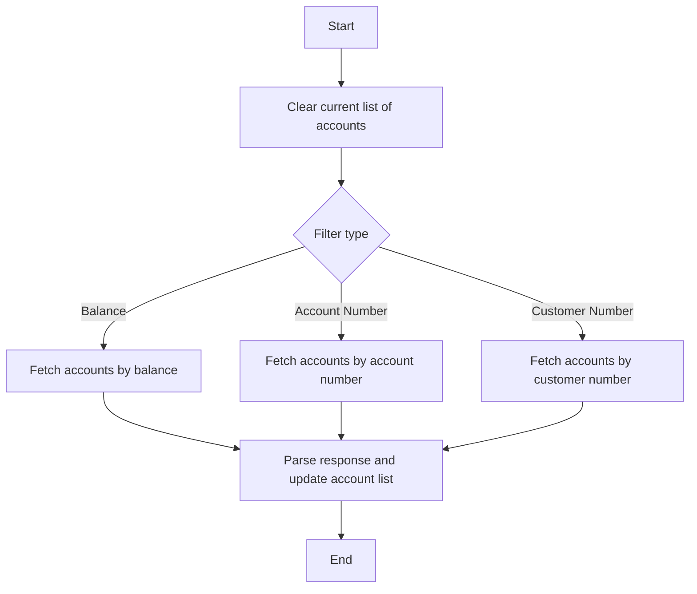

This document will cover the process of retrieving account data based on different filters. We'll cover:

1. Clearing the current list of accounts
2. Fetching account data based on filters
3. Parsing the response and updating the account list.

Technical document: <SwmLink doc-title="Retrieving Account Data Flow">[Retrieving Account Data Flow](/.swm/retrieving-account-data-flow.ksf8d87t.sw.md)</SwmLink>

# [Clearing the current list of accounts](https://app.swimm.io/repos/Z2l0aHViJTNBJTNBY2ljcy1iYW5raW5nLXNhbXBsZS1hcHBsaWNhdGlvbi1jYnNhLUlCTS1EZW1vLUdQVCUzQSUzQVN3aW1tLURlbW8=/docs/ksf8d87t#the-flow-starts-by-clearing-the-current-list-of-accounts)

The first step in the process is to clear the current list of accounts. This ensures that any previous data is removed, and the list is ready to be populated with new data. This step is crucial for maintaining data accuracy and preventing the display of outdated or irrelevant account information to the user.

# [Fetching account data based on filters](https://app.swimm.io/repos/Z2l0aHViJTNBJTNBY2ljcy1iYW5raW5nLXNhbXBsZS1hcHBsaWNhdGlvbi1jYnNhLUlCTS1EZW1vLUdQVCUzQSUzQVN3aW1tLURlbW8=/docs/ksf8d87t#then-based-on-the-filter-provided-it-calls-the-appropriate-method-to-fetch-the-account-data)

Depending on the filter criteria provided by the user, the system will call the appropriate method to fetch the account data. The filters can include balance, account number, or customer number. For example, if the user wants to see accounts with a specific balance, the system will fetch accounts that match that balance condition. This step ensures that the user receives the most relevant account data based on their specified criteria.

# [Parsing the response and updating the account list](https://app.swimm.io/repos/Z2l0aHViJTNBJTNBY2ljcy1iYW5raW5nLXNhbXBsZS1hcHBsaWNhdGlvbi1jYnNhLUlCTS1EZW1vLUdQVCUzQSUzQVN3aW1tLURlbW8=/docs/ksf8d87t#once-the-data-is-fetched-it-parses-the-response-and-updates-the-list-of-accounts-with-the-new-data)

After fetching the account data, the system will parse the response to extract the relevant account details. These details are then used to update the list of accounts. This step ensures that the user interface displays the most up-to-date account information, providing a seamless and accurate experience for the user.

&nbsp;

*This is an auto-generated document by Swimm 🌊 and has not yet been verified by a human*

<SwmMeta version="3.0.0" repo-id="Z2l0aHViJTNBJTNBY2ljcy1iYW5raW5nLXNhbXBsZS1hcHBsaWNhdGlvbi1jYnNhLUlCTS1EZW1vLUdQVCUzQSUzQVN3aW1tLURlbW8=" repo-name="cics-banking-sample-application-cbsa-IBM-Demo-GPT">Powered by [Swimm](/)</SwmMeta>
