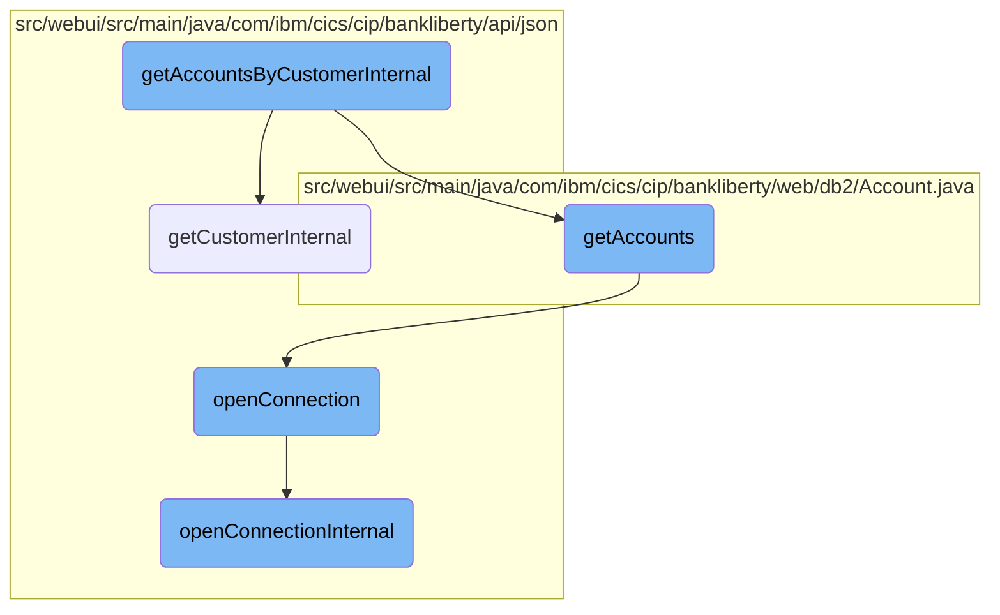
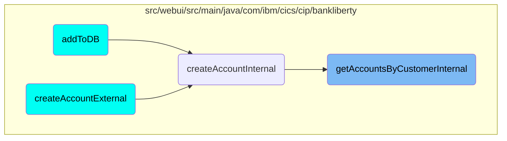

This document explains the process of retrieving accounts associated with a specific customer. The process involves several steps including customer retrieval, account fetching, and database connection management.

The flow starts by trying to get the customer's details. If the customer is found, it then fetches the accounts linked to that customer. If any step fails, appropriate error messages are returned. Finally, it compiles the account details into a JSON response and sends it back.

# Flow drill down



<SwmSnippet path="/src/webui/src/main/java/com/ibm/cics/cip/bankliberty/api/json/AccountsResource.java" line="492">

---

## Handling customer retrieval and account fetching

The <SwmToken path="src/webui/src/main/java/com/ibm/cics/cip/bankliberty/api/json/AccountsResource.java" pos="492:5:5" line-data="	public Response getAccountsByCustomerInternal(">`getAccountsByCustomerInternal`</SwmToken> function is responsible for retrieving accounts associated with a specific customer. It first attempts to retrieve customer details using <SwmToken path="src/webui/src/main/java/com/ibm/cics/cip/bankliberty/api/json/AccountsResource.java" pos="507:2:2" line-data="				.getCustomerInternal(customerNumber);">`getCustomerInternal`</SwmToken>. If the customer is not found, it returns a 404 error. If the customer is found, it proceeds to fetch the accounts using <SwmToken path="src/webui/src/main/java/com/ibm/cics/cip/bankliberty/web/db2/Account.java" pos="504:7:7" line-data="	public Account[] getAccounts(long l, int sortCode)">`getAccounts`</SwmToken>. If accounts cannot be accessed, it returns a 500 error. Finally, it constructs a JSON response with the account details and returns a 200 status.

```java
	public Response getAccountsByCustomerInternal(
			@PathParam(JSON_CUSTOMER_NUMBER) Long customerNumber)
	{
		logger.entering(this.getClass().getName(),
				GET_ACCOUNTS_BY_CUSTOMER_INTERNAL);

		JSONArray accounts = null;
		Response myResponse = null;

		JSONObject response = new JSONObject();
		Integer sortCode = this.getSortCode();
		int numberOfAccounts = 0;

		CustomerResource myCustomer = new CustomerResource();
		Response customerResponse = myCustomer
				.getCustomerInternal(customerNumber);

		if (customerResponse.getStatus() != 200)
		{
			if (customerResponse.getStatus() == 404)
			{
```

---

</SwmSnippet>

<SwmSnippet path="/src/webui/src/main/java/com/ibm/cics/cip/bankliberty/api/json/CustomerResource.java" line="491">

---

### Retrieving customer details

The <SwmToken path="src/webui/src/main/java/com/ibm/cics/cip/bankliberty/api/json/CustomerResource.java" pos="491:5:5" line-data="	public Response getCustomerInternal(@PathParam(JSON_ID) Long id)">`getCustomerInternal`</SwmToken> function retrieves customer details based on the provided customer ID. It checks if the customer ID is valid and then fetches the customer details from the VSAM database. If the customer is not found, it returns a 404 error. If the customer is found, it constructs a JSON response with the customer details and returns a 200 status.

```java
	public Response getCustomerInternal(@PathParam(JSON_ID) Long id)
	{
		logger.entering(this.getClass().getName(),
				"getCustomerInternal for customerNumber " + id);
		Integer sortCode = this.getSortCode();

		JSONObject response = new JSONObject();

		if (id.longValue() < 0)
		{
			// Customer number cannot be negative
			response.put(JSON_ERROR_MSG, "Customer number cannot be negative");
			Response myResponse = Response.status(404)
					.entity(response.toString()).build();
			logger.log(Level.WARNING,
					() -> "Customer number supplied was negative in CustomerResource.getCustomerInternal");
			logger.exiting(this.getClass().getName(),
					GET_CUSTOMER_INTERNAL_EXIT, myResponse);
			return myResponse;
		}

```

---

</SwmSnippet>

<SwmSnippet path="/src/webui/src/main/java/com/ibm/cics/cip/bankliberty/web/db2/Account.java" line="504">

---

### Fetching accounts

The <SwmToken path="src/webui/src/main/java/com/ibm/cics/cip/bankliberty/web/db2/Account.java" pos="504:7:7" line-data="	public Account[] getAccounts(long l, int sortCode)">`getAccounts`</SwmToken> function fetches accounts associated with a specific customer number and sort code from the <SwmToken path="src/webui/src/main/java/com/ibm/cics/cip/bankliberty/api/json/HBankDataAccess.java" pos="71:13:13" line-data="		// Open a connection to the DB2 database">`DB2`</SwmToken> database. It constructs an SQL query to retrieve the account details and executes it. If the query is successful, it returns an array of account objects. If there is an error during the query execution, it logs the error and returns null.

```java
	public Account[] getAccounts(long l, int sortCode)
	{
		logger.entering(this.getClass().getName(), GET_ACCOUNTS_CUSTNO + l);
		openConnection();
		Account[] temp = new Account[MAXIMUM_ACCOUNTS_PER_CUSTOMER];

		String customerNumberString = padCustomerNumber(Long.toString(l));

		String sortCodeString = padSortCode(sortCode);

		String sql = "SELECT * from ACCOUNT where ACCOUNT_EYECATCHER LIKE 'ACCT' AND ACCOUNT_CUSTOMER_NUMBER like ? and ACCOUNT_SORTCODE like ? ORDER BY ACCOUNT_NUMBER";
		logger.log(Level.FINE, () -> PRE_SELECT_MSG + sql + ">");
		int i = 0;
		try (PreparedStatement stmt = conn.prepareStatement(sql);)
		{
			stmt.setString(1, customerNumberString);
			stmt.setString(2, sortCodeString);

			ResultSet rs = stmt.executeQuery();

			while (rs.next())
```

---

</SwmSnippet>

<SwmSnippet path="/src/webui/src/main/java/com/ibm/cics/cip/bankliberty/api/json/HBankDataAccess.java" line="69">

---

### Opening a database connection

The <SwmToken path="src/webui/src/main/java/com/ibm/cics/cip/bankliberty/api/json/HBankDataAccess.java" pos="69:5:5" line-data="	protected void openConnection()">`openConnection`</SwmToken> function is responsible for opening a connection to the <SwmToken path="src/webui/src/main/java/com/ibm/cics/cip/bankliberty/api/json/HBankDataAccess.java" pos="71:13:13" line-data="		// Open a connection to the DB2 database">`DB2`</SwmToken> database. It checks if a connection already exists for the current task. If not, it attempts to create a new connection using <SwmToken path="src/webui/src/main/java/com/ibm/cics/cip/bankliberty/api/json/HBankDataAccess.java" pos="87:1:1" line-data="			openConnectionInternal();">`openConnectionInternal`</SwmToken>. If the connection is closed, it tries to reopen it.

```java
	protected void openConnection()
	{
		// Open a connection to the DB2 database
		logger.entering(this.getClass().getName(), "openConnection()");

		Integer taskNumberInteger = Task.getTask().getTaskNumber();
		String db2ConnString = DB2CONN.concat(taskNumberInteger.toString());
		logger.log(Level.FINE,
				() -> "Attempting to get DB2CONN for task number "
						+ taskNumberInteger.toString());
		this.conn = (Connection) cornedBeef.get(db2ConnString);
		if (this.conn == null)
		{
			HBankDataAccess.incrementConnCount();
			logger.log(Level.FINE,
					() -> "Attempting to create DB2CONN for task number "
							+ taskNumberInteger.toString());
			// Attempt to open a connection
			openConnectionInternal();
			logger.log(Level.FINE,
					() -> "Creation succcessful for DB2CONN for task number "
```

---

</SwmSnippet>

<SwmSnippet path="/src/webui/src/main/java/com/ibm/cics/cip/bankliberty/api/json/HBankDataAccess.java" line="162">

---

### Internal connection handling

The <SwmToken path="src/webui/src/main/java/com/ibm/cics/cip/bankliberty/api/json/HBankDataAccess.java" pos="163:3:3" line-data="	void openConnectionInternal()">`openConnectionInternal`</SwmToken> function handles the internal logic for establishing a new connection to the <SwmToken path="src/webui/src/main/java/com/ibm/cics/cip/bankliberty/api/json/HBankDataAccess.java" pos="178:17:17" line-data="						() -&gt; &quot;About to attempt to get DB2 connection&quot;);">`DB2`</SwmToken> database. It uses JNDI to look up the data source and attempts to get a connection. If the connection is successful, it sets the transaction isolation level and stores the connection in a map for reuse. If there is an error, it logs the error and triggers an abend.

```java
	@SuppressWarnings("unchecked")
	void openConnectionInternal()
	{
		logger.entering(this.getClass().getName(), "openConnectionInternal");
		String jndiString = "jdbc/defaultCICSDataSource";
		Context ctx;

		try
		{
			ctx = new InitialContext();
			DataSource ds = (DataSource) ctx.lookup(jndiString);
			logger.log(Level.FINE, () -> "jndi string is " + jndiString);
			// If there is no current connection
			if (this.conn == null)
			{
				logger.log(Level.FINE,
						() -> "About to attempt to get DB2 connection");
				// Try and get a connection
				this.conn = ds.getConnection();
				this.conn.setTransactionIsolation(
						Connection.TRANSACTION_READ_UNCOMMITTED);
```

---

</SwmSnippet>

# Where is this flow used?

This flow is used multiple times in the codebase as represented in the following diagram:



&nbsp;

*This is an auto-generated document by Swimm 🌊 and has not yet been verified by a human*

<SwmMeta version="3.0.0" repo-id="Z2l0aHViJTNBJTNBY2ljcy1iYW5raW5nLXNhbXBsZS1hcHBsaWNhdGlvbi1jYnNhLUlCTS1EZW1vLUdQVCUzQSUzQVN3aW1tLURlbW8=" repo-name="cics-banking-sample-application-cbsa-IBM-Demo-GPT"><sup>Powered by [Swimm](/)</sup></SwmMeta>
